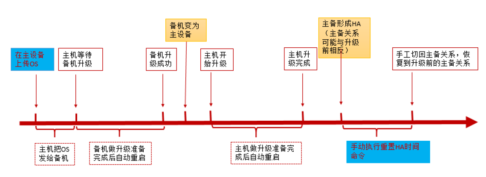
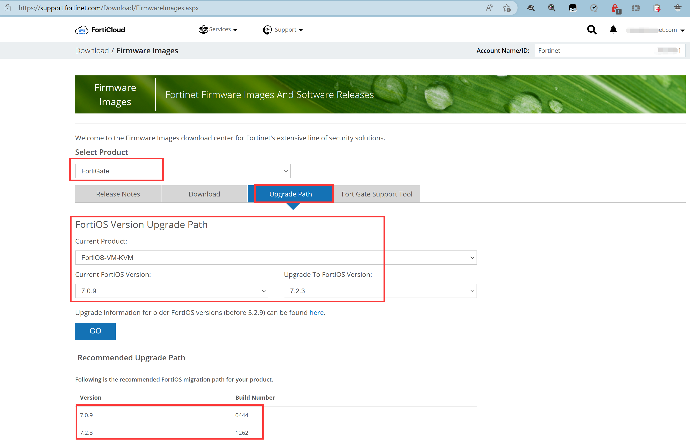
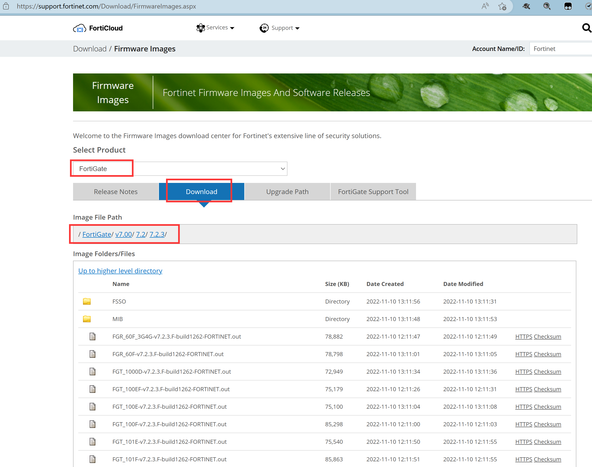
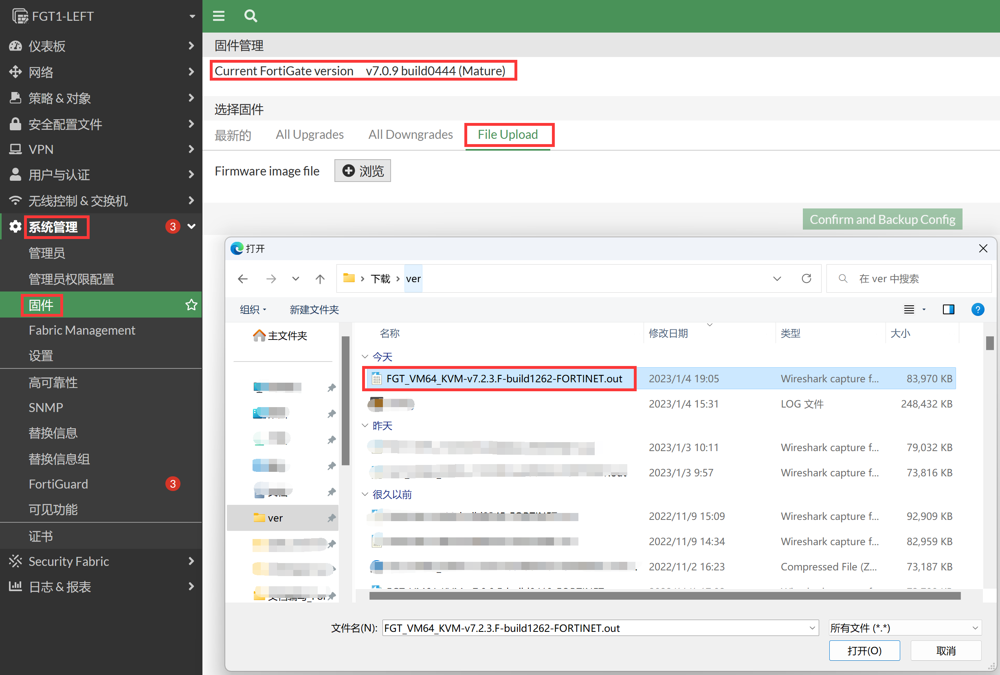
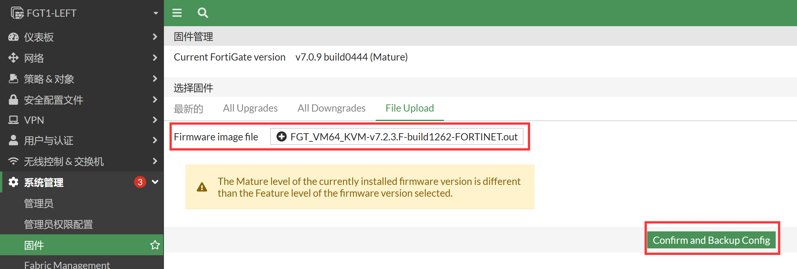
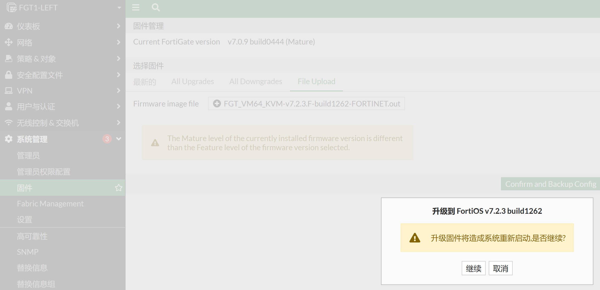
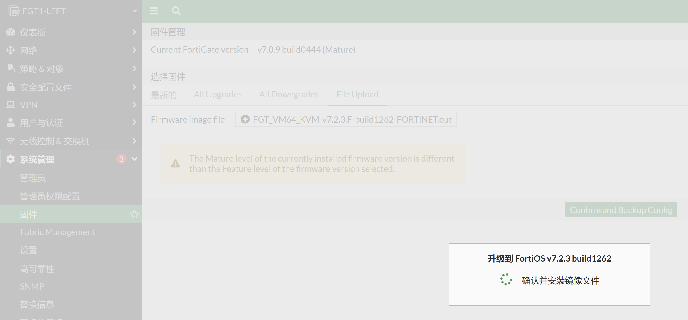

# HA-Cluster不间断升级

## 不间断升级介绍

1. “HA不间断升级”故名思义就是说在 HA 升级过程中， HA-cluster 中的设备会一台一台的进行升级，从而保证了业务在升级过程中不中断。

2. 上传 OS 的方法分为 Web 界面上传和通过命令行上传，本文介绍以 Web 界面上 传， 两台设备升级完成需要 15 分钟左右， 过程如下：

   

## 升级过程

1. 在主机Web界面上点击升级按钮。
2. 主机把OS发给备机，备机准备并开始升级，然后自动重启，此过程需要5分钟（或更长时间），请耐心等待。
3. 备机升级完成，并切换成主机。
4. 主机观察到备机升级成功并切换为新的主机后，开始准备升级，此过程需要5分钟（或更长时间），请耐心等待。
5. 一旦准备完成，主机（此时为备）自动重启加载升级后OS，重启约2分钟。
6. 主机（此时为备）重启后，形成HA 。主机从原来的备同步配置（外部配置和内部配置），约1~3分钟。
7. 此时，HA重新建立，但是主备关系发生了切换，需要在此时的主（最开始的备） 手工执行切换diagnose sys ha reset uptime 切换原来的主备关系。

## 操作建议

1. 操作前下载并阅读 Release 文档和升级说明文档，做到注意事项心中有数。可以参考官方文档：https://docs.fortinet.com/product/fortigate/7.0

2. 升级前后备份设备配置。

3. 接入 console 在主设备上， 记录 log 观察升级 过程，做到心中有数。 有问题也可以反馈厂商。

4. 耐心等待，主备机升级的时间都会比较长。

## 操作步骤

1. 分别备份主备设备的配置文件，参考[配置备份及恢复](..\系统管理\设备管理\配置备份及恢复.md)章节。

2. 举例：FGT101F从FortiOS 7.0.9升级到FortiOS 7.2.3，从https://support.fortinet.com/Download/FirmwareImages.aspx 得知我直接升级即可，无需升级多次版本。

   

3. 下载7.2.3版本对应产品的文件到本地，以便通过GUI导入软件版本进行升级。

   

4. 准备工作做完，正式开始升级，在主设备进入系统管理→固件→File Upload，点击浏览按钮，选择要升级的FortiOS 7.2.3版本文件。

   

5. 点击确认并备份配置，会在升级前下载设备当前的配置文件到本地（只有当前主机的）。

   

   

6. 此时FortiOS将先传给备机，业务还是运行在主机上，等备机重启后将接管主机的业务，然后主机再重启升级，此过程业务是不中断的。

   

### Console记录

1. 耐心等待与观察Console输出信息，做到心中有数。以下为升级过程Left设备Consloe打印信息，其实管理员并不需要做什么，只需要请注意阅读并理解，做到心中有数，万一出现故障可以知道大概是哪一步的问题。

   ```
   FGT1-LEFT # Wait for HA to be primary of all clusters...    //主设备发送FortiOS到备设备
   Send image to HA secondary.
   ..Wait for secondary to restart...   //备机先升级，升级重启约5分钟，请耐心等待
   Wait for first secondary to become new primary..    //备机升级并重启完毕后，主机会先等待备机变成新的主机，以便业务被备机先接管
   Firmware upgrade in progress ...    //当备机成为新主机之后，主机将准备升级
   Done.    //主机准备升级结束，开始正式升级主设备，升级过程约5分钟，请耐心等待
   The system is going down NOW !!
   Please stand by while rebooting the system.
   Restarting system.
   SeaBIOS (version rel-1.12.1-0-ga5cab58e9a3f-prebuilt.qemu.org)
   Machine UUID 934483a5-b727-447c-b98c-9cb5dd2209fb
   Loading flatkc... ok
   Loading /rootfs.gz...ok
   System is starting...
   The config file may contain errors. 
   Please see details by the command 'diagnose debug config-error-log read'.
   Serial number is FGVM08TM22000173
   FGT1-LEFT login: admin
   Password: 
   Welcome!
   FGT1-LEFT # get system status
   Version: FortiGate-VM64-KVM v7.2.3,build1262,221109 (GA.F)    //原主机后升级完毕
   Firmware Signature: certified
   Virus-DB: 90.05815(2022-09-09 23:26)
   Extended DB: 90.05815(2022-09-09 23:26)
   Extreme DB: 1.00000(2018-04-09 18:07)
   AV AI/ML Model: 2.07351(2022-09-08 21:45)
   IPS-DB: 6.00741(2015-12-01 02:30)
   IPS-ETDB: 6.00741(2015-12-01 02:30)
   APP-DB: 6.00741(2015-12-01 02:30)
   INDUSTRIAL-DB: 6.00741(2015-12-01 02:30)
   IPS Malicious URL Database: 1.00001(2015-01-01 01:01)
   IoT-Detect: 0.00000(2001-01-01 00:00)
   Serial-Number: FGVM08TM22000173
   License Status: Warning
   License Expiration Date: 2023-01-14
   VM Resources: 8 CPU/8 allowed, 3961 MB RAM
   Log hard disk: Not available
   Hostname: FGT1-LEFT
   Private Encryption: Disable
   Operation Mode: NAT
   Current virtual domain: root
   Max number of virtual domains: 10
   Virtual domains status: 1 in NAT mode, 0 in TP mode
   Virtual domain configuration: disable
   FIPS-CC mode: disable
   Current HA mode: a-p, secondary    //升级完毕之后状态是主还是备将视具体情况而定：主防火墙和备防火墙重启完成时间相差五分钟以内，则后面重启的主机（优先级高的FGT）将会主动抢占为主设备，如果二者升级重启时间相差超过5分钟，则后重启的主设备将会处于备的状态，不会抢占回主的状态
   Cluster uptime: 2 hours, 15 minutes, 17 seconds
   Cluster state change time: 2023-01-04 19:16:50
   Branch point: 1262
   Release Version Information: GA
   FortiOS x86-64: Yes
   System time: Wed Jan  4 19:17:08 2023
   Last reboot reason: warm reboot
   ```

2. RIGHT防火墙的Console记录。

   ```
   FGT2-RIGHT # geGet image from ha primary OK.    //主机发送FortiOS到备机上
   Verifying the integrity of the firmware image...
   Check image OK.
   Please wait for system to restart.    //备机先开始升级并重启，因此业务在主机上运行
   Firmware upgrade in progress ...
   Done.
   The system is going down NOW !!
   Please stand by while rebooting the system.
   Restarting system.
   SeaBIOS (version rel-1.12.1-0-ga5cab58e9a3f-prebuilt.qemu.org)
   Machine UUID fe581bd9-2eb0-4115-896a-dd50f521d0ee
   Booting from Hard Disk...
   SYSLINUX 6.04 EDD 6.04-pre1 Copyright (C) 1994-2015 H. Peter Anvin et al
   Loading flatkc... ok
   Loading /rootfs.gz...ok
   System is starting...
   The config file may contain errors. 
   Please see details by the command 'diagnose debug config-error-log read'.
   Serial number is FGVM08TM22000174
   
   FGT2-RIGHT login: admin
   Password: 
   Welcome!
   FGT2-RIGHT # get system status
   Version: FortiGate-VM64-KVM v7.2.3,build1262,221109 (GA.F)    //原备机升级成功
   Firmware Signature: certified
   Virus-DB: 90.05815(2022-09-09 23:26)
   Extended DB: 90.05815(2022-09-09 23:26)
   Extreme DB: 1.00000(2018-04-09 18:07)
   AV AI/ML Model: 2.07351(2022-09-08 21:45)
   IPS-DB: 6.00741(2015-12-01 02:30)
   IPS-ETDB: 6.00741(2015-12-01 02:30)
   APP-DB: 6.00741(2015-12-01 02:30)
   INDUSTRIAL-DB: 6.00741(2015-12-01 02:30)
   IPS Malicious URL Database: 1.00001(2015-01-01 01:01)
   IoT-Detect: 0.00000(2001-01-01 00:00)
   Serial-Number: FGVM08TM22000174
   License Status: Warning
   License Expiration Date: 2023-01-14
   VM Resources: 8 CPU/8 allowed, 3961 MB RAM
   Log hard disk: Not available
   Hostname: FGT2-RIGHT
   Private Encryption: Disable
   Operation Mode: NAT
   Current virtual domain: root
   Max number of virtual domains: 10
   Virtual domains status: 1 in NAT mode, 0 in TP mode
   Virtual domain configuration: disable
   FIPS-CC mode: disable
   Current HA mode: a-p, primary    //升级完毕之后状态是主还是备将视具体情况而定：主防火墙和备防火墙重启完成时间相差五分钟以内，则后面重启的主机（优先级高的FGT）将会主动抢占为主设备，如果二者升级重启时间相差超过5分钟，则后重启的主设备将会处于备的状态，不会抢占回主的状态
   Cluster uptime: 2 hours, 16 minutes, 28 seconds
   Cluster state change time: 2023-01-04 19:16:51
   Branch point: 1262
   Release Version Information: GA
   FortiOS x86-64: Yes
   System time: Wed Jan  4 19:18:20 2023
   Last reboot reason: warm reboot
   ```

3. 手工切换HA状态，此步骤不是必要，升级完毕之后状态是主还是备将视具体情况而定：

   - 情况1：主防火墙和备防火墙重启完成时间相差五分钟以内，则后面重启的主机（优先级高的FGT）将会主动抢占为主设备。如果是这种情况，则不需要任何的额外切换动作。

   - 情况2：如果二者升级重启时间相差超过5分钟，则后重启的主设备将会处于备的状态，不会抢占回主的状态。这个时候才需要命令行进行强制的HA切换一下，让HA状态恢复到升级之前的主备状态。

4. 如果有以上第2种情况，HA-Cluster升级完毕之后，备机成了新的主，而旧的主机成为了备，并且想要将HA的状态切换到升级之前的状态，则只需要重启完成5分钟后在备机（新的主机）上敲一条命令即可完成主备切换。

   ```
   FGT2-RIGHT # diagnose sys ha reset-uptime    //此命令会Reset当前设备的HA时间，以便重新进行HA的选举。reset-uptime相当于把备机的HA运行时间清0，这样运行时间长且优先级高的主设备，一定会重新选举为主的
   ```

5. 再观察HA的状态是否是我们所需要的状态，以下这三个命令都可以看到HA的选举结果和HA状态。

   ```
   # diagnose sys ha status
   # get system status
   # get system ha statu
   ```

7. 升级后检查是否有重要配置丢失。

   ```
   diagnose debug  config-error-log read    //不丢路由、接口地址、服务对象、防火墙策略、VPN这些，一般问题不大。丢一些默认的配置可能是因为新版本做了功能变
   ```

8. 检查配置是否同步，查看主备防火墙的配置HA checksum，正常来说二者的配置checksum是一致的，如果状态不同步，可以参考[HA双机配置同步说明](.\HA双机配置同步说明.md)章节排查。

   ```
   FGT1-LEFT # diagnose sys ha checksum show
   is_manage_primary()=0, is_root_primary()=0
   debugzone
   global: a5 20 2d 71 a0 22 13 92 59 82 45 6d 43 b8 fb d9 
   root: d0 f3 bd a2 b5 f8 df 39 7c 6c 25 c9 91 e1 b9 99 
   all: b9 3b b3 36 86 d7 ff 08 1d e8 ce 48 e4 85 85 48 
   checksum
   global: a5 20 2d 71 a0 22 13 92 59 82 45 6d 43 b8 fb d9 
   root: d0 f3 bd a2 b5 f8 df 39 7c 6c 25 c9 91 e1 b9 99 
   all: b9 3b b3 36 86 d7 ff 08 1d e8 ce 48 e4 85 85 48 
   
   FGT2-RIGHT # diagnose sys ha checksum show
   is_manage_primary()=0, is_root_primary()=0
   debugzone
   global: a5 20 2d 71 a0 22 13 92 59 82 45 6d 43 b8 fb d9 
   root: d0 f3 bd a2 b5 f8 df 39 7c 6c 25 c9 91 e1 b9 99 
   all: b9 3b b3 36 86 d7 ff 08 1d e8 ce 48 e4 85 85 48 
   checksum
   global: a5 20 2d 71 a0 22 13 92 59 82 45 6d 43 b8 fb d9 
   root: d0 f3 bd a2 b5 f8 df 39 7c 6c 25 c9 91 e1 b9 99 
   all: b9 3b b3 36 86 d7 ff 08 1d e8 ce 48 e4 85 85 48 
   ```

9. HA不中断升级完毕，升级完毕之后查看HA的状态、测试业务、最好再次备份一份软件版本升级之后的配置文件。
