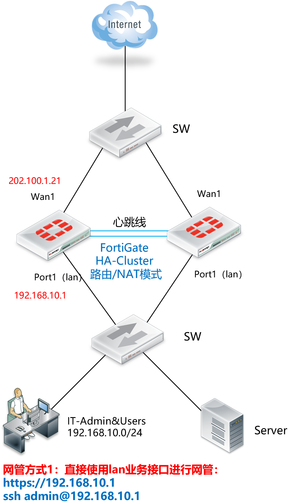
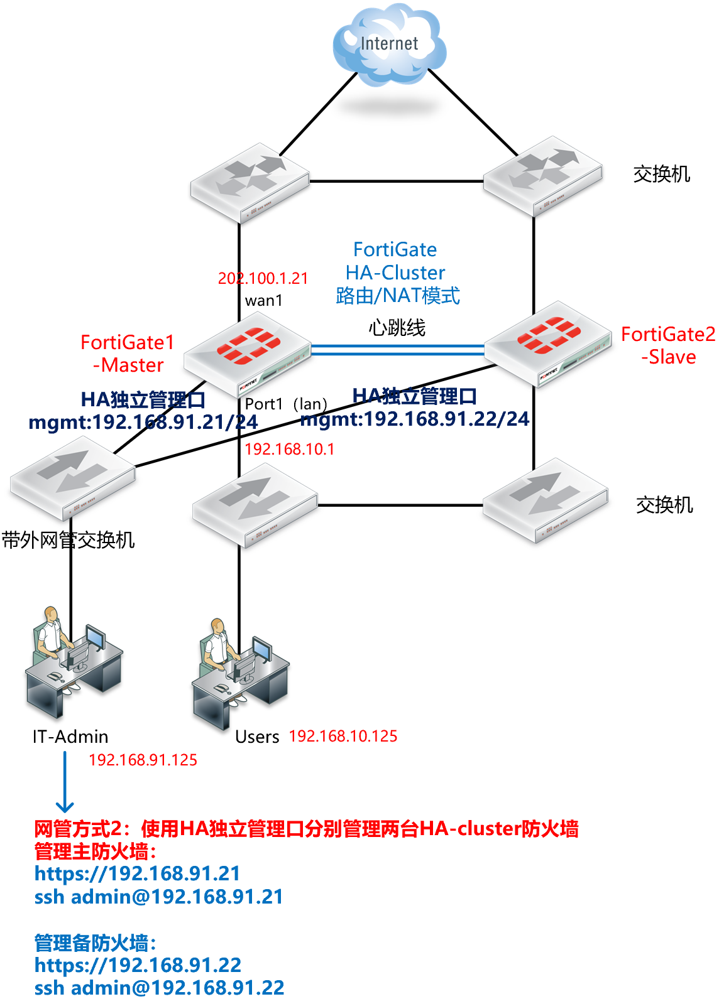
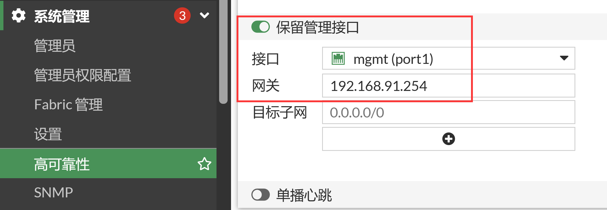
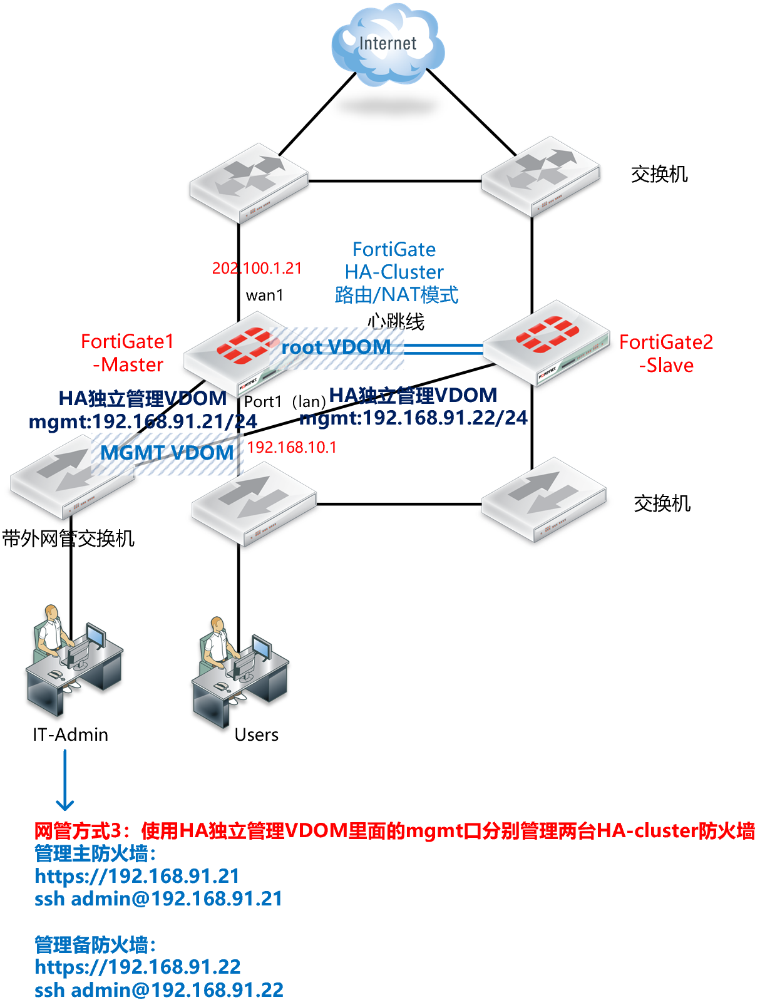
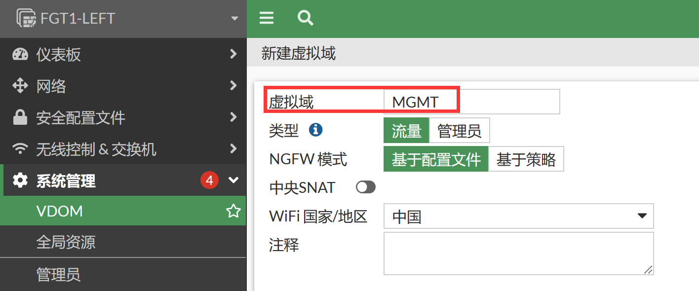
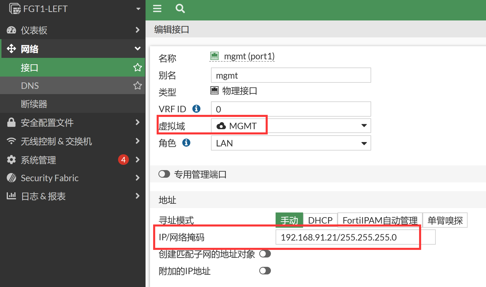
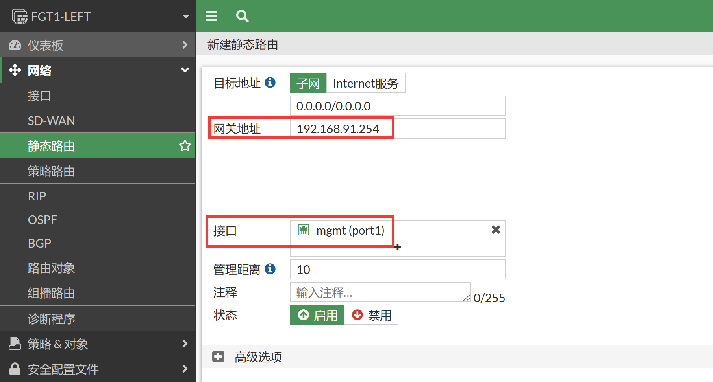
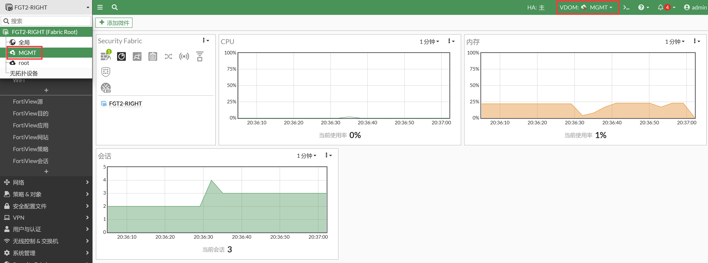

# HA的网管介绍

## 使用业务接口进行网管

1. 对网管要求不是太高的情况下推荐使用。



2. 优点：
   - 够直接、够简单、无需考虑太多网管的因素

   - 可以直接使用mgmt、lan或wan接口进行网管，直接网管即可，只需要开放接口的网管协议即可。（另外需注意管理员的可信任主机配置）

     ```
     config system interface
         edit "port1"
             set ip 192.168.10.1 255.255.255.0
             set allowaccess ping https ssh http fgfm
             set alias "LAN_Inside"
         next
     end
     ```

3. 缺点：

   - 管理员无法登陆到备机上进行管理和查看，备机处于一种未知的状态（只能通过主机查看到备机的状态，管理员无法直接网管HA备机）
   - 对于HA-Cluster来说HA是一个大的整体，此时的两台防火墙配置完全一样，换一句话说备机是完全不可控/不可登陆，完全处于热备的状态，只有主防火墙出现故障的时候备防火墙才会被激活，而在没有激活之前，管理员是无法登陆到备机上进行管理和查看的。这样就有一种小概率，备机坏了的时候（比如硬件故障），相对来说比较难被发现（可以通过主设备查看HA状态可以查看到备机掉线的异常情况）。如果对于设备管理要求较高的话，显然备机的这种未知状态会让人无法完全放心。
   - 这就是简单带来的烦恼，既然要解决这样的烦恼，就有了下面的另外两种解决办法，当然这两种办法就不能用简单来形容了，相对要复杂一些。

## 使用HA独立管理接口进行网管

1. 备机管理员可以直接登陆，对HA的主机和备机进行单独的管理。

   

2. 优点：

   - HA Cluster的主备两台机器都可以独立的进行网管和配置。

   - HA独立管理口拥有一个完全独立的IP转发和路由空间，将网络管理区域和业务数据区域的IP/路由完全独立，二者相互不影响。相当于在后台创建了一个vsys_hamgmt的vdom，是一个轻量级的vdom。GUI是隐藏不可见的状态，让用户尽量较少的感受到此vdom的存在，意在简化用户对于独立管理口的使用和理解。命令行下实际可以进入到vsys_hamgmt进去ping等测试，而GUI是几乎是感受不到vsys_hamgmt的存在的。

     ```
     FGT-LEFT # execute enter ？
     <name>    vdom name
     vsys_hamgmt    //HA独立管理口轻量级vdom
     root    //业务数据的vdom
     ```

     我们知道业务接口的配置HA-Cluster之间是完全同步的，但HA独立管理口的配置HA-Cluster之间是不同步的，这样才可以确保HA-Cluster各自的独立管理口IP地址可以不一致，以便管理员可以通过不同的管理IP分别管理HA的主和备。

   - 基于以上特性，我们可以知道，root和vsys_hamgmt拥有独立的IP/路由空间，因此独立管理口的IP和业务接口的IP地址是可以重叠使用的（允许IP/网段冲突），这个部分可以按照个人需求进行操作，不一定非要如此IP网段冲突的设置。比如业务接口lan的IP为192.168.1.99，这个时候其实可以将独立管理口mgmt的IP设置为192.168.1.198（主）、192.168.1.199（备），二者可以在同一个网段，管理员可以通过192.168.1.198管理到主防火墙，192.168.1.199管理到备防火墙。而192.168.1.99这个业务接口地址则永远只属于当前HA-Cluster的主防火墙。通常来说我们都是不建议管理和业务网段IP地址重叠/冲突的，这样不便于设计、理解、排错，非不得已不要这样使用。

3. 缺点：

   - 独立管理口网管是独立的，但是fortiguard的更新无法使用独立管理mgmt进行更新，还是需要通过业务接口进行fortiguard服务的更新。

   - 另外关于syslog、Radius等防火墙主动往外发起的业务，默认也是使用业务接口进行处理的，如果有使用独立管理口进行上述业务的需求，需要在HA下面开启“set ha-direct enable”，这样由FGT-LEFT本地发起的数据才会通过独立管理口mgmt去发送。

     ```
     FGT-LEFT # config system ha
     ...
         set ha-direct ?
         
     	enable    Enable using ha-mgmt interface for syslog, remote authentication (RADIUS), FortiAnalyzer, FortiSandbox, sFlow, and Netflow.
     	disable    Disable using ha-mgmt interface for syslog, remote authentication (RADIUS), FortiAnalyzer, FortiSandbox, sFlow, and Netflow.    //默认为disable，使用业务接口处理以上业务。有需要独立管理的mgmt发送数据的时候才将其enable
     end
     ```

     以上无疑增加了业务和管理的复杂性，需要考虑的东西更多，容易犯错的机会也就更大。

4. HA独立管理口的使用建议：

   - 如果仅仅是单纯的管理HA-Cluster的主和备防火墙，这个方法还是挺合适的
   - 如果有更多更复杂的需求，则需要搞清楚HA独立管理口的工作逻辑，比如Radius请求/syslog日志是由谁发送的问题。注意命令适当的时候需要开启“set ha-direct enable”命令。可以通过sniffer抓包协助判断HA场景下的FGT-LEFT主动往外发包情况，以便确认是否是你需要的发包效果：# diagnose sniffer packet any "port 1812" 4 0 l  （抓取防火墙发起的Radius认证数据）
   - 另外如果需要使用独立管理口mgmt进行fortiguard更新的话，则必须使用更加彻底的独立管理VDOM（方法3），将管理与业务的完全隔离，那个也是最彻底的方法，当然相对也更加复杂一些。（DNS解析和Fortiguard更新还是走的业务接口）

5. HA独立管理口命令行配置。

   ```
   主防火墙：
   config system ha
       set ha-mgmt-status enable
       config ha-mgmt-interfaces
           edit 1
               set interface "mgmt"
               set gateway 192.168.91.254
           next
       end
   end
   config system interface
       edit "mgmt"
           set ip 192.168.91.21 255.255.255.0
           set allowaccess ping https ssh http
           set alias "HA_Dedicated_MGMT"
       next
   end
   
   备防火墙：
   config system ha
       set ha-mgmt-status enable
       config ha-mgmt-interfaces
           edit 1
               set interface "mgmt"
               set gateway 192.168.91.254
           next
       end
   end
   config system interface
       edit "port1"
           set ip 192.168.91.22 255.255.255.0
           set allowaccess ping https ssh http
           set alias "mgmt"
       next
   end
   ```

6. HA独立管理口GUI配置。

   

## 使用独立VDOM进行网管

1. HA独立管理口可以简单的理解是一个轻量级的VDOM隔离，而HA独立管理VDOM则是一个完完全全的真实VDOM隔离。如果需要将HA-Cluster的管理和业务彻底隔离开，则建议使用HA独立管理VDOM。

2. HA独立管理口+配置了set ha-direct enable其实实现了一部分的独立管理VDOM的功能，但是还是不够彻底，比如fortigaurd更新等需求，因此这就是独立管理VDOM存在的原因。

   

3. 优点：

   - 完全的管理和业务独立，管理是管理VDOM，业务是业务VDOM，完全隔离，最符合隔离管理的需求。

4. 缺点：

   - 需要开启VDOM特性，配置相对会复杂一些。

5. 独立管理VDOM的配置，首先需要开启VDOM特性。

   ```
   FGT-LEFT # config system global
   FGT-LEFT (global) # set vdom multi-vdom
   FGT-LEFT (global) # end
   You will be logged out for the operation to take effect
   Do you want to continue? (y/n)y
   Auto backup config ...
   exit
   FGT-LEFT login:
   FGT-LEFT login: admin
   Password: ********
   Welcome !
   ```

6. 创建新的MGMT独立管理VDOM。

   

   ```
   FGT-LEFT # config vdom
   FGT-LEFT (vdom) # edit MGMT
   FGT-LEFT (MGMt) # end
   ```

7. 将MGMT独立管理VDOM修改为管理VDOM（只能命令行修改）。

   ```
   FGT-LEFT # config global
   FGT-LEFT (global) # config system global
   FGT-LEFT (global) # set management-vdom
   <string>    please input string value
   MGMT    vdom
   root    vdom
   FGT-LEFT (global) # set management-vdom MGMT
   FGT-LEFT (global) # end
   FGT-LEFT (global) # end
   ```

8. HA里面指定MGMT VDOM为独立管理VDOM。

   ```
   FGT-LEFT # config  global
   FGT-LEFT (global) # config system ha
   FGT-LEFT (ha) # set standalone-mgmt-vdom enable    //此配置HA的主备同步，在主设备配置会自动同步到备设备上
   FGT-LEFT (ha) # end
   ```

9. 将mgmt接口加入到MGMT VDOM中，并配置上管理IP和默认路由。

   

   

   ```
   配置mgmt加入到VDOM-MGMT以及配置管理IP地址：
   FGT-LEFT # config global
   FGT-LEFT (global) # config system interface
   FGT-LEFT (interface) # edit port1
   FGT-LEFT (mgmt) # set vdom MGMT
   FGT-LEFT (mgmt) # set ip 192.168.91.21/24
   FGT-LEFT (mgmt) # set alias "MGMT"
   FGT-LEFT (mgmt) # end
   FGT-LEFT (global) # end
   
   配置默认路由：
   FGT-LEFT # config vdom
   FGT-LEFT (vdom) # edit MGMT
   current vf=MGMT:1
   FGT-LEFT (MGMT) # config router static
   FGT-LEFT (static) #
   FGT-LEFT (static) # edit 0
   new entry '0' added
   FGT-LEFT (0) # set gateway 192.168.91.254
   FGT-LEFT (0) # set device port1
   FGT-LEFT (0) # end
   
   FGT-LEFT (MGMT) # execute ping 192.168.91.254
   PING 192.168.91.254 (192.168.91.254): 56 data bytes
   64 bytes from 192.168.91.254: icmp_seq=0 ttl=255 time=0.2 ms
   64 bytes from 192.168.91.254: icmp_seq=1 ttl=255 time=0.1 ms
   64 bytes from 192.168.91.254: icmp_seq=2 ttl=255 time=0.1 ms
   64 bytes from 192.168.91.254: icmp_seq=3 ttl=255 time=0.1 ms
   64 bytes from 192.168.91.254: icmp_seq=4 ttl=255 time=0.1 ms
   --- 192.168.91.254 ping statistics ---
   
   5 packets transmitted, 5 packets received, 0% packet loss
   round-trip min/avg/max = 0.1/0.1/0.2 ms
   ```

10. 此时备机是无法WEB/SSH登陆的需要通过主机的命令（或者Console线）连到备机的命令行界面。

    ```
    FGT-LEFT # config global
    FGT-LEFT (global) # execute ha  manage
    <id>    please input peer box index.
    <1>     Subsidary unit FG101E4Q17000045
    
    FGT-LEFT (global) # execute ha  manage  1  \\ 从主机登陆到备机的命令行
    
    FFGT-LEFT-RIGHT login: admin
    Password: ********
    Welcome !
    
    FFGT-LEFT-RIGHT $
    ```

11. 备防火墙那边会自动同步VDOM和mgmt加入到MGMT的配置（如果配置同步不正常，可以将备机重启，并等待配置同步完成，再操作），而独立管理MGMT-VDOM内部的配置是不会同步的，因此只需要修改备防火墙管理VODM、mgmt的接口IP和路由即可。

    ```
    FGT-LEFT # config global
    FGT-LEFT (global) # config system global
    FGT-LEFT (global) # set management-vdom MGMT
    FGT-LEFT (global) # end
    FGT-LEFT (global) # end
    FGT-LEFT-RIGHT $ config vdom
    FGT-LEFT-RIGHT (vdom) $ edit MGMT
    current vf=MGMT:1
    FGT-LEFT-RIGHT (MGMT) $ config system interface
    FGT-LEFT-RIGHT (interface) $ edit mgmt
    FGT-LEFT-RIGHT (mgmt) $ set ip 192.168.91.22/24
    FGT-LEFT-RIGHT (mgmt) $ set allowaccess https http  ping ssh
    FGT-LEFT-RIGHT (mgmt) $ set alias "HA_Dedicated_MGMT"
    FGT-LEFT-RIGHT (mgmt) $ show
    FGT-LEFT-RIGHT (mgmt) $ end
    
    FGT-LEFT-RIGHT (MGMT) $ config router static
    FGT-LEFT-RIGHT (static) $ edit 0
    new entry '0' added
    FGT-LEFT-RIGHT (0) $ set device mgmt
    FGT-LEFT-RIGHT (0) $ set  gateway  192.168.91.254
    FGT-LEFT-RIGHT (0) $ end
    
    FGT-LEFT-RIGHT (MGMT) $ execute  ping 192.168.91.254
    PING 192.168.91.254 (192.168.91.254): 56 data bytes
    64 bytes from 192.168.91.254: icmp_seq=0 ttl=255 time=0.2 ms
    64 bytes from 192.168.91.254: icmp_seq=1 ttl=255 time=0.1 ms
    64 bytes from 192.168.91.254: icmp_seq=2 ttl=255 time=0.1 ms
    64 bytes from 192.168.91.254: icmp_seq=3 ttl=255 time=0.1 ms
    64 bytes from 192.168.91.254: icmp_seq=4 ttl=255 time=0.1 ms
    
    --- 192.168.91.254 ping statistics ---
    5 packets transmitted, 5 packets received, 0% packet loss
    round-trip min/avg/max = 0.1/0.1/0.2 ms
    ```

12. 这个时候可以通过GUI登录到备机了（使用备机的独立管理IP）。

13. 这时候可以通过192.168.91.21和192.168.91.22分别管理到主防火墙和备防火墙了。

    

14. 此时所有的Radius/SYSLOG/DNS/FORTGUARD都是通过MGMT这个VDOM进行更新的，完全独立于root业务VDOM，彻底的管理是管理，业务是业务。这是HA独立管理的终极解决方案。

15. 越完美的方案，有时候也就是意味着越复杂，实际部署中需按照个人需求进行选择如何管理HA-Cluster。
