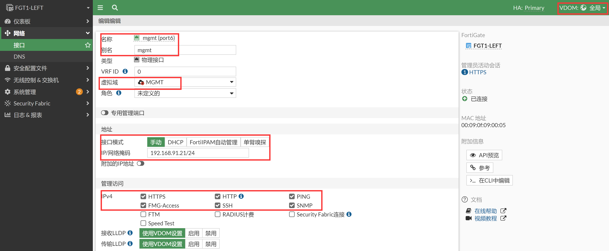

# HA集群带外独立管理-独立管理VDOM

## 组网需求

1. 在HA集群中，所有集群成员的配置全部相同，通过IP只能管理到主设备，无法通过IP对每个slave设备进行单独的管理。同时为了业务的安全，需要将管理网络与业务网络独立开。包括独立管理，包括syslog日志、SNMP、Radius等。
2. 另外包括DNS、Fortiguard更新也需要通过管理口进行处理。为实现如上需求，HA使用独立的管理接口是无法完全满足了，这是就需要使用最终极的解决方案独立管理VDOM了。

## 网络拓扑


## 配置要点

- 配置HA基础配置
- 配置基础LAN/WAN上网服务
- 配置HA独立VDOM
- 配置防火墙的SYSLOG、SNMP和FMG

## 配置步骤和结果验证

1. 配置HA基础配置，初始化配置防火墙的时候可以通过mgmt口登陆到防火墙上，一般mgmt口的管理IP是192.168.1.99，第一步可以通过此IP登陆防火墙（参考[Web管理](..\..\系统管理\设备管理\Web管理.md)章节），或者通过console口管理防火墙（参考[Console管理](..\..\系统管理\设备管理\Console管理.md)章节）。具体型号初始化如果网管和接口的网管IP信息等可参考https://docs.fortinet.com/product/fortigate/hardware 或https://docs.fortinet.com/document/fortigate/hardware/fortigate-quickstart-guide-high-end?model=all 。

2. 按照以上方式登陆第一次开箱的防火墙。先登陆主防火墙，并配置进行HA的基础配置，然后登陆到备防火墙，配置备防火墙的HA基础配置。

3. 分别配置主防火墙和备防火墙的HA，主防火墙优先级调整为150，备防火墙的优先级保持默认的120，配置HA-cluster组名字和密码，监控业务接口wan1和port1，使用HA1和HA2接口将二者互联。

   

   ```
   config system ha
       set group-name "FGT"
       set mode a-p
       set password ENC XU4Yv532eMH20TXkbxDMQWRNs+ChZrIVXcotCFVP2C86QBl2zhznTNU+0PDKw5Vlvtm6B+NCZ+f+1EiT3MsUteDHW82Aten6q+Yu6zAT5NuXYYIKnVpG=
       set hbdev "port7" 50 "port8" 50 
       set session-pickup enable
       set override disable
       set priority 150
       set monitor "port1" "port2" 
   end
   ```

   

   ```
   config system ha
       set group-name "FGT"
       set mode a-p
       set password ENC HzpTLoO69D1nrZ9QZbKFDbuUmCefmDRbZqTvgSseAgh2zU8JOHq1bthC750a+p5S/rkfRSROmhVMqOKRbBZkir3C8VWW9l+h7jl7Xp4N5sdA1CmDSUzX=
       set hbdev "port7" 50 "port8" 50 
       set session-pickup enable
       set override disable
       set priority 120
       set monitor "port1" "port2" 
   end
   ```

4. 双方的HA配置完毕之后将ha1和ha2线相互直连，将会进行HA的选举，此时优先级150高的FGT将成为主防火墙，优先级低的120的FGT将成为备防火墙。然后备防火墙的配置将会和主防火墙进行同步，备防火墙所有配置和主防火墙一致，此时备防火墙也将不再可以WEB/SSH登录，仅仅可以Console登录。后续所有的操作和配置都在主防火墙上的GUI、SSH或Console完成。

5. 选举结果如下，FGT1-LEFT成为主设备。

   ```
   FGT1-LEFT # diagnose sys ha status
   HA information
   Statistics
           traffic.local = s:0 p:22783 b:12890083
           traffic.total = s:0 p:22793 b:12890691
           activity.ha_id_changes = 2
           activity.fdb  = c:0 q:0
   
   Model=80008, Mode=2 Group=0 Debug=0
   nvcluster=1, ses_pickup=1, delay=0
   
   [Debug_Zone HA information]
   HA group member information: is_manage_primary=1.
   FGVM08TM22000173:      Primary, serialno_prio=1, usr_priority=150, hostname=FGT1-LEFT
   FGVM08TM22000174:    Secondary, serialno_prio=0, usr_priority=120, hostname=FGT2-RIGHT
   
   [Kernel HA information]
   vcluster 1, state=work, primary_ip=169.254.0.2, primary_id=0:
   FGVM08TM22000173:      Primary, ha_prio/o_ha_prio=0/0
   FGVM08TM22000174:    Secondary, ha_prio/o_ha_prio=1/1
   ```

6. 这三个命令都可以看到HA的选举结果和HA状态。

   ```
   # diagnose sys ha status
   # get system status
   # get system ha status
   ```

7. GUI查看HA的选举结果和状态。

   

8. 配置基础LAN/WAN上网服务。此步骤为正常上网的基础配置，大概的步骤是配置接口IP、配置默认路由、配置策略即可实现防火墙的简单上网配置。（所有配置都在主防火墙上完成，备防火墙此时不可以登陆）

9. 配置接口IP。

   

   ```
   config system interface
       edit "port1"
           set vdom "root"
           set ip 192.168.10.1 255.255.255.0
           set allowaccess ping https ssh snmp http fgfm
           set type physical
           set alias "lan"
           set snmp-index 1
       next
       edit "port2"
           set vdom "root"
           set ip 202.100.1.21 255.255.255.0
           set type physical
           set alias "wan1"
           set snmp-index 2
       next
   end
   ```

10. 配置默认路由。

    

    ```
    config router static
        edit 1
            set gateway 202.100.1.192
            set device "port2"
        next
    end
    ```

11. 配置上网策略。

    

    ```
    config firewall policy
        edit 1
            set name "to_Internet"
            set srcintf "port1"
            set dstintf "port2"
            set action accept
            set srcaddr "LAN_192.168.10.0"
            set dstaddr "all"
            set schedule "always"
            set service "ALL"
            set nat enable
        next
    end
    ```

12. 配置LAN口网管相关参数，关于网管目前可以通过port1（lan）的192.168.10.1进行管理，比较关键的网管因素是：

    - port1接口下开启了网管的协议，比如https、http、ssh、snmp等。

      

    - 管理员可信任主机如果配置了的话，需要包含发起管理请求的主机IP或网段。

      

    - 客户端PC到FGT的来回路由可达，可以通过ping和tracert测试。

    - 上面1、2点确认没有问题之后，还是遇到不通的情况，可以通过sniffer抓包和debug flow确认问题所在。

      ```
      FGT # diagnose sniffer packet any "host 192.168.10.1" 4 0 l
      ```

    - 如果跨接口管理防火墙，比如处于port1的PC要通过防火墙port2接口的IP管理防火墙，则需要主要有port1到port2的放通策略，否则数据也是不通的。

    - 出现网管不了的情况，99%就是以上的原因了。

13. 配置HA独立VDOM，首先需要开启VDOM特性（主设备上配置，会自动同步到备机）。

    ```
    FGT1-LEFT # config sys global 
    FGT1-LEFT (global) # set vdom-mode 
    FGT1-LEFT (global) # set vdom-mode multi-vdom 
    FGT1-LEFT (global) # end
    
    You will be logged out for the operation to take effect.
    Do you want to continue? (y/n)y
    exit
    
    FGT1-LEFT login: admin
    Password: 
    Welcome!
    ```

14. 创建新的MGMT独立管理VDOM（主设备上配置，会自动同步到备机）。

    

    

    

    ```
    FGT1-LEFT # config vdom
    FGT1-LEFT (vdom) # edit MGMT
    FGT1-LEFT (MGMt) # end
    ```

15. 将MGMT独立管理VDOM修改为管理VDOM（只能命令行修改），该配置主备会同步。

    ```
    FGT1-LEFT # config global 
    FGT1-LEFT (global) # config system global 
    FGT1-LEFT (global) # set management-vdom MGMT    //设置MGMT为管理VDOM，也就是说fortiguard、dns、ntp...等等主动更新，都是从MGMT这个VDOM发起，是一个管理的VDOM
    FGT1-LEFT (global) # end
    FGT1-LEFT (global) # end
    ```

16. HA里面开启独立管理VDOM，该配置主备会同步。

    ```
    FGT1-LEFT # config global 
    FGT1-LEFT (global) # config system ha
    FGT1-LEFT (ha) # set standalone-mgmt-vdom enable 
    FGT1-LEFT (ha) # end
    FGT1-LEFT (global) # end
    ```

17. 将mgmt（port6）接口加入到MGMT VDOM中，并配置上管理IP和默认路由。

    

    

    ```
    config global
    config system interface
        edit "port6"
            set vdom "MGMT"
            set ip 192.168.91.21 255.255.255.0
            set allowaccess ping https ssh snmp http fgfm
            set type physical
            set alias "mgmt"
            set snmp-index 6
        next
    end
    
    FGT1-LEFT # config vdom 
    FGT1-LEFT (vdom) # edit MGMT 
    current vf=MGMT:4 
    config router static
        edit 1
            set gateway 192.168.91.254
            set device "port6"
        next
    end
    ```

18. 在主机的MGMT VDOM中ping网关192.168.91.254。

    ```
    FGT1-LEFT # config vdom 
    FGT1-LEFT (vdom) # edit MGMT 
    current vf=MGMT:4
    
    FGT1-LEFT (MGMT) # exe ping 192.168.91.254
    PING 192.168.91.254 (192.168.91.254): 56 data bytes
    64 bytes from 192.168.91.254: icmp_seq=0 ttl=128 time=1.3 ms
    64 bytes from 192.168.91.254: icmp_seq=1 ttl=128 time=0.6 ms
    64 bytes from 192.168.91.254: icmp_seq=2 ttl=128 time=0.6 ms
    64 bytes from 192.168.91.254: icmp_seq=3 ttl=128 time=0.5 ms
    64 bytes from 192.168.91.254: icmp_seq=4 ttl=128 time=0.8 ms
    --- 192.168.91.254 ping statistics ---
    5 packets transmitted, 5 packets received, 4 duplicates, 0% packet loss
    round-trip min/avg/max = 0.5/0.7/1.4 ms
    ```

19. 此时备机是无法WEB/SSH登陆的需要通过主机的命令（或者Console线）连到备机的命令行界面。

    ```
    FGT1-LEFT # config global
    FGT1-LEFT (global) # exe ha manage ?
    <id>    please input peer box index.
    <0>     Subsidiary unit FGVM08TM22000174
    
    FGT1-LEFT (global) # exe ha manage 0 admin
    Warning: Permanently added '169.254.0.1' (ED25519) to the list of known hosts.
    admin@169.254.0.1's password: 
    FGT2-RIGHT # 
    ```

20. 备防火墙那边会自动同步VDOM和mgmt加入到MGMT的配置（如果配置同步不正常，可以将备机重启，并等待配置同步完成，再操作），而独立管理MGMT-VDOM内部的配置是不会同步的，因此只需要修改备防火墙的mgmt的接口IP和路由即可。

    ```
    FGT2-RIGHT # config vdom 
    FGT2-RIGHT (vdom) # edit MGMT 
    current vf=MGMT:4
    
    FGT2-RIGHT (MGMT) # config system interface
    FGT2-RIGHT (interface) # edit port6
    FGT2-RIGHT (port6) # set ip 192.168.91.22/24
    FGT2-RIGHT (port6) # set allowaccess ping https ssh snmp http fgfm
    FGT2-RIGHT (port6) # set alias "mgmt"
    FGT2-RIGHT (port6) # end
    FGT2-RIGHT (MGMT) # end
    ```

21. 备机使用MGMT VDOM ping网关192.168.91.254。

    ```
    FGT2-RIGHT # config vdom 
    FGT2-RIGHT (vdom) # edit MGMT 
    current vf=MGMT:4
    
    FGT2-RIGHT (MGMT) # exe ping 192.168.91.254
    PING 192.168.91.254 (192.168.91.254): 56 data bytes
    64 bytes from 192.168.91.254: icmp_seq=0 ttl=128 time=2.2 ms
    64 bytes from 192.168.91.254: icmp_seq=1 ttl=128 time=0.6 ms
    64 bytes from 192.168.91.254: icmp_seq=2 ttl=128 time=0.7 ms
    64 bytes from 192.168.91.254: icmp_seq=3 ttl=128 time=0.7 ms
    64 bytes from 192.168.91.254: icmp_seq=4 ttl=128 time=0.5 ms
    --- 192.168.91.254 ping statistics ---
    5 packets transmitted, 5 packets received, 4 duplicates, 0% packet loss
    round-trip min/avg/max = 0.5/1.0/2.3 ms
    ```

22. 备机也配置完毕，这个时候可以通过GUI登录到备机，查看备机的GUI配置。可以通过192.168.91.21和192.168.91.22分别管理到主防火墙和备防火墙了。

    

    

#### SYSLOG

1. 配置SYSLOG等本机发出的网管配置。

   

   ```
   config global
   config log syslogd setting
       set status enable
       set server "192.168.91.105"
   end
   ```

2. 默认情况下MGMT和root会继承global的syslog日志配置。

   

3. 主/备防火墙的日志都会通过独立管理VDOM的mgmt（port6）192.168.91.21和192.168.91.22将syslog日志发送出去。

   ```
   FGT1-LEFT (MGMT) # diagnose sniffer packet any "port 514" 4
   Using Original Sniffing Mode
   interfaces=[any]
   filters=[port 514]
   1.159125 port6 out 192.168.91.21.19604 -> 192.168.91.105.514: udp 600
   1.159404 port6 out 192.168.91.21.19604 -> 192.168.91.105.514: udp 553
   1.159522 port6 out 192.168.91.21.19604 -> 192.168.91.105.514: udp 553
   3.158564 port6 out 192.168.91.21.19604 -> 192.168.91.105.514: udp 553
   5.159318 port6 out 192.168.91.21.19604 -> 192.168.91.105.514: udp 608
   6.158835 port6 out 192.168.91.21.19604 -> 192.168.91.105.514: udp 600
   
   FGT2-RIGHT (MGMT) # diagnose sniffer packet any "port 514" 4
   Using Original Sniffing Mode
   interfaces=[any]
   filters=[port 514]
   4.513098 port6 out 192.168.91.22.12931 -> 192.168.91.105.514: udp 554
   10.513817 port6 out 192.168.91.22.12931 -> 192.168.91.105.514: udp 554
   11.512382 port6 out 192.168.91.22.12931 -> 192.168.91.105.514: udp 554
   11.512444 port6 out 192.168.91.22.12931 -> 192.168.91.105.514: udp 554
   11.512445 port6 out 192.168.91.22.12931 -> 192.168.91.105.514: udp 554
   11.512447 port6 out 192.168.91.22.12931 -> 192.168.91.105.514: udp 554
   ```

   

#### SNMP

1. VDOM-MGMT的mgmt（port6）接口下开启SNMP协议，主设备和备设备都要开，VDOM-MGMT里面的配置不同步。

   

   ```
   FGT1-LEFT：
   config vdom
   edit MGMT
   config system interface
       edit "port6"
           set vdom "root"
           set ip 192.168.91.21 255.255.255.0
           set allowaccess ping https ssh snmp http fgfm ftm
           set type physical
           set alias "mgmt"
       next
   end
   
   FGT2-RIGHT：
   config vdom
   edit MGMT
   config system interface
       edit "port6"
           set vdom "root"
           set ip 192.168.91.22 255.255.255.0
           set allowaccess ping https ssh snmp http fgfm ftm
           set type physical
           set alias "mgmt"
       next
   end
   ```

2. 进入全局VDOM，开启SNMP功能，此配置主备同步。

   

   ```
   config global
   config system snmp sysinfo
       set status enable
       set description "FGT"
       set contact-info "support_cn@fortinet.com"
       set location "Beijing"
   end
   
   config system snmp community
       edit 1
           set name "public"
           config hosts
               edit 1
                   set ip 192.168.91.105 255.255.255.255
               next
           end
       next
   end
   ```

3. 在SNMP客户端对主设备和备设备的port6口进行get/walk操作，这里以iReasoning MIB Browser为例，可以正常读取SNMP节点信息。

   ```
   FGT1-LEFT (MGMT) # dia sniff pa any "port 161" 4
   Using Original Sniffing Mode
   interfaces=[any]
   filters=[port 161]
   44.345632 port6 in 192.168.91.105.50268 -> 192.168.91.21.161: udp 45
   44.346025 port6 in 192.168.91.105.50268 -> 192.168.91.21.161: udp 45
   44.346912 port6 out 192.168.91.21.161 -> 192.168.91.105.50268: udp 45
   44.347040 port6 out 192.168.91.21.161 -> 192.168.91.105.50268: udp 45
   
   FGT2-RIGHT (MGMT) # dia sniff pa any "port 161" 4
   Using Original Sniffing Mode
   interfaces=[any]
   filters=[port 161]
   8.956697 port6 in 192.168.91.105.50265 -> 192.168.91.22.161: udp 45
   8.957084 port6 in 192.168.91.105.50265 -> 192.168.91.22.161: udp 45
   8.958027 port6 out 192.168.91.22.161 -> 192.168.91.105.50265: udp 45
   8.958123 port6 out 192.168.91.22.161 -> 192.168.91.105.50265: udp 45
   ```

   

   

4. SNMP客户端接收到的FGT发送的trap信息，可以看到主备设备均通过自身进行发送。

   ```
   FGT1-LEFT (MGMT) # dia sniff pa any "port 162" 4
   Using Original Sniffing Mode
   interfaces=[any]
   filters=[port 162]
   38.445858 port6 out 192.168.91.21.162 -> 192.168.91.105.162: udp 104
   38.446035 port6 out 192.168.91.21.162 -> 192.168.91.105.162: udp 128
   
   FGT2-RIGHT (MGMT) # dia sniff pa any "port 162" 4
   Using Original Sniffing Mode
   interfaces=[any]
   filters=[port 162]
   150.833321 port6 out 192.168.91.22.162 -> 192.168.91.105.162: udp 43
   150.833537 port6 out 192.168.91.22.162 -> 192.168.91.105.162: udp 68
   168.867406 port6 out 192.168.91.22.162 -> 192.168.91.105.162: udp 107
   168.867504 port6 out 192.168.91.22.162 -> 192.168.91.105.162: udp 129
   ```

   

   

#### FortiManger管理

1. FortiManager只能通过业务接口添加，通过FGT的port2（wan）口添加设备，在FGT的wan口下开启FMG管理协议。

   

   ```
   config global
   config system interface
       edit "port1"
           set vdom "root"
           set ip 192.168.10.1 255.255.255.0
           set allowaccess ping https ssh snmp http fgfm ftm
           set type physical
           set alias "lan"
           set snmp-index 1
       next
   end
   ```

2. 配置防火墙主动连接FMG（如果FMG可以主动访问到FGT，也可以通过FMG主动添加FGT）。

   

   ```
   config global
   config system central-management
       set type fortimanager
       set fmg "192.168.90.107"
   end
   ```

3. 如果是FGT主动去注册FMG，则FMG会有未注册的设备提示。

   

4. 只需要将设备添加到FMG的对应ADOM的设备管理中即可。

   

5. 授权完成。

   

6. 在FMG中可以对FGT进行管理。

   

7. 关于FMG还是建议使用业务接口进行管理，不能使用独立管理口/独立管理VDOM进行管理。对于FMG来说HA-Cluster就是一台设备，因此需要一个固定的IP地址来网管FGT会比较合适，可以有效的避免HA发生切换的时候，FGT和FMG的tunnel中断的情况。

## 总结

此时所有的SNMP/Radius/SYSLOG/DNS/FORTGUARD都是通过MGMT这个VDOM进行更新的，完全独立于root业务VDOM，彻底的管理是管理，业务是业务。这是HA独立管理的终极解决方案。

> FortiManger管理HA-Cluster的时候只能通过业务接口进行管理，不能通过独立管理口或者独立管理VDOM进行管理。 
