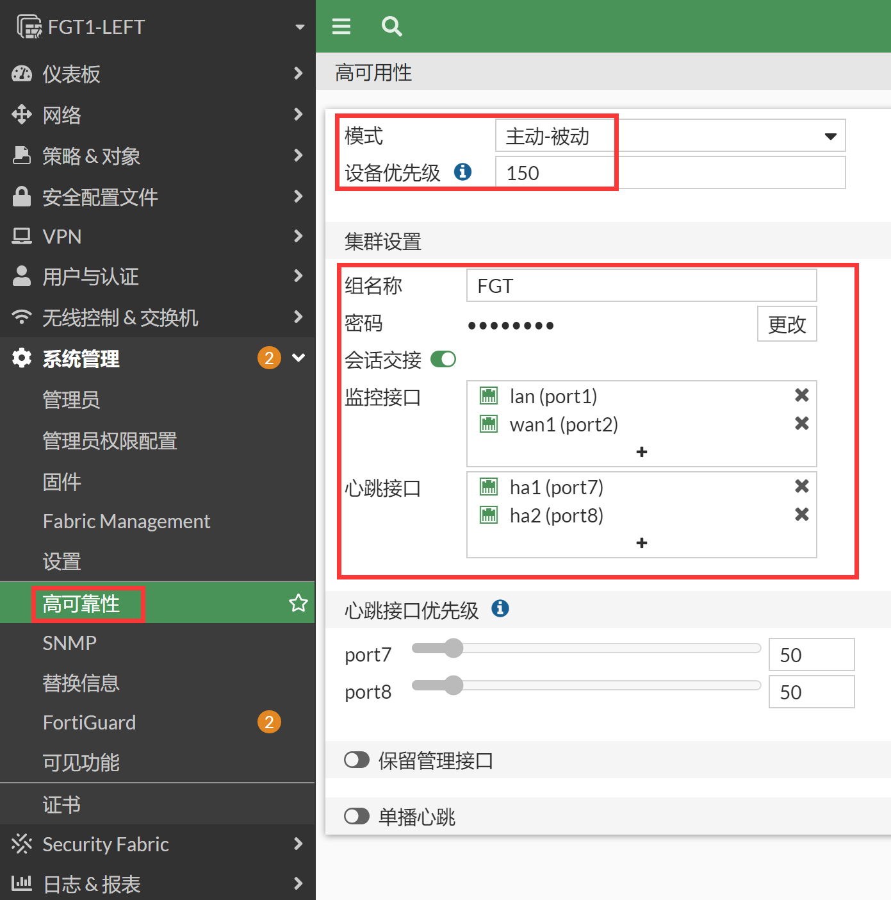
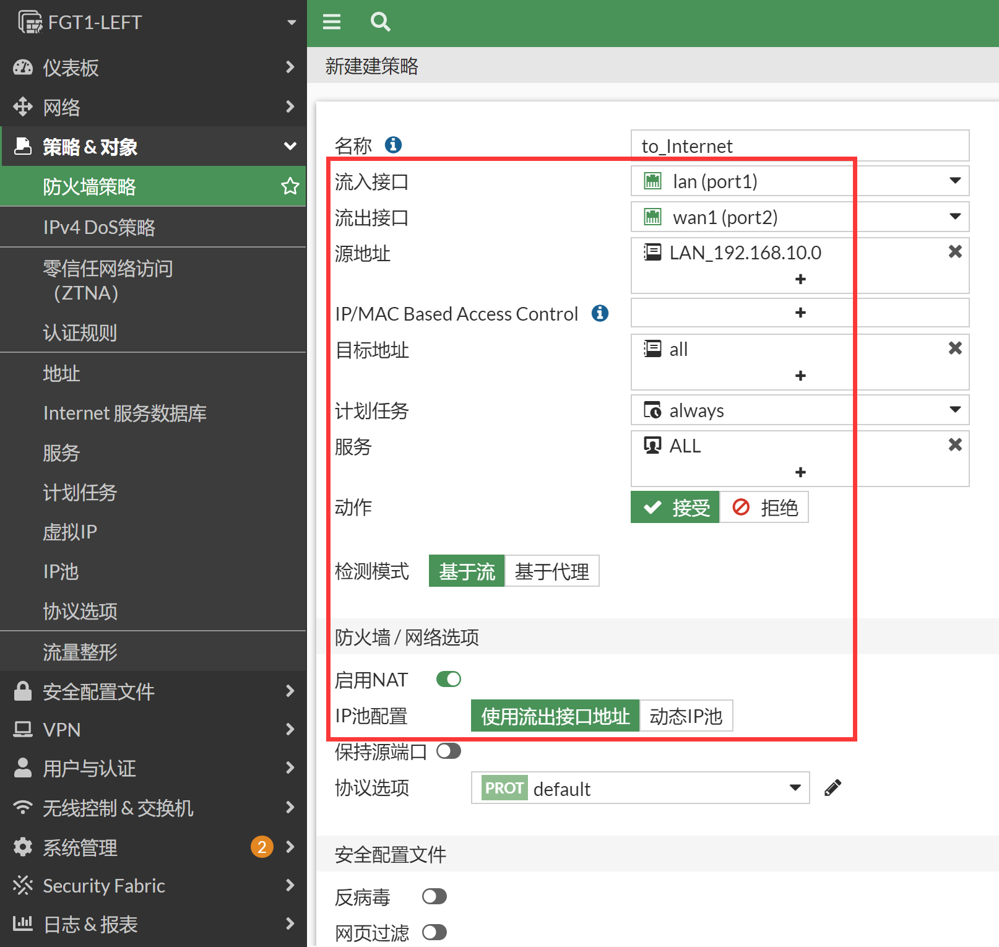
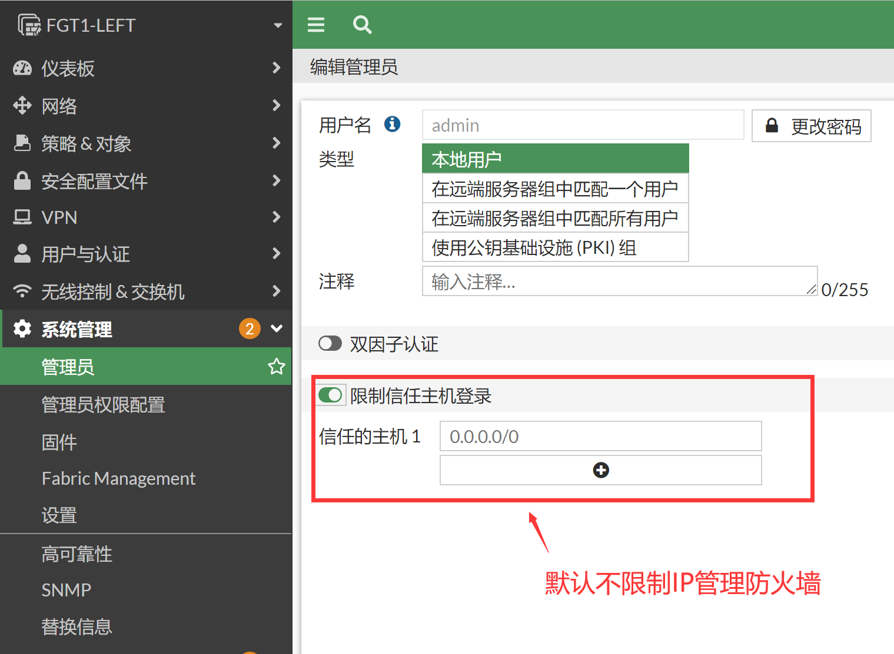
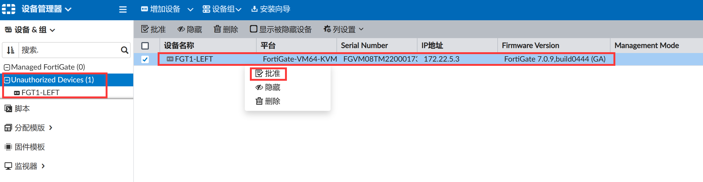
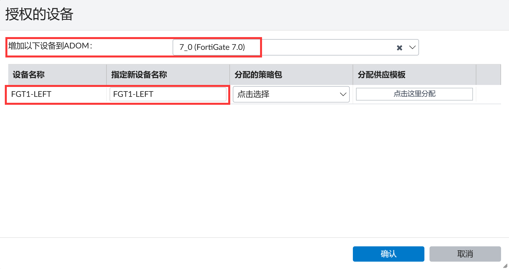

# HA集群带外独立管理-独立管理接口

## 组网需求

1. 在HA集群中，所有集群成员的配置全部相同，通过IP只能管理到主设备，无法通过IP对每个slave设备进行单独的管理。同时为了业务的安全，需要将管理网络与业务网络独立开。
2. 为实现如上需求，可以使用HA使用独立的管理接口来实现带外管理功能。独立管理口的相关配置不会被HA所同步。

## 网络拓扑


## 配置要点

- 配置HA基础配置
- 配置基础LAN/WAN上网服务
- 配置“HA独立管理口”
- 配置防火墙的SYSLOG、SNMP和FMG

## 配置步骤和结果验证

1. 配置HA基础配置，初始化配置防火墙的时候可以通过mgmt口登陆到防火墙上，一般mgmt口的管理IP是192.168.1.99，第一步可以通过此IP登陆防火墙（参考[Web管理](..\..\系统管理\设备管理\Web管理.md)章节），或者通过console口管理防火墙（参考[Console管理](..\..\系统管理\设备管理\Console管理.md)章节）。具体型号初始化如果网管和接口的网管IP信息等可参考https://docs.fortinet.com/product/fortigate/hardware 或https://docs.fortinet.com/document/fortigate/hardware/fortigate-quickstart-guide-high-end?model=all 。

2. 按照以上方式登陆第一次开箱的防火墙。先登陆主防火墙，并配置进行HA的基础配置，然后登陆到备防火墙，配置备防火墙的HA基础配置。

3. 分别配置主防火墙和备防火墙的HA，主防火墙优先级调整为150，备防火墙的优先级保持默认的120，配置HA-cluster组名字和密码，监控业务接口wan1和port1，使用HA1和HA2接口将二者互联。

   

   ```
   config system ha
       set group-name "FGT"
       set mode a-p
       set password ENC XU4Yv532eMH20TXkbxDMQWRNs+ChZrIVXcotCFVP2C86QBl2zhznTNU+0PDKw5Vlvtm6B+NCZ+f+1EiT3MsUteDHW82Aten6q+Yu6zAT5NuXYYIKnVpG=
       set hbdev "port7" 50 "port8" 50 
       set session-pickup enable
       set override disable
       set priority 150
       set monitor "port1" "port2" 
   end
   ```

   

   ```
   config system ha
       set group-name "FGT"
       set mode a-p
       set password ENC HzpTLoO69D1nrZ9QZbKFDbuUmCefmDRbZqTvgSseAgh2zU8JOHq1bthC750a+p5S/rkfRSROmhVMqOKRbBZkir3C8VWW9l+h7jl7Xp4N5sdA1CmDSUzX=
       set hbdev "port7" 50 "port8" 50 
       set session-pickup enable
       set override disable
       set priority 120
       set monitor "port1" "port2" 
   end
   ```

4. 双方的HA配置完毕之后将ha1和ha2线相互直连，将会进行HA的选举，此时优先级150高的FGT将成为主防火墙，优先级低的120的FGT将成为备防火墙。然后备防火墙的配置将会和主防火墙进行同步，备防火墙所有配置和主防火墙一致，此时备防火墙也将不再可以WEB/SSH登录，仅仅可以Console登录。后续所有的操作和配置都在主防火墙上的GUI、SSH或Console完成。

5. 选举结果如下，FGT1-LEFT成为主设备。

   ```
   FGT1-LEFT # diagnose sys ha status
   HA information
   Statistics
           traffic.local = s:0 p:22783 b:12890083
           traffic.total = s:0 p:22793 b:12890691
           activity.ha_id_changes = 2
           activity.fdb  = c:0 q:0
   
   Model=80008, Mode=2 Group=0 Debug=0
   nvcluster=1, ses_pickup=1, delay=0
   
   [Debug_Zone HA information]
   HA group member information: is_manage_primary=1.
   FGVM08TM22000173:      Primary, serialno_prio=1, usr_priority=150, hostname=FGT1-LEFT
   FGVM08TM22000174:    Secondary, serialno_prio=0, usr_priority=120, hostname=FGT2-RIGHT
   
   [Kernel HA information]
   vcluster 1, state=work, primary_ip=169.254.0.2, primary_id=0:
   FGVM08TM22000173:      Primary, ha_prio/o_ha_prio=0/0
   FGVM08TM22000174:    Secondary, ha_prio/o_ha_prio=1/1
   ```

6. 这三个命令都可以看到HA的选举结果和HA状态。

   ```
   # diagnose sys ha status
   # get system status
   # get system ha status
   ```

7. GUI查看HA的选举结果和状态。

   

8. 配置基础LAN/WAN上网服务。此步骤为正常上网的基础配置，大概的步骤是配置接口IP、配置默认路由、配置策略即可实现防火墙的简单上网配置。（所有配置都在主防火墙上完成，备防火墙此时不可以登陆）

9. 配置接口IP。

   

   ```
   config system interface
       edit "port1"
           set vdom "root"
           set ip 192.168.10.1 255.255.255.0
           set allowaccess ping https ssh snmp http fgfm
           set type physical
           set alias "lan"
           set snmp-index 1
       next
       edit "port2"
           set vdom "root"
           set ip 202.100.1.21 255.255.255.0
           set type physical
           set alias "wan1"
           set snmp-index 2
       next
   end
   ```

10. 配置默认路由。

    

    ```
    config router static
        edit 1
            set gateway 202.100.1.192
            set device "port2"
        next
    end
    ```

11. 配置上网策略。

    

    ```
    config firewall policy
        edit 1
            set name "to_Internet"
            set srcintf "port1"
            set dstintf "port2"
            set action accept
            set srcaddr "LAN_192.168.10.0"
            set dstaddr "all"
            set schedule "always"
            set service "ALL"
            set nat enable
        next
    end
    ```

12. 配置LAN口网管相关参数，关于网管目前可以通过port1（lan）的192.168.10.1进行管理，比较关键的网管因素是：

    - port1接口下开启了网管的协议，比如https、http、ssh、snmp等。

      

    - 管理员可信任主机如果配置了的话，需要包含发起管理请求的主机IP或网段。

      

    - 客户端PC到FGT的来回路由可达，可以通过ping和tracert测试。

    - 上面1、2点确认没有问题之后，还是遇到不通的情况，可以通过sniffer抓包和debug flow确认问题所在。

      ```
      FGT # diagnose sniffer packet any "host 192.168.10.1" 4 0 l
      ```

    - 如果跨接口管理防火墙，比如处于port1的PC要通过防火墙port2接口的IP管理防火墙，则需要主要有port1到port2的放通策略，否则数据也是不通的。

    - 出现网管不了的情况，99%就是以上的原因了。

13. 配置HA独立管理口，**要注意如果作为独立管理的接口有关联的配置，则独立管理口不能选择该接口，比如某接口配置了DHCP服务器，则需要把DHCP相关的功能先去掉，然后才可以将该接口指定为独立管理口**。

    

14. 在主设备和备设备上将port6（mgmt）接口加入独立管理口，并配置独立管理口的网关。

    

    ```
    config system ha
    ...
        set ha-mgmt-status enable
        config ha-mgmt-interfaces
            edit 1
                set interface "port6"    //此命令会同步到备机
                set gateway 192.168.91.254    //独立管理口的网关IP地址配置不会同步到备防火墙，因为二者可以拥有不同的IP网段和网关地址，不同步可以满足更多的需求，也更加灵活
            next
        end
    ...
    end
    ```

15. 此时如果本身就是通过mgmt接口管理的防火墙，则可能管理会中断，必须使用console口进行mgmt接口IP的配置。如果使用的业务接口lan（port1）管理的防火墙，则直接修改mgmt接口IP地址即可。

16. 配置mgmt接口（port6）的IP，并开启相关的网管服务。

    

    ```
    config system interface
        edit "port6"
            set ip 192.168.91.21 255.255.255.0
            set allowaccess ping https ssh snmp http fgfm
            set type physical
            set alias "mgmt"
            set snmp-index 6
        next
    end
    ```

17. 主机的HA独立管理口配置完毕，开始配置备机的独立管理口，此时备机是无法WEB/SSH登陆的需要通过主机的execute ha  manage命令（或者Console线）连到备机的命令行界面。

    ```
    FGT1-LEFT # exe ha manage ?
    <id>    please input peer box index.
    <0>     Subsidiary unit FGVM08TM22000174
    
    FGT1-LEFT # exe ha manage 0 admin
    admin@169.254.0.1's password: 
    FGT2-RIGHT # 
    ```

18. 配置备防火墙的mgmt管理口IP地址（开启HA独立管理口功能之后，mgmt的配置不会再同步，需要手工配置mgmt的IP地址）。

    ```
    FGT2-RIGHT # config system interface 
    FGT2-RIGHT (interface) # edit port6
    FGT2-RIGHT (port6) # set ip 192.168.91.22/24
    FGT2-RIGHT (port6) # set allowaccess ping https ssh snmp http fgfm
    FGT2-RIGHT (port6) # end
    ```

19. 配置HA独立管理口的网关（此配置不会从主设备同步，需要单独配置）。

    ```
    FGT2-RIGHT # config system ha
    FGT2-RIGHT (ha) # config ha-mgmt-interfaces 
    FGT2-RIGHT (ha-mgmt-interfaces) # edit 1 
    FGT2-RIGHT (1) # set gateway 192.168.91.254
    FGT2-RIGHT (1) # end
    FGT2-RIGHT (ha) # show
    config system ha
        set group-name "FGT"
        set mode a-p
        set password ENC L2tPmaCKq4nyH9Y6/+wKJQTXF2ROKYww0zCKqylOTEiACqph0eB+Ji5FDv5OimBxc4XvxZD8cU6bsWbRP8l/TcHRgpOvoPB/9m/Qu23voGOSxhLxlgiz=
        set hbdev "port7" 50 "port8" 50 
        set session-pickup enable
        set ha-mgmt-status enable
        config ha-mgmt-interfaces
            edit 1
                set interface "port6"
                set gateway 192.168.91.254
            next
        end
        set override disable
        set priority 120
        set monitor "port1" "port2" 
    end
    FGT2-RIGHT (ha) # end
    ```

20. HA独立管理口的配置完毕，此时管理员可以通过192.168.91.21管理主防火墙，192.168.91.22管理备防火墙。两台防火墙拥有独立的管理IP。

21. 如何测试独立管理口和独立管理口的网关是否可以通信？独立管理口实际可以理解为一个轻量级的vdom，如果要测试此vdom里面的数据转发，需要先进入到此轻量级vdom里面然后再发起相应的ping测试，测试才是我们想要的结果。否则直接发起ping的话，就相当于在root vdom（业务处理的VDOM）发包，实际和独立管理口是隔离的是无关的，会引起误会/误解。

22. 测试独立管理口和独立管理口网关的测试，可以看到vsys_hamgmt有独立的路由表和管理路由。

    ```
    FGT1-LEFT # exe enter ?
    <name>    vdom name
    root
    vsys_hamgmt
    
    FGT1-LEFT # exe enter vsys_hamgmt    //进入轻量级独立管理vdom
    current vdom=vsys_hamgmt:1
    
    FGT1-LEFT # get router info routing-table all    //拥有独立的路由表
    ...
    Routing table for VRF=0
    C       192.168.91.0/24 is directly connected, port6
    
    FGT1-LEFT # diagnose ip route list
    ...
    tab=254 vf=1 scope=0 type=1 proto=17 prio=0 0.0.0.0/0.0.0.0/0->0.0.0.0/0 pref=0.0.0.0 gwy=192.168.91.254 dev=8(port6)    //独立管理的默认路由
    ...
    
    FGT1-LEFT # exe ping 192.168.91.254
    PING 192.168.91.254 (192.168.91.254): 56 data bytes
    64 bytes from 192.168.91.254: icmp_seq=0 ttl=128 time=0.9 ms
    64 bytes from 192.168.91.254: icmp_seq=1 ttl=128 time=1.3 ms
    64 bytes from 192.168.91.254: icmp_seq=2 ttl=128 time=0.8 ms
    64 bytes from 192.168.91.254: icmp_seq=3 ttl=128 time=0.5 ms
    64 bytes from 192.168.91.254: icmp_seq=4 ttl=128 time=0.7 ms
    
    --- 192.168.91.254 ping statistics ---
    5 packets transmitted, 5 packets received, 4 duplicates, 0% packet loss
    round-trip min/avg/max = 0.5/1.9/4.3 ms
    
    FGT-LEFT # diagnose sniffer packet any "host 192.168.91.254" 4
    interfaces=[any]
    filters=[host 192.168.91.254]
    3.235814 port6 out 192.168.91.21 -> 192.168.91.254: icmp: echo request    //匹配明细直连路由，ping数据从port6 out，可以成功ping通网关
    3.235900 port6 in 192.168.91.254 -> 192.168.91.21: icmp: echo reply
    4.245672 port6 out 192.168.91.21 -> 192.168.91.254: icmp: echo request
    4.245747 port6 in 192.168.91.254 -> 192.168.91.21: icmp: echo reply
    ```

23. 退出独立管理口轻量级vdom，进入root vdom，查看路由表，并尝试访问独立管理口的网关。

    ```
    FGT1-LEFT # exe enter root
    current vdom=root:0
    
    FGT1-LEFT # get router info routing-table all    //业务的独立路由表，和独立管理的路由表完全独立，相当于路由的轻量级隔离
    ...
    Routing table for VRF=0
    S*      0.0.0.0/0 [10/0] via 202.100.1.192, port2, [1/0]
    C       192.168.10.0/24 is directly connected, port1
    C       202.100.1.0/24 is directly connected, port2
    
    FGT101E_Master_379 # execute ping 192.168.91.254  // 通过root ping 192.168.91.254
    PING 192.168.91.254 (192.168.91.254): 56 data bytes
    
    --- 192.168.91.254 ping statistics ---
    5 packets transmitted, 0 packets received, 100% packet loss
    
    FGT-LEFT # diagnose sniffer packet any "host 192.168.91.254 and icmp" 4
    interfaces=[any]
    filters=[host 192.168.91.254 and icmp]
    12.785835 port2 out 202.100.1.21 -> 192.168.91.254: icmp: echo request  // 匹配到默认路由，ping数据从port2 out，无法ping通独立管理的网关，结果是正确的，但这不是我们想要的结果。处于一个错误的状态，实际并不是不通，只是没有进入vsys_hamgmt而已
    13.795618 port2 out 202.100.1.21 -> 192.168.91.254: icmp: echo request
    14.805621 port2 out 202.100.1.21 -> 192.168.91.254: icmp: echo request
    15.815615 port2 out 202.100.1.21 -> 192.168.91.254: icmp: echo request
    16.825621 port2 out 202.100.1.21 -> 192.168.91.254: icmp: echo request
    ```

24. 测试备机的独立管理口网关ping测试。

    ```
    FGT2-RIGHT # exe enter vsys_hamgmt
    current vdom=vsys_hamgmt:1
    
    FGT2-RIGHT # execute ping 192.168.91.254    //发起ping测试
    PING 192.168.91.254 (192.168.91.254): 56 data bytes
    64 bytes from 192.168.91.254: icmp_seq=0 ttl=255 time=0.3 ms
    64 bytes from 192.168.91.254: icmp_seq=1 ttl=255 time=0.1 ms
    64 bytes from 192.168.91.254: icmp_seq=2 ttl=255 time=0.1 ms
    64 bytes from 192.168.91.254: icmp_seq=3 ttl=255 time=0.1 ms
    64 bytes from 192.168.91.254: icmp_seq=4 ttl=255 time=0.1 ms
    --- 192.168.91.254 ping statistics ---
    5 packets transmitted, 5 packets received, 0% packet loss
    round-trip min/avg/max = 0.1/0.1/0.3 ms
    
    FGT2-RIGHT # execute enter root    //测试完毕，退出轻量级独立管理vdom
    current vdom=root:0
    ```

### HTTPS、Ping管理

1. 通过独立管理IP：192.168.91.21管理主防火墙。

   

2. 通过独立管理IP：192.168.91.22管理备防火墙。

   

#### SYSLOG

1. 确认通过192.168.10.1网管没问题的话，配置SYSLOG等本机发出的网管配置。

   

   ```
   config log syslogd setting
       set status enable
       set server "192.168.10.100"
   end
   ```

2. 主/备防火墙的日志都会通过业务接口port1 192.168.10.1将syslog日志发送出去，备防火墙的syslog日志会通过心跳线到主机，然后由主机代为转发。

   ```
   FGT1-LEFT # diagnose sniffer packet any "port 514" 4
   interfaces=[any]
   filters=[port 514]
   0.918154 port1 out 192.168.10.1.15840 -> 192.168.10.125.514: udp 635    //主防火墙的syslog日志
   0.918225 port1 out 192.168.10.1.15840 -> 192.168.10.125.514: udp 649
   5.492057 port1 out 192.168.10.1.22418 -> 192.168.10.125.514: udp 649
   5.961902 port_ha in 169.254.0.2.514 -> 169.254.0.1.514: udp 454    //备防火墙的console登陆日志
   5.962018 port1 out 192.168.10.1.22418 -> 192.168.10.125.514: udp 418
   5.968684 port1 out 192.168.10.1.15840 -> 192.168.10.125.514: udp 554
   8.314617 port1 out 192.168.10.1.22418 -> 192.168.10.125.514: udp 730
   8.507346 port_ha in 169.254.0.2.514 -> 169.254.0.1.514: udp 473    //备防火墙的console退出日志
   8.507479 port1 out 192.168.10.1.22418 -> 192.168.10.125.514: udp 437
   8.964545 port1 out 192.168.10.1.22418 -> 192.168.10.125.514: udp 724
   9.074989 port1 out 192.168.10.1.15840 -> 192.168.10.125.514: udp 597
   ```

   

#### SNMP

1. lan接口下开启SNMP协议。

   

   ```
   config system interface
       edit "port1"
           set vdom "root"
           set ip 192.168.10.1 255.255.255.0
           set allowaccess ping https ssh snmp http fgfm ftm
           set type physical
           set alias "lan"
           set snmp-index 1
       next
   end
   ```

2. 开启SNMP功能。

   

   ```
   config system snmp sysinfo
       set status enable
       set description "FGT"
       set contact-info "support_cn@fortinet.com"
       set location "Beijing"
   end
   
   config system snmp community
       edit 1
           set name "public"
           config hosts
               edit 1
                   set ip 192.168.10.100 255.255.255.255
               next
           end
       next
   end
   ```

3. 在SNMP客户端对FortiGate的lan口进行get/walk操作，这里以IReasoning MIB Browser为例。

   

4. SNMP客户端接收到的FGT发送的trap信息，可以看到主备设备均通过主设备进行发送。

   

   

#### FortiManger管理

1. FortiManager通过FGT的lan口添加设备，在FGT的lan口下开启FMG管理协议。

   

   ```
   config system interface
       edit "port1"
           set vdom "root"
           set ip 192.168.10.1 255.255.255.0
           set allowaccess ping https ssh snmp http fgfm ftm
           set type physical
           set alias "lan"
           set snmp-index 1
       next
   end
   ```

2. 配置防火墙主动连接FMG（如果FMG可以主动访问到FGT，也可以通过FMG主动添加FGT）。

   

   ```
   config system central-management
       set type fortimanager
       set fmg "192.168.90.107"
   end
   ```

3. 如果是FGT主动去注册FMG，则FMG会有未注册的设备提示。

   

4. 只需要将设备添加到FMG的对应ADOM的设备管理中即可。

   

5. 授权完成。

   

6. 在FMG中可以对FGT进行管理。

   

### HA-direct

1. 以上的发送syslog都是通过业务接口port1 192.168.10.1发送的，如果想要syslog、snmp通过mgmt（port6）发送出去，则需要在HA里面开启一个ha-direct功能才可以实现。该命令在主机开启后，也会同步到备机。

   ```
   FGT1-LEFT # config sys ha
   
   FGT1-LEFT (ha) # set ha-direct ?
   enable     Enable using ha-mgmt interface for syslog, SNMP, remote authentication (RADIUS), FortiAnalyzer, FortiSandbox, sFlow, and Netfl.
   disable    Disable using ha-mgmt interface for syslog, SNMP, remote authentication (RADIUS), FortiAnalyzer, FortiSandbox, sFlow, and Netf.
   
   FGT1-LEFT (ha) # set ha-direct enable 
   FGT1-LEFT (ha) # end
   When ha-direct is enabled, source ip may not work.
   We recommend to unset all log-related, netflow and sflow source ip.
   By selecting to continue, all source ip will be unset.
   Do you want to continue? (y/n)y
   ```

2. 再次查看syslog的发送情况，syslog这次就从mgmt（port6）发送出去了。

   ```
   FGT1-LEFT # diagnose sniffer packet any "port 514" 4
   Using Original Sniffing Mode
   interfaces=[any]
   filters=[port 514]
   1.189223 port6 out 192.168.91.21.3320 -> 192.168.10.100.514: udp 553
   1.189276 port6 out 192.168.91.21.3320 -> 192.168.10.100.514: udp 553
   1.189278 port6 out 192.168.91.21.3320 -> 192.168.10.100.514: udp 553
   2.189291 port6 out 192.168.91.21.3320 -> 192.168.10.100.514: udp 556
   3.188617 port6 out 192.168.91.21.3320 -> 192.168.10.100.514: udp 613
   4.194761 port6 out 192.168.91.21.3320 -> 192.168.10.100.514: udp 488
   
   FGT2-RIGHT # diagnose sniffer packet any "port 514" 4 
   Using Original Sniffing Mode
   interfaces=[any]
   filters=[port 514]
   7.137889 port6 out 192.168.91.22.5532 -> 192.168.10.100.514: udp 489
   8.136846 port6 out 192.168.91.22.5532 -> 192.168.10.100.514: udp 554
   8.136907 port6 out 192.168.91.22.5532 -> 192.168.10.100.514: udp 554
   8.136909 port6 out 192.168.91.22.5532 -> 192.168.10.100.514: udp 554
   8.136911 port6 out 192.168.91.22.5532 -> 192.168.10.100.514: udp 554
   10.135873 port6 out 192.168.91.22.5532 -> 192.168.10.100.514: udp 554
   ```

3. 如果是snmp的trap想从独立管理口发送，则需要在SNMP的community配置中，对host开启ha-direct功能，主备同步。

   ```
   config system snmp community
       edit 1
           set name "public"
           config hosts
               edit 1
                   set ip 192.168.10.100 255.255.255.255
                   set ha-direct enable
               next
           end
       next
   end
   ```

4. 再次查看snmp trap的发送情况，trap这次就从mgmt（port6）发送出去了。

   ```
   FGT1-LEFT # diagnose sniffer packet any "port 162" 4
   Using Original Sniffing Mode
   interfaces=[any]
   filters=[port 162]
   10.358519 port6 out 192.168.91.21.162 -> 192.168.10.100.162: udp 106
   10.358662 port6 out 192.168.91.21.162 -> 192.168.10.100.162: udp 128
   
   FGT2-RIGHT # diagnose sniffer packet any "port 162" 4
   Using Original Sniffing Mode
   interfaces=[any]
   filters=[port 162]
   6.257505 port6 out 192.168.91.22.162 -> 192.168.10.100.162: udp 43
   6.257678 port6 out 192.168.91.22.162 -> 192.168.10.100.162: udp 68
   77.293372 port6 out 192.168.91.22.162 -> 192.168.10.100.162: udp 43
   77.293562 port6 out 192.168.91.22.162 -> 192.168.10.100.162: udp 68
   122.341966 port6 out 192.168.91.22.162 -> 192.168.10.100.162: udp 107
   122.342170 port6 out 192.168.91.22.162 -> 192.168.10.100.162: udp 129
   ```

5. 关于FMG还是建议使用业务接口进行管理，不能使用独立管理口进行管理。对于FMG来说HA-Cluster就是一台设备，因此需要一个固定的IP地址来网管FGT会比较合适，可以有效的避免HA发生切换的时候，FGT和FMG的tunnel中断的情况。

6. 关于DNS和FortiGuard还是通过root VDOM（管理VDOM）进行解析和更新的。
7. 要彻底的完完全全的实现HA-Cluster的独立管理同时又与业务完全隔离，则需要使用独立管理VDOM，请参考[HA集群带外独立管理-独立管理VDOM](.\HA集群带外独立管理-独立管理VDOM.md)章节。
