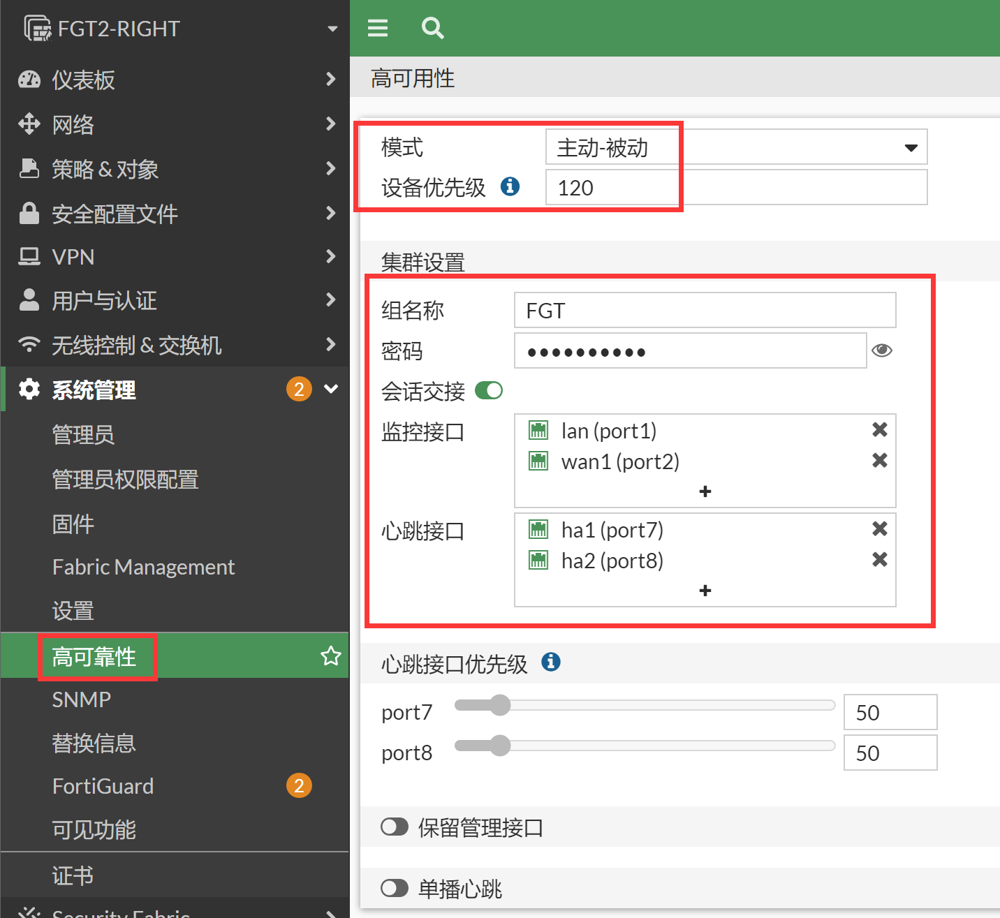
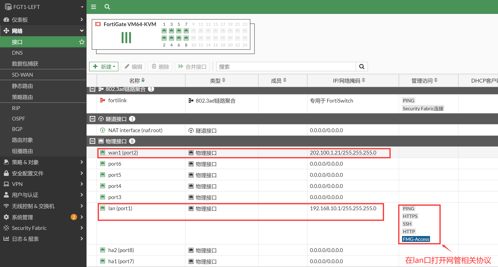
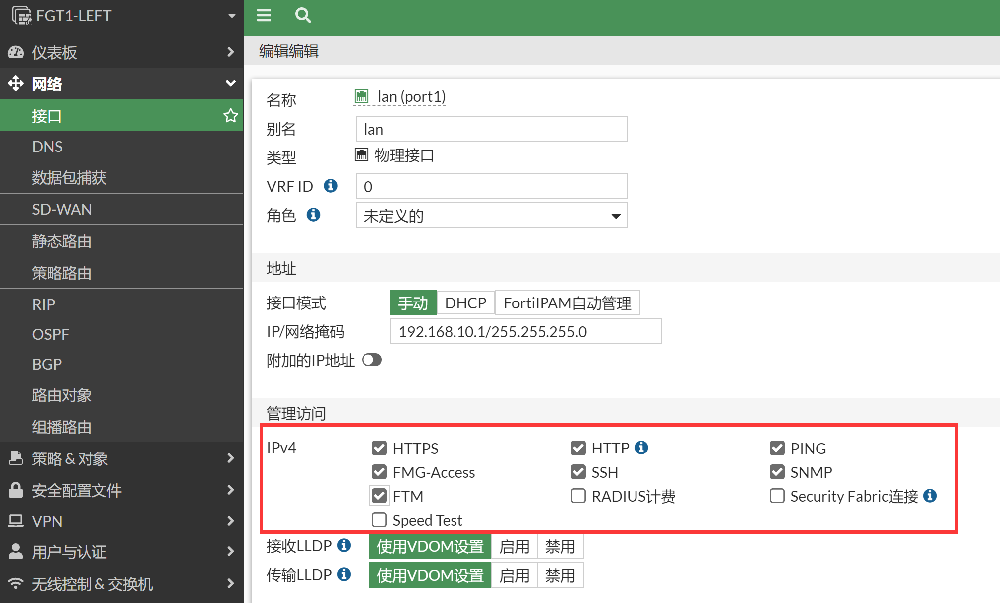
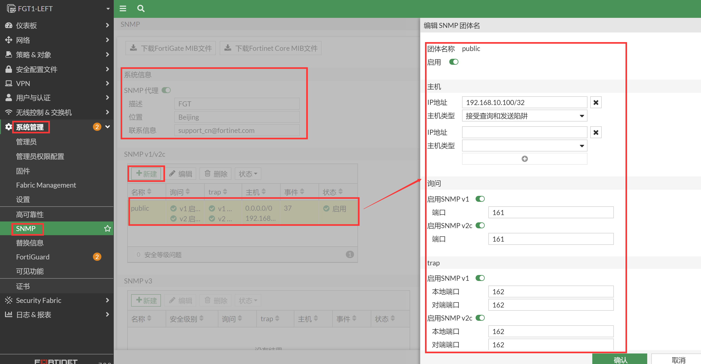
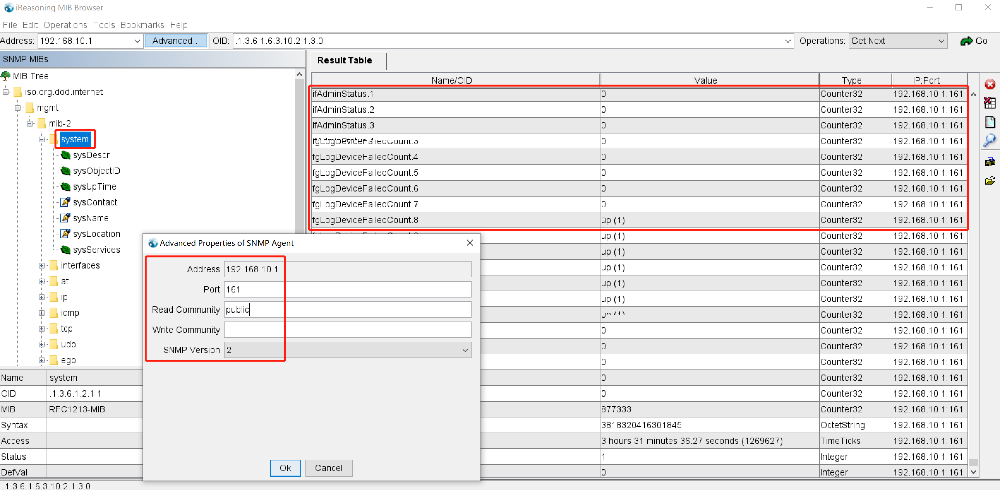
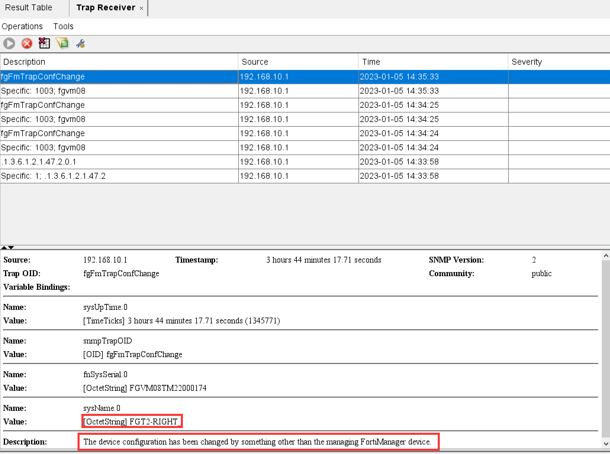
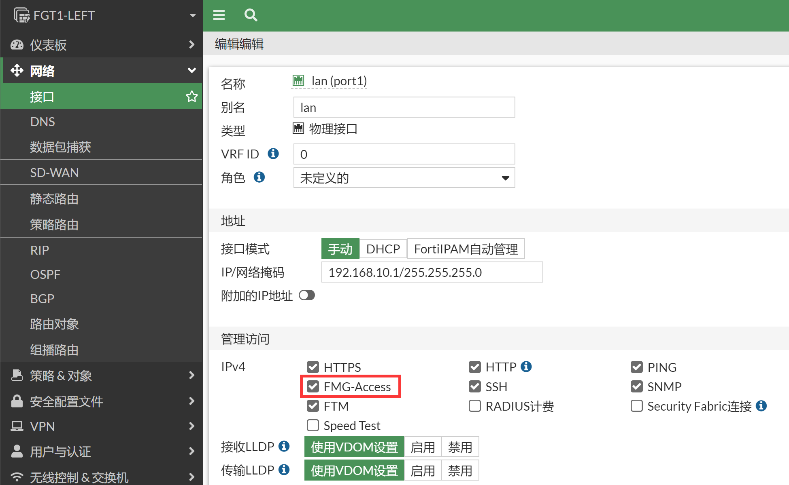
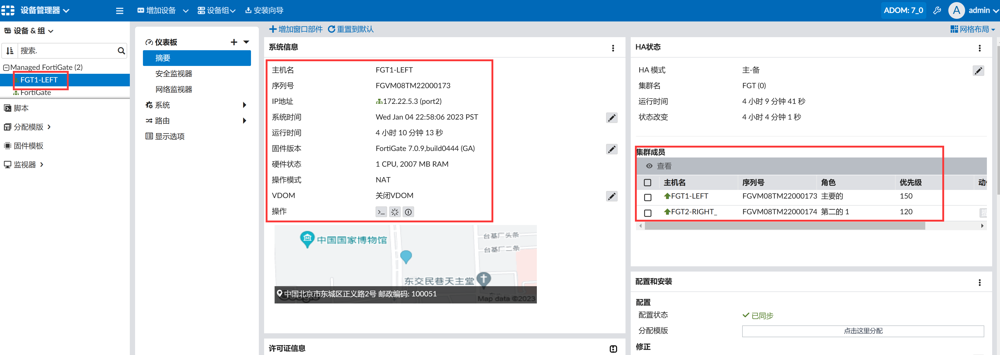

# HA集群普通管理

## 组网需求

通过业务接口管理和配置HA集群。

## 网络拓扑


## 配置要点

- 配置HA基础配置

- 配置基础LAN/WAN上网服务

- 配置网络管理的相关参数

- 配置防火墙的SYSLOG、SNMP、FMG

## 配置步骤和结果验证

### HA基础配置

1. 配置HA基础配置，初始化配置防火墙的时候可以通过mgmt口登陆到防火墙上，一般mgmt口的管理IP是192.168.1.99，第一步可以通过此IP登陆防火墙（参考[Web管理](..\..\系统管理\设备管理\Web管理.md)章节），或者通过console口管理防火墙（参考[Console管理](..\..\系统管理\设备管理\Console管理.md)章节）。具体型号初始化如果网管和接口的网管IP信息等可参考https://docs.fortinet.com/product/fortigate/hardware 或https://docs.fortinet.com/document/fortigate/hardware/fortigate-quickstart-guide-high-end?model=all 。

2. 按照以上方式登陆第一次开箱的防火墙。先登陆主防火墙，并配置进行HA的基础配置，然后登陆到备防火墙，配置备防火墙的HA基础配置。

3. 分别配置主防火墙和备防火墙的HA，主防火墙优先级调整为150，备防火墙的优先级保持默认的120，配置HA-cluster组名字和密码，监控业务接口wan1和port1，使用HA1和HA2接口将二者互联。

   

   ```
   config system ha
       set group-name "FGT"
       set mode a-p
       set password ENC XU4Yv532eMH20TXkbxDMQWRNs+ChZrIVXcotCFVP2C86QBl2zhznTNU+0PDKw5Vlvtm6B+NCZ+f+1EiT3MsUteDHW82Aten6q+Yu6zAT5NuXYYIKnVpG=
       set hbdev "port7" 50 "port8" 50 
       set session-pickup enable
       set override disable
       set priority 150
       set monitor "port1" "port2" 
   end
   ```

   

   ```
   config system ha
       set group-name "FGT"
       set mode a-p
       set password ENC HzpTLoO69D1nrZ9QZbKFDbuUmCefmDRbZqTvgSseAgh2zU8JOHq1bthC750a+p5S/rkfRSROmhVMqOKRbBZkir3C8VWW9l+h7jl7Xp4N5sdA1CmDSUzX=
       set hbdev "port7" 50 "port8" 50 
       set session-pickup enable
       set override disable
       set priority 120
       set monitor "port1" "port2" 
   end
   ```

4. 双方的HA配置完毕之后将ha1和ha2线相互直连，将会进行HA的选举，此时优先级150高的FGT将成为主防火墙，优先级低的120的FGT将成为备防火墙。然后备防火墙的配置将会和主防火墙进行同步，备防火墙所有配置和主防火墙一致，此时备防火墙也将不再可以WEB/SSH登录，仅仅可以Console登录。后续所有的操作和配置都在主防火墙上的GUI、SSH或Console完成。

5. 选举结果如下，FGT1-LEFT成为主设备。

   ```
   FGT1-LEFT # diagnose sys ha status
   HA information
   Statistics
           traffic.local = s:0 p:22783 b:12890083
           traffic.total = s:0 p:22793 b:12890691
           activity.ha_id_changes = 2
           activity.fdb  = c:0 q:0
   
   Model=80008, Mode=2 Group=0 Debug=0
   nvcluster=1, ses_pickup=1, delay=0
   
   [Debug_Zone HA information]
   HA group member information: is_manage_primary=1.
   FGVM08TM22000173:      Primary, serialno_prio=1, usr_priority=150, hostname=FGT1-LEFT
   FGVM08TM22000174:    Secondary, serialno_prio=0, usr_priority=120, hostname=FGT2-RIGHT
   
   [Kernel HA information]
   vcluster 1, state=work, primary_ip=169.254.0.2, primary_id=0:
   FGVM08TM22000173:      Primary, ha_prio/o_ha_prio=0/0
   FGVM08TM22000174:    Secondary, ha_prio/o_ha_prio=1/1
   ```

6. 这三个命令都可以看到HA的选举结果和HA状态。

   ```
   # diagnose sys ha status
   # get system status
   # get system ha status
   ```

7. GUI查看HA的选举结果和状态。

   

8. 配置基础LAN/WAN上网服务。此步骤为正常上网的基础配置，大概的步骤是配置接口IP、配置默认路由、配置策略即可实现防火墙的简单上网配置。（所有配置都在主防火墙上完成，备防火墙此时不可以登陆）

9. 配置接口IP。

   

   ```
   config system interface
       edit "port1"
           set vdom "root"
           set ip 192.168.10.1 255.255.255.0
           set allowaccess ping https ssh snmp http fgfm
           set type physical
           set alias "lan"
           set snmp-index 1
       next
       edit "port2"
           set vdom "root"
           set ip 202.100.1.21 255.255.255.0
           set type physical
           set alias "wan1"
           set snmp-index 2
       next
   end
   ```

10. 配置默认路由。

    

    ```
    config router static
        edit 1
            set gateway 202.100.1.192
            set device "port2"
        next
    end
    ```

11. 配置上网策略。

    

    ```
    config firewall policy
        edit 1
            set name "to_Internet"
            set srcintf "port1"
            set dstintf "port2"
            set action accept
            set srcaddr "LAN_192.168.10.0"
            set dstaddr "all"
            set schedule "always"
            set service "ALL"
            set nat enable
        next
    end
    ```

12. 配置LAN口网管相关参数，关于网管目前可以通过port1（lan）的192.168.10.1进行管理，比较关键的网管因素是：

    - port1接口下开启了网管的协议，比如https、http、ssh、snmp等。

      

    - 管理员可信任主机如果配置了的话，需要包含发起管理请求的主机IP或网段。

      

    - 客户端PC到FGT的来回路由可达，可以通过ping和tracert测试。

    - 上面1、2点确认没有问题之后，还是遇到不通的情况，可以通过sniffer抓包和debug flow确认问题所在。

      ```
      FGT # diagnose sniffer packet any "host 192.168.10.1" 4 0 l
      ```

    - 如果跨接口管理防火墙，比如处于port1的PC要通过防火墙port2接口的IP管理防火墙，则需要主要有port1到port2的放通策略，否则数据也是不通的。

    - 出现网管不了的情况，99%就是以上的原因了。


### 网管配置

#### SYSLOG

1. 确认通过192.168.10.1网管没问题的话，配置SYSLOG等本机发出的网管配置。

   

   ```
   config log syslogd setting
       set status enable
       set server "192.168.10.100"
   end
   ```

2. 主/备防火墙的日志都会通过业务接口port1 192.168.10.1将syslog日志发送出去，备防火墙的syslog日志会通过心跳线到主机，然后由主机代为转发。

   ```
   FGT1-LEFT # diagnose sniffer packet any "port 514" 4
   interfaces=[any]
   filters=[port 514]
   0.918154 port1 out 192.168.10.1.15840 -> 192.168.10.125.514: udp 635    //主防火墙的syslog日志
   0.918225 port1 out 192.168.10.1.15840 -> 192.168.10.125.514: udp 649
   5.492057 port1 out 192.168.10.1.22418 -> 192.168.10.125.514: udp 649
   5.961902 port_ha in 169.254.0.2.514 -> 169.254.0.1.514: udp 454    //备防火墙的console登陆日志
   5.962018 port1 out 192.168.10.1.22418 -> 192.168.10.125.514: udp 418
   5.968684 port1 out 192.168.10.1.15840 -> 192.168.10.125.514: udp 554
   8.314617 port1 out 192.168.10.1.22418 -> 192.168.10.125.514: udp 730
   8.507346 port_ha in 169.254.0.2.514 -> 169.254.0.1.514: udp 473    //备防火墙的console退出日志
   8.507479 port1 out 192.168.10.1.22418 -> 192.168.10.125.514: udp 437
   8.964545 port1 out 192.168.10.1.22418 -> 192.168.10.125.514: udp 724
   9.074989 port1 out 192.168.10.1.15840 -> 192.168.10.125.514: udp 597
   ```

   

#### SNMP

1. lan接口下开启SNMP协议。

   

   ```
   config system interface
       edit "port1"
           set vdom "root"
           set ip 192.168.10.1 255.255.255.0
           set allowaccess ping https ssh snmp http fgfm ftm
           set type physical
           set alias "lan"
           set snmp-index 1
       next
   end
   ```

2. 开启SNMP功能。

   

   ```
   config system snmp sysinfo
       set status enable
       set description "FGT"
       set contact-info "support_cn@fortinet.com"
       set location "Beijing"
   end
   
   config system snmp community
       edit 1
           set name "public"
           config hosts
               edit 1
                   set ip 192.168.10.100 255.255.255.255
               next
           end
       next
   end
   ```

3. 在SNMP客户端对FortiGate的lan口进行get/walk操作，这里以IReasoning MIB Browser为例。

   

4. SNMP客户端接收到的FGT发送的trap信息，可以看到主备设备均通过主设备进行发送。

   

   

#### FortiManger管理

1. FortiManager通过FGT的lan口添加设备，在FGT的lan口下开启FMG管理协议。

   

   ```
   config system interface
       edit "port1"
           set vdom "root"
           set ip 192.168.10.1 255.255.255.0
           set allowaccess ping https ssh snmp http fgfm ftm
           set type physical
           set alias "lan"
           set snmp-index 1
       next
   end
   ```

2. 配置防火墙主动连接FMG（如果FMG可以主动访问到FGT，也可以通过FMG主动添加FGT）。

   

   ```
   config system central-management
       set type fortimanager
       set fmg "192.168.90.107"
   end
   ```

3. 如果是FGT主动去注册FMG，则FMG会有未注册的设备提示。

   

4. 只需要将设备添加到FMG的对应ADOM的设备管理中即可。

   

5. 授权完成。

   

6. 在FMG中可以对FGT进行管理。

   

#### SSH、Ping

1. 在lan接口下开启SSH和Ping。

2. 使用PC客户端访问FGT主设备的Ping和SSH。

   
