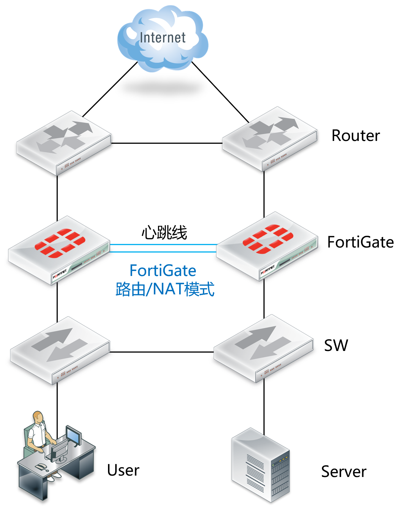
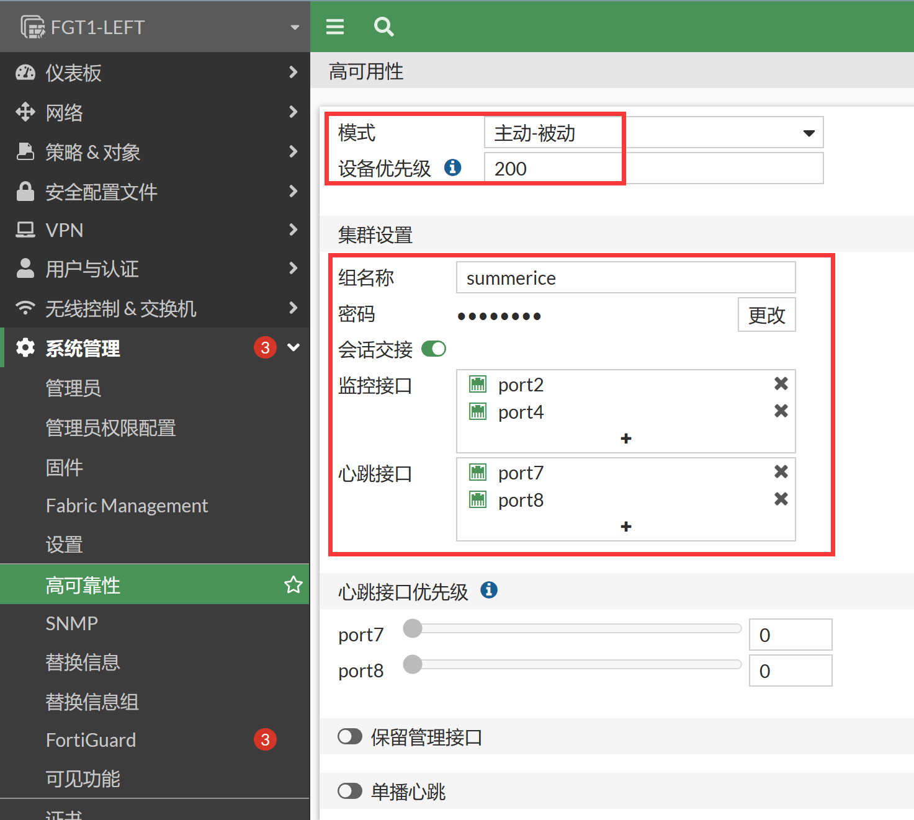
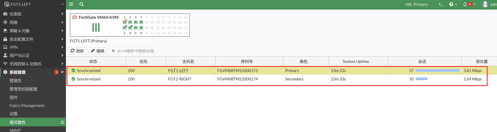

# HA典型基础配置

## 网络拓扑



## 配置建议

1. 进行HA环境下更换设备前，进行配置备份，防止操作失误而造成的配置丢失。
2. 建议配置两条以上的心跳线缆，防止单心跳故障造成HA机群崩溃，使用独立的心跳接口，尽量避免与业务口混用。
3. 优先使用光纤接口。
4. 开启会话同步：set session-pickup enable（默认关闭）或者在WEB上启用“会话交接”。
5. 谨慎使用override功能。开启override后设备选举过程中HA优先级参数高于设备运行时间参数，可能造成期望成为备机的设备被选举为主设备，造成反向同步配置信息。
6. 更改默认的HA组的ID，避免同一个广播域内存在多个HA机群，而造成接口的虚拟MAC冲突。
7. 选择正确的监控端口和心跳端口，在开启vdom虚拟cluster时候，每个cluster需要单独配置。
8. 如果开启ping server功能，则需要再HA配置中添加相应的配置命令。
9. 建议将与防火墙相连的交换机接口配置为stp portfast模式，发生接口Up/Down切换时，交换机的接口可立刻进入转发状态，而不需要stp状态进行侦听、学习、转发等延迟步骤后接口才转发数据。

## 配置要点

- 进行HA 的配置，硬件和软件版本需满足如下要求：
   - 防火墙硬件型号相同、同型号硬件需要为相同的硬件版本。
   - 内存容量、CPU 型号、硬盘容量等相同。
   - 相同的软件版本版本。
- 配置设备1的HA。
- 配置设备2的HA。
- 组建HA。
- 查看HA集群。

## 配置步骤

1. 配置主设备，进入菜单系统管理→高可用性，模式选择“主动-被动”模式，优先级配置200（主机高于从机）；组名/密码自定义；勾选“启用会话交接”。

   

   - 模式：单机模式、主动-被动、主动-主动。在大多数网络中会选择主动-被动，即主设备进行业务处理，备机处于备份状态，当主设备发生设备故障或者接口链路故障后，则由备机继续处理业务。
   - 设备优先级：优先级高的设备，优先被选为主设备。
   - 组名和密码：自行定义即可，做HA的两台机器需要配置相同的参数。
   - 启用会话交接：建议启用。主墙和备墙之间实时进行会话信息的同步，当发生HA切换到时候，备墙上有同样的会话信息会对原来的会话进行处理，不会产生会话中断。
   - HA的接口配置：
        - 端口监控：HA监控的接口，作为HA切换依据之一；本案例中监控port2（外网口）和port4（内网口）。业务端口需要被防火墙监控，当端口出现故障时会进行切换，具有数量多的有效监控端口的设备会作为主墙处理数据。
        - 心跳接口：启用两个心跳接口：port7、port8。用于配置同步，会话同步，对方存活心跳检测等，为了集群的稳定建议配置２条或以上的线条线。在有多条心跳线路的情况下，心跳端口的 心跳优先级 决定了优先使用那条线路同步心跳（优先级高的端口连接的线路优先使用）

2. 配置从设备，除了优先级不同外（优先级低于主机），其他参数均与设备1相同。

3. 组建HA，连接心跳线，FGT主的port7、port8，连接到 FGT从的port7、port8。

4. 防火墙开始协商建立HA集群，此时会暂时失去和防火墙到连接，这是因为在HA协商过程中会改变防火墙接口到MAC地址。可以通过更新电脑的arp表来恢复连接，Windows下的命令为arp -d。

5. 连接业务口链路。

6. 组建好HA后，两台防火墙配置同步，具有相同的配置，通过访问主防火墙来进行业务配置，如IP地址，策略等，更新的配置会自动同步。

   >  HA建立完成后，只能通过主机进行访问、管理主机。如果需要登陆备机管理，请参考[HA的网管介绍](.\HA-Cluster的网管\HA的网管介绍.md)章节。

## 结果验证

1. 进入菜单系统管理→高可用性，就可以看到HA的建立情况。

   

2. 在主设备的CLI下查看HA状态。

   ```
   FGT1-LEFT # get system ha status 
   HA Health Status: OK
   Model: FortiGate-VM64-KVM
   Mode: HA A-P
   Group: 77
   Debug: 0
   Cluster Uptime: 0 days 0:23:56
   Cluster state change time: 2023-01-04 17:01:52
   Primary selected using:
       <2023/01/04 17:01:52> FGVM08TM22000173 is selected as the primary because its override priority is larger than peer member FGVM08TM22000174.
   ses_pickup: enable, ses_pickup_delay=disable
   override: disable
   Configuration Status:
       FGVM08TM22000173(updated 3 seconds ago): in-sync
       FGVM08TM22000174(updated 4 seconds ago): in-sync
   System Usage stats:
       FGVM08TM22000173(updated 3 seconds ago):
           sessions=9, average-cpu-user/nice/system/idle=0%/0%/0%/99%, memory=33%
       FGVM08TM22000174(updated 4 seconds ago):
           sessions=9, average-cpu-user/nice/system/idle=0%/0%/0%/99%, memory=33%
   HBDEV stats:
       FGVM08TM22000173(updated 3 seconds ago):
           port7: physical/10000full, up, rx-bytes/packets/dropped/errors=4230515/13569/0/0, tx=5053711/11897/0/0
           port8: physical/10000full, up, rx-bytes/packets/dropped/errors=3215271/7193/0/0, tx=3246636/7167/0/0
       FGVM08TM22000174(updated 4 seconds ago):
           port7: physical/10000full, up, rx-bytes/packets/dropped/errors=5035221/11873/0/0, tx=4224168/13553/0/0
           port8: physical/10000full, up, rx-bytes/packets/dropped/errors=3244371/7162/0/0, tx=3212142/7186/0/0
   MONDEV stats:
       FGVM08TM22000173(updated 3 seconds ago):
           port2: physical/10000full, up, rx-bytes/packets/dropped/errors=263241/3765/0/0, tx=46197/492/0/0
           port4: physical/10000full, up, rx-bytes/packets/dropped/errors=70859/610/0/0, tx=15210/114/0/0
       FGVM08TM22000174(updated 4 seconds ago):
           port2: physical/10000full, up, rx-bytes/packets/dropped/errors=291104/4091/0/0, tx=14698/104/0/0
           port4: physical/10000full, up, rx-bytes/packets/dropped/errors=69842/597/0/0, tx=14886/106/0/0
   Primary     : FGT1-LEFT       , FGVM08TM22000173, HA cluster index = 1
   Secondary   : FGT2-RIGHT      , FGVM08TM22000174, HA cluster index = 0
   number of vcluster: 1
   vcluster 1: work 169.254.0.2
   Primary: FGVM08TM22000173, HA operating index = 0
   Secondary: FGVM08TM22000174, HA operating index = 1
   ```

   ```
   FGT1-LEFT # diagnose sys ha status 
   HA information
   Statistics
           traffic.local = s:0 p:51672 b:21448340
           traffic.total = s:0 p:51674 b:21448444
           activity.ha_id_changes = 2
           activity.fdb  = c:0 q:0
   
   Model=80008, Mode=2 Group=77 Debug=0
   nvcluster=1, ses_pickup=1, delay=0
   
   [Debug_Zone HA information]
   HA group member information: is_manage_primary=1.
   FGVM08TM22000173:      Primary, serialno_prio=1, usr_priority=200, hostname=FGT1-LEFT
   FGVM08TM22000174:    Secondary, serialno_prio=0, usr_priority=100, hostname=FGT2-RIGHT
   
   [Kernel HA information]
   vcluster 1, state=work, primary_ip=169.254.0.2, primary_id=0:
   FGVM08TM22000173:      Primary, ha_prio/o_ha_prio=0/0
   FGVM08TM22000174:    Secondary, ha_prio/o_ha_prio=1/1
   ```

   

