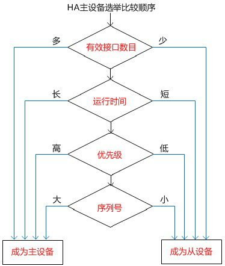
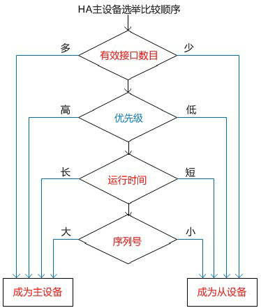

# HA选取主设备的方法

## 主设备选举顺序

防火墙在组成集群到时候，需要选举一台主设备。主设备的选举根据下图所示进行，主设备之外的设备则成为从设备。主设备硬件故障或者被监控的端口链路故障都会重新进行主设备的选举。防火墙按照如下顺序进行比较，进行主设备的选举。这些因素分别是：监控端口中的有效接口数量，设备运行时间，HA优先级，设备的序列号。



### 有效地被监控端口数量

1. 配置了需要被监控的业务端口之后，具有最多数量的有效监控端口的设备会成为主设备。通常情况下当一个HA集群建立起来的时候，所有到被监控的端口都是连接好并工作正常的，所以这个时候监控端口的数量不会成为影响到主设备选举的决定性因素。

2. 当一个被监控的端口出现故障或者链路失效，就会出发协商进行主设备选举，同样这些故障端口恢复到时候也会触发协商。当主设备的某个端口或链路出现故障，而其他设备相关端口和链路都是正常的就会从新选举出一个新的主设备。如port3、port4为被监控端口，当主设备的port3状态down，则其监控端口有效数量减少，从设备此时有效接口数量不变会成为主设备，继续工作。 

3. 如果从设备上的监控端口出现故障，也会进行协商选举，选举结果是主设备不变，因为从设备上监控端口数量较少，自然不会成为主设备。如果不同设备的不同接口现了不同的端口故障，则每次都会进行一次选举。

4. **链路故障切换功能的目的就是要保证具有最多有效端口，最少故障点的那台设备成为主设备。**

   ```
   FGT# config system ha
   FGT(ha)# set monitor "port3" "port4"
   FGT(ha)# end
   ```

### 设备运行时间

1. 运行时间较长到设备会成为主设备。该时间参数是以从上一次设备出现故障以来所正常运行的时间，当然设备重新启动后该时间值也会复位为0。当集群内设备同时启动时，每台设备运行时间是相同的。当设备上的监控端口发生设备故障时，有效运行时间复位，会低于集群内其他设备，与此同时因为拥有有效监控端口数少于其他设备。当出现故障的监控端口恢复时，虽然与未发生故障到设备具有相同的监控端口数，由于运行时间被复位后小于其他设备，也无法成为主设备。

2. 在大多数情况下，集群通过age参数减少了选举新的主设备所需要的时间，使集群更加稳定，因为选举过程有可能会中断数据传输。

   > 注：设备重新启动后age复位为0；接口失效后设备age复位为0。

#### 集群启动时间差

有时集群内的某些主机需要更多的启动时间，启动时间的不同会导致一系列的问题出现，但不会影响集群的操作。为了确保后启动的主机可以成为主设备，FGCP协议默认为忽略5分钟的运行时间的差异，在大多数情况下该时间差的忽略可以帮助用户更容易实现自己预期的配置。在下列情况下运行时间差会造成不可以预料的结果：

1. 在升级固件版本的时候，默认情况下uninterruptable-upgrade enabled参数是开启的，集群会在所有的主机都升级完成后选举新的主设备。但由于主机之间升级后造成的运行时间的差异会小于5分钟，该差异会被忽略，其他的设备会成为新的主机。
2. 在测试失效切换的时候，由于反复切换，造成集群内主机运行时间的差小于5分钟。在通常情况下，失效切换后，失效的主机重新加入集群，他的运行时间要短于其他机，因而不会被选举为主设备。但如果失效的机器加入集群后他与其他主机之间的运行时间差小于5分钟，就有可能被选举为新的主机。

#### 修改时间差

1. 用户可以通过如下命令来修改该参数。

   ```
   FGT# config system ha
   FGT(ha)# set ha-uptime-diff-margin 60
   FGT(ha)# end
   ```

2. 这个命令设置时间差为60秒，运行范围为1-65535秒，默认为300秒。如果你不想等待5分钟的时间以便进行测试，你可以减少差值；在非中断升级防火墙OS的过程中减少差值，或者当集群内机器启动时间差加大的时候增加该差值。

### HA优先级

1. 当具有相同监控端口数，且同时启动运行的防火墙，具有较高优先级的设备优先成为主设备。防火墙默认的优先级为128，可以通过配置优先级参数使某台设备优先成为主设备。该参数同主机名一样，不会在HA成员之间同步。

2. 当安装一组新的设备的时候，有效接口相同和运行时间相同，则优先级高会成为选主设备选举的因素。当一个台具有高优先级新设备加入一个现有的HA集群的时候，并不会触发从新协商，直到机群再次协商的时候该设备会由从设备被选举成为主设备。可以通过图形界面，或者如下的命令对优先级参数进行修改。

   ```
   FGT# config system ha
   FGT(ha)# set priority 200
   FGT(ha)# end
   ```

3. 可以通过execute ha manage命令对机群中的从设备进行优先级的修改。修改该参数后进行重新选举。

### SN序列号

当集群中的设备具相同的有效接口数，运行时间和优先级的时候，设备的序号会成为最后比较的参数，因为不同的设备具有不同的序列号，具有较大数值的SN number的会成为主设备。

### Override参数

1. 在HA的配置中，override参数会影响到主设备的选举过程。

   ```
   FGT# config system ha
   FGT(ha)# set override disable/enable
   FGT(ha)# end
   ```

2. 该参数默认需要通过CLI命令行进行配置，默认值为disable。

3. 当overide参数开启后，主设备的选举方法发生改变，优先级参数成为比运行时间更优先比较的参数。

   

4. 如果一个设备的优先级较高，同时开启了overide选项，则在有效接口相同的情况下，该设备将始终作为主设备工作。由于该参数的这个特性，在实际操作中可能因为误操作造成设备配置的丢失，如下面的例子：

   - A设备优先级200, override enable, B设备优先级100, override disable
   - A设备故障，B设备成为主设备
   - 更换新的A设备，新设配仅设置HA参数，优先级200，override enable，但未做任何的业务配置
   - 新设备所有线路连接好后开启设备，由于新的设备和B设备具有相同的有效接口数量，同时具有较高优先级，选举成主设备
   - 原来主设备B设备的配置文件被同步成为新设备的空配置，数据丢失
   - 规避方法：检查override是否开启，检查优先级参数，或者新的设备接入的时候，不连接任何监控端口的线缆，使其具有少的有效端口数。


