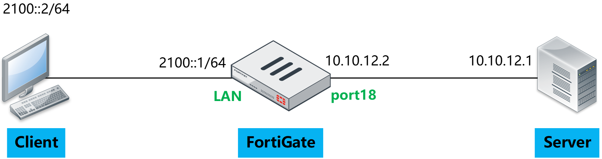

# NAT64

## 组网需求

1. 用户内部使用IPv6网络，FGT作为客户网络的互联网边界介入防火墙，通过NAT64功能实现对互联网的访问。
2. 互联网接入服务商，IPv4网络。
3. 内部IPv6网络。
4. 在7.0版本之后，一个基于per-VDOM的tunnel接口naf.vdom将会自动创建以处理NAT64和NAT46的流量，该接口不支持修改MTU。

## 网络拓扑



Client侧为IPv6，Server侧为IPv4，使用Client访问Server，FortiGate做NAT64转换。

## 配置步骤

1. 创建VIP，选择类型为IPv6，Map to填写IPv4 Server地址， extip填写IPv6 VIP地址，NAT64 VIP的extip如果是一个范围，必须填写为一个完整的subnet，否则GUI报错。

   

   ```
   config firewall vip6
       edit "NAT64"
           set extip 2200::64
           set nat66 disable
           set nat64 enable
           set ipv4-mappedip 10.10.12.1
           set add-nat64-route enable
       next
   end
   ```

2. 可以看默认存在一个naf.root接口，用于处理NAT64流量，创建VIP完成后，如果开启了add-nat64-route（默认开启），针对naf.root接口生成去往VIP IPv6地址的路由，关闭add-nat64-route后，该路由会消失。

   

   

3. 注意：如果是NAT64 VIP，extip配置的不是一个完整的subnet，或范围中包含subnet的广播地址，则下发时页面或CLI会报错，因为无法为naf接口下发路由。

   

4. 创建IPv4 Pool，配置地址池范围，注意不要和port18地址冲突，配置冲突这里并不会提示，后续会讲到为什么不能配成一样的，开启NAT64后，须填写为一个完整的subnet（最小32位）的IPv4地址范围，否则GUI报错。

   

   ```
   config firewall ippool
       edit "NAT64"
           set startip 10.10.200.1
           set endip 10.10.200.254
           set nat64 enable
           set add-nat64-route enable
       next
   end
   ```

5. 创建完成后，如果开启了add-nat64-route（默认开启），可以看到生成了IPv4的kernel路由，针对naf.root接口生成去往IPPool IPv4地址的路由，IPPool关闭NAT64或关闭add-nat64-route后，该路由会消失。

   

6. 开启NAT64后，如果IPPool配置的不是一个完整的subnet，则下发时页面或CLI会报错，因为无法为naf接口下发路由。

   

7. 创建防火墙策略，在NAT中开启NAT64，然后在Destination中引用VIP，在IPPool中引用IPPool。

   

   ```
   config firewall policy
       edit 2
           set name "NAT64"
           set srcintf "lan"
           set dstintf "port18"
           set action accept
           set nat64 enable
           set srcaddr "all"
           set dstaddr "NAT64"
           set srcaddr6 "all"
           set dstaddr6 "all"
           set schedule "always"
           set service "ALL"
           set ippool enable
           set poolname "NAT64"
       next
   end
   ```


## 结果验证

1. Client访问FortiGate的NAT64 VIP地址2200::64，抓包查看NAT64过程，可以看到经过naf.root接口，目标地址被转换为Server IPv4，源IPv6地址被转换为IPPool中的IPv4地址，返回的流量从IPv4被还原为IPv6。

   

2. debug flow IPv4/IPv6，可以看到DNAT64整个过程都需要经过naf.root接口处理。

   

3. 在FortiGate查看IPv6会话，可以看到源接口为物理入接口lan，目标接口为index 37，为naf.root，naf被标记为1，IPv6流量未被加速，会话中还包含相关的IPv4的相关信息。

   

   

4. 在FortiGate查看IPv4会话，可以看到源接口为index 37，为naf.root，目标接口为物理出接口port18，naf被标记为2，IPv4流量未被加速，会话中还包含相关的IPv6会话信息。

   

   

5. 修改IPPool的地址范围和IPv4出接口地址一致，再次测试NAT64转换。

   ```
   config firewall ippool
       edit "NAT64"
           set startip 10.10.12.2
           set endip 10.10.12.2
           set nat64 enable
       next
   end
   ```

6. 查看kernel路由中关于naf.root的路由，可以看到未产生IPPool的路由，这样返回的流量肯定是被丢掉的，接下来验证一下。

   

7. debug flow IPv4&IPv6可以看到，Client到Server方向的NAT46的DNAT和SNAT均正常工作，但返回的IPv6流量未匹配到naf.root接口的路由，而gw查找到的是root接口，返回的流量无法到达Client。

   

8. **所以配置NAT64时，需要注意，IPPool不要配置成和出接口地址相同的地址，配置不会报错，但实际会不通，如果是IPv4的第二地址，实际测试也是不行的。**

9. 还原IPPool的配置，这次修改VIP6的External IP和物理入接口IP一致。

   ```
   config firewall vip6
       edit "NAT64"
           set extip 2100::1
           set nat66 disable
           set nat64 enable
           set ipv4-mappedip 10.10.12.1
       next
   end
   ```

10. 查看kernel路由中关于naf.root的路由，可以看到未产生naf.root接口的VIP6的路由，这样NAT64的Client发起方流量应该是无法进入NAT64流程的，接下来验证一下。

    

11. debug flow IPv4&IPv6可以看到，Client到Server方向的NAT64流量被FortiGate路由到root接口，未进入naf.root接口，由FortiGate直接返回了reply报文，没有IPv4的debug flow产生。

    

12. **所以配置NAT64时，需要注意，IPv6 VIP的extip不要配置成和入接口地址相同的地址，配置不会报错，但实际会不通，如果是IPv6的第二地址，实际测试也是不行的。**

## CLI相关

### VIP CLI

1. IPv4类型的VIP支持三种组合，NAT44、NAT46、NAT44+NAT46。

   ```
   config firewall vip
       edit "vip1"
           set extip 30.0.0.110-30.0.0.120
           set extintf "port3"
           set arp-reply disable
           set portforward enable
           set srcintf-filter "port3"
           set nat44 disable    <------- new option enabled by default
           set nat46 enable    <------- new option disabled by default
           set ipv6-mappedip 2040::20-2040::30    <------- new option available when nat46 enabled
           set extport 10
           set ipv6-mappedport 100    <------- new option available when nat46 enabled
       next
   end
   ```

2. IPv6类型的VIP支持三种组合，NAT66、NAT64、NAT66+NAT64。

   ```
   config firewall vip6
       edit "vip3"
           set extip 2002::100-2002::200
           set portforward enable
           set nat66 disable    <---- new option enabled by default
           set nat64 enable    <---- new option disabled by default
           set ipv4-mappedip 8.8.8.8-8.8.8.108    <----- new option available when nat64 is enabled
           set ipv4-mappedport 1000    <--- new option available when nat64 is enabled
           set extport 100
       next
   end
   ```

3. NAT64也支持Virtual Server，开启NAT64后，RS必须配置为IPv4地址，实现的NAT过程和普通的NAT64是一样的。

   ```
   config firewall vip6 
       edit "vip2"
           set type server-load-balance
           set extip 2002::2
           set server-type udp
           set monitor "ping-mon-l"
           set nat64 enable
           set extport 53
           config realservers
               edit 1
                   set ip 8.8.8.8    <----- server ip must be ipv4 when nat64 is abled
                   set port 53
               next
               edit 2
                   set ip 8.8.4.4
                   set port 53
               next
           end
       next
   end
   ```

### IPPool CLI

1. IPv4类型的IPPool，类型为NAT64，地址池范围必须是一个subnet的范围，默认会开启add-nat64-route。

   ```
   config firewall ippool
       edit "pol64"
           set startip 10.0.0.0    <--- ip range must be a subnet if nat64 enabled
           set endip 10.0.255.255
           set nat64 enable    <--- new option
           set add-nat64-route enable    <---- new option available when nat64 enabled (by default enable)
       next
   end
   ```

2. IPv6类型的IPPool，类型为NAT46，地址池范围必须是一个subnet的范围，默认会开启add-nat46-route。

   ```
   config firewall ippool6
       edit "pol46"
           set startip 2002::    <---- ip range must be a subnet if nat46 enabled
           set endip 2002::ffff
           set nat46 enable
           set add-nat46-route enable    <---- new option available when nat46 enabled (by default enable)
       next
   end
   ```

### Firewall Policy & Central SNAT CLI

1. NAT64 Firewall Policy。

   ```
   config firewall policy
        edit 3
           set srcintf "port2"
           set dstintf "port3"
           set srcaddr "all"
           set dstaddr "all"    <---- both ipv4 and ipv6 addresses are required when nat64 enable
           set srcaddr6 "all"
           set dstaddr6 "vip3"    <--- vip6 with nat64 enabled
           set action accept
           set schedule "always"
           set service "ALL"
           set ippool enable
           set poolname "po1"    <---- ipv4 pool with nat64 enabled
           set nat64 enable    <--- new option to enable nat64
       next
   end
   ```

2. NAT64 Central SNAT。

   ```
   config firewall central-snat-map     
       edit 3
           set type ipv6
           set srcintf "any"
           set dstintf "any"
           set orig-addr6 "all"
           set dst-addr6 "all"
           set nat64 enable    <---- new option for ipv6 rule
           set nat-ippool "po1"    <---- available when nat64 is enabled, ipv4 pool with nat64 enabled
       next
   end
   ```

