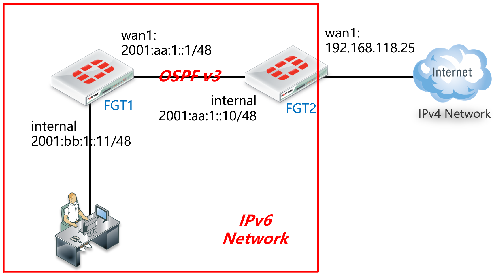

# OSPFv3

## 组网需求

在IPv6网络内部使用OSPFv3。

## 网络拓扑



## 配置要点

**FGT1：**

- 配置基本上网功能
- 配置OSPFv3

**FGT2：**

- 配置NAT64上网IPv4 Internet
- 配置OSPF

## 配置步骤

### FGT1

1. 配置基本上网功能，参考[上网配置](.\上网配置.md)章节。

   ```
   config system interface
   	edit "internal"
   		config ipv6
   			set ip6-allowaccess ping https http
   			set ip6-address 2001:bb:1::1/48
   		next
       edit "wan1"
              config ipv6
               set ip6-allowaccess ping https
               set ip6-address 2001:aa:1::1/48
           next
     end
   ```

2. 配置OSPFv3。

   ```
   config router ospf6
   	set router-id 192.168.1.200    //指定路由ID
   	config area
   		edit 0.0.0.0    //配置area 0
   		next
   	end
   	config ospf6-interface
   		edit "wan1"    // 名字，可自定义
   			set interface "wan1"    //配置wan1口运行OSPFv3
   		next
   		end
   	config redistribute "connected"    //充分发直连路由
   		set status enable
       end
   end
   ```

### FGT2

1. 配置NAT64上网功能，参考[NAT64&DNS64](.\NAT64&DNS64.md)章节。

   ```
   config system interface
      edit "internal"
              config ipv6
                  set ip6-allowaccess ping https telnet
                  set ip6-address 2001:aa:1::10/48
      next
      edit "wan1"
          set vdom "root"
          set ip 192.168.118.25 255.255.255.0
          set allowaccess ping https
          set type physical
          set snmp-index 2
      next
   end
   ```

2. 配置OSPFv3。

   ```
   config router ospf6
      set default-information-originate always    //向OSPF邻居FGT1发布一条默认路由
      set router-id 192.168.1.99    //配置路由ID
          config area    //配置区域 0.0.0.0
              edit 0.0.0.0
              next
          end
          config ospf6-interface     //指定internal接口运行OSPF协议
              edit "internal"    //名字，可自定义
                  set interface "internal"
              next
          end
   end
   ```

## 结果验证

1. 查看FGT1 OSPF邻居。

   ```
   FortiGate # get router info6   ospf  neighbor
   OSPFv3 Process (*null*)
   Neighbor ID     Pri   State           Dead Time   Interface  Instance ID
   192.168.1.99      1   Full/Backup     00:00:34    wan1       0
   ```

2. 查看FGT1路由表。

   ```
   FortiGate # get  router  info6   routing-table
   IPv6 Routing Table
   Codes: K - kernel route, C - connected, S - static, R - RIP, O - OSPF,
         IA - OSPF inter area
         N1 - OSPF NSSA external type 1, N2 - OSPF NSSA external type 2
         E1 - OSPF external type 1, E2 - OSPF external type 2
         I - IS-IS, B - BGP
         * - candidate default
   Timers: Uptime
   O*E2    ::/0 [110/1] via fe80::a5b:eff:fe6f:f7a6, wan1, 00:20:29    //学到的默认路由
   C       ::1/128 via ::, root, 02:21:41
   C       2001:aa:1::/48 via ::, wan1, 02:13:38
   C       2001:bb:1::/48 via ::, internal, 01:58:51
   ```

3. FGT1用户可以通过FGT2访问IPv4互联网。
