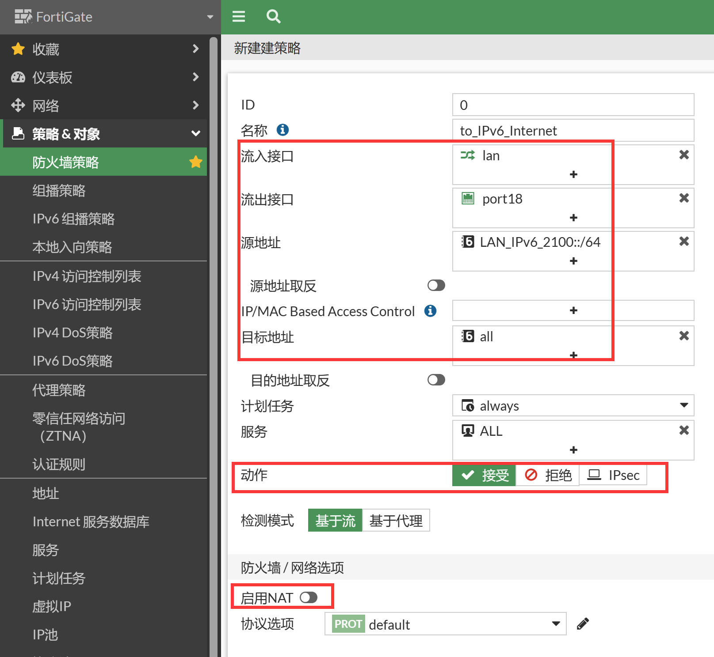

# 上网配置

## 组网需求

1. 用户内部使用IPv6网络，FortiGate作为客户网络的互联网边界介入防火墙，实现对互联网的访问。
2. 外部互联网接入服务商为IPv6网络。
3. 内部也为IPv6网络。

## 网络拓扑


## 配置要点

- 配置接口IP
- 配置路由
- 配置策略

## 配置步骤

1. 配置接口IPv6地址。

   

   

   ```
   config system interface
       edit "lan"
           config ipv6
               set ip6-address 2100::1/64
               set ip6-allowaccess ping https ssh snmp http fgfm fabric
           end
       next
       edit "port18"
           config ipv6
               set ip6-address 2200::2/64
               set ip6-allowaccess ping https ssh snmp http fgfm fabric
           end
       next
   end
   ```

2. 配置IPv6路由。

   

   

   ```
   config router static6
       edit 1
           set gateway 2200::1
           set device "port18"
       next
   end
   ```

3. 创建内网网段的IPv6地址对象，进入策略&对象→地址，新建内网的IPv6地址对象。

   

   ```
   config firewall address6
       edit "LAN_IPv6_2100::/64"
           set uuid 042a2792-8d96-51ed-39e3-a512a3f5e16d
           set ip6 2100::/64
       next
   end
   ```

4. 新建防火墙策略，允许内部IPv6访问外部IPv6网络，由于都是IPv6地址，可以直接通信，不需要开启NAT。

   

   ```
   config firewall policy
       edit 10
           set name "to_IPv6_Internet"
           set srcintf "lan"
           set dstintf "port18"
           set action accept
           set srcaddr6 "LAN_IPv6_2100::/64"
           set dstaddr6 "all"
           set schedule "always"
           set service "ALL"
       next
   end
   ```

## 结果验证

客户端PC可以通过FortiGate正常访问IPv6 Internet。


