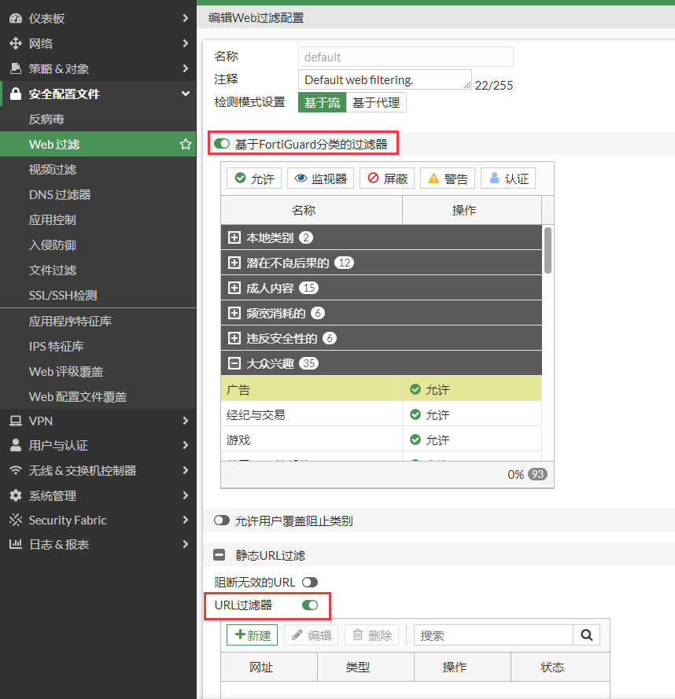
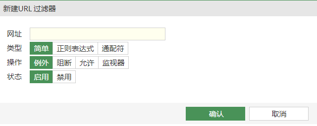
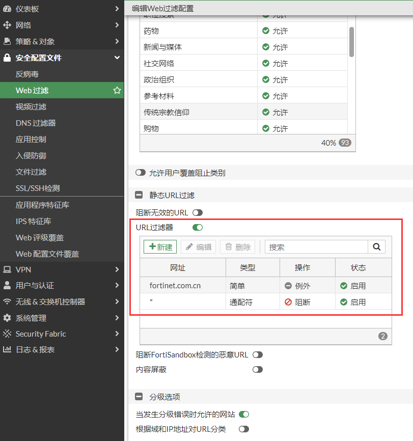
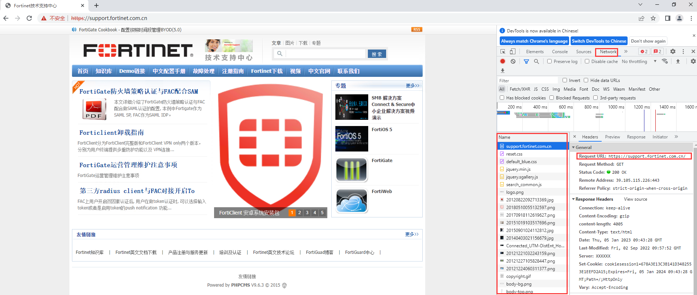
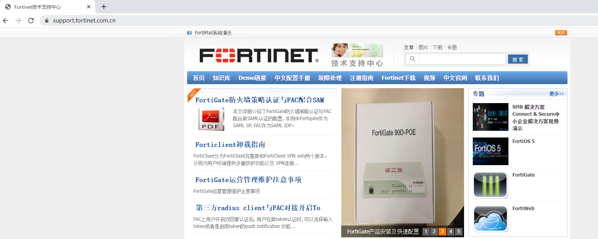
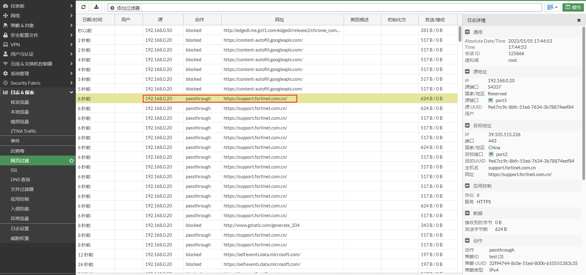
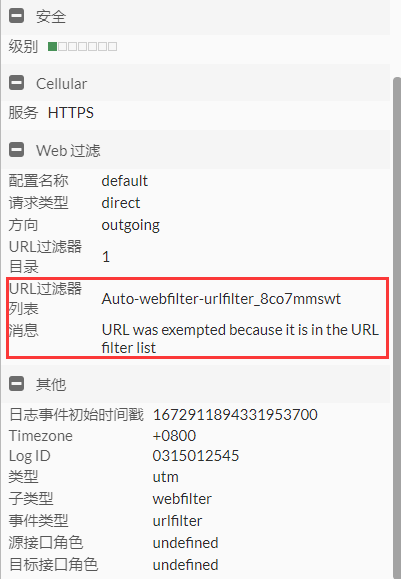
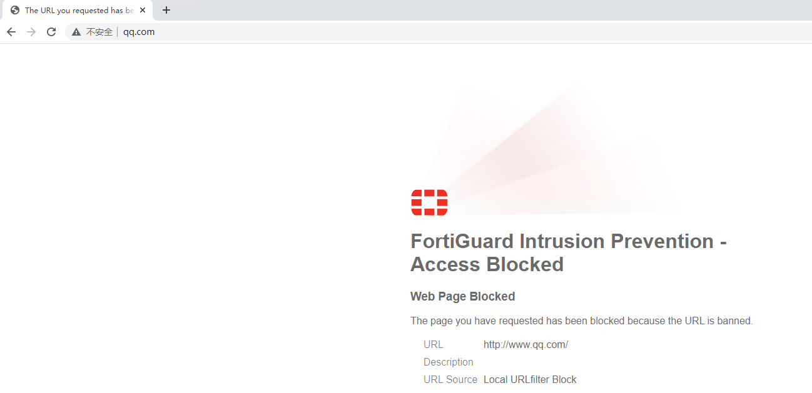
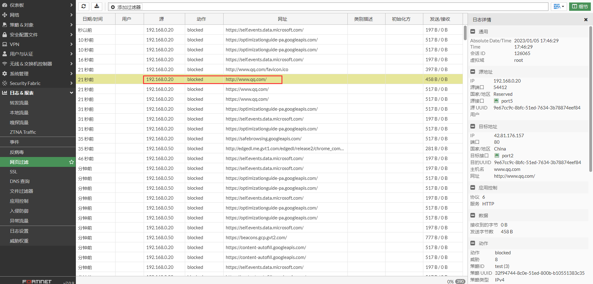
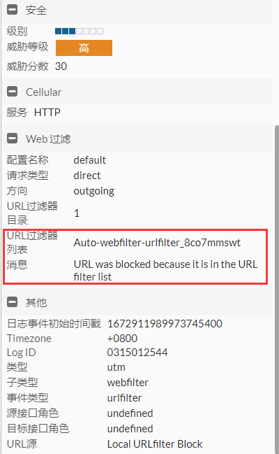

# URL过滤

## 什么是URL过滤

在Web过滤中，除了根据FortiGuard分类执行监控或阻断动作外，还可以使用URL过滤来手动指定哪些网站被允许，哪些网站被阻断。

执行顺序：

1. 如果URL过滤的动作是允许，那么将继续执行FortiGuard过滤；如果FortiGuard的分类的匹配动作是拒绝，那么该URL仍然会被拒绝；
2. 如果URL过滤的动作是拒绝，那么该URL将被直接拒绝；

## URL过滤类型

**简单**：URL过滤器将执行完整的匹配；

如果网址设置为support.fortinet.com.cn，那么URL过滤器将匹配support.fortinet.com.cn，不会匹配www.fortinet.com.cn；

如果网址设置为fortinet.com.cn,那么URL过滤器将匹配support.fortinet.com.cn，www.fortinet.com.cn，fortinet.com.cn，不会匹配fortinetxxx.com.cn。

**正则表达式**：URL过滤器根据正则表达式执行匹配；

如果网址设置为fortinet（即.\*fortinet.\*），那么URL过滤器将匹配包含fortinet字符的网址，如www.fortinet.com,www.xxxfortinetyyy.com等；

如果网址设置为forti.\*\\.com，那么URL过滤器将匹配support.fortinet.com，www.fortiguard.com等。

**通配符**：URL过滤器根据通配符执行匹配；

如果网址设置为*，那么URL过滤器将匹配所有网址；

如果网址设置为*.fortinet.com，那么URL过滤器将匹配support.fortinet.com，www.fortinet.com等；

## URL过滤动作

**例外**：该UR直接被URL过滤器允许，不再执行后续的FortiGate过滤器，内容过滤器等；

**阻断**：该URL被URL过滤器阻断；

**允许**：该URL被URL过滤器允许，但仍然要执行FortiGuard过滤器，内容过滤器等；

**监视器**：动作还允许一样，但记录日志。

## **网络拓扑**

PC-----------(port5:192.168.0.2/24)FGT(port2:100.1.1.2)-------------Internet

## 配置步骤

1. **基本配置**

   配置接口IP和路由。

   

   

2. **配置Web过滤配置文件**

   这里直接使用Default配置文件，并使用URL过滤器只允许fortinet.com.cn域名的网站，阻止其他所有网站。

   请勾选”当发生分级错误时允许的网站“。这是为了防止因网络延迟，丢包等原因导致FortiGate不能与FortiGuard webfilter通信而引起web站点无法评估，进而导致该站点不能访问；勾选后如果是由于无法评估引起的错误，将允许访问该站点。

   

   注意：在浏览器访问一个网站中，浏览器不仅仅只是访问该域名本身。网站中有很多图片，js脚本等等都是需要加载的，因此在URL放通网站的时候，需要连那些浏览器内部访问的请求都要放通。浏览器访问一个域名时，通过F12，点击network可以查看到该域名加载了哪些内容。

   

## URL过滤测试

1. PC访问support.fortinet.com.cn是允许的。

   

   查看web过滤日志。

   

   

2. PC访问www.qq.com被URL过滤器阻止。

   

   查看webfilter日志。

   

   

