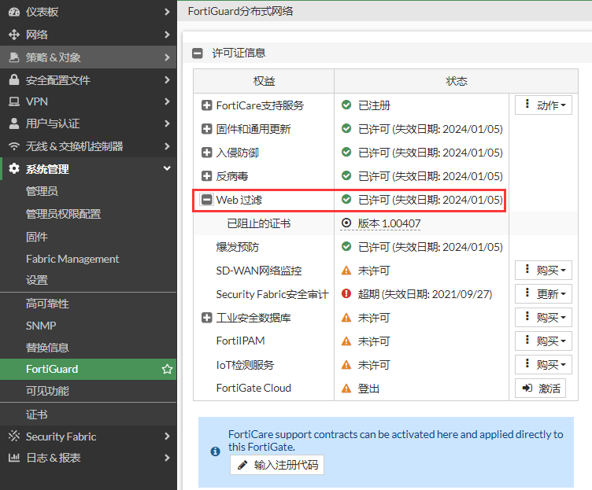
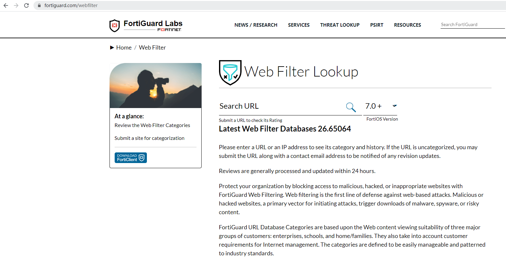
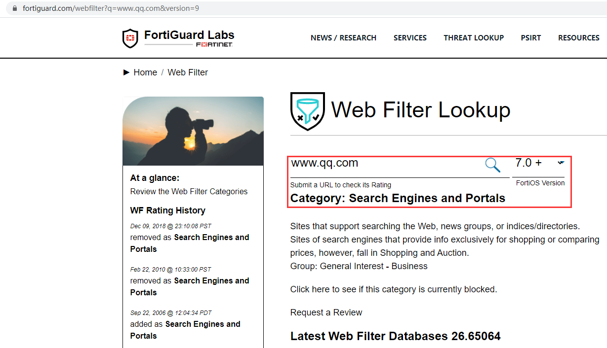
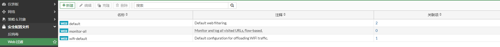
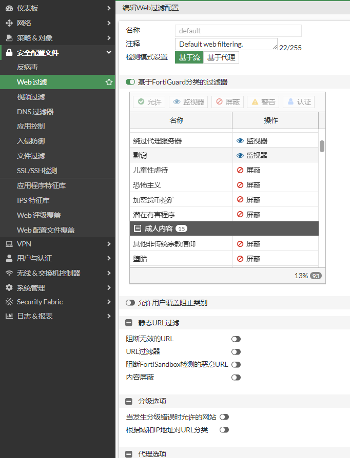
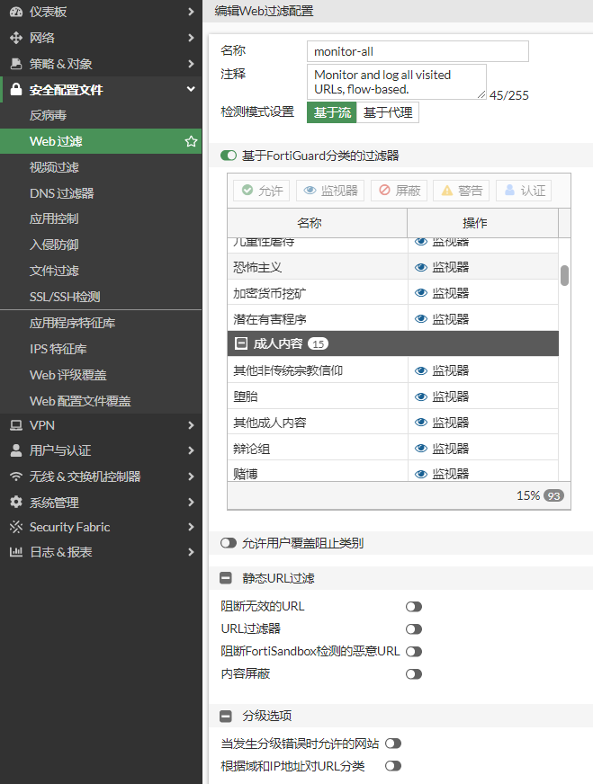
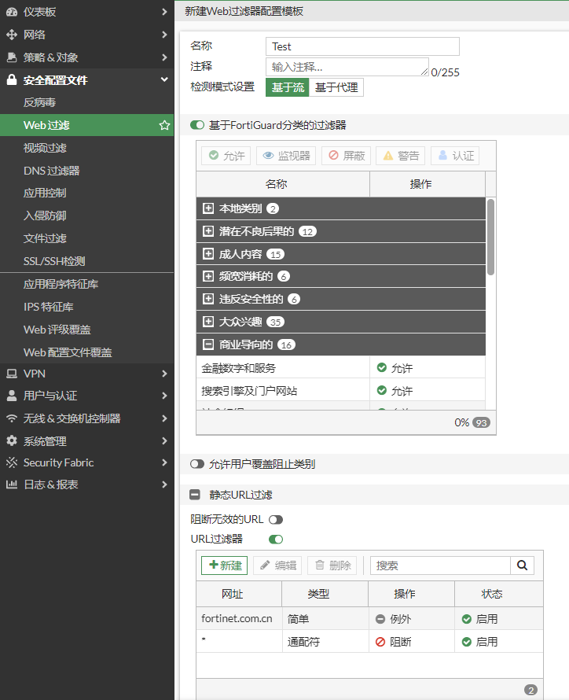

# Web过滤简介

## 什么是Web过滤

Web过滤是FortiGate对用户访问Web资源进行限制或控制的功能。

## Web过滤特征库

选择“系统管理”-->“FortiGuard”-->“许可证信息”，查看Web过滤的状态是有license的。Web过滤的特征库在云端，不在FortiGate本地。

在FortiGuard上查看Webfilter特征库。

输入网站，可以查询该URL属于哪个分类。

## web过滤配置文件

web过滤默认有一些配置文件，这些配置文件应用的目标各有不同，也可以根据自身的业务需求创建新的配置文件。

default配置文件默认对成人内容，不安全的内容等进行阻断，对其他的内容进行监控。

monitor-all配置文件对所有的内容都进行监控。

用户也可以根据自身的需求创建配置文件，选择“安全配置文件”-->“Web过滤”，点击“新建”。如这里通过“URL过滤器”只允许用户访问support.fortinet.com.cn，其他网站都拒绝。

