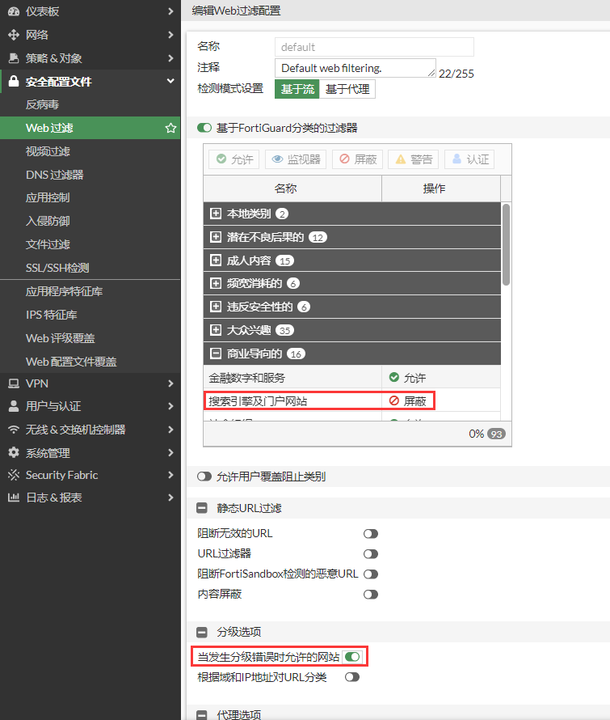
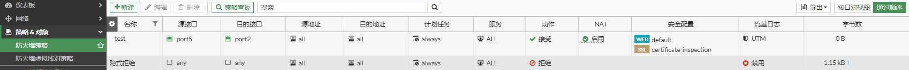
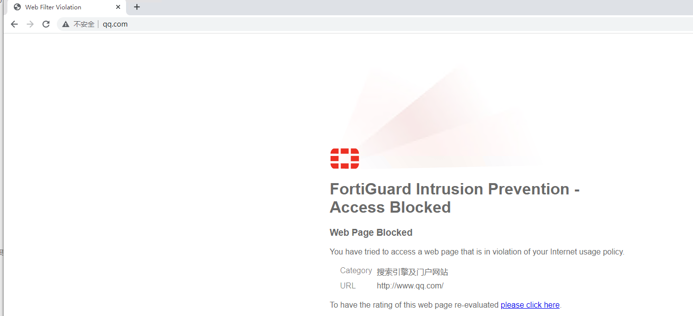
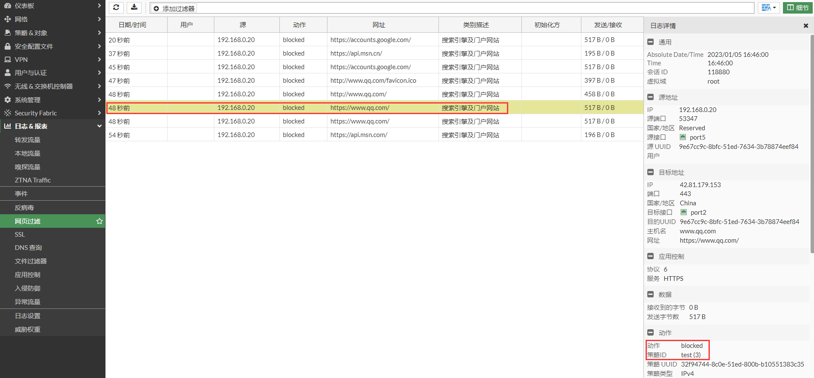
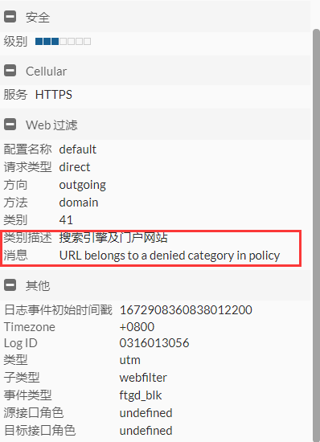

# Web高级选项

## **组网需求**

客户使用Webfilter限制用户访问Web资源。

## **网络拓扑**

PC-----------(port5:192.168.0.2/24)FGT(port2:100.1.1.2)-------------Internet

## 配置步骤

1. **基本配置**

   配置接口IP和路由。

   

   

2. **配置Web过滤配置文件**

   这里直接使用Default配置文件，为了便于测试，这里阻断了用户访问”搜索引擎和门户网站“的URL分类。

   请勾选”当发生分级错误时允许的网站“。这是为了防止因网络延迟，丢包等原因导致FortiGate不能与FortiGuard webfilter通信而引起web站点无法评估，进而导致该站点不能访问；勾选后如果是由于无法评估引起的错误，将允许访问该站点。

   

3. **配置策略**

   

## Web过滤测试

使用PC访问www.qq.com 被web过滤阻断。

查看Web过滤日志

