# 入侵防御简介

## 什么是IPS入侵防御系统

入侵防御系统 (IPS) 可帮助企业识别恶意流量并主动拦截此类流量进入企业网络。IPS通过特征库检测来识别流量中是否存在漏洞和漏洞利用程序；如果检测到威胁，则按照安全防御策略采取适当的措施，比如阻止访问。

## 入侵防御特征库

选择“系统管理”-->“FortiGuard”-->“许可证信息”，在“入侵防御”菜单下可以查看IPS特种库的版本及IPS引擎的版本。

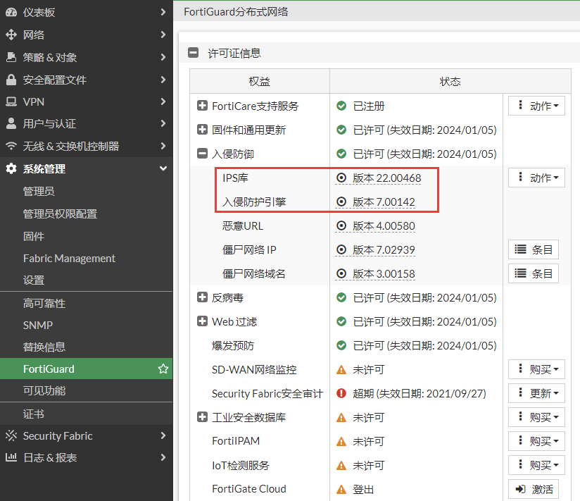

选择“安全配置文件”-->“IPS特征库”，可以查看具体的特征，将鼠标悬停在某一个特征上，可以查看该特征的详细信息。

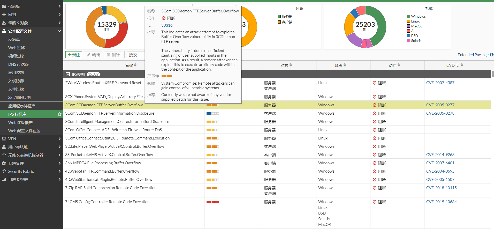

## 入侵防御配置文件

入侵防御默认有一些配置文件，这些配置文件应用的目标各有不同，也可以根据自身的业务需求创建新的配置文件。

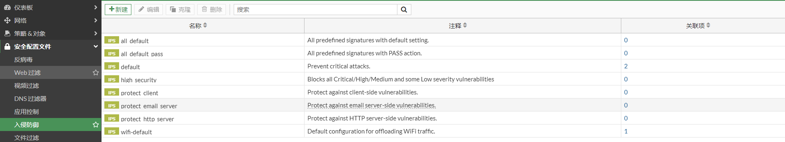

在high_security配置文件中，IPS阻断严重级别是Critical/High/Medium的特征库，严重级别是Low的则是保持特征的默认动作。

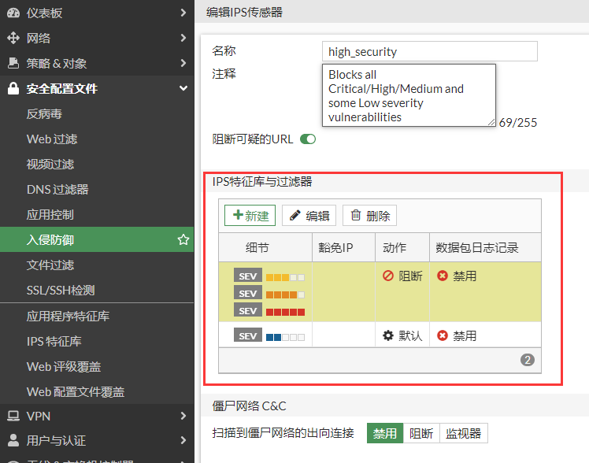

在protect_http_server配置文件中，IPS将对象过滤器的属性设置为服务器，协议过滤器的属性设置为HTTP，因此过滤器仅包含适用于服务器的HTTP协议的签名，动作是使用特征默认的动作。

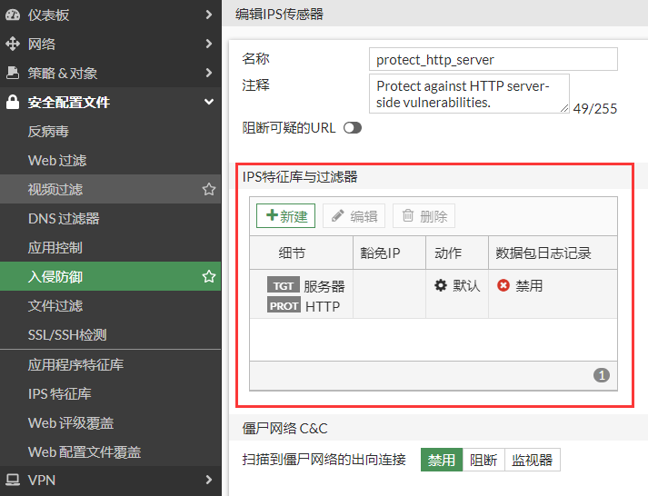

用户也可以根据自身的需求创建配置文件，选择“安全配置文件”-->“入侵防御”，点击“新建”，这里保护linux服务器的HTTP服务。

1. **创建IPS过滤器**

   在”IPS特征库与过滤器“选项下，点击“新建”，类型选择过滤器，动作设置为阻断，协议过滤器设置为FTP，OS过滤器设置为Linux。

   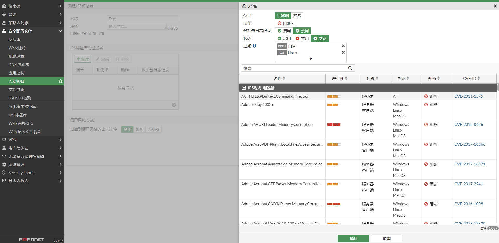

   确定保存。

   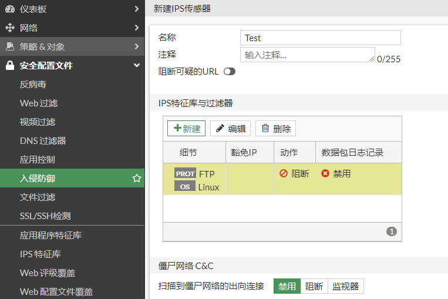

2. **指定某一个IPS具体的特征**

   这里以eicar做测试。类型选择签名，动作设置为阻断，在搜索框中搜索eicar，将过滤出eicar的特征：Eicar.Virus.Test.File，然后右击该特征，点击“添加已选”，表示选中该特征。

   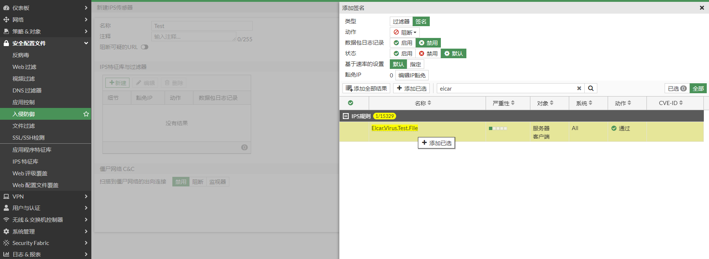

   特征选中后，会有绿色勾选的标识，以及“已选”标签会标识出特征的数量，然后点击确认。

   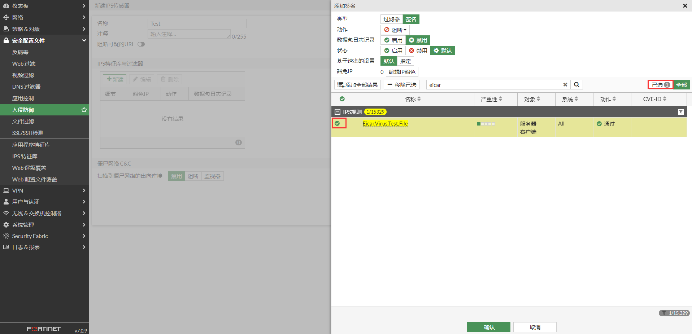

   确定保存。

   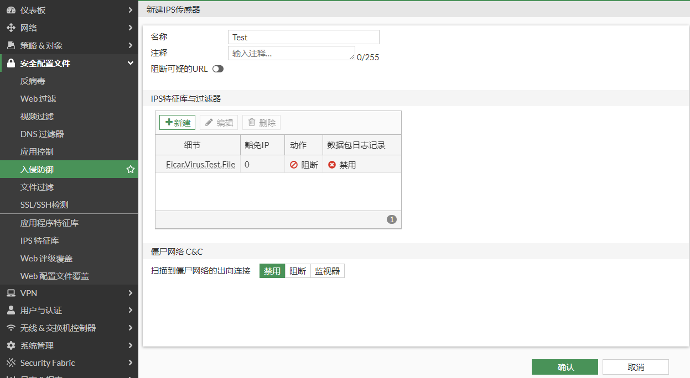

3. **IPS规则的顺序**

   如下图，严重级别过滤器设置为信息，该过滤器包含了eicar，动作是允许；单独设置eicar特征的动作是阻断；那么最终eicar的动作是允许。IPS规则是由上到下匹配的。

   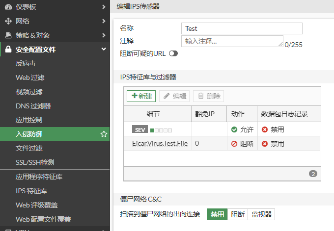
