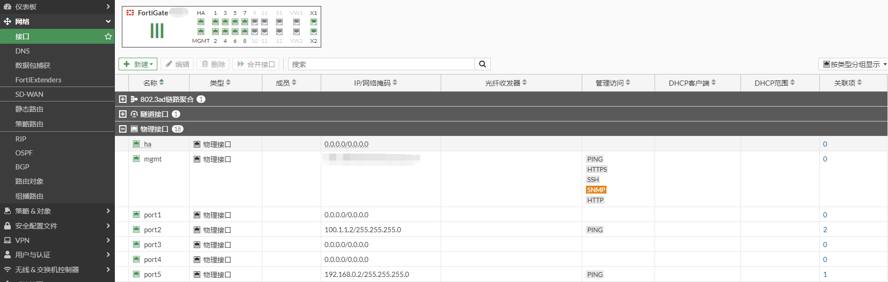
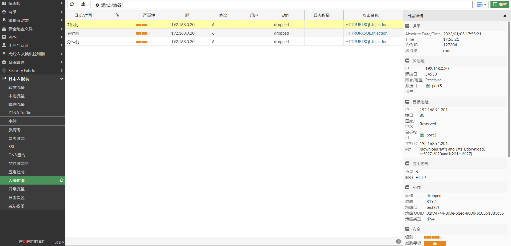

# 入侵防御配置

## **组网需求**

客户使用IPS保护用户上网的流量。

## **网络拓扑**

PC-----------(port5:192.168.0.2/24)FGT(port2:100.1.1.2)-------------Internet

## 配置步骤

1. **基本配置**

   配置接口IP和路由。

   

   

2. **配置IPS配置文件**

   这里直接使用默认的high_security配置文件。

   

3. **配置策略**

   在策略中调用IPS配置文件。

   

## 入侵防御测试

发起SQL注入攻击被IPS拦截。

查看IPS日志。

