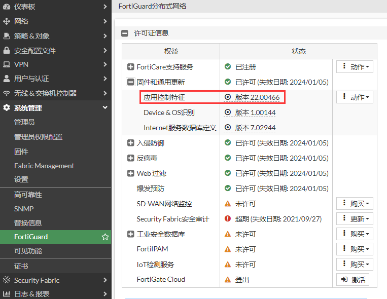
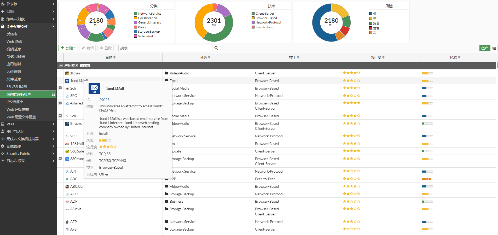
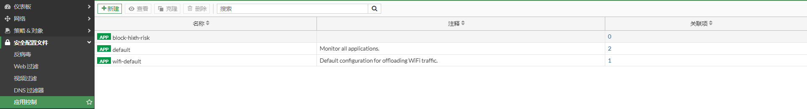
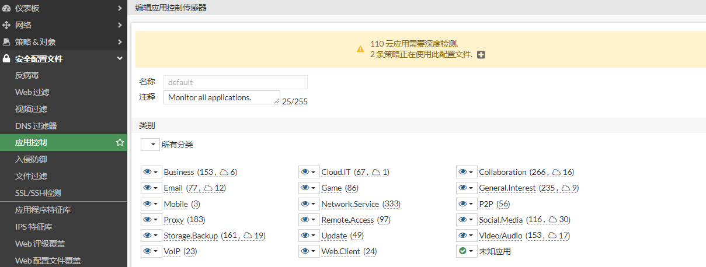
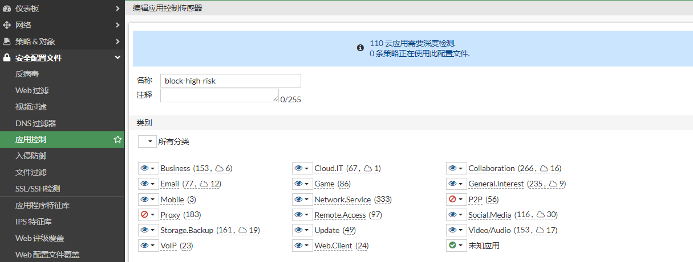
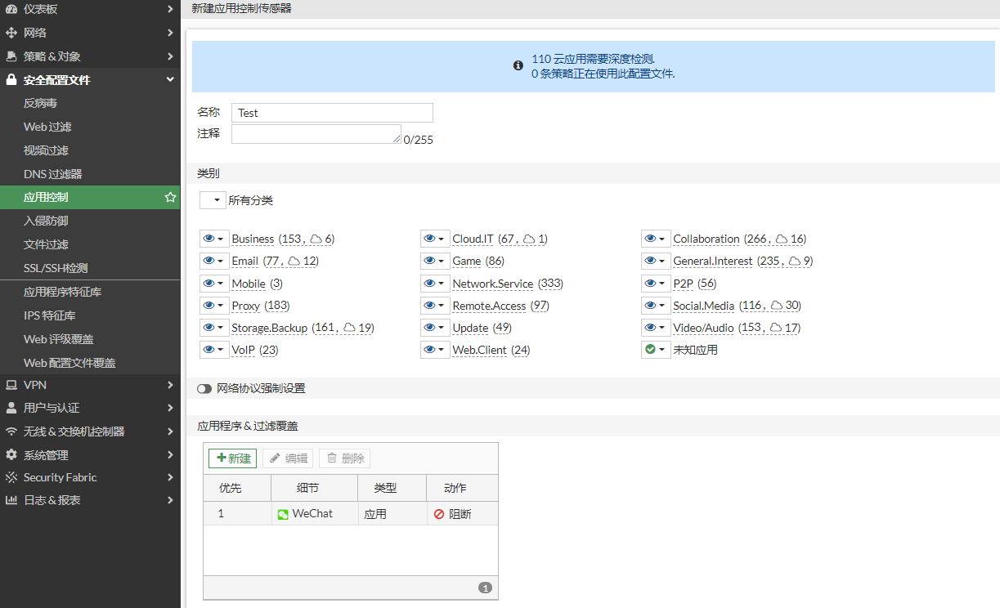

# 应用控制简介

## 什么是应用控制

FortiGate通过扫描流量中的内容来检测应用程序，FortiGate应用控制可以检测二千多种不同的Web应用、软件程序、网络服务及通讯协议等特征，使企业重拾对应用程序的可视化和控制能力。

## 应用控制特征库

选择“系统管理”-->“FortiGuard”-->“许可证信息”，在”固件和通用更新“菜单下可以查看应用控制特征库的版本。

选择“安全配置文件”-->“应用控制特征库”，可以查看具体的特征，将鼠标悬停在某一个特征上，可以查看该特征的详细信息。

## 硬控控制配置文件

应用控制默认有一些配置文件，这些配置文件应用的目标各有不同，也可以根据自身的业务需求创建新的配置文件。

default配置文件，默认监控所有的应用。

block-high-risk配置文件，阻断了Proxy和P2P类别的应用。

用户也可以根据自身的需求创建配置文件，选择“安全配置文件”-->“应用控制”，点击“新建”，如阻断微信。

