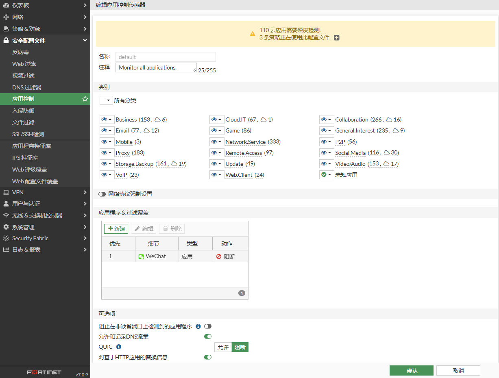

# 配置应用控制

## **组网需求**

客户使用应用控监控和限制用户上网的流量。

## **网络拓扑**

PC-----------(port5:192.168.0.2/24)FGT(port2:100.1.1.2)-------------Internet

## 配置步骤

1. **基本配置**

   配置接口IP和路由。

   

   

2. **配置应用控制配置文件**

   这里直接使用Default配置文件，并阻断了用户使用微信。

   

3. **配置策略**

   

## 应用控制测试

PC登录微信被应用控制阻断。

查看应用控制日志。

