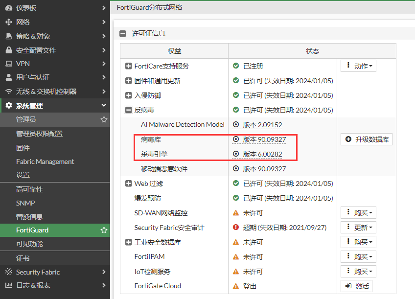
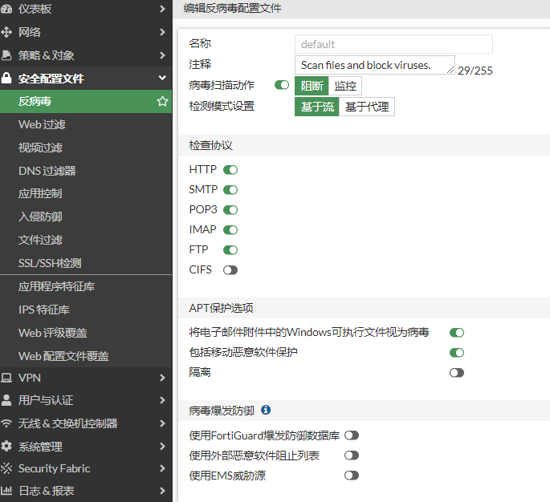
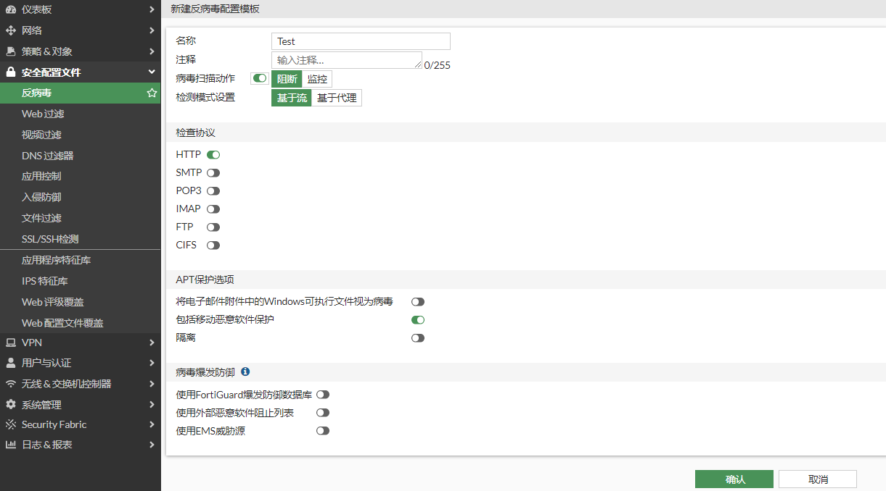

# 反病毒简介

## 什么是AV反病毒

AV反病毒功能凭借庞大且不断更新的病毒特征库有效保护企业内网用户和服务器免受病毒文件侵害。AV通过特征库检测来识别流量中的病毒文件， 如果检测到威胁，则按照安全防御策略采取适当的措施，比如阻止访问，避免由病毒文件而引起的数据破坏、权限更改和系统崩溃等情况的发生，保证网络的安全。

## 反病毒特征库

选择“系统管理”-->“FortiGuard”-->“许可证信息”，在“反病毒菜单”下可以查看AV特种库的版本及AV引擎的版本。

## 反病毒配置文件

反病毒默认自带两个配置文件，这两个配置文件设置是一样，只是描述性信息不一样。

默认使用default配置文件即可，动作默认是阻断，可根据实际情况调整。

用户也可以根据自身的需求创建配置文件，选择“安全配置文件”-->“反病毒”，点击“新建”，这里保护HTTP服务。

