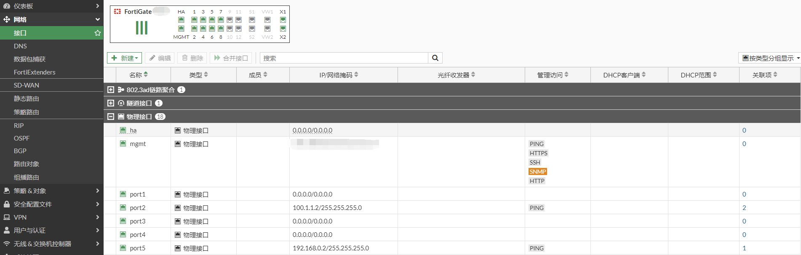
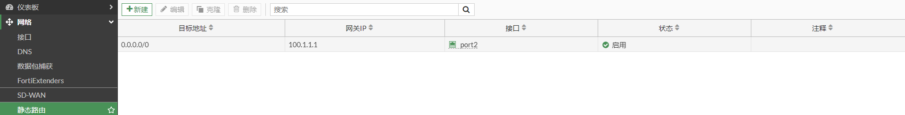
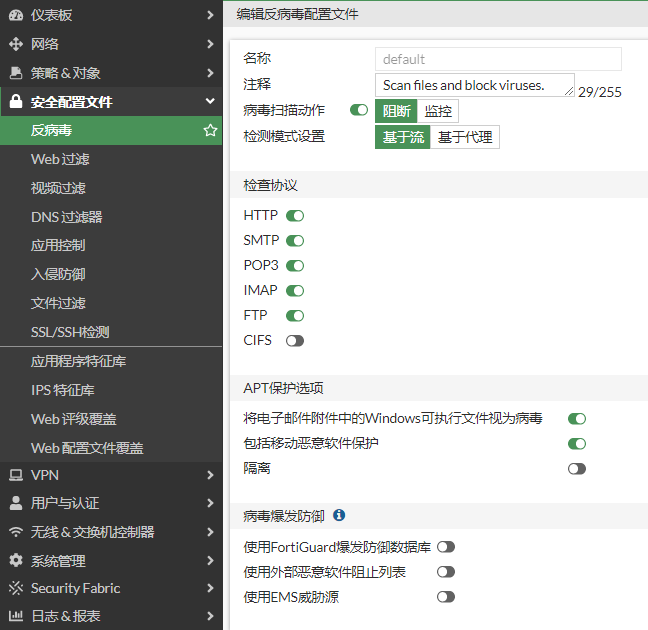
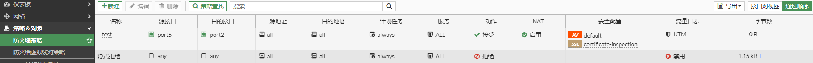
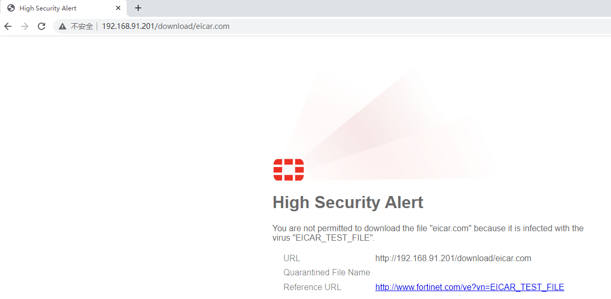
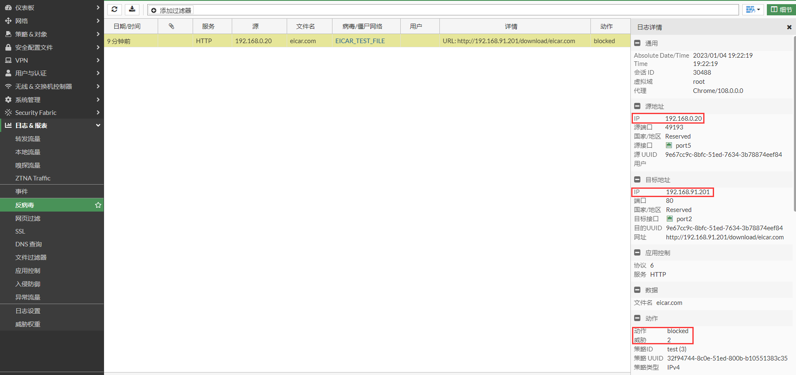
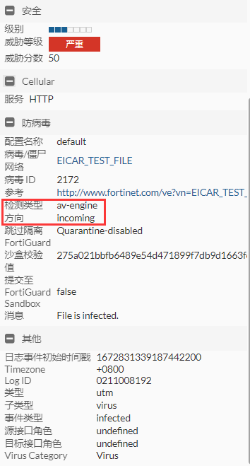
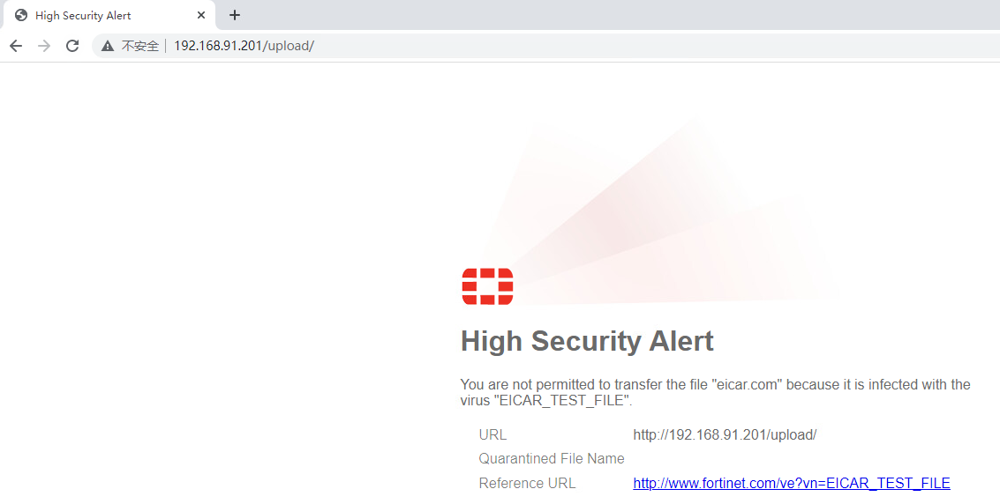
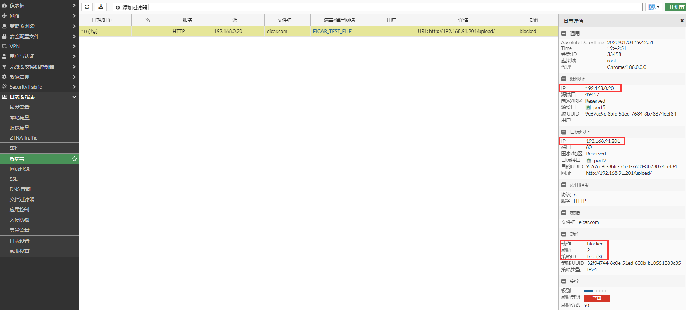
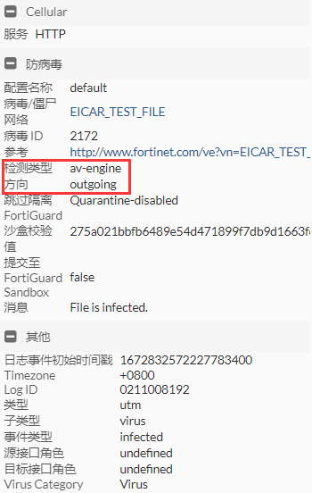

# 反病毒配置

## **组网需求**

客户使用AV保护用户上网的流量。

## **网络拓扑**

PC-----------(port5:192.168.0.2/24)FGT(port2:100.1.1.2)-------------Internet

## 配置步骤

1. **基本配置**

   配置接口IP和路由。

   

   

2. **配置IPS配置文件**

   这里使用默认的default配置文件。测试环境中使用eicar做测试。

   

3. **配置策略**

   

## 反病毒测试

1. **使用PC下载eicar.com文件**

   PC下载eicar.com时，被AV检测到并拦截。

   

   查看反病毒日志。对于发起方192.168.0.20而言，攻击是从192.168.0.20到192.168.91.201，因此方向是outgoing。

   

   

2. **使用PC上传eicar.com**

   PC上传eicar.com时，被AV检测到并拦截。

   

   查看反病毒日志。对于发起方192.168.0.20而言，攻击是从192.168.0.20到192.168.91.201，因此方向是outgoing。

   

   

