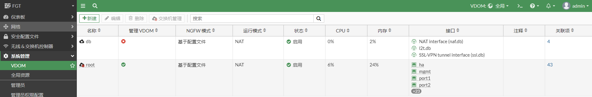
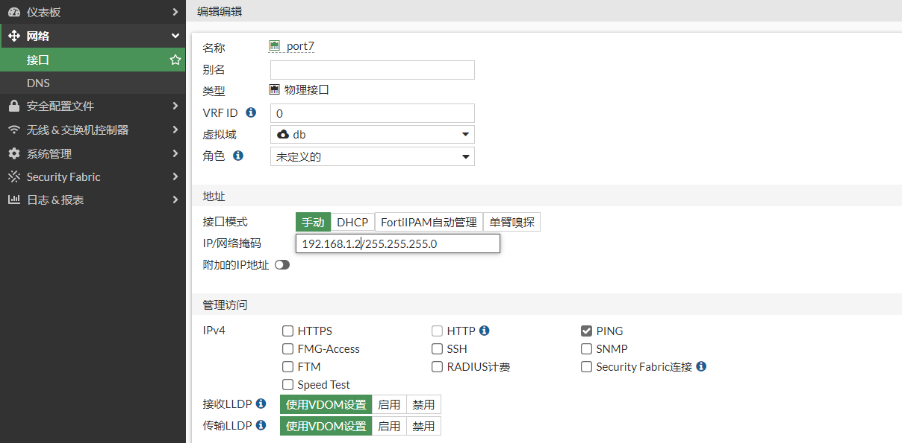
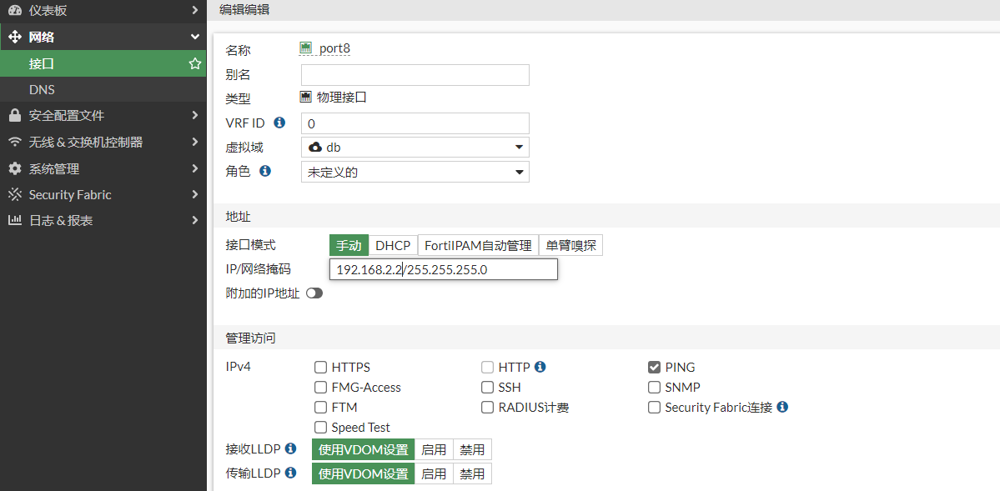
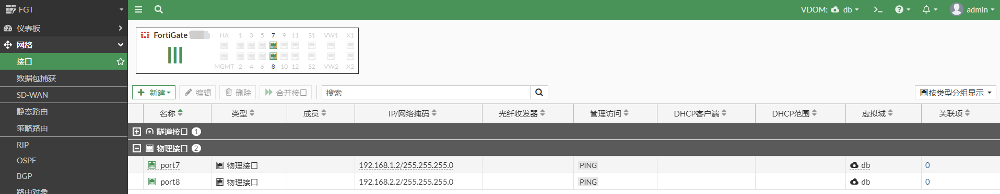
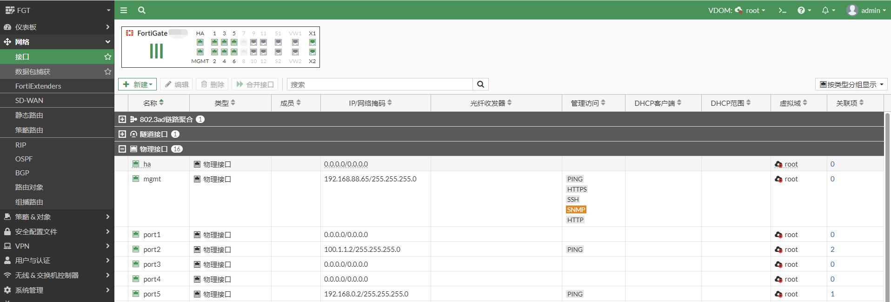
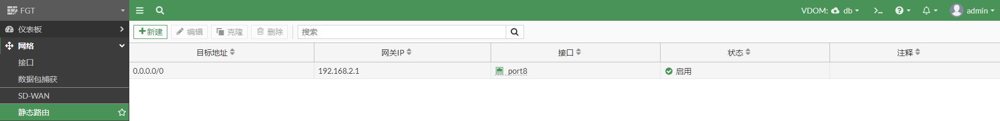
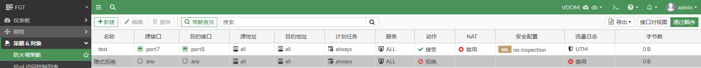

# VDOM使用

## **组网需求**

客户上网的业务和内部数据的业务分离。将FortiGate划分两个不同的vdom，一个root vdom用于上网，一个db vdom用于内网数据库访问。

## **网络拓扑**

PC1-----------(port5:192.168.0.2/24)FGT-root-vdom(port2:100.1.1.2)-------------Internet

PC2-----------(port7:192.168.1.2/24)FGT-db_vdom(port8:192.168.2.2)------------Router-----------DB Server

## 配置步骤

1. **创建vdom**

   开启VDOM

   ```
   config system global 
       set vdom-mode multi-vdom 
   end
   ```

   创建vdom

   

2. **将接口划入vdom**

   所有的接口默认都在root vdom中，因此只需要将port7和port8划入db vdom即可。

   

   

   查看db vdom中的接口。

   

   查看root vdom中的接口。

   

2. **root vdom配置路由和策略**

   配置路由。

   

   配置策略。

   

3. **db vdom配置路由和策略**

   配置路由。

   

   配置策略。

   

## 业务测试

### root vdom测试

1. 查看root vdom路由表

   ```
   进入root vdom
   #config vdom 
   #edit root
   
   # get router info routing-table  all 
   Codes: K - kernel, C - connected, S - static, R - RIP, B - BGP
          O - OSPF, IA - OSPF inter area
          N1 - OSPF NSSA external type 1, N2 - OSPF NSSA external type 2
          E1 - OSPF external type 1, E2 - OSPF external type 2
          i - IS-IS, L1 - IS-IS level-1, L2 - IS-IS level-2, ia - IS-IS inter area
          * - candidate default
   
   Routing table for VRF=0
   S*      0.0.0.0/0 [10/0] via 100.1.1.1, port2, [1/0]
   C       100.1.1.0/24 is directly connected, port2
   C       192.168.0.0/24 is directly connected, port5
   ```

2. **业务测试**

   PC1 ping 114.114.114.114

   ```
   PC1# ping 114.114.114.114
   PING 114.114.114.114 (114.114.114.114) 56(84) bytes of data.
   64 bytes from 114.114.114.114: icmp_seq=1 ttl=64 time=23.2 ms
   64 bytes from 114.114.114.114: icmp_seq=2 ttl=82 time=23.3 ms
   64 bytes from 114.114.114.114: icmp_seq=3 ttl=79 time=23.3 ms
   64 bytes from 114.114.114.114: icmp_seq=4 ttl=78 time=23.4 ms
   64 bytes from 114.114.114.114: icmp_seq=5 ttl=77 time=23.1 ms
   ```

   FortiGate抓包

   ```
   进入root vdom
   #config vdom 
   #edit root
   
   抓包
   # diagnose sniffer packet any icmp 4
   interfaces=[any]
   filters=[icmp]
   1.674117 port5 in 192.168.0.10 -> 114.114.114.114: icmp: echo request
   1.674142 port2 out 100.1.1.2 -> 114.114.114.114: icmp: echo request
   1.697234 port2 in 114.114.114.114 -> 100.1.1.2: icmp: echo reply
   1.697242 port5 out 114.114.114.114 -> 192.168.0.10: icmp: echo reply
   ```
   
   FortiGate查看会话
   
   ```
   进入vdom
   #config vdom 
   #edit root 
   
   查看会话
   #diagnose sys session filter proto 1
   #diagnose sys session filter vd-name root
   #diagnose sys session list 
   
   该会话的vdom索引是0，即vd=0，通过diagnose sys vd list查看vdom索引，root vdom的索引是0
   session info: proto=1 proto_state=00 duration=1 expire=59 timeout=0 flags=00000000 socktype=0 sockport=0 av_idx=0 use=3
   origin-shaper=
   reply-shaper=
   per_ip_shaper=
   class_id=0 ha_id=0 policy_dir=0 tunnel=/ vlan_cos=0/255
   state=may_dirty npu 
   statistic(bytes/packets/allow_err): org=168/2/1 reply=168/2/1 tuples=2
   tx speed(Bps/kbps): 0/0 rx speed(Bps/kbps): 0/0
   orgin->sink: org pre->post, reply pre->post dev=13->10/10->13 gwy=100.1.1.1/192.168.0.10
   hook=post dir=org act=snat 192.168.0.10:3646->114.114.114.114:8(100.1.1.2:64062)
   hook=pre dir=reply act=dnat 114.114.114.114:64062->100.1.1.2:0(192.168.0.10:3646)
   misc=0 policy_id=3 pol_uuid_idx=515 auth_info=0 chk_client_info=0 vd=0
   serial=0003413a tos=ff/ff app_list=0 app=0 url_cat=0
   rpdb_link_id=00000000 ngfwid=n/a
   npu_state=0x4000c00 ofld-O ofld-R
   npu info: flag=0x81/0x81, offload=8/8, ips_offload=0/0, epid=150/156, ipid=156/150, vlan=0x0000/0x0000
   vlifid=156/150, vtag_in=0x0000/0x0000 in_npu=1/1, out_npu=1/1, fwd_en=0/0, qid=0/3
   
   进入全局，查看vdom索引
   #config global 
   # diagnose sys vd list | grep name=root
   name=root/root index=0 enabled fib_ver=36 rpdb_ver=2 use=168 rt_num=48 asym_rt=0 sip_helper=0, sip_nat_trace=1, mc_fwd=0, mc_ttl_nc=0, tpmc_sk_pl=0
   ```
   

### db vdom测试

1. **查看路由表**

   ```
   进入db vdom
   #config vdom 
   #edit db 
   
   查看路由表
   # get router info routing-table  all 
   Codes: K - kernel, C - connected, S - static, R - RIP, B - BGP
          O - OSPF, IA - OSPF inter area
          N1 - OSPF NSSA external type 1, N2 - OSPF NSSA external type 2
          E1 - OSPF external type 1, E2 - OSPF external type 2
          i - IS-IS, L1 - IS-IS level-1, L2 - IS-IS level-2, ia - IS-IS inter area
          * - candidate default
   
   Routing table for VRF=0
   S*      0.0.0.0/0 [10/0] via 192.168.2.1, port8, [1/0]
   C       192.168.1.0/24 is directly connected, port7
   C       192.168.2.0/24 is directly connected, port8
   ```

2. **业务测试**

   PC2 ping DB Server

   ```
   PC2# ping 192.168.91.201
   PING 192.168.91.201 (192.168.91.201) 56(84) bytes of data.
   64 bytes from 192.168.91.201: icmp_seq=1 ttl=61 time=0.898 ms
   64 bytes from 192.168.91.201: icmp_seq=2 ttl=61 time=1.05 ms
   64 bytes from 192.168.91.201: icmp_seq=3 ttl=61 time=0.935 ms
   64 bytes from 192.168.91.201: icmp_seq=4 ttl=61 time=0.687 ms
   
   --- 192.168.91.201 ping statistics ---
   4 packets transmitted, 4 received, 0% packet loss, time 3002ms
   rtt min/avg/max/mdev = 0.687/0.892/1.050/0.134 ms
   ```

   FortiGate抓包

   ```
   进入db vdom
   #config vdom 
   #edit db 
   
   查看路由表
   # diagnose sniffer packet any icmp 4
   interfaces=[any]
   filters=[icmp]
   2.484117 port7 in 192.168.1.10 -> 192.168.91.201: icmp: echo request
   2.484133 port8 out 192.168.1.10 -> 192.168.91.201: icmp: echo request
   2.484914 port8 in 192.168.91.201 -> 192.168.1.10: icmp: echo reply
   2.485049 port7 out 192.168.91.201 -> 192.168.1.10: icmp: echo reply
   ```

   FortiGate查看会话

   ```
   进入db vdom
   #config vdom 
   #edit db
   
   查看会话
   # diagnose sys session filter proto 1
   # diagnose sys session filter vd-name db
   # diagnose sys session list
   
   该会话的vdom索引是3，即vd=3，通过diagnose sys vd list查看vdom索引，db vdom的索引是3
   session info: proto=1 proto_state=00 duration=1 expire=59 timeout=0 flags=00000000 socktype=0 sockport=0 av_idx=0 use=3
   origin-shaper=
   reply-shaper=
   per_ip_shaper=
   class_id=0 ha_id=0 policy_dir=0 tunnel=/ vlan_cos=0/255
   state=may_dirty npu 
   statistic(bytes/packets/allow_err): org=168/2/1 reply=168/2/1 tuples=2
   tx speed(Bps/kbps): 0/0 rx speed(Bps/kbps): 0/0
   orgin->sink: org pre->post, reply pre->post dev=15->16/16->15 gwy=192.168.2.1/192.168.1.10
   hook=pre dir=org act=noop 192.168.1.10:2605->192.168.91.201:8(0.0.0.0:0)
   hook=post dir=reply act=noop 192.168.91.201:2605->192.168.1.10:0(0.0.0.0:0)
   misc=0 policy_id=1 pol_uuid_idx=617 auth_info=0 chk_client_info=0 vd=3
   serial=0003466c tos=ff/ff app_list=0 app=0 url_cat=0
   rpdb_link_id=00000000 ngfwid=n/a
   npu_state=0x4000c00 ofld-O ofld-R
   npu info: flag=0x81/0x81, offload=8/8, ips_offload=0/0, epid=162/160, ipid=160/162, vlan=0x0000/0x0000
   vlifid=160/162, vtag_in=0x0000/0x0000 in_npu=1/1, out_npu=1/1, fwd_en=0/0, qid=3/2
   
   进入全局，查看vdom索引
   #config global 
   # diagnose sys vd list | grep name=db
   name=db/db index=3 enabled fib_ver=23 rpdb_ver=0 use=62 rt_num=7 asym_rt=0 sip_helper=0, sip_nat_trace=1, mc_fwd=0, mc_ttl_nc=0, tpmc_sk_pl=0
   ```

   
