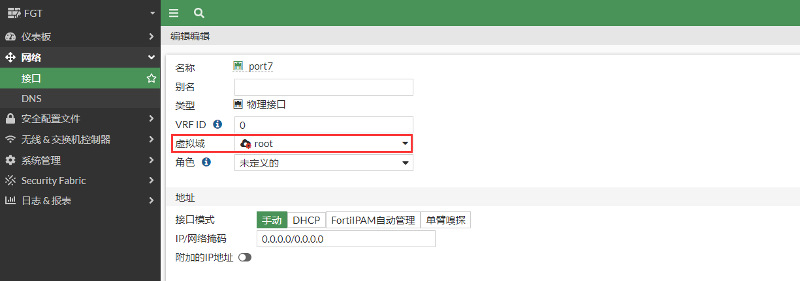
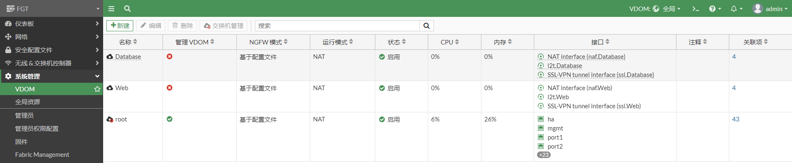

# VDOM基本配置

## VDOM简介

虚拟域(VDOM)，即虚拟防火墙，是将一台物理的 FortiGate 划分为两个或两个以上的可以独 立运行的虚拟防火墙的技术，虚拟域技术可以将FortiGate划分为多个不同的NAT/透明模式多个虚拟FortiGate，为每一个虚拟域提供独立的安全策略，路由及 VPN 配置等。

## 开启VDOM

在config system global下开启vdom，vdom模式选择multi-vdom，开启vdom后需要重新登录FortiGate。

```
config system global 
    set vdom-mode multi-vdom 
end
You will be logged out for the operation to take effect.
Do you want to continue? (y/n)y
```

开启vdom后，FortiGate默认将设备分为全局域和root vdom。可以直接点击“全局”或者“root” 来切换全局域和root vdom。


全局用于所有vdom都共享的配置，如HA，SNMP，证书等。


使用CLI配置时，需要使用config global进入全局模式，再配置具体的功能。如配置snmp：

```
config global 
    config system snmp sysinfo
        set status enable
    end
end
```

root vdom是一个默认的虚拟防火墙。root vdom默认是管理vdom，用于和FortiGuard通信来更新license，特征库等。


使用CLI配置时，需要使用config vdom进入对应的vdom，在配置具体的功能，如配置防火墙策略：

```
config vdom 
    edit root 
    config firewall policy
        edit 3
            set name "test"
            set srcintf "port5"
            set dstintf "port2"
            set action accept
            set srcaddr "all"
            set dstaddr "all"
            set schedule "always"
            set service "ALL"
            set nat enable
        next
    end
end
```

## 创建vdom

1. **GUI创建vdom**

   在全局中，选择“系统管理”

   

   创建OA vdom，用于独立的OA业务。创建的vdom默认是NAT模式的。

   

   点击确认后，创建完成。

   

2. **CLI创建vdom**

   进入vdom，edit vdom名称就会直接创建一个vdom，默认是NAT模式的vdom。

   ```
   config vdom 
       edit Database
   end
   ```

   创建完成后，可以在GUI界面查看。

   

   可以避免CLI误创建vdom，可以将vdom创建提示打开。

   ```
   config global 
       config system global 
           set edit-vdom-prompt enable 
       end
   end
   ```

   再次创建vdom时，CLI会提示。

   ```
   config vdom 
   edit Web
   
   The input VDOM name doesn't exist.
   Do you want to create a new VDOM?
   Please press 'y' to continue, or press 'n' to cancel. (y/n)y
   
   current vf=Web:5
   
   end
   ```

3. **将vdom改为透明模式**

   创建vdom时默认是NAT模式，需要通过CLI将vdom修改为透明模式。注意：如果透明模式是一进一出的环境，建议使用虚拟接口对。

   ```
   config vdom 
       edit Web 
       config system settings
           set opmode transparent
           set manageip 1.1.1.1/255.255.255.0
           set gateway 1.1.1.254
       end
   end
   ```

## 将接口划入vdom

1. **GUI方式将接口划入vdom**

   切换到全局，选择“网络”-->”接口“。

   

   将接口划入OA vdom。

   

   可以看到OA已经划入到OA vdom。

   
   切换到OA vdom查看接口。

   

2. **CLI方式将接口划入vdom**

   命令行如下：

   ```
   config global 
       config system interface
           edit port8
               set vdom OA
           next
       end
   end
   ```

   GUI查看OA vdom的接口。（port7是上一个操作划入OA vdom的）

   

## 修改管理vdom

管理vdom用于和FortiGuard通信来更新license，特征库等，因此需要连接Internet；也可以连接FortiManager更新，则FortiManager与FortiGuard通信。

1. **GUI修改管理vdom**

   切换到全局，选择“系统管理”-->“VDOM”，选择vdom，点击“交换机管理”切换为管理VDOM，点击“OK”。

   

   可以看到OA已设置为管理vdom。

   

2. **CLI修改管理vdom**

   ```
   config global 
       config system global
           set management-vdom OA
       end
   end
   ```

## 删除vdom

1. **GUI删除vdom**

   在删除vdom前，需要把vdom中的接口以及相关的配置都移除，在没有完全移除之前，是不能删除该vdom的。如OA vdom。

   

   选择“网络”-->“接口”，将接口划入到其他的vdom。

   
   当OA中的接口及其他相关的配置都移除后，OA vdom可以删除。

   

   点击“删除”。

   

   确认后，OA vdom移除。

   

2. **CLI删除vdom**

   在删除vdom前，需要把vdom中的接口以及相关的配置都移除，在没有完全移除之前，是不能删除该vdom的。

   ```
   config vdom 
       delete Database 
   end
   
   ```

   GUI查看该vdom已经删除。

   

## 关闭vdom

将FortiGate的其他vdom都删除后，才可以关闭vdom。


CLI关闭vdom，关闭vdom后，需要重新登录。

```
config global 
    config system global 
        set vdom-mode no-vdom 
    end
    
You will be logged out for the operation to take effect.
Do you want to continue? (y/n)y
```

