# VDOM间通信

## **组网需求**

OA业务vdom的用户通过Internet vdom上网。

## **网络拓扑**

有两个方式可以让VDOM之间通信：

1. 通过物理线路连接；

   ```
   PC1-----------(port5:192.168.0.2/24)FGT-root-vdom(port2:100.1.1.2)-------------Internet
                                      (port3:10.1.1.1)
                                              |
                                      (port4:10.1.1.2)
   PC2-----------(port7:192.168.1.2/24)FGT-db_vdom(port8:192.168.2.2)------------Router-----------OA
   ```

2. 通过NPU link内部线路连接，中高端设备支持。

   ```
   PC1-----------(port5:192.168.0.2/24)FGT-root-vdom(port2:100.1.1.2)-------------Internet
                                   (npu0_vlink0:10.1.1.1)
                                              |
                                   (npu0_vlink:10.1.1.2)
   PC2-----------(port7:192.168.1.2/24)FGT-db_vdom(port8:192.168.2.2)------------Router-----------OA
   ```

## 配置步骤

1. 开启vdom并创建vdom。

   ```
config system global 
       set vdom-mode multi-vdom 
   end
   ```
   
   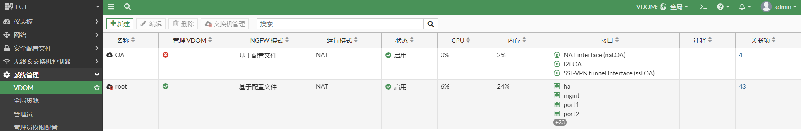

2. 将接口划入vdom，所有的接口默认都在root vdom中，因此只需要将port7和port8划入db vdom即可。

   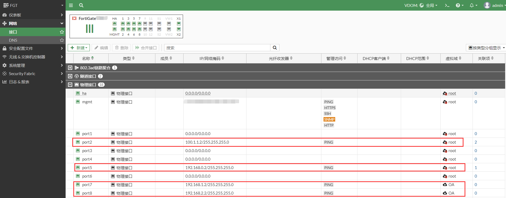

3. root vdom配置路由和策略，这是root vdom自身业务转发的配置。配置路由。

   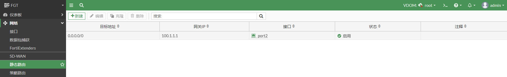


4. 配置策略。

   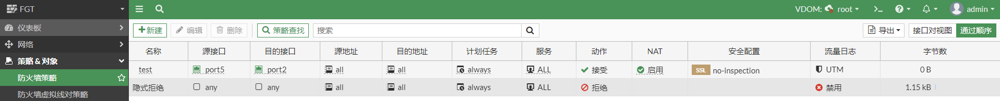

5. OA vdom配置路由和策略，这是OA vdom自身业务转发的配置，配置路由，OA的目的地址范围假设是192.168.0.0/16。

   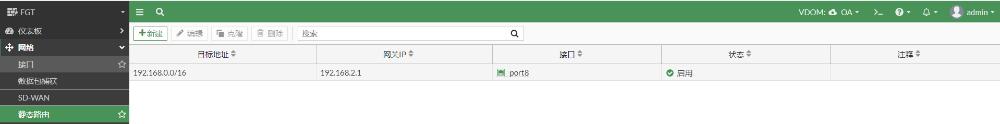

6. 配置策略。

   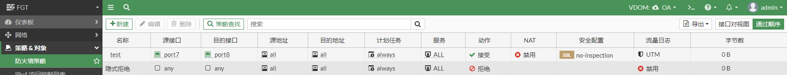

## VDOM间通信配置

### 物理线路方式

1. 将接口划入vdom，将port3划入root vdom，将port4划入OA vdom，配置ip地址，然后使用网线连接port3和port4。

   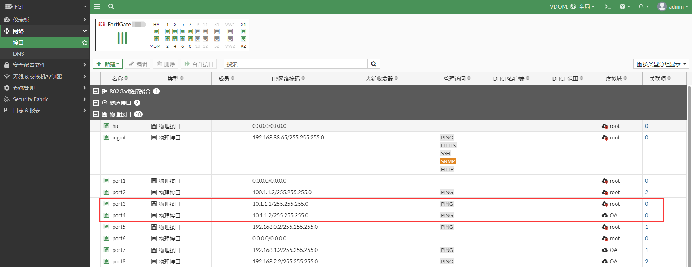

2. 测试port3和port4之间的连通性。进入root vdom，从root vdom ping OA vdom port4接口地址。

   ```
   进入root vdom，从root vdom ping OA vdom port4接口地址
   #config vdom 
   #edit root
   # execute ping 10.1.1.2
   PING 10.1.1.2 (10.1.1.2): 56 data bytes
   64 bytes from 10.1.1.2: icmp_seq=0 ttl=255 time=0.0 ms
   64 bytes from 10.1.1.2: icmp_seq=1 ttl=255 time=0.0 ms
   64 bytes from 10.1.1.2: icmp_seq=2 ttl=255 time=0.0 ms
   64 bytes from 10.1.1.2: icmp_seq=3 ttl=255 time=0.0 ms
   64 bytes from 10.1.1.2: icmp_seq=4 ttl=255 time=0.0 ms
   
   --- 10.1.1.2 ping statistics ---
   5 packets transmitted, 5 packets received, 0% packet loss
   round-trip min/avg/max = 0.0/0.0/0.0 ms
   ```

3. 进入OA vdom，从OA vdom ping  root vdom port3接口地址。

   ```
   #config vdom 
   #edit OA 
   #execute ping 10.1.1.1
   PING 10.1.1.1 (10.1.1.1): 56 data bytes
   64 bytes from 10.1.1.1: icmp_seq=0 ttl=255 time=0.0 ms
   64 bytes from 10.1.1.1: icmp_seq=1 ttl=255 time=0.0 ms
   64 bytes from 10.1.1.1: icmp_seq=2 ttl=255 time=0.0 ms
   64 bytes from 10.1.1.1: icmp_seq=3 ttl=255 time=0.0 ms
   64 bytes from 10.1.1.1: icmp_seq=4 ttl=255 time=0.0 ms
   
   --- 10.1.1.1 ping statistics ---
   5 packets transmitted, 5 packets received, 0% packet loss
   round-trip min/avg/max = 0.0/0.0/0.0 ms
   ```

4. root vdom配置路由和策略，配置路由，配置root vdom到OA vdom子网的回程路由。

   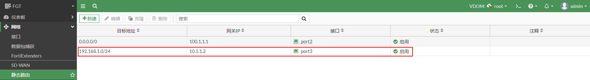

5. 配置策略，允许OA vdom到Internet的流量。

   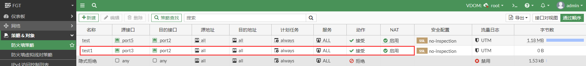

6. OA vdom配置路由和策略，配置路由，使OA vdom访问Internet的路由指向root vdom。

   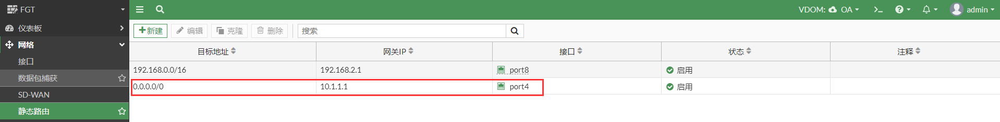

7. 配置策略，允许OA vdom到root vdom的流量。

   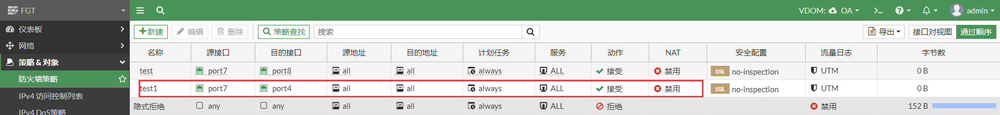

### VDOM间通信测试

1. PC2 ping 114.114.114.114。

   ```
   PC2# ping 114.114.114.114
   PING 114.114.114.114 (114.114.114.114) 56(84) bytes of data.
   64 bytes from 114.114.114.114: icmp_seq=1 ttl=69 time=23.5 ms
   64 bytes from 114.114.114.114: icmp_seq=2 ttl=85 time=23.2 ms
   64 bytes from 114.114.114.114: icmp_seq=3 ttl=86 time=23.2 ms
   64 bytes from 114.114.114.114: icmp_seq=4 ttl=73 time=23.2 ms
   ```

2. FortiGate抓包可以看出数据流穿过了port3和port4接口（在root vdom或者在OA vdom下抓包都是可以的）。

   ```
   # diagnose sniffer packet any icmp 4
   interfaces=[any]
   filters=[icmp]
   2.923717 port7 in 192.168.1.10 -> 114.114.114.114: icmp: echo request
   2.923771 port4 out 192.168.1.10 -> 114.114.114.114: icmp: echo request
   2.923782 port3 in 192.168.1.10 -> 114.114.114.114: icmp: echo request
   2.923794 port2 out 100.1.1.2 -> 114.114.114.114: icmp: echo request
   2.946967 port2 in 114.114.114.114 -> 100.1.1.2: icmp: echo reply
   2.946978 port3 out 114.114.114.114 -> 192.168.1.10: icmp: echo reply
   2.946989 port4 in 114.114.114.114 -> 192.168.1.10: icmp: echo reply
   2.947163 port7 out 114.114.114.114 -> 192.168.1.10: icmp: echo reply
   ```

3. FortiGate查看会话，ping 流量在root vdom和OA vdom都产生了会话。在root vdom或者在OA vdom下查看会话都是可以的,vd=0是root vdom，vd=3是OA vdom

   ```
   # diagnose sys session list
   session info: proto=1 proto_state=00 duration=29 expire=31 timeout=0 flags=00000000 socktype=0 sockport=0 av_idx=0 use=3
   origin-shaper=
   reply-shaper=
   per_ip_shaper=
   class_id=0 ha_id=0 policy_dir=0 tunnel=/ vlan_cos=0/255
   state=may_dirty npu 
   statistic(bytes/packets/allow_err): org=168/2/1 reply=168/2/1 tuples=2
   tx speed(Bps/kbps): 0/0 rx speed(Bps/kbps): 0/0
   orgin->sink: org pre->post, reply pre->post dev=11->10/10->11 gwy=100.1.1.1/10.1.1.2
   hook=post dir=org act=snat 192.168.1.10:2691->114.114.114.114:8(100.1.1.2:63107)
   hook=pre dir=reply act=dnat 114.114.114.114:63107->100.1.1.2:0(192.168.1.10:2691)
   misc=0 policy_id=4 pol_uuid_idx=636 auth_info=0 chk_client_info=0 vd=0
   serial=00036a12 tos=ff/ff app_list=0 app=0 url_cat=0
   rpdb_link_id=00000000 ngfwid=n/a
   npu_state=0x4000c00 ofld-O ofld-R
   npu info: flag=0x81/0x81, offload=8/8, ips_offload=0/0, epid=150/152, ipid=152/150, vlan=0x0000/0x0000
   vlifid=152/150, vtag_in=0x0000/0x0000 in_npu=1/1, out_npu=1/1, fwd_en=0/0, qid=2/7
   
   session info: proto=1 proto_state=00 duration=29 expire=31 timeout=0 flags=00000000 socktype=0 sockport=0 av_idx=0 use=3
   origin-shaper=
   reply-shaper=
   per_ip_shaper=
   class_id=0 ha_id=0 policy_dir=0 tunnel=/ vlan_cos=0/255
   state=may_dirty npu 
   statistic(bytes/packets/allow_err): org=168/2/1 reply=168/2/1 tuples=2
   tx speed(Bps/kbps): 0/0 rx speed(Bps/kbps): 0/0
   orgin->sink: org pre->post, reply pre->post dev=15->12/12->15 gwy=10.1.1.1/192.168.1.10
   hook=pre dir=org act=noop 192.168.1.10:2691->114.114.114.114:8(0.0.0.0:0)
   hook=post dir=reply act=noop 114.114.114.114:2691->192.168.1.10:0(0.0.0.0:0)
   misc=0 policy_id=2 pol_uuid_idx=637 auth_info=0 chk_client_info=0 vd=3
   serial=00036a11 tos=ff/ff app_list=0 app=0 url_cat=0
   rpdb_link_id=00000000 ngfwid=n/a
   npu_state=0x4000c00 ofld-O ofld-R
   npu info: flag=0x81/0x81, offload=8/8, ips_offload=0/0, epid=154/160, ipid=160/154, vlan=0x0000/0x0000
   vlifid=160/154, vtag_in=0x0000/0x0000 in_npu=1/1, out_npu=1/1, fwd_en=0/0, qid=2/3
   ```

4. 进入全局，查看vdom索引。

   ```
   #config global 
   # diagnose sys vd list  | grep name=root 
   name=root/root index=0 enabled fib_ver=49 rpdb_ver=2 use=162 rt_num=46 asym_rt=0 sip_helper=0, sip_nat_trace=1, mc_fwd=0, mc_ttl_nc=0, tpmc_sk_pl=0
   
   # diagnose sys vd list  | grep name=OA
   name=OA/OA index=3 enabled fib_ver=18 rpdb_ver=0 use=65 rt_num=7 asym_rt=0 sip_helper=0, sip_nat_trace=1, mc_fwd=0, mc_ttl_nc=0, tpmc_sk_pl=0
   ```

### NPU link方式

NPU link方式和物理线路方式思路是一样的，只是接口不一样。

1. 将NPU link接口划入vdom，中高端设备支持NPU link接口，NPU link接口支持NP加速。可以使用NPU link接口进行vdom之间的通信。将npu0_vlink0划入 root vdom，将npu0_vlink1划入OA vdom，并配置IP地址。

   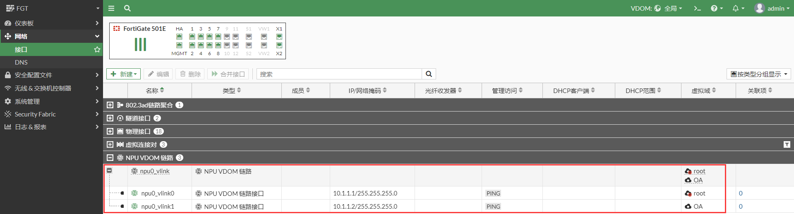

2. 测试NPU link之间的连通性，进入root vdom，从root vdom ping OA vdom npu_vlink1接口地址。

   ```
   #config vdom 
   #edit root
   # execute ping 10.1.1.2
   PING 10.1.1.2 (10.1.1.2): 56 data bytes
   64 bytes from 10.1.1.2: icmp_seq=0 ttl=255 time=0.0 ms
   64 bytes from 10.1.1.2: icmp_seq=1 ttl=255 time=0.0 ms
   64 bytes from 10.1.1.2: icmp_seq=2 ttl=255 time=0.0 ms
   64 bytes from 10.1.1.2: icmp_seq=3 ttl=255 time=0.0 ms
   64 bytes from 10.1.1.2: icmp_seq=4 ttl=255 time=0.0 ms
   
   --- 10.1.1.2 ping statistics ---
   5 packets transmitted, 5 packets received, 0% packet loss
   round-trip min/avg/max = 0.0/0.0/0.0 ms
   ```

3. 进入OA vdom，从OA vdom ping  root vdom npu_vlink0接口地址。

   ```
   #config vdom 
   #edit OA 
   #execute ping 10.1.1.1
   PING 10.1.1.1 (10.1.1.1): 56 data bytes
   64 bytes from 10.1.1.1: icmp_seq=0 ttl=255 time=0.0 ms
   64 bytes from 10.1.1.1: icmp_seq=1 ttl=255 time=0.0 ms
   64 bytes from 10.1.1.1: icmp_seq=2 ttl=255 time=0.0 ms
   64 bytes from 10.1.1.1: icmp_seq=3 ttl=255 time=0.0 ms
   64 bytes from 10.1.1.1: icmp_seq=4 ttl=255 time=0.0 ms
   
   --- 10.1.1.1 ping statistics ---
   5 packets transmitted, 5 packets received, 0% packet loss
   round-trip min/avg/max = 0.0/0.0/0.0 ms
   ```

4. root vdom配置路由和策略：配置路由，配置root vdom到OA vdom子网的回程路由。

   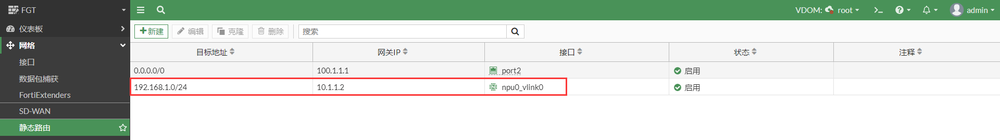

5. 配置策略，允许OA vdom到Internet的流量。

   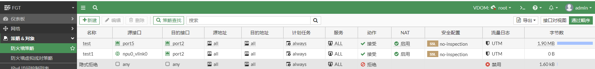

6. OA vdom配置路由和策略：配置路由，使OA vdom访问Internet的路由指向root vdom。

   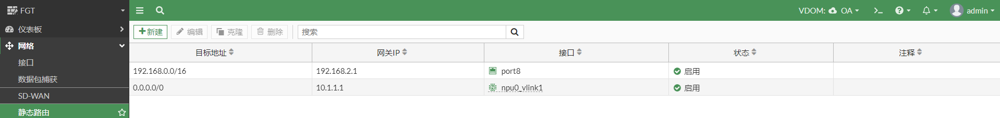

7. 配置策略，允许OA vdom到root vdom的流量。

   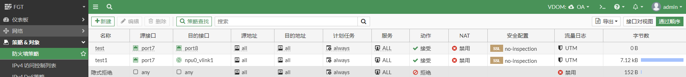

### VDOM间通信测试

1. PC2 ping 114.114.114.114。

   ```
   PC2# ping 114.114.114.114
   PING 114.114.114.114 (114.114.114.114) 56(84) bytes of data.
   64 bytes from 114.114.114.114: icmp_seq=1 ttl=69 time=23.5 ms
   64 bytes from 114.114.114.114: icmp_seq=2 ttl=85 time=23.2 ms
   64 bytes from 114.114.114.114: icmp_seq=3 ttl=86 time=23.2 ms
   64 bytes from 114.114.114.114: icmp_seq=4 ttl=73 time=23.2 ms
   ```

2. FortiGate抓包可以看出数据流穿过了npu_vlink0和npu_vlink1接口（在root vdom或者在OA vdom下抓包都是可以的）。

   ```
   # diagnose sniffer packet any icmp 4
   interfaces=[any]
   filters=[icmp]
   3.064987 port7 in 192.168.1.10 -> 114.114.114.114: icmp: echo request
   3.065007 npu0_vlink1 out 192.168.1.10 -> 114.114.114.114: icmp: echo request
   3.065012 npu0_vlink0 in 192.168.1.10 -> 114.114.114.114: icmp: echo request
   3.065024 port2 out 100.1.1.2 -> 114.114.114.114: icmp: echo request
   3.088172 port2 in 114.114.114.114 -> 100.1.1.2: icmp: echo reply
   3.088199 npu0_vlink0 out 114.114.114.114 -> 192.168.1.10: icmp: echo reply
   3.088205 npu0_vlink1 in 114.114.114.114 -> 192.168.1.10: icmp: echo reply
   3.088431 port7 out 114.114.114.114 -> 192.168.1.10: icmp: echo reply
   ```

3. FortiGate查看会话，ping 流量在root vdom和OA vdom都产生了会话，在root vdom或者在OA vdom下查看会话都是可以的,vd=0是root vdom，vd=3是OA vdom。

   ```
   # diagnose sys session list
   
   session info: proto=1 proto_state=00 duration=3 expire=57 timeout=0 flags=00000000 socktype=0 sockport=0 av_idx=0 use=3
   origin-shaper=
   reply-shaper=
   per_ip_shaper=
   class_id=0 ha_id=0 policy_dir=0 tunnel=/ vlan_cos=0/255
   state=may_dirty npu 
   statistic(bytes/packets/allow_err): org=168/2/1 reply=168/2/1 tuples=2
   tx speed(Bps/kbps): 0/0 rx speed(Bps/kbps): 0/0
   orgin->sink: org pre->post, reply pre->post dev=7->10/10->7 gwy=100.1.1.1/10.1.1.2
   hook=post dir=org act=snat 192.168.1.10:2733->114.114.114.114:8(100.1.1.2:63149)
   hook=pre dir=reply act=dnat 114.114.114.114:63149->100.1.1.2:0(192.168.1.10:2733)
   misc=0 policy_id=4 pol_uuid_idx=638 auth_info=0 chk_client_info=0 vd=0
   serial=00037b32 tos=ff/ff app_list=0 app=0 url_cat=0
   rpdb_link_id=00000000 ngfwid=n/a
   npu_state=0x4000c00 ofld-O ofld-R
   npu info: flag=0x81/0x91, offload=8/8, ips_offload=0/0, epid=150/142, ipid=132/150, vlan=0x0000/0x0000
   vlifid=132/150, vtag_in=0x0000/0x0000 in_npu=1/1, out_npu=1/1, fwd_en=0/0, qid=0/5
   
   session info: proto=1 proto_state=00 duration=3 expire=57 timeout=0 flags=00000000 socktype=0 sockport=0 av_idx=0 use=3
   origin-shaper=
   reply-shaper=
   per_ip_shaper=
   class_id=0 ha_id=0 policy_dir=0 tunnel=/ vlan_cos=0/255
   state=may_dirty npu 
   statistic(bytes/packets/allow_err): org=168/2/1 reply=168/2/1 tuples=2
   tx speed(Bps/kbps): 0/0 rx speed(Bps/kbps): 0/0
   orgin->sink: org pre->post, reply pre->post dev=15->8/8->15 gwy=10.1.1.1/192.168.1.10
   hook=pre dir=org act=noop 192.168.1.10:2733->114.114.114.114:8(0.0.0.0:0)
   hook=post dir=reply act=noop 114.114.114.114:2733->192.168.1.10:0(0.0.0.0:0)
   misc=0 policy_id=2 pol_uuid_idx=637 auth_info=0 chk_client_info=0 vd=3
   serial=00037b31 tos=ff/ff app_list=0 app=0 url_cat=0
   rpdb_link_id=00000000 ngfwid=n/a
   npu_state=0x4000c00 ofld-O ofld-R
   npu info: flag=0x91/0x81, offload=8/8, ips_offload=0/0, epid=132/160, ipid=160/142, vlan=0x0000/0x0000
   vlifid=160/142, vtag_in=0x0000/0x0000 in_npu=1/1, out_npu=1/1, fwd_en=0/0, qid=0/1
   ```

4. 进入全局，查看vdom索引。

   ```
   #config global 
   # diagnose sys vd list  | grep name=root 
   name=root/root index=0 enabled fib_ver=49 rpdb_ver=2 use=162 rt_num=46 asym_rt=0 sip_helper=0, sip_nat_trace=1, mc_fwd=0, mc_ttl_nc=0, tpmc_sk_pl=0
   
   # diagnose sys vd list  | grep name=OA
   name=OA/OA index=3 enabled fib_ver=18 rpdb_ver=0 use=65 rt_num=7 asym_rt=0 sip_helper=0, sip_nat_trace=1, mc_fwd=0, mc_ttl_nc=0, tpmc_sk_pl=0
   ```

