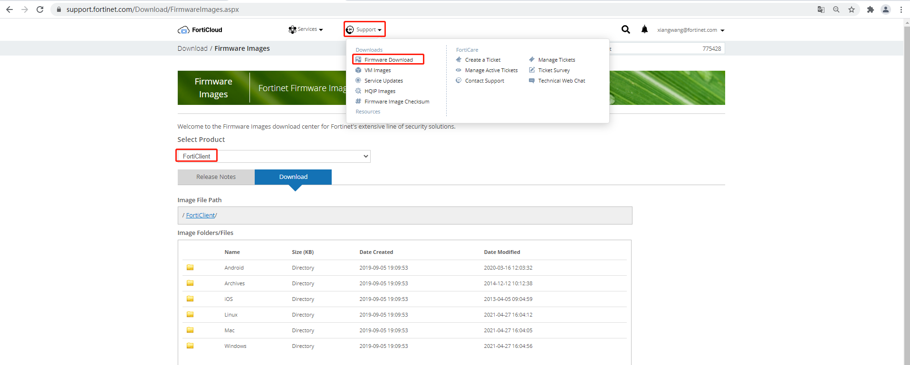
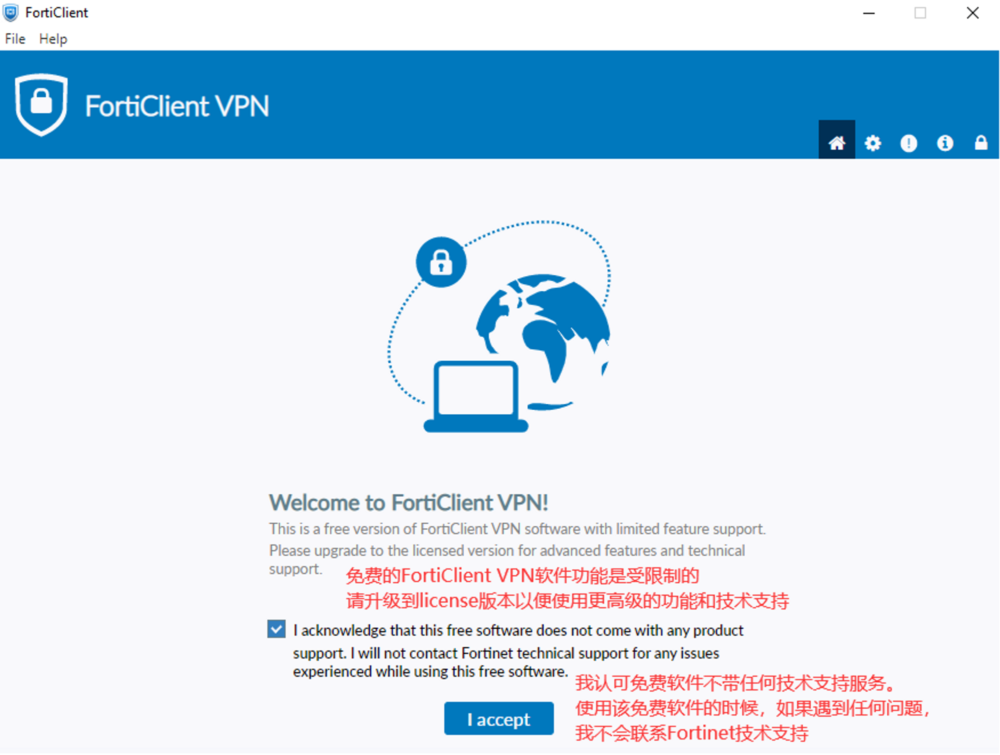

# FortiClient下载

登录https://support.fortinet.com/Download/FirmwareImages.aspx 网站，点击“Support”下拉箭头，选择”Fireware Download“-->”FortiClient“，选择对应系统的版本下载。

注意：完整版FortiClient需要EMS license；免费的FortiClient VPN支持SSLVPN和IPSEC VPN，但FortiClient端不提供技术支持服务。

