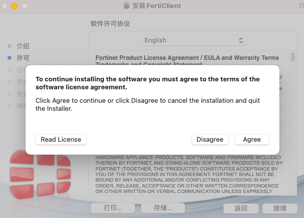

# Mac FortiClient安装及使用

## Mac FortiClient完整版安装

1. **下载FortiClient**

   这里使用FortiClient 7.0.7的版本。登录https://support.fortinet.com/Download/FirmwareImages.aspx 网站下载FortiClient_7.0.7.0245_macosx.dmg。
   
   

2. **安装FortiClient**

   点击FortiClient_7.0.7.0245_macosx.dmg安装，点击”Install“。
   
   
   
   点击“继续”。
   
   
   
   点击“继续”。
   
   
   
   点击“Agree”。
   
   
   
   点击“继续”。
   
   
   
   输入用户名和密码授权安装。
   
   
   
   
   
   选择“允许"。
   
   
   
   
   
   安装成功。
   
   
   
   打开FortiClient。
   
   
   
   **3.连接EMS**
   
   在连接EMS前，需要授予FortiClient磁盘访问权限。
   
   
   
   输入EMS IP地址，点击“连接”。
   
   
   
   选择“允许”
   
   
   
   已连接上EMS。
   
   

## MAC 免费版FortiClient VPN安装

1. **下载FortiClient**

   这里使用FortiClient 7.0.7的版本。登录https://support.fortinet.com/Download/FirmwareImages.aspx 网站下载FortiClientVPNSetup_7.0.7.0245_macosx.dmg。

   

2. **安装FortiClient**

   点击FortiClientVPNSetup_7.0.7.0245_macosx.dmg，点击“Install”。

   

   点击“继续”。

   

   点击“继续”。

   

   选择“Agree”。

   

   点击“安装”。

   

   输入用户名和密码授权安装。

   

   

   选择“允许”。

   

   安装完成。

   

   3. **打开FortiClient**

      勾选“I acknowledge that this free software...”，点击I accept。免费的FortiClient是不提供技术支持服务的。

      

      同意后FortiClient界面如下：

      

      授予FortiClient磁盘访问权限。

      

## 设置SSLVPN

1. **点击“配置VPN”**

   

2. **配置SSLVPN**

   连接名：SSLVPN名称

   远程网关：FortiGate开启SSLVPN服务的接口地址；

   自定义端口：SSLVPN服务的端口号；

   

3. **配置完成**

   

   4. **连接SSLVPN**

      输入账号密码后，点击“连接”，再弹出窗口选择 continue，接受FortiGate的证书。

      

      SSLVPN连接成功。

      

