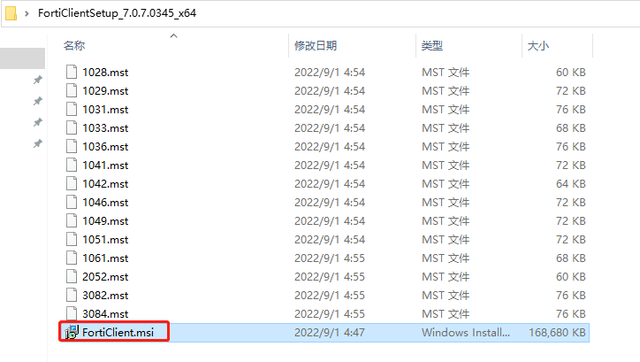
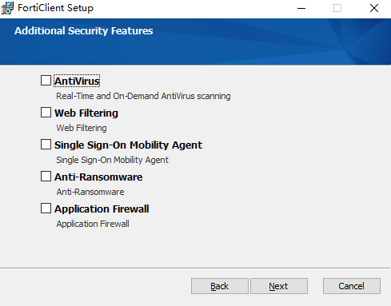

# FortiClient安装

## Windows FortiClient完整版安装

1. **下载FortiClient**

   这里使用FortiClient 7.0.7的版本。登录https://support.fortinet.com/Download/FirmwareImages.aspx 网站下载FortiClientSetup_7.0.7.0345_x64.zip，x64表示64位系统。

   

2. **安装FortiClient**

   解压FortiClientSetup_7.0.7.0345_x64.zip，然后点击“FortiClient.msi”安装。

   

   勾选“Yes,I have read an accept the ...”，点击Next。

   

   选择“Secure Remote Access”，即SSLVPN和IPSEC VPN，点击Next。

   

   点击Next。

   

   点击Next。

   

   点击Install。

   

   

   点击“Finish”，安装完成。

   

3. **连接EMS**

   打开FortiClient，在没有连接EMS之前，FortiClient会显示UNLICNESED，并提示试用时间。

   

   输入EMS服务器的地址或者域名。

   

   选择”允许“

   

   已连接上EMS，并且不再提示UNLICNESED。

   

   

## Windows免费版FortiClient VPN安装

1. **下载FortiClient**

   这里使用FortiClient 7.0.7的版本。登录https://support.fortinet.com/Download/FirmwareImages.aspx 网站下载FortiClientVPNSetup_7.0.7.0345_x64.exe，x64表示64位系统。

   

2. **安装FortiClient**

   双击FortiClientVPNSetup_7.0.7.0345_x64.exe安装，勾选“Yes,I have read an accept the ...”，点击Next。

   

   点击Install。

   

   

   安装完成，点击“Finish”。

   

3. **打开FortiClient**

   勾选“I acknowledge that this free software...”，点击I accept。免费的FortiClient是不提供技术支持服务的。

   

   同意后显示配置界面。

   

   

## Windows设置SSLVPN

1. **点击“配置VPN”**

   

2. **设置SSLVPN连接**

   连接名：SSLVPN名称

   远程网关：FortiGate开启SSLVPN服务的接口地址；

   自定义端口：SSLVPN服务的端口号；

   

3. **配置完成**

   

4. **SSLVPN连接**

   输入账号和密码后，点击连接，再弹出窗口选择是，接受FortiGate的证书。

   

   连接成功。

   
