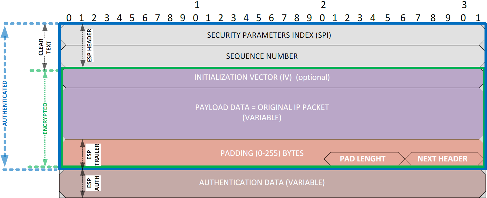

# IPSec VPN原理

## 什么是IPSEC VPN

IPSec全称为Internet Protocol Security，是由Internet Engineering Task Force (IETF) 定义的安全标准框架，通过在公网上为两个或多个私有网络之间建立IPsec隧道，并通过加密和验证算法保证VPN连接的安全。IPSEC协议工作在IP层，在IP层对数据包进行加密和验证：

- 数据的机密性：IPSec的发送方对发给对端的数据进行加密；
- 数据的完整性：IPSec的接收方对接收到的数据进行验证以保证数据在传送的过程中没有被修改；
- 数据来源的认证：IPSec接收方验证数据的起源；
- 抗重播：IPSec的接收方可以检测并拒绝到重播的IP包；

## SA安全关联

SA（security association）安全关联分为两种：ISAKMP/IKE SA和IPsec SA。

**ISAKMP/IKE SA**：对等体之间的ISAKMP/IKE  SA用于控制IPsec协商数据流，如协商对IKE数据流进行加密以及对对等体进行验证的算法，确保协商过程中的安全。

**IPsec SA**：IPSec SA用于协商对等体之间真正需要通信的IP数据流进行加密的算法，IPSec SA是单向的，因此至少需要两个:一个用于入站数据流，另一个用于出站数据流。

## IPSEC安全协议

**FortiGate IPSEC VPN只使用ESP，不支持AH。**

**ESP**：ESP（Encapsulating Security Payload），协议号50，支持认证和加密功能。ESP在每一个数据包的标准IP报头后面添加一个ESP报文头，并在数据包后面追加一个ESP尾（ESP Trailer和ESP Auth data）。

ESP报文结构如下图：

- **SPI**：安全参数索引，用于标识IPSEC SA；
- **SEQUENCE NUMBER**：序列号，长度32bit，从1开始的递增的计数器，唯一地标识每一个数据包，用于防止重放攻击；
- **INITIALIZATION VECTOR (IV)**：初始向量，一些算法如 AES-GCM、AES-CCM 和 ChaCha20-Poly1305，采用 IV 生成一个随机数，用作加密和解密的输入参数；
- **PAYLOAD DATA**：负载数据，原始包中可变长的数据内容；
- **PADDING**：填充字段，需要加密的明文长度（也就是ESP报文的结构中，IV + Payload Data + Padding + Pad Length + Next Header的长度）必须是块长度的整数倍，事实是无法保证最后一个块的大小正好为块长度要求，因此信息必须填充至满足要求。只要是使用对称密钥的块密码工作模式，均可能需要Padding字段进行填充；
- **PAD LENGHT**：填充字段的长度，0表示没有填充；
- **NEXT HEADER**：下一头部，标识ESP报文头后的负载类型。传输模式下，是被保护的上层协议（TCP或UDP）的编号；隧道模式下，是IP协议的编号；
- **AUTHENTICATION DATA**：认证数据，包含数据完整性校验值ICV，用于接收方进行完整性校验；

**ESP报文抓包示例**：

**AH**：AH（Authentication Header），协议号51，只提供认证功能，不提供加密功能。

## 封装模式

**IPSEC隧道模式**

在隧道模式下，ESP头被插到原始IP头之前，重新生成一个新的报文头放到ESP头之前，保护IP头和负载。隧道模式主要应用于VPN网关之间或主机与VPN网关之间的通信，用来保护VPN网关后面的网络。

**IPSEC传输模式**

在传输模式下，ESP头被插入到IP头与传输层协议头之间，保护TCP/UDP/ICMP的负载。传输模式没有添加额外的IP头，因此原始报文中的IP地址在加密后报文的IP头中是可见的。一般用于IPsec加密点等于IPsec通信点的环境下或GRE over IPsec的环境中。

## IKE协议

### IKE协议与IPSEC的关系

因特网密钥交换IKE（Internet Key Exchange）协议建立在Internet安全关联和密钥管理协议ISAKMP定义的框架上，是基于UDP的应用层协议，分IKEv1和IKEv2两个版本。它为IPsec协商建立SA，并把协商好的参数交给IPsec，IPsec使用IKE建立的SA对IP报文加密或认证。

### IKE的安全机制

- **DH秘钥交换算法**：DH是一种公共密钥交换算法，它用于产生密钥材料，并通过ISAKMP消息在发送和接收端之间进行密钥材料交换。然后，两端各自计算出完全相同的对称密钥，该对称密钥用于计算加密和验证的密钥。DH使用密钥组定义自己产生密钥的长度。

| **DH Group** | **Description**                                              |
   | - | :- |
   | 1    | More Modular Exponential (MODP) DH Group with a 768-bit modulus |
   | 2        | MODP with a 1024-bit modulus                             |
   | 5        | MODP with a 1536-bit modulus                             |
   | 14       | MODP with a 2048-bit modulus                             |
   | 15       | MODP with a 3027-bit modulus                             |
   | 16       | MODP with a 4096-bit modulus                             |
   | 17       | MODP with a 6144-bit modulus                             |
   | 18       | MODP with a 8192-bit modulus                             |
   | 19       | 256-bit random elliptic curve group                      |
   | 20       | 384-bit random elliptic curve group                      |
   | 21       | 521-bit random elliptic curve group                      |
   | 27       | Brainpool 224-bit elliptic curve group                   |
   | 28       | Brainpool 256-bit elliptic curve group                   |
   | 29       | Brainpool 384-bit elliptic curve group                   |
   | 30       | Brainpool 512-bit elliptic curve group                   |
   | 31       | Curve25519 128-bit elliptic curve group                      |

- **身份认证**

   通过IP地址或者名称确定双方的身份，有两种身份认证方式：预共享秘钥和数字证书认证。

   - 在预共享密钥认证中，通信双方采用共享的密钥对报文进行Hash计算，判断双方的计算结果是否相同。如果相同，则认证通过；否则认证失败。
   - 在数字证书认证中，通信双方使用CA证书进行数字证书合法性验证，双方各有自己的公钥（网络上传输）和私钥（本地存储）。发送方对报文进行Hash计算，并用自己的私钥对报文计算结果进行加密，生成数字签名。接收方使用发送方的公钥对数字签名进行解密，并对报文进行Hash计算，判断计算结果与解密后的结果是否相同。如果相同，则认证通过；否则认证失败。

   IKE支持的认证算法有：MD5、SHA1、SHA2-256、SHA2-384、SHA2-512。（MD5和SHA1认证算法不安全）

- **数据加密**

   身份数据在密钥产生之后加密传送，实现了对身份数据的保护。

   IKE支持的加密算法有：DES、3DES、AES-128、AES-192、AES-256。（DES和3DES加密算法不安全）

- **PFS**

   PFS（Perfect Forward Secrecy），即完善的前向安全性，是指一个密钥被破解，并不影响其他密钥的安全性，因为这些密钥间没有派生关系。IPSec SA的密钥是从IKE SA的密钥导出的，由于一个IKE SA协商生成一对或多对IPSec SA，当IKE的密钥被窃取后，攻击者将可能收集到足够的信息来导出IPSec SA的密钥，PFS通过执行一次额外的DH交换，保证IPSec SA密钥的安全。

### IKEv1秘钥协商过程

IKEv1秘钥协商分为两个阶段：

第一阶段：通信双方协商和建立IKE协议本身的使用的安全通道，即建立IKE SA。

第二阶段：利用第一阶段建立的安全通道建立一对用于数据安全传输的IPSEC SA。

### **IKEv1第一阶段**

IKEv1第一阶段协商支持两种协商模式：主模式（Main Mode）和野蛮模式（Aggressive Mode）。

**主模式**

主模式包含3次双向交换，用到了6条ISAKMP信息。

1. **第1和2个包用于安全提议交换。**

   a. 在第1个包中，发起方SPI设置为随机值，而响应方SPI设置为0；在第2个数据包中，响应方SPI必须用新值回复，并且整个协商保持相同的SPI值。

   b. 对Vendor ID进行处理，以确定对等体是否支持NAT-T、DPD等。

   c. 协商安全协商加密和验证的算法。

   

   

2. **第3和4个包用于密钥信息交换**

   通过DH公钥值和nonce值，两个对等体将生成一个名为SKEYID的种子密钥。为了不同的目的，将使用该种子密钥生成另外3个会话密钥：

   SKEYID_d：作为阶段2生成KEY的材料；

   SKEYID_a：用来ISAKMP包完整性用的key；

   SKEYID_e：用来加密ISAKMP包的key；

   nonce：随机生成的数字，用于防重放攻击。

   

3. **第5和6个包用于身份和认证信息交换**

   第5和6个包是加密的，目的是确认对方的身份。如果是使用预共享密钥，那么验证包括检查双方是否有相同的预共享密钥。如果是证书，则对等体交换证书，并假设签署双方的CA是受信任的，则验证成功。
   
   
   
   **野蛮模式**
   
   野蛮模式只用到3个包。
   
   1. **第1个包，发起方发送安全提议、DH公开值、临时值(nonce )，以及身份ID供响应方验证。**
   
      
   
   2. **第2个包，响应方用选定提议的所有参数，DH公开值进行应答，以及身份ID供发起方验证。**
   
      
   
   3. **第3个包，发起方发送验证数据。**
   
      

### IKEv1第二阶段

IKEv1协商阶段二的目的就是建立用来安全传输数据的IPSec SA，并为数据传输衍生出密钥。该采用快速模式（Quick Mode），使用IKEv1协商阶段一中生成的密钥对ISAKMP消息的完整性和身份进行验证，并对ISAKMP消息进行加密，从而保证了数据交换的安全性。

IKEv1第二阶段有3个包：

1. **第1个包，发起方发送本端的安全参数：被保护的数据流和IPSec安全提议等，以及身份认证信息。**

   

2. **第2个包，响应方发送确认的安全参数和身份认证信息并生成IPSEC数据传输密钥。**

   

3. **发起方发送确认信息，确认与响应方可以通信，协商结束。**

   

### IKEv2秘钥协商过程

IKEv2使用2次交换共4个包就可以完成一对IPSec SA的建立，如果建立的IPSec SA大于一对时，每一对IPSec SA只需额外增加1次创建子SA交换，即2个包就可以完成。IKEv2定义了三种交换：初始交换（Initial Exchanges）、创建子SA交换（Create_Child_SA Exchange）以及通知交换（Informational Exchange）。

**初始交换**

IKEv2通过初始交换就可以完成第一对IPSec SA的协商建立。

1. 第1和2个包，IKE_SA_INIT交换；协商IKE SA加密和验证算法，交换临时随机数和DH交换，然后生成一个共享密钥材料，通过这个共享密钥材料可以衍生出IPSec SA的所有密钥。

   

2. 第3和4个包，IKE_AUTH交换；完成身份认证、对前两条信息的认证和IPSec SA的参数协商，第3和4个包是加密的。

   

**创建子SA交换**

当一个IKE SA需要创建多对IPSEC SA时，则创建子SA交换来协商后续的IPSEC SA。创建子SA交换还可以用于IKE SA的重协商。

**通知交换**

IPSEC两端有时会传递一些控制信息，例如错误信息或者通告信息，这些信息在IKEv2中是通过通知交换完成的。

## NAT穿越

**疑问**：ESP隧道模式默认只支持一对一NAT转换，不支持PAT；ESP传输模式不支持NAT。如果FortiGate位于企业内部，运营商出口有单独的设备做NAT，那么IPSEC流量如何穿越NAT？

**解决方案：**

**NAT-T技术，即在IP和ESP报文之间插入一个8个字节UDP头部(端口号默认为4500），FortiGate默认enable NAT-T**

NAT-T由三部分组成：

1. 首先是判断远程对等体是否支持NAT-T；

2. 其次是检测对等体之间的路径上是否有NAT；

3. 最后决定如何使用UDP封装来处理NAT。

### IKEv1穿越NAT

IKEv1第一阶段协商支持两种协商模式：主模式（Main Mode）和野蛮模式（Aggressive Mode）。

**主模式**

1. 第1和2个包协商是否支持NAT-T

   

2. 第3和4个包，发起方插入了两个NAT-D载荷。第一个NAT-D载荷包含IKE对等体的IP地址和端口的Hash值，第二个NAT-D载荷包含本端的IP地址和端口的Hash值。响应方也计算这两个Hash值，两方计算的哪个Hash值不相等，表明哪个设备在NAT网关后面。

   

3. 完成NAT-T检测后，如果发现NAT网关，则后续UDP报文端口号修改为4500。

   当UDP封装的是ISAKMP消息，会增加一个non-ESP marker（为4个值为0的字节），以示跟封装ESP报文有区别。

   

**野蛮模式**

1. 第1个包，发起方在IKE消息中插入Vendor ID来告知对方自己支持NAT穿越。

   

2. 第2个包，响应方确认支持NAT-T，并携带两个NAT-D载荷。第一个NAT-D载荷包含IKE对等体的IP地址和端口的Hash值，第二个NAT-D载荷包含本端的IP地址和端口的Hash值。

   

3. 第3个包，响应方也计算这两个Hash值，两方计算的哪个Hash值不相等，表明哪个设备在NAT网关后面，但这个包的数据内容是加密的。完成NAT-T检测后，如果发现NAT网关，则从此UDP报文开始端口号修改为4500。

   当UDP封装的是ISAKMP消息，会增加一个non-ESP marker（为4个值为0的字节），以示跟封装ESP报文有区别。

   

### IKEv2穿越NAT

1. 第1和2个包，在IKE消息中插入两个载荷，第一个载荷NAT_DETECTION_SOURCE_IP包含本端的IP地址和端口的Hash值，第二个载荷NAT_DETECTION_DESTINATION_IP包含对端的IP地址和端口的Hash值。这两个通知载荷用于检测在将要建立IPSec隧道的两个网关之间是否存在NAT，如果接收到的NAT_DETECTION_SOURCE通知载荷没有匹配数据包IP头中的源IP和端口的Hash值，则说明对端位于NAT网关后面。如果接收到的NAT_DETECTION_DESTINATION_IP通知载荷没有匹配数据包IP头中的目的IP和端口的Hash值，则意味着本端位于NAT网关之后。

   

2. 第3和4个包，完成IKE_SA_INIT后，发现NAT设备，后续UDP报文端口号修改为4500。

   当UDP封装的是ISAKMP消息，会增加一个non-ESP marker（为4个值为0的字节），以示跟封装ESP报文有区别。

   
