# ADVPN模式

## **组网需求**

传统的Hub-Spoke方式中，Spoke只能和Hub建立永久隧道，Spoke之间的流量需要通过Hub来转发，这种方式减轻了Spoke的负担，增加了 Hub的性能要求，同时利于总部对分支间流量的监控；使用ADVPN技术实现的Full-Mesh方式中，Spoke之间可以建立动态直连隧道，分支间的流量可以直接转发。相比而言，Hub负担减轻，同时减少分支间流量的延迟，更有利于SPOKE之间的流量传输，在实际使用的过程中可按照自身需求进行选择。

## 网络拓扑

```
PC1-----------(port5:192.168.0.1/24)HUB(port2:100.1.1.2)-------------Internet-------------(port2:200.1.1.2)SPOKE1(port5:192.168.1.1/24)-----------PC2
                                                                         |-----------------(port2:201.1.1.2)SPOKE2(port3:192.168.2.1/24)-----------PC3
```

VPN Tunnel IP地址分配，以及BGP的规划：

| 角色   | 公网IP    | 私网网段       | VPN隧道IP  | BGP信息            |
| ------ | --------- | -------------- | ---------- | ------------------ |
| HUB    | 100.1.1.2 | 192.168.0.1/24 | 10.10.10.1 | AS 65001 RR反射器  |
| SPOKE1 | 200.1.1.2 | 192.168.1.1/24 | 10.10.10.2 | AS 65001 RR Client |
| SPOKE2 | 201.1.1.2 | 192.168.2.1/24 | 10.10.10.3 | AS 65001 RR Client |
| SPOKE3 |           |                |            |                    |
| SPOKEX |           |                |            |                    |

## 配置步骤

这里使用IPSEC “Hub and Spoke”模板创建ADVPN。

### HUB端配置

1. **基本配置**

   配置接口IP和路由

   

   

2. **配置IPSEC VPN**

   选择“Hub and Spoke”模板

   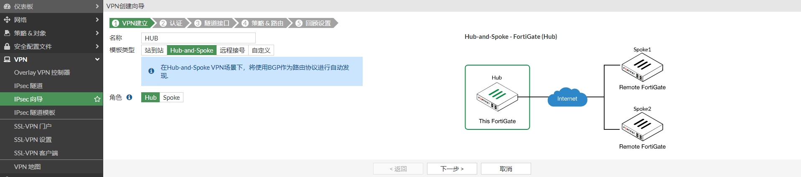

   选择创建IPSEC的接口及预共享秘钥。

   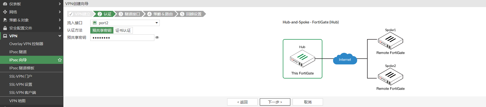

   HUB端的tunnel ip是10.10.10.1，远程IP地址/掩码是10.10.10.254/24。10.10.10.254是不被Spoke所使用的预留IP，IPsec Tunnel是一个点对点的隧道，但是ADVPN中这条隧道需要同时对应多个SPOKE，因此不能将Remote IP写成一个存在的SPOKE端IP。

   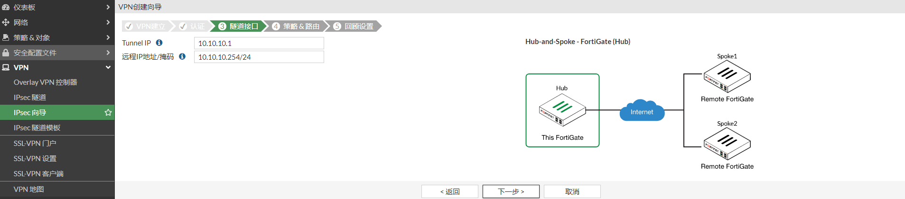

   输入BGP AS号，本地的内网接口及本地的内网网段，这里有两个spoke，分别设置对应隧道IP。

   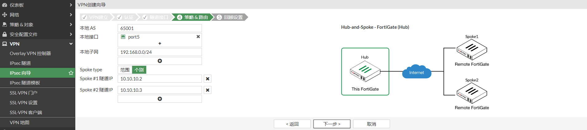

   VPN向导即将创建的内容。

   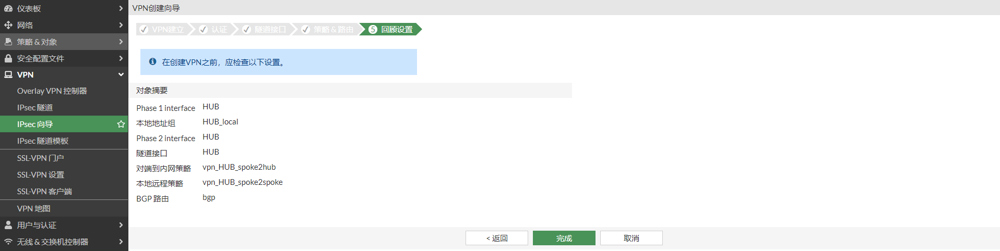

   VPN创建完成，Spoke#1和Spoke#2需要复制下来用于SPOKE端创建VPN。

   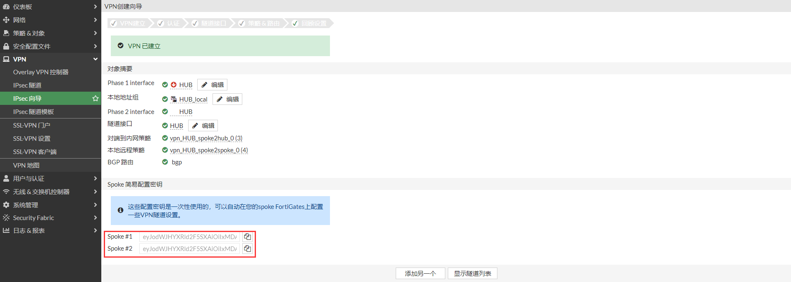


### 查看HUB端IPSEC向导创建的配置

通过“VPN创建向导”可以很方便的配置VPN，但我们需要知道向导具体做了哪些配置。

1. **创建地址对象和地址对象组**

   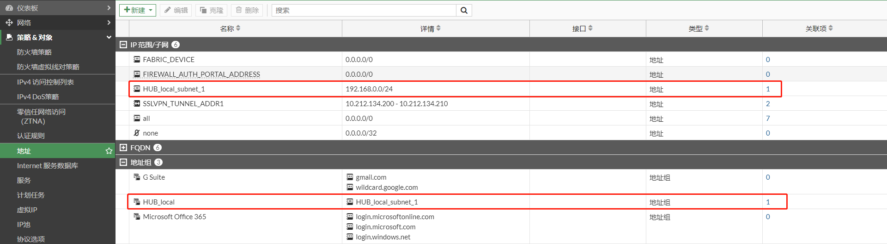

2. **创建IPSEC VPN**

   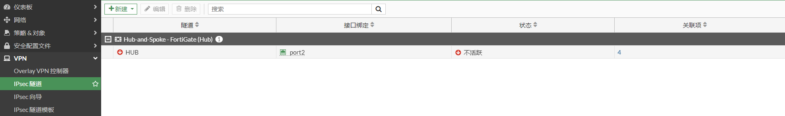

   对应的命令行

   ```
   config vpn ipsec phase1-interface
       edit "HUB"
           set type dynamic
           set interface "port2"
           set peertype any
           set net-device disable
           set proposal aes128-sha256 aes256-sha256 aes128-sha1 aes256-sha1
           set add-route disable
           set dpd on-idle
           set comments "VPN: HUB (Created by VPN wizard)"
           set wizard-type hub-fortigate-auto-discovery
           set auto-discovery-sender enable
           set psksecret ENC SKVqWAT1K2iJB8U5T26IVmwtHjbLPes7VloWfh1ARXPGobKTYHruFIVEe/RjNKZrNj3j1GdXrvp1GlPLt7DExzLGKKyIoQ/1q5owciyhpLn753JL0kRW86eR/C2h0aDcGZVKI8U9MagbU1pEy7RC71rtRr3dJjSd95eu6oeyq9FssYpAq9jCdyDbiSpbZoEVoYEwiw==
       next
   end
   config vpn ipsec phase2-interface
       edit "HUB"
           set phase1name "HUB"
           set proposal aes128-sha1 aes256-sha1 aes128-sha256 aes256-sha256 aes128gcm aes256gcm chacha20poly1305
           set comments "VPN: HUB (Created by VPN wizard)"
       next
   end
   ```

3. **创建策略**

   注意：模板中只创建了SPOKE到HUB端的策略以及SPOKE到SPOKE端的策略，没有创建HUB到SPOKE端的策略，可以根据业务的需求添加。

   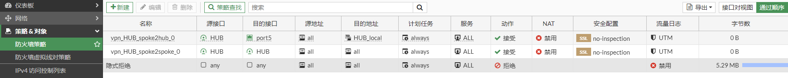

4. **创建VPN接口IP**

   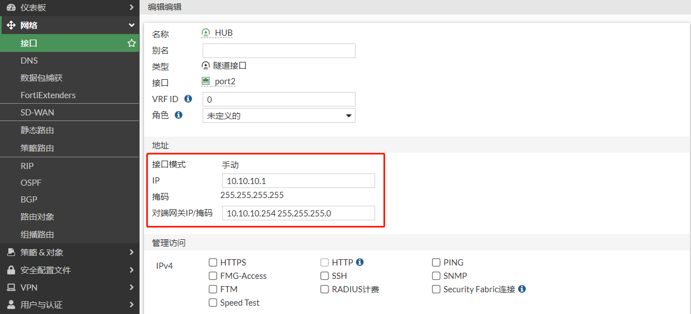

5. **创建BGP**

   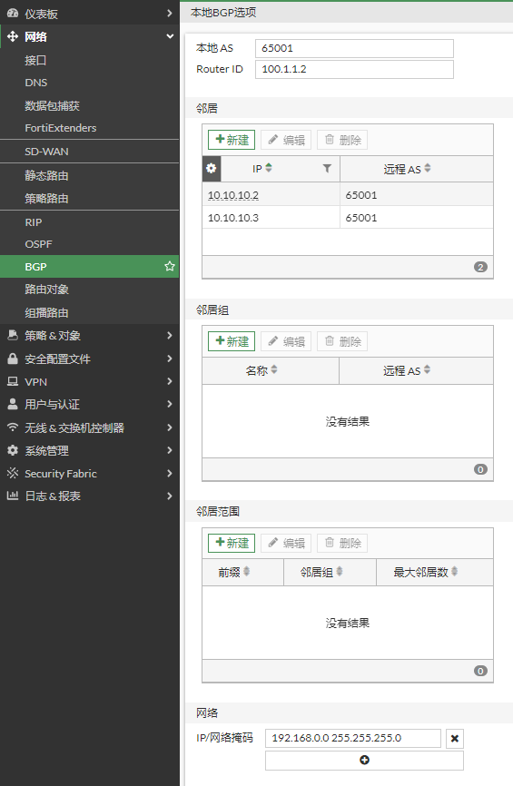

### 针对向导配置的优化建议

1. 在第一阶段中开启DPD周期性检测（每隔10s检测一次Peer状态），实现快速的检测并切换VPN隧道的目的。

   ```
   config vpn ipsec phase1-interface
       edit "VPN-to-SH"
           set dpd on-idle
           set dpd-retrycount 3
           set dpd-retryinterval 10
       next
   end
   ```

### SPOKE1端配置

1. **基本配置**

   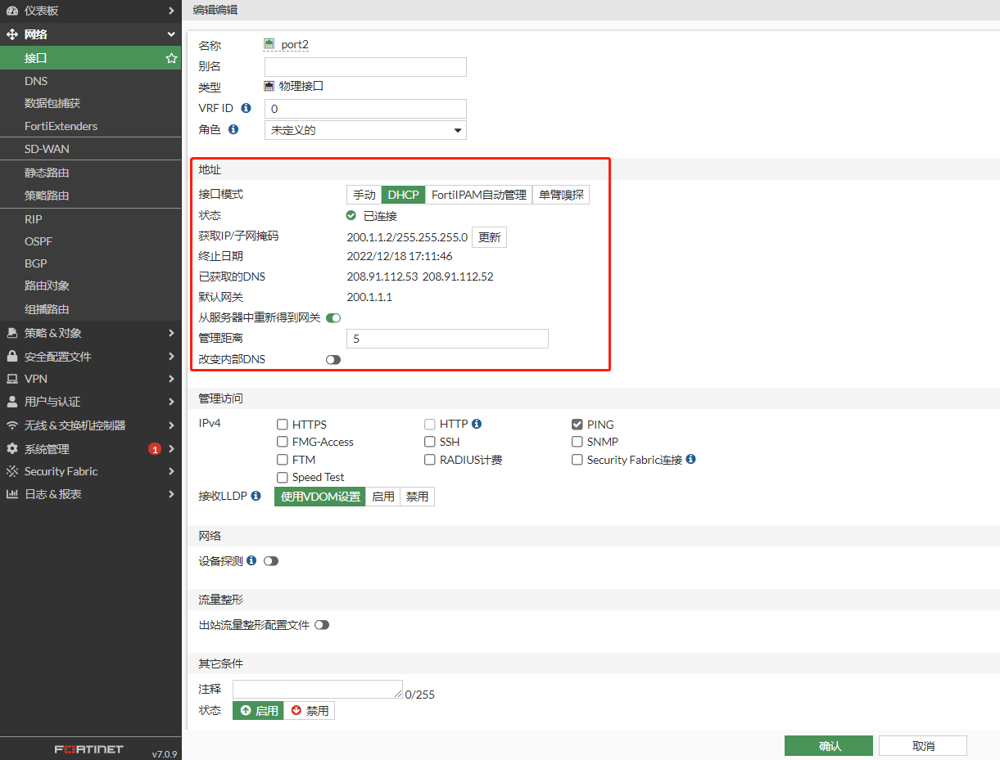

   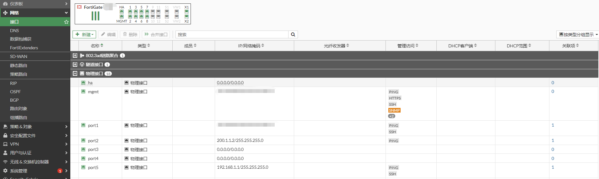

2. **配置IPSEC VPN**

   选择“Hub and Spoke”模板。输入在HUB生成的Spoke#1的秘钥并点击应用，然后点击下一步。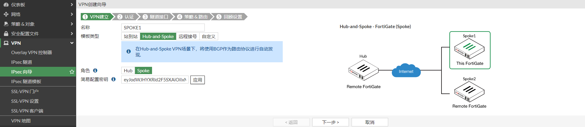

   远程IP地址和流出接口会自动生成，需要输入预共享秘钥。点击下一步。

   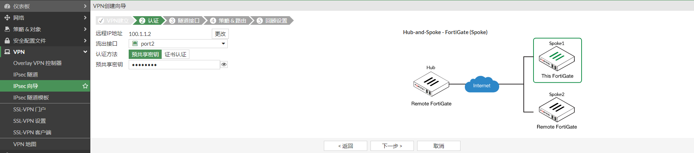

   自动生成隧道IP，点击下一步。

   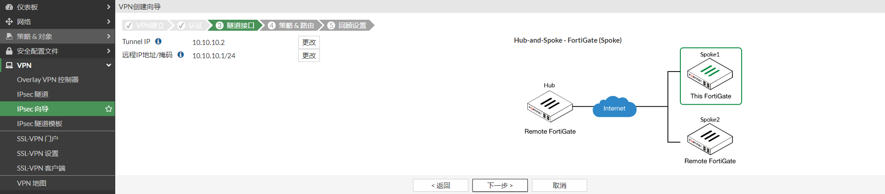

   自动生成本地AS号，需要生成SPOKE1本地的内网接口及需要保护的内网网段，点击下一步。

   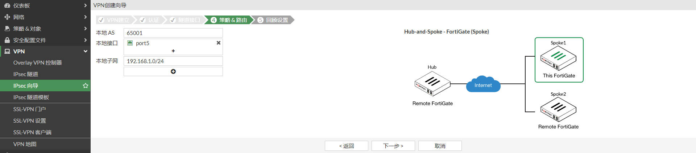

   VPN向导即将创建的内容，点击完成。

   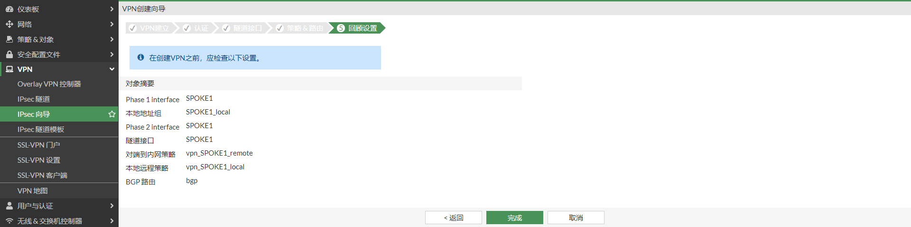

   VPN创建完成。

   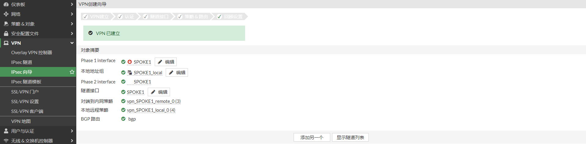

### 查看SPOKE1端IPSEC向导创建的配置

通过“VPN创建向导”可以很方便的配置VPN，但我们需要知道向导具体做了哪些配置。

1. **创建地址对象和地址对象组**

   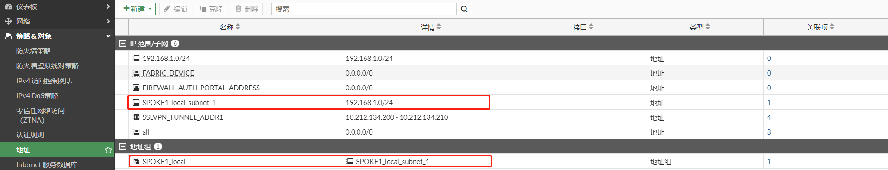

2. **创建VPN**

   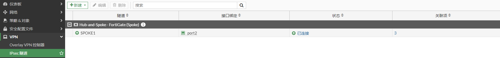

   对应的命令行

   ```
   config vpn ipsec phase1-interface
       edit "SPOKE1"
           set interface "port2"
           set peertype any
           set net-device enable
           set proposal aes128-sha256 aes256-sha256 aes128-sha1 aes256-sha1
           set add-route disable
           set dpd on-idle
           set comments "VPN: SPOKE1 (Created by VPN wizard)"
           set wizard-type spoke-fortigate-auto-discovery
           set auto-discovery-receiver enable
           set remote-gw 100.1.1.2
           set psksecret ENC zVXgULIXvCQPfG0ubZ8R36jhME7KanJ9V/NyV8zt5tXA5jlwPAli6alNN6g26Udtb04sWU/veKHuorIFmj9fO0J9vBi6Da6+pRlhnfSZ/f3fcxG7hj7ydbk72PyXw2mDdDKsMty+27VVqTNG8OEyxdX+/vCG82iT5NjaLM84V/P1/YNUlIWqrnte2PEjuw9tzzbbDQ==
       next
   end
   config vpn ipsec phase2-interface
       edit "SPOKE1"
           set phase1name "SPOKE1"
           set proposal aes128-sha1 aes256-sha1 aes128-sha256 aes256-sha256 aes128gcm aes256gcm chacha20poly1305
           set comments "VPN: SPOKE1 (Created by VPN wizard)"
       next
   end
   ```

3. **创建策略**

   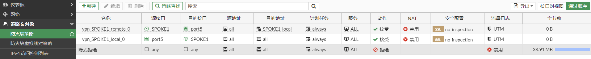

4. **创建VPN接口IP**

   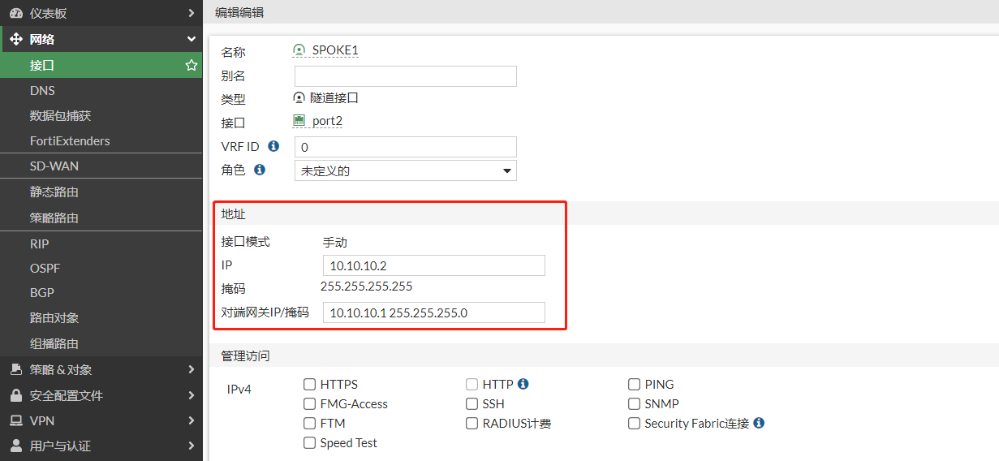

5. **创建BGP**

   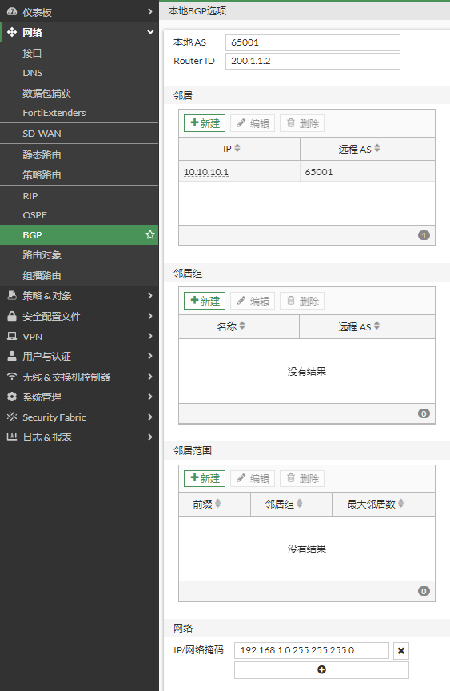

### 针对向导配置的优化建议

1. 在第一阶段中开启DPD周期性检测（每隔10s检测一次Peer状态），实现快速的检测并切换VPN隧道的目的。

   ```
   config vpn ipsec phase1-interface
       edit "VPN-to-SH"
           set dpd on-idle
           set dpd-retrycount 3
           set dpd-retryinterval 10
       next
   end
   ```

2. 开启自动协商，主动让隧道UP起来，而非使用VPN业务的时候再去触发VPN的协商，这样可以减少业务的丢包。在VPN主动发起方开启即可。

   IPSEC VPN阶段一自动协商是默认开启的。

   ```
   config vpn ipsec phase1-interface
       edit "VPN-to-SH"
           set auto-negotiate enable 
       next
   end
   ```

   IPSEC VPN阶段二自动协商默认关闭，需要开启。

   ```
   config vpn ipsec phase2-interface
       edit "VPN-to-SH"
           set auto-negotiate enable
       next
   end
   ```

### SPOKE2配置

1. 基本配置

   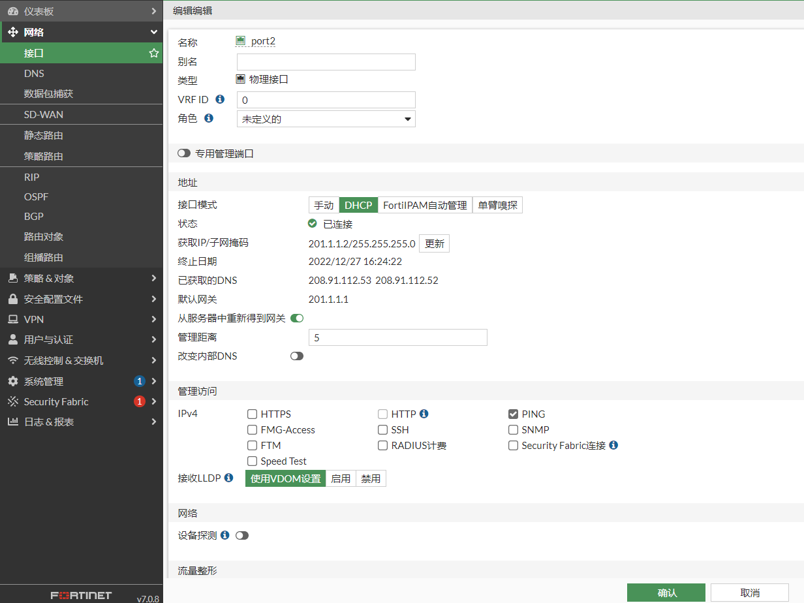

   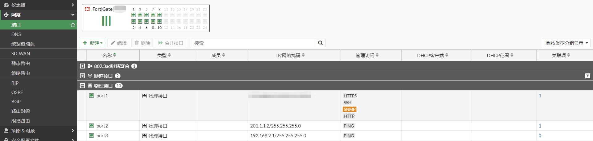

2. **配置IPSEC VPN**

   选择“Hub and Spoke”模板。输入在HUB生成的Spoke#2的秘钥并点击应用，然后点击下一步。

   

   远程IP地址和流出接口会自动生成，需要输入预共享秘钥。点击下一步。

   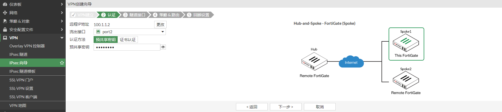

   自动生成隧道IP，点击下一步。

   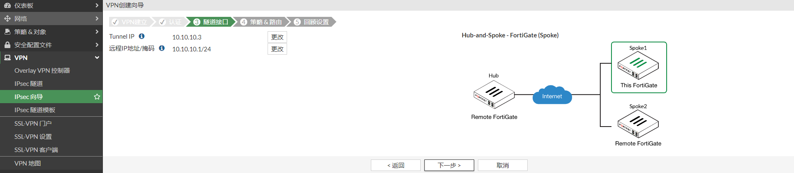

   自动生成本地AS号，需要生成SPOKE1本地的内网接口及需要保护的内网网段，点击下一步。

   

   VPN向导即将创建的内容，点击完成。

   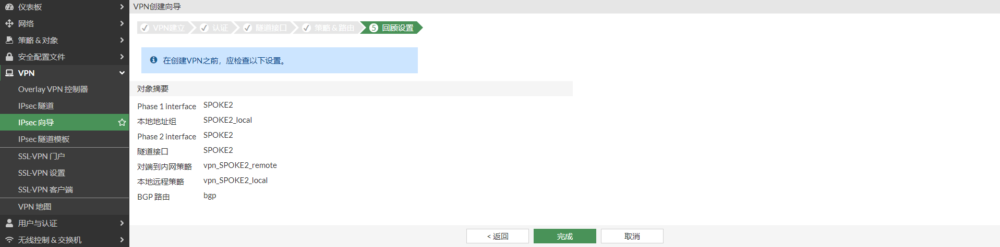

   VPN创建成功。

   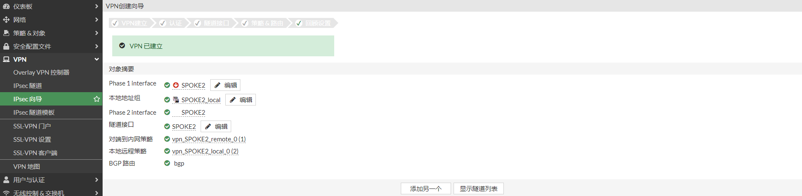

### 查看SPOKE2端IPSEC向导创建的配置

通过“VPN创建向导”可以很方便的配置VPN，但我们需要知道向导具体做了哪些配置。

1. **创建地址对象和地址对象组**

   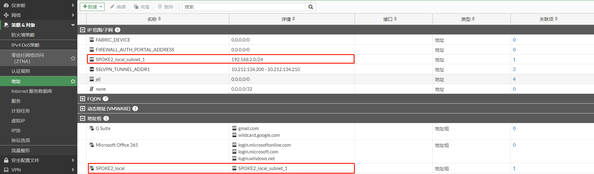

2. **创建VPN**

   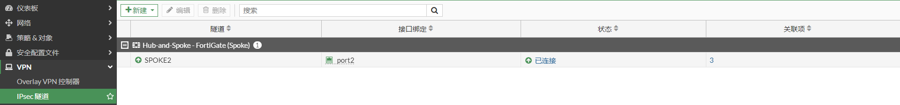

   对应的命令行

   ```
   config vpn ipsec phase1-interface
       edit "SPOKE2"
           set interface "port2"
           set peertype any
           set net-device enable
           set proposal aes128-sha256 aes256-sha256 aes128-sha1 aes256-sha1
           set add-route disable
           set dpd on-idle
           set comments "VPN: SPOKE2 (Created by VPN wizard)"
           set wizard-type spoke-fortigate-auto-discovery
           set auto-discovery-receiver enable
           set remote-gw 100.1.1.2
           set psksecret ENC Hhob5itx47wX/q8zqk2vgdQqbTGPVR3Ks4Bti+eH4AOK/4vS+a1JTnh4IwhyrQ8J8APUDv6ttVJDUV00lROhiXPy3XNqtZR1Vw8mlAv1I3KQTvEWV9/AUZRWRqoEKN8uo98qbPR97LC5NPQ7OIiZYvsh8T5XQhHGzRNiQpL4sSWBRbJDTvKrxarnuJr8UIdzHqO7xA==
       next
   end
   config vpn ipsec phase2-interface
       edit "SPOKE2"
           set phase1name "SPOKE2"
           set proposal aes128-sha1 aes256-sha1 aes128-sha256 aes256-sha256 aes128gcm aes256gcm chacha20poly1305
           set comments "VPN: SPOKE2 (Created by VPN wizard)"
       next
   end
   ```

3. **创建策略**

   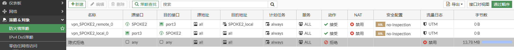

4. **创建VPN接口IP**

   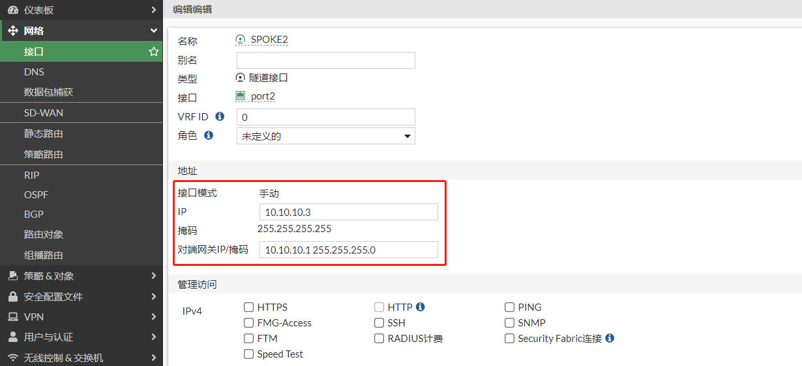

5. **创建BGP**

   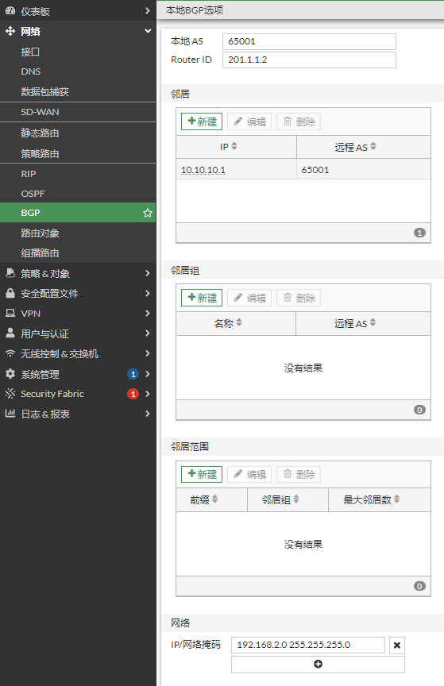

### 针对向导配置的优化建议

1. 在第一阶段中开启DPD周期性检测（每隔10s检测一次Peer状态），实现快速的检测并切换VPN隧道的目的。

   ```
   config vpn ipsec phase1-interface
       edit "VPN-to-SH"
           set dpd on-idle
           set dpd-retrycount 3
           set dpd-retryinterval 10
       next
   end
   ```

2. 开启自动协商，主动让隧道UP起来，而非使用VPN业务的时候再去触发VPN的协商，这样可以减少业务的丢包。在VPN主动发起方开启即可。

   IPSEC VPN阶段一自动协商是默认开启的。

   ```
   config vpn ipsec phase1-interface
       edit "VPN-to-SH"
           set auto-negotiate enable 
       next
   end
   ```

   IPSEC VPN阶段二自动协商默认关闭，需要开启。

   ```
   config vpn ipsec phase2-interface
       edit "VPN-to-SH"
           set auto-negotiate enable
       next
   end
   ```

## 查看VPN和路由状态

1. **HUB端VPN和路由状态**

   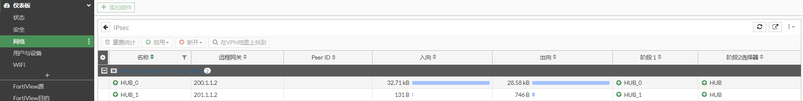

   ```
   # diagnose vpn  ike gateway list 
   
   vd: root/0
   name: HUB_0
   version: 1
   interface: port2 10
   addr: 100.1.1.2:500 -> 200.1.1.2:500
   tun_id: 10.10.10.2/::10.0.0.4
   remote_location: 0.0.0.0
   network-id: 0
   virtual-interface-addr: 10.10.10.1 -> 10.10.10.2
   created: 212s ago
   auto-discovery: 1 sender
   IKE SA: created 1/1  established 1/1  time 0/0/0 ms
   IPsec SA: created 1/2  established 1/2  time 0/0/0 ms
   
     id/spi: 0 1f454ba48eb31ef1/779d7de61a925ba5
     direction: responder
     status: established 212-212s ago = 0ms
     proposal: aes128-sha256
     key: 26b761298dff1684-03a1e6994809ae6d
     lifetime/rekey: 86400/85917
     DPD sent/recv: 00000000/00000000
   
   vd: root/0
   name: HUB_1
   version: 1
   interface: port2 10
   addr: 100.1.1.2:500 -> 201.1.1.2:500
   tun_id: 10.10.10.3/::10.0.0.5
   remote_location: 0.0.0.0
   network-id: 0
   virtual-interface-addr: 10.10.10.1 -> 10.10.10.3
   created: 155s ago
   auto-discovery: 1 sender
   IKE SA: created 1/1  established 1/1  time 0/0/0 ms
   IPsec SA: created 1/2  established 1/2  time 0/0/0 ms
   
     id/spi: 1 4b28344cdc4862a2/c0f31569b4326560
     direction: responder
     status: established 155-155s ago = 0ms
     proposal: aes128-sha256
     key: 5e6660c76dfafef8-062dfbfdc7c83d2d
     lifetime/rekey: 86400/85974
     DPD sent/recv: 00000000/00000008
   
   # diagnose vpn  tunnel list 
   list all ipsec tunnel in vd 0
   ------------------------------------------------------
   name=HUB_0 ver=1 serial=5 100.1.1.2:0->200.1.1.2:0 tun_id=10.10.10.2 tun_id6=::10.0.0.4 dst_mtu=1500 dpd-link=on weight=1
   bound_if=10 lgwy=static/1 tun=intf mode=dial_inst/3 encap=none/8872 options[22a8]=npu rgwy-chg frag-rfc  run_state=0 role=primary accept_traffic=1 overlay_id=0
   
   parent=HUB index=0
   proxyid_num=1 child_num=0 refcnt=5 ilast=0 olast=0 ad=s/1
   stat: rxp=2 txp=482 rxb=32710 txb=34637
   dpd: mode=on-idle on=1 idle=20000ms retry=3 count=0 seqno=1
   natt: mode=none draft=0 interval=0 remote_port=0
   proxyid=HUB proto=0 sa=1 ref=4 serial=1 ads
     src: 0:0.0.0.0-255.255.255.255:0
     dst: 0:0.0.0.0-255.255.255.255:0
     SA:  ref=6 options=a26 type=00 soft=0 mtu=1438 expire=43082/0B replaywin=2048
          seqno=f2 esn=0 replaywin_lastseq=00000002 qat=0 rekey=0 hash_search_len=1
     life: type=01 bytes=0/0 timeout=43186/43200
     dec: spi=9fbaba90 esp=aes key=16 a779f017a79a7e25bebcd73a8729ca4d
          ah=sha1 key=20 032444a21009bb1ed477c1b1c9fff594761031d5
     enc: spi=54b85815 esp=aes key=16 c4dcfc64ac2175b63e9e35198755e4ac
          ah=sha1 key=20 9b19cfd19c928ae8d12de4c6a76a7040e9baf274
     dec:pkts/bytes=2/16392, enc:pkts/bytes=482/47064
     npu_flag=03 npu_rgwy=200.1.1.2 npu_lgwy=100.1.1.2 npu_selid=2 dec_npuid=1 enc_npuid=1
   ------------------------------------------------------
   name=HUB_1 ver=1 serial=6 100.1.1.2:0->201.1.1.2:0 tun_id=10.10.10.3 tun_id6=::10.0.0.5 dst_mtu=1500 dpd-link=on weight=1
   bound_if=10 lgwy=static/1 tun=intf mode=dial_inst/3 encap=none/8872 options[22a8]=npu rgwy-chg frag-rfc  run_state=0 role=primary accept_traffic=1 overlay_id=0
   
   parent=HUB index=1
   proxyid_num=1 child_num=0 refcnt=5 ilast=0 olast=0 ad=s/1
   stat: rxp=2 txp=12 rxb=131 txb=798
   dpd: mode=on-idle on=1 idle=20000ms retry=3 count=0 seqno=2
   natt: mode=none draft=0 interval=0 remote_port=0
   proxyid=HUB proto=0 sa=1 ref=3 serial=1 ads
     src: 0:0.0.0.0-255.255.255.255:0
     dst: 0:0.0.0.0-255.255.255.255:0
     SA:  ref=6 options=a26 type=00 soft=0 mtu=1438 expire=43120/0B replaywin=2048
          seqno=4 esn=0 replaywin_lastseq=00000002 qat=0 rekey=0 hash_search_len=1
     life: type=01 bytes=0/0 timeout=43190/43200
     dec: spi=9fbaba91 esp=aes key=16 2670729ad842dd91c879db020170554b
          ah=sha1 key=20 1b6eb76171659fc431e7ffaed7e90bb9d7daa1fe
     enc: spi=f01e0450 esp=aes key=16 e4ed2f14faac5e5ddf7dec37ac8d6843
          ah=sha1 key=20 12f6d432f0a1ebef51de6e32d811dba066f54741
     dec:pkts/bytes=2/142, enc:pkts/bytes=6/551
     npu_flag=03 npu_rgwy=201.1.1.2 npu_lgwy=100.1.1.2 npu_selid=3 dec_npuid=1 enc_npuid=1
   ------------------------------------------------------
   name=HUB ver=1 serial=4 100.1.1.2:0->0.0.0.0:0 tun_id=10.0.0.2 tun_id6=::10.0.0.2 dst_mtu=0 dpd-link=on weight=1
   bound_if=10 lgwy=static/1 tun=intf mode=dialup/2 encap=none/552 options[0228]=npu frag-rfc  role=primary accept_traffic=1 overlay_id=0
   
   proxyid_num=0 child_num=2 refcnt=4 ilast=42953655 olast=42953655 ad=/0
   stat: rxp=4 txp=494 rxb=32841 txb=35435
   dpd: mode=on-idle on=0 idle=10000ms retry=3 count=0 seqno=0
   natt: mode=none draft=0 interval=0 remote_port=0
   run_tally=0
   ```

   查看路由表

   ```
   # get router info routing-table  all 
   Codes: K - kernel, C - connected, S - static, R - RIP, B - BGP
          O - OSPF, IA - OSPF inter area
          N1 - OSPF NSSA external type 1, N2 - OSPF NSSA external type 2
          E1 - OSPF external type 1, E2 - OSPF external type 2
          i - IS-IS, L1 - IS-IS level-1, L2 - IS-IS level-2, ia - IS-IS inter area
          * - candidate default
   
   Routing table for VRF=0
   S*      0.0.0.0/0 [10/0] via 100.1.1.1, port2, [1/0]
   C       10.10.10.0/24 is directly connected, HUB
   C       10.10.10.1/32 is directly connected, HUB
   C       100.1.1.0/24 is directly connected, port2
   C       192.168.0.0/24 is directly connected, port5
   B       192.168.1.0/24 [200/0] via 10.10.10.2 (recursive is directly connected, HUB), 00:50:01
   B       192.168.2.0/24 [200/0] via 10.10.10.3 (recursive is directly connected, HUB), 00:29:13
   ```

2. **SPOKE1端VPN和路由状态**

   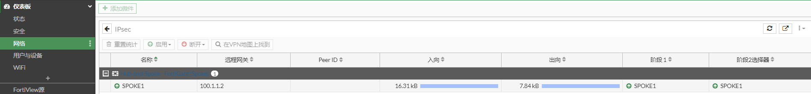

   ```
   # diagnose vpn ike gateway list 
   
   vd: root/0
   name: SPOKE1
   version: 1
   interface: port2 10
   addr: 200.1.1.2:500 -> 100.1.1.2:500
   tun_id: 100.1.1.2/::100.1.1.2
   remote_location: 0.0.0.0
   network-id: 0
   virtual-interface-addr: 10.10.10.2 -> 10.10.10.1
   created: 397s ago
   auto-discovery: 2 receiver
   IKE SA: created 1/1  established 1/1  time 0/0/0 ms
   IPsec SA: created 1/2  established 1/2  time 0/0/0 ms
   
     id/spi: 0 1f454ba48eb31ef1/779d7de61a925ba5
     direction: initiator
     status: established 397-397s ago = 0ms
     proposal: aes128-sha256
     key: 26b761298dff1684-03a1e6994809ae6d
     lifetime/rekey: 86400/85702
     DPD sent/recv: 00000004/00000000
   
   # diagnose vpn  tunnel list 
   list all ipsec tunnel in vd 0
   ------------------------------------------------------
   name=SPOKE1 ver=1 serial=1 200.1.1.2:0->100.1.1.2:0 tun_id=100.1.1.2 tun_id6=::100.1.1.2 dst_mtu=1500 dpd-link=on weight=1
   bound_if=10 lgwy=static/1 tun=intf mode=auto/1 encap=none/568 options[0238]=npu create_dev frag-rfc  role=primary accept_traffic=1 overlay_id=0
   
   proxyid_num=1 child_num=0 refcnt=4 ilast=11 olast=11 ad=r/2
   stat: rxp=2 txp=649 rxb=32678 txb=45413
   dpd: mode=on-idle on=1 idle=10000ms retry=3 count=0 seqno=4
   natt: mode=none draft=0 interval=0 remote_port=0
   proxyid=SPOKE1 proto=0 sa=1 ref=3 serial=2 auto-negotiate adr
     src: 0:0.0.0.0-255.255.255.255:0
     dst: 0:0.0.0.0-255.255.255.255:0
     SA:  ref=6 options=1a227 type=00 soft=0 mtu=1438 expire=42643/0B replaywin=2048
          seqno=1bf esn=0 replaywin_lastseq=00000002 qat=0 rekey=0 hash_search_len=1
     life: type=01 bytes=0/0 timeout=42933/43200
     dec: spi=54b85815 esp=aes key=16 c4dcfc64ac2175b63e9e35198755e4ac
          ah=sha1 key=20 9b19cfd19c928ae8d12de4c6a76a7040e9baf274
     enc: spi=9fbaba90 esp=aes key=16 a779f017a79a7e25bebcd73a8729ca4d
          ah=sha1 key=20 032444a21009bb1ed477c1b1c9fff594761031d5
     dec:pkts/bytes=2/16342, enc:pkts/bytes=892/90448
     npu_flag=03 npu_rgwy=100.1.1.2 npu_lgwy=200.1.1.2 npu_selid=1 dec_npuid=1 enc_npuid=1
   ```

   查看路由表

   ```
   # get router info routing-table  all 
   Codes: K - kernel, C - connected, S - static, R - RIP, B - BGP
          O - OSPF, IA - OSPF inter area
          N1 - OSPF NSSA external type 1, N2 - OSPF NSSA external type 2
          E1 - OSPF external type 1, E2 - OSPF external type 2
          i - IS-IS, L1 - IS-IS level-1, L2 - IS-IS level-2, ia - IS-IS inter area
          * - candidate default
   
   Routing table for VRF=0
   S*      0.0.0.0/0 [5/0] via 200.1.1.1, port2, [1/0]
   S       10.10.10.0/24 [5/0] via SPOKE1 tunnel 100.1.1.2, [1/0]
   S       10.10.10.1/32 [15/0] via SPOKE1 tunnel 100.1.1.2, [1/0]
   C       10.10.10.2/32 is directly connected, SPOKE1
   C       192.168.1.0/24 is directly connected, port5
   C       200.1.1.0/24 is directly connected, port2
   B       192.168.0.0/24 [200/0] via 10.10.10.1 (recursive via SPOKE1 tunnel 100.1.1.2), 00:52:00
   B       192.168.2.0/24 [200/0] via 10.10.10.3 (recursive via SPOKE1 tunnel 100.1.1.2), 00:30:43
   ```

3. **SPOKE2端VPN和路由状态**

   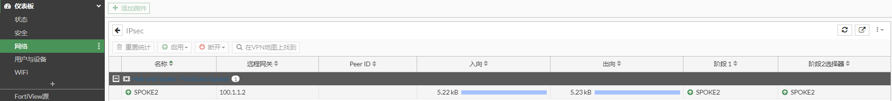

   ```
   # diagnose vpn ike gateway list 
   
   vd: root/0
   name: SPOKE2
   version: 1
   interface: port2 6
   addr: 201.1.1.2:500 -> 100.1.1.2:500
   tun_id: 100.1.1.2/::100.1.1.2
   remote_location: 0.0.0.0
   network-id: 0
   virtual-interface-addr: 10.10.10.3 -> 10.10.10.1
   created: 429s ago
   auto-discovery: 2 receiver
   IKE SA: created 1/1  established 1/1  time 0/0/0 ms
   IPsec SA: created 1/2  established 1/2  time 0/0/0 ms
   
     id/spi: 0 4b28344cdc4862a2/c0f31569b4326560
     direction: initiator
     status: established 429-429s ago = 0ms
     proposal: aes128-sha256
     key: 5e6660c76dfafef8-062dfbfdc7c83d2d
     lifetime/rekey: 86400/85671
     DPD sent/recv: 00000017/00000003
   
   # diagnose vpn tunnel list 
   list all ipsec tunnel in vd 0
   ------------------------------------------------------
   name=SPOKE2 ver=1 serial=2 201.1.1.2:0->100.1.1.2:0 tun_id=100.1.1.2 tun_id6=::100.1.1.2 dst_mtu=1500 dpd-link=on weight=1
   bound_if=6 lgwy=static/1 tun=intf mode=auto/1 encap=none/568 options[0238]=npu create_dev frag-rfc  role=primary accept_traffic=1 overlay_id=0
   
   proxyid_num=1 child_num=0 refcnt=4 ilast=9 olast=9 ad=r/2
   stat: rxp=27 txp=24 rxb=1863 txb=1536
   dpd: mode=on-idle on=1 idle=10000ms retry=3 count=0 seqno=23
   natt: mode=none draft=0 interval=0 remote_port=0
   proxyid=SPOKE2 proto=0 sa=1 ref=3 serial=2 auto-negotiate adr
     src: 0:0.0.0.0-255.255.255.255:0
     dst: 0:0.0.0.0-255.255.255.255:0
     SA:  ref=3 options=1a203 type=00 soft=0 mtu=1438 expire=42552/0B replaywin=2048
          seqno=f esn=0 replaywin_lastseq=00000013 qat=0 rekey=0 hash_search_len=1
     life: type=01 bytes=0/0 timeout=42897/43200
     dec: spi=f01e0450 esp=aes key=16 e4ed2f14faac5e5ddf7dec37ac8d6843
          ah=sha1 key=20 12f6d432f0a1ebef51de6e32d811dba066f54741
     enc: spi=9fbaba91 esp=aes key=16 2670729ad842dd91c879db020170554b
          ah=sha1 key=20 1b6eb76171659fc431e7ffaed7e90bb9d7daa1fe
     dec:pkts/bytes=36/2480, enc:pkts/bytes=28/2653
     npu_flag=00 npu_rgwy=100.1.1.2 npu_lgwy=201.1.1.2 npu_selid=2 dec_npuid=0 enc_npuid=0
   ```

   查看路由表

   ```
   # get router info routing-table all 
   Codes: K - kernel, C - connected, S - static, R - RIP, B - BGP
          O - OSPF, IA - OSPF inter area
          N1 - OSPF NSSA external type 1, N2 - OSPF NSSA external type 2
          E1 - OSPF external type 1, E2 - OSPF external type 2
          i - IS-IS, L1 - IS-IS level-1, L2 - IS-IS level-2, ia - IS-IS inter area
          * - candidate default
   
   Routing table for VRF=0
   S*      0.0.0.0/0 [5/0] via 200.1.1.1, port2, [1/0
   S       10.10.10.0/24 [5/0] via SPOKE2 tunnel 100.1.1.2, [1/0]
   S       10.10.10.1/32 [15/0] via SPOKE2 tunnel 100.1.1.2, [1/0]
   C       10.10.10.3/32 is directly connected, SPOKE2
   C       192.168.2.0/24 is directly connected, port3
   C       200.1.1.0/24 is directly connected, port2
   B       192.168.0.0/24 [200/0] via 10.10.10.1 (recursive via SPOKE2 tunnel 100.1.1.2), 00:34:25
   B       192.168.1.0/24 [200/0] via 10.10.10.2 (recursive via SPOKE2 tunnel 100.1.1.2), 00:34:25
   ```


## 业务测试

1. **SPOKE1端访问HUB**

   ```
   PC2# ifconfig ens224
   ens224: flags=4163<UP,BROADCAST,RUNNING,MULTICAST>  mtu 1500
           inet 192.168.1.10  netmask 255.255.255.0  broadcast 192.168.1.255
           inet6 fe80::1a6c:e61:d2b9:a415  prefixlen 64  scopeid 0x20<link>
           inet6 2001::2  prefixlen 64  scopeid 0x0<global>
           ether 00:0c:29:0e:4e:c5  txqueuelen 1000  (Ethernet)
           RX packets 5904889  bytes 459674552 (438.3 MiB)
           RX errors 0  dropped 58  overruns 0  frame 0
           TX packets 3224540  bytes 205411564402 (191.3 GiB)
           TX errors 0  dropped 0 overruns 0  carrier 0  collisions 0
   
   PC2# ping 192.168.0.10 -c 4
   PING 192.168.0.10 (192.168.0.10) 56(84) bytes of data.
   64 bytes from 192.168.0.10: icmp_seq=1 ttl=62 time=0.746 ms
   64 bytes from 192.168.0.10: icmp_seq=2 ttl=62 time=0.765 ms
   64 bytes from 192.168.0.10: icmp_seq=3 ttl=62 time=0.862 ms
   64 bytes from 192.168.0.10: icmp_seq=4 ttl=62 time=0.677 ms
   
   --- 192.168.0.10 ping statistics ---
   4 packets transmitted, 4 received, 0% packet loss, time 2999ms
   rtt min/avg/max/mdev = 0.677/0.762/0.862/0.071 ms
   ```

2. **SPOKE2端访问HUB**

   ```
   PC3# ifconfig ens224
   ens224: flags=4163<UP,BROADCAST,RUNNING,MULTICAST>  mtu 1500
           inet 192.168.2.10  netmask 255.255.255.0  broadcast 192.168.2.255
           inet6 fe80::2652:4dd7:5d0e:941d  prefixlen 64  scopeid 0x20<link>
           inet6 240e:604:109:39::216  prefixlen 64  scopeid 0x0<global>
           ether 00:0c:29:37:f0:ac  txqueuelen 1000  (Ethernet)
           RX packets 9638867  bytes 205844622412 (191.7 GiB)
           RX errors 0  dropped 118  overruns 0  frame 0
           TX packets 5737914  bytes 378901312 (361.3 MiB)
           TX errors 0  dropped 0 overruns 0  carrier 0  collisions 0
   
   PC3# ping 192.168.0.10 -c 4
   PING 192.168.0.10 (192.168.0.10) 56(84) bytes of data.
   64 bytes from 192.168.0.10: icmp_seq=1 ttl=62 time=0.848 ms
   64 bytes from 192.168.0.10: icmp_seq=2 ttl=62 time=0.935 ms
   64 bytes from 192.168.0.10: icmp_seq=3 ttl=62 time=0.899 ms
   64 bytes from 192.168.0.10: icmp_seq=4 ttl=62 time=1.04 ms
   
   --- 192.168.0.10 ping statistics ---
   4 packets transmitted, 4 received, 0% packet loss, time 3002ms
   rtt min/avg/max/mdev = 0.848/0.931/1.045/0.081 ms
   ```


3. **SPOKE之间访问**

   ```
   PC2# ifconfig ens224
   ens224: flags=4163<UP,BROADCAST,RUNNING,MULTICAST>  mtu 1500
           inet 192.168.1.10  netmask 255.255.255.0  broadcast 192.168.1.255
           inet6 fe80::1a6c:e61:d2b9:a415  prefixlen 64  scopeid 0x20<link>
           inet6 2001::2  prefixlen 64  scopeid 0x0<global>
           ether 00:0c:29:0e:4e:c5  txqueuelen 1000  (Ethernet)
           RX packets 5908666  bytes 460902918 (439.5 MiB)
           RX errors 0  dropped 58  overruns 0  frame 0
           TX packets 3225276  bytes 205411619294 (191.3 GiB)
           TX errors 0  dropped 0 overruns 0  carrier 0  collisions 0
   
   SPOKE1访问SPOKE2
   PC2# ping 192.168.2.10 -c 4
   PING 192.168.2.10 (192.168.2.10) 56(84) bytes of data.
   64 bytes from 192.168.2.10: icmp_seq=1 ttl=61 time=1.27 ms
   64 bytes from 192.168.2.10: icmp_seq=3 ttl=62 time=0.925 ms
   64 bytes from 192.168.2.10: icmp_seq=4 ttl=62 time=0.812 ms
   
   --- 192.168.2.10 ping statistics ---
   4 packets transmitted, 3 received, 25% packet loss, time 3002ms
   rtt min/avg/max/mdev = 0.812/1.004/1.276/0.199 ms
   ```
   
   SPOKE之间访问时，会触发SPOKE之间创建单独的VPN。
   
   在SPOKE1上查看与SPOKE2之间的VPN和路由。
   
   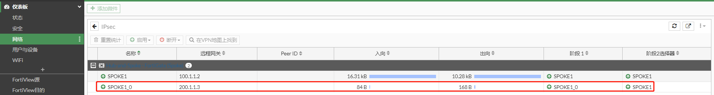
   
   ```
   # diagnose vpn ike gateway list name SPOKE1_0
   
   vd: root/0
   name: SPOKE1_0
   version: 1
   interface: port2 10
   addr: 200.1.1.2:500 -> 201.1.1.2:500
   tun_id: 201.1.1.2/::201.1.1.2
   remote_location: 0.0.0.0
   network-id: 0
   virtual-interface-addr: 10.10.10.2 -> 10.10.10.3
   created: 30s ago
   auto-discovery: 2 receiver
   IKE SA: created 1/1  established 1/1  time 0/0/0 ms
   IPsec SA: created 1/1  established 1/1  time 0/0/0 ms
   
     id/spi: 2 c9a21426384683c3/9ec0d3e19cd425e1
     direction: initiator
     status: established 30-30s ago = 0ms
     proposal: aes128-sha256
     key: 8caa0db523816e6c-c1c1d43ab5961a5a
     lifetime/rekey: 86400/86069
     DPD sent/recv: 00000003/00000000
   
   # diagnose vpn tunnel list name SPOKE1_0
   list ipsec tunnel by names in vd 0
   ------------------------------------------------------
   name=SPOKE1_0 ver=1 serial=3 200.1.1.2:0->201.1.1.2:0 tun_id=201.1.1.2 tun_id6=::201.1.1.2 dst_mtu=1500 dpd-link=on weight=1
   bound_if=10 lgwy=static/1 tun=intf mode=dial_inst/3 encap=none/760 options[02f8]=npu create_dev no-sysctl rgwy-chg frag-rfc  role=primary accept_traffic=1 overlay_id=0
   
   parent=SPOKE1 index=0
   proxyid_num=1 child_num=0 refcnt=6 ilast=2 olast=2 ad=r/2
   stat: rxp=1 txp=2 rxb=84 txb=168
   dpd: mode=on-idle on=1 idle=10000ms retry=3 count=0 seqno=4
   natt: mode=none draft=0 interval=0 remote_port=0
   proxyid=SPOKE1 proto=0 sa=1 ref=3 serial=1 auto-negotiate adr
     src: 0:0.0.0.0-255.255.255.255:0
     dst: 0:0.0.0.0-255.255.255.255:0
     SA:  ref=6 options=1a227 type=00 soft=0 mtu=1438 expire=42855/0B replaywin=2048
          seqno=3 esn=0 replaywin_lastseq=00000002 qat=0 rekey=0 hash_search_len=1
     life: type=01 bytes=0/0 timeout=42897/43200
     dec: spi=54b85816 esp=aes key=16 0478ea93933324f29cf01524e7d28ec4
          ah=sha1 key=20 5fb7754757facf499e85b1bdb314520d3cf10faa
     enc: spi=f01e0451 esp=aes key=16 183a97d565d45c86096969afeacd60ec
          ah=sha1 key=20 7f1cf1f622146d60453f68f35ed9804ab4566d46
     dec:pkts/bytes=2/168, enc:pkts/bytes=4/472
     npu_flag=03 npu_rgwy=201.1.1.2 npu_lgwy=200.1.1.2 npu_selid=3 dec_npuid=1 enc_npuid=1
     
     # get router info routing-table  all 
   Codes: K - kernel, C - connected, S - static, R - RIP, B - BGP
          O - OSPF, IA - OSPF inter area
          N1 - OSPF NSSA external type 1, N2 - OSPF NSSA external type 2
          E1 - OSPF external type 1, E2 - OSPF external type 2
          i - IS-IS, L1 - IS-IS level-1, L2 - IS-IS level-2, ia - IS-IS inter area
          * - candidate default
   
   Routing table for VRF=0
   S*      0.0.0.0/0 [5/0] via 200.1.1.1, port2, [1/0]
   S       10.10.10.0/24 [5/0] via SPOKE1 tunnel 100.1.1.2, [1/0]
   S       10.10.10.1/32 [15/0] via SPOKE1 tunnel 100.1.1.2, [1/0]
   C       10.10.10.2/32 is directly connected, SPOKE1
                         is directly connected, SPOKE1_0
   C       10.10.10.3/32 is directly connected, SPOKE1_0
   B       192.168.0.0/24 [200/0] via 10.10.10.1 (recursive via SPOKE1 tunnel 100.1.1.2), 00:07:22
   B       192.168.2.0/24 [200/0] via 10.10.10.3 (recursive is directly connected, SPOKE1_0), 00:00:26
   C       200.1.1.0/24 is directly connected, port2
   C       192.168.1.0/24 is directly connected, port5
   ```
   
   在SPOKE2上查看与SPOKE1之间的VPN。
   
   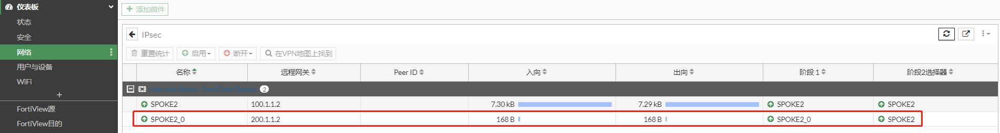
   
   ```
   # diagnose vpn ike gateway list name SPOKE2_0
   
   vd: root/0
   name: SPOKE2_0
   version: 1
   interface: port2 6
   addr: 201.1.1.2:500 -> 200.1.1.2:500
   tun_id: 10.10.10.2/::10.0.0.1
   remote_location: 0.0.0.0
   network-id: 0
   virtual-interface-addr: 10.10.10.3 -> 10.10.10.2
   created: 150s ago
   auto-discovery: 2 receiver
   IKE SA: created 1/1  established 1/1  time 0/0/0 ms
   IPsec SA: created 1/1  established 1/1  time 0/0/0 ms
   
     id/spi: 2 c9a21426384683c3/9ec0d3e19cd425e1
     direction: responder
     status: established 150-150s ago = 0ms
     proposal: aes128-sha256
     key: 8caa0db523816e6c-c1c1d43ab5961a5a
     lifetime/rekey: 86400/85979
     DPD sent/recv: 00000000/0000000f
   
   # diagnose vpn  tunnel list name SPOKE2_0
   list ipsec tunnel by names in vd 0
   ------------------------------------------------------
   name=SPOKE2_0 ver=1 serial=3 201.1.1.2:0->200.1.1.2:0 tun_id=10.10.10.2 tun_id6=::10.0.0.1 dst_mtu=1500 dpd-link=on weight=1
   bound_if=6 lgwy=static/1 tun=intf mode=dial_inst/3 encap=none/760 options[02f8]=npu create_dev no-sysctl rgwy-chg frag-rfc  role=primary accept_traffic=1 overlay_id=0
   
   parent=SPOKE2 index=0
   proxyid_num=1 child_num=0 refcnt=6 ilast=6 olast=6 ad=r/2
   stat: rxp=2 txp=2 rxb=168 txb=168
   dpd: mode=on-idle on=1 idle=10000ms retry=3 count=0 seqno=1
   natt: mode=none draft=0 interval=0 remote_port=0
   proxyid=SPOKE2 proto=0 sa=1 ref=2 serial=1 auto-negotiate adr
     src: 0:0.0.0.0-255.255.255.255:0
     dst: 0:0.0.0.0-255.255.255.255:0
     SA:  ref=3 options=1a203 type=00 soft=0 mtu=1438 expire=43034/0B replaywin=2048
          seqno=3 esn=0 replaywin_lastseq=00000003 qat=0 rekey=0 hash_search_len=1
     life: type=01 bytes=0/0 timeout=43191/43200
     dec: spi=f01e0451 esp=aes key=16 183a97d565d45c86096969afeacd60ec
          ah=sha1 key=20 7f1cf1f622146d60453f68f35ed9804ab4566d46
     enc: spi=54b85816 esp=aes key=16 0478ea93933324f29cf01524e7d28ec4
          ah=sha1 key=20 5fb7754757facf499e85b1bdb314520d3cf10faa
     dec:pkts/bytes=4/336, enc:pkts/bytes=4/472
     npu_flag=00 npu_rgwy=200.1.1.2 npu_lgwy=201.1.1.2 npu_selid=3 dec_npuid=0 enc_npuid=0
   
   # get router info routing-table  all 
   Codes: K - kernel, C - connected, S - static, R - RIP, B - BGP
          O - OSPF, IA - OSPF inter area
          N1 - OSPF NSSA external type 1, N2 - OSPF NSSA external type 2
          E1 - OSPF external type 1, E2 - OSPF external type 2
          i - IS-IS, L1 - IS-IS level-1, L2 - IS-IS level-2, ia - IS-IS inter area
          * - candidate default
   
   Routing table for VRF=0
   S*      0.0.0.0/0 [5/0] via 201.1.1.1, port2, [1/0]
   S       10.10.10.0/24 [5/0] via SPOKE2 tunnel 100.1.1.2, [1/0]
   S       10.10.10.1/32 [15/0] via SPOKE2 tunnel 100.1.1.2, [1/0]
   C       10.10.10.2/32 is directly connected, SPOKE2_0
   C       10.10.10.3/32 is directly connected, SPOKE2
                         is directly connected, SPOKE2_0
   B       192.168.0.0/24 [200/0] via 10.10.10.1 (recursive via SPOKE2 tunnel 100.1.1.2), 00:13:13
   B       192.168.1.0/24 [200/0] via 10.10.10.2 (recursive is directly connected, SPOKE2_0), 00:01:48
   C       192.168.2.0/24 is directly connected, port3
   C       201.1.1.0/24 is directly connected, port2
   ```
   
   


