# FortiClient客户端-VPN拨号模式

## 组网需求

某公司内部有一台OA服务器，在外移动办公的工作人员需要通过IPSEC VPN拨入到公司内网来对内网服OA服务器进行访问。

## 网络拓扑

PC---------------Internet-------------(port2:100.1.1.2)FGT-BJ(port5:192.168.0.1/24)-----------OA Server(192.168.0.10)

## 配置步骤

### 配置IPSec

1. **基本配置**

   配置接口IP和路由

   

   

2. **创建用户**

   选择“用户与认证”-->“设置用户”，点击“新建”。

   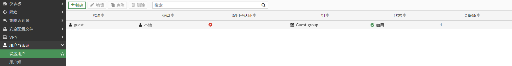

   选择“本地用户”，点击“下一步”。

   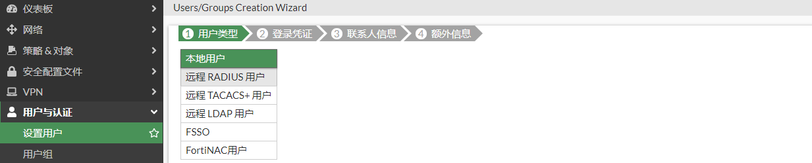

   输入用户名和密码，点击“下一步”。

   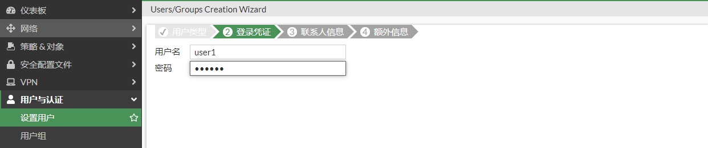

   可根据需求选择启用。这里不启用，点击“下一步”。

   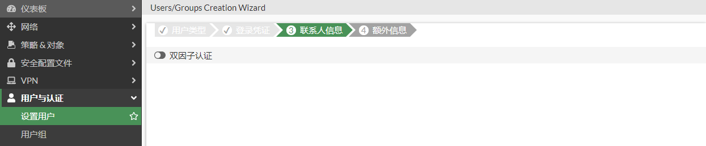

   点击“提交”。

   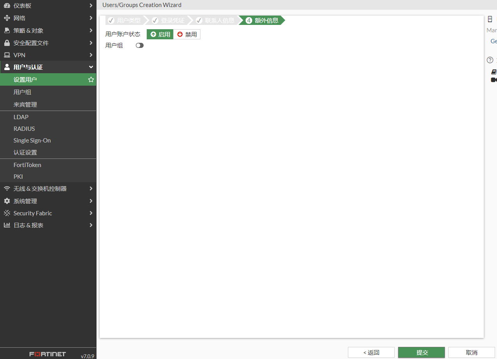

   完成用户创建。

   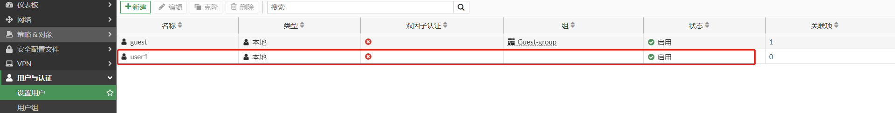

3. **创建用户组**

   选择“用户与认证”-->“用户组”，点击“新建”。

   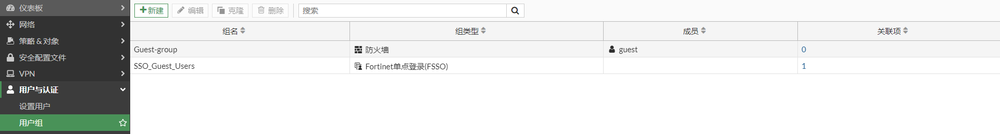

   输入名称，即组名，并将用户加入用户组，点击“确认”。

   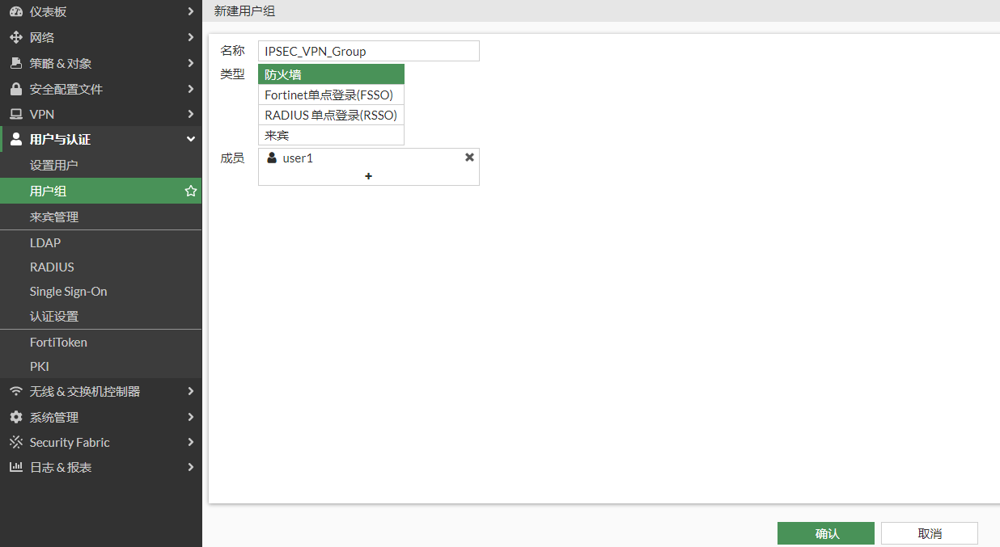

   完成用户组创建。

   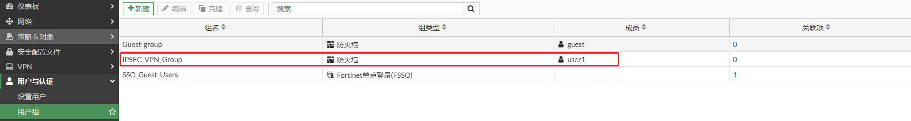

4. **创建子网**

   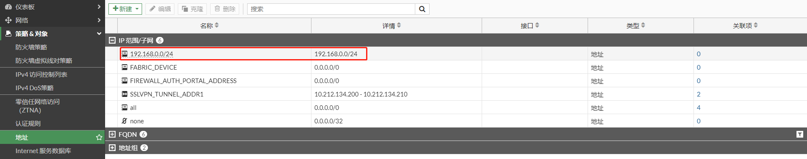

5. **配置IPSEC VPN**

   选择“VPN”-->“IPsec隧道”，点击“新建”，选择“IPsec隧道”。

   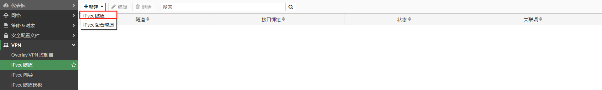

   根据“VPN创建向导”进行VPN模板配置，输入名称，选择”远程接“-->"基于客户端"-->“FortiClient”，并点击下一步。

   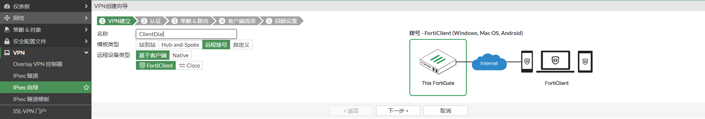

   选择对外的接口，设置预共享秘钥和用户组，并点击下一步。

   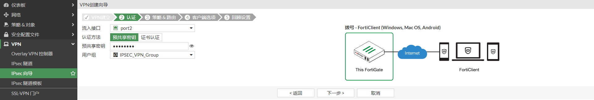

   输入内网接口，允许访问的本地地址段，客户端拨号后获取的地址范围，并点击下一步。

   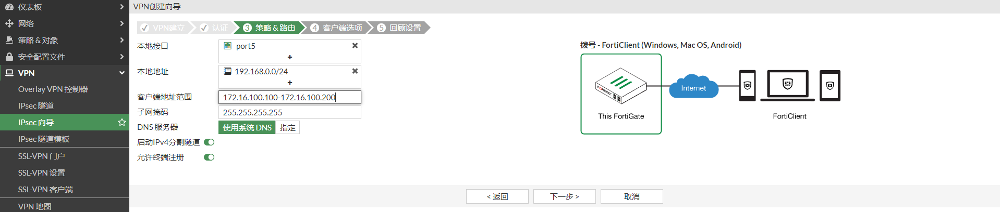

   保存密码，FortiClient第一次拨号成功后，FortiClient会显示“保存密码”的选项，默认勾选。

   自动连接，FortiClient第一次拨号成功后，FortiClient会显示“自动连接”的选项，该功能是运行FortiClient会拨入该IPSEC VPN。

   保持存活，FortiClient第一次拨号成功后，FortiClient会显示“保持连接”的选项，该功能是IPSEC VPN由于网络原因中断后，会自动重拨。

   免费的FortiClient版本不支持自动连接和保持连接，需要完整版的FortiClient，需要购买EMS license。

   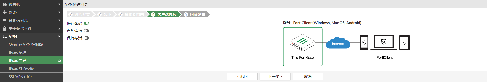

   VPN创建向导提示即将创建的内容，然后点击完成。

   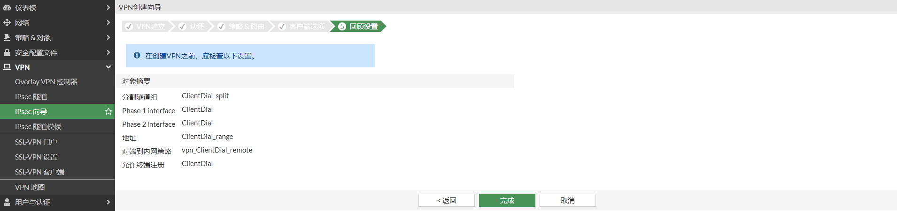

   VPN创建成功。

   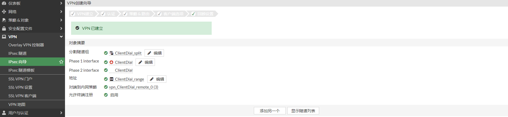


### 查看IPSEC向导创建的配置

通过“VPN创建向导”可以很方便的配置VPN，但我们需要知道向导具体做了哪些配置。

1. **创建地址对象和地址对象组。**

   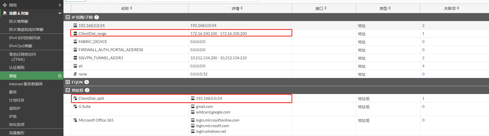

2. **创建IPSEC VPN**

   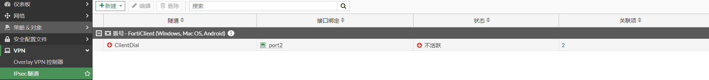

   对应的命令行

   ```
   config vpn ipsec phase1-interface
       edit "ClientDial"
           set type dynamic
           set interface "port2"
           set mode aggressive
           set peertype any
           set net-device disable
           set mode-cfg enable
           set proposal aes128-sha256 aes256-sha256 aes128-sha1 aes256-sha1
           set comments "VPN: ClientDial (Created by VPN wizard)"
           set wizard-type dialup-forticlient
           set xauthtype auto
           set authusrgrp "IPSEC_VPN_Group"
           set ipv4-start-ip 172.16.100.100
           set ipv4-end-ip 172.16.100.200
           set dns-mode auto
           set ipv4-split-include "ClientDial_split"
           set save-password enable
           set psksecret ENC cTt0jnn1i1wx0Elky0oa0pRS3I7Kb8UAUHRndju/6cI7nbcQ1IBcmXqdj9aJXjE/ZNUZgElJLwKARXoP3iJPBAkWJaYtQrEC+XfZC2QGr/Xsw72UQSL0Rll8wIKAk7vPDIQXbn/eQSYPs7CH+2r64HiKJ91+zt3LzAlASNooXPKea8EK7f9qaUTfj/p/kxqrk9aN6A==
       next
   end
   
   config vpn ipsec phase2-interface
       edit "ClientDial"
           set phase1name "ClientDial"
           set proposal aes128-sha1 aes256-sha1 aes128-sha256 aes256-sha256 aes128gcm aes256gcm chacha20poly1305
           set comments "VPN: ClientDial (Created by VPN wizard)"
       next
   end
   ```

2. **创建策略。**

   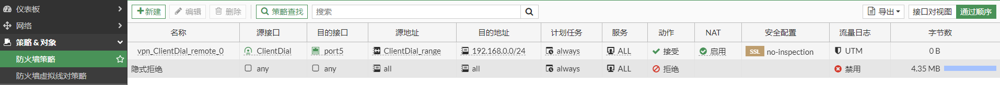

### 配置FortClient

1. 选择“Remote Access”，点击“配置VPN”。

   

2. 输入连接名，远程网关，共享秘钥，以及用户名，然后点击“保存”。

   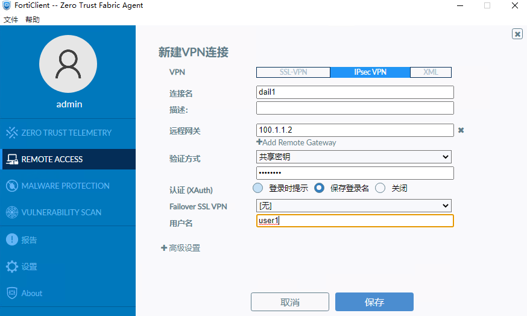

   在”高级设置“有更多的选项，如ike版本，IKE阶段一和阶段二的加密集等，可以根据FortiGate的设置做对应的修改。

   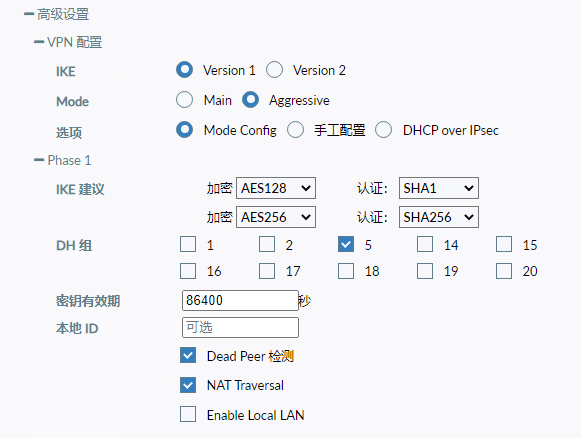

   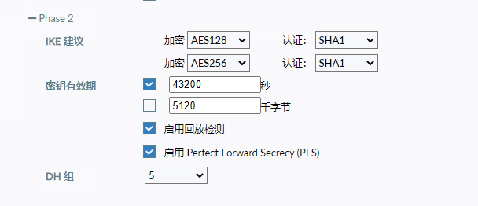

   3. VPN配置完成

      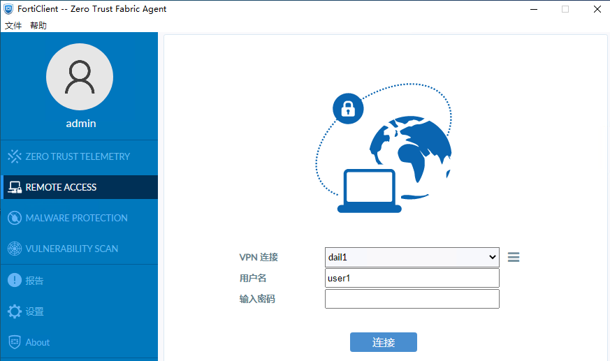

   

## FortClient拨号测试

1. 在FortiClient中输入账号密码，点击“连接”，FortiClient拨号成功。

   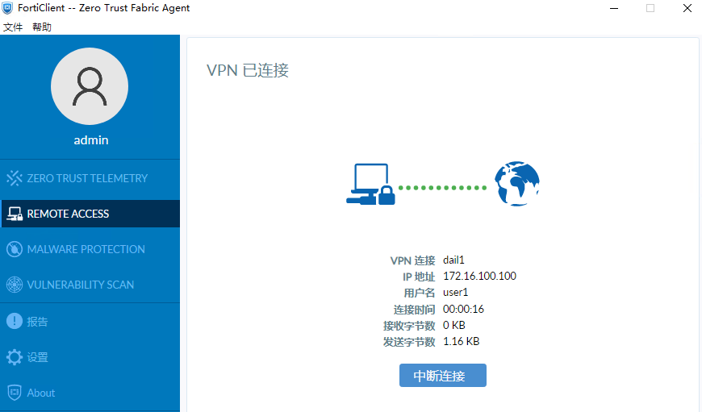

2. 查看终端路由表，192.168.0.0/24指向IPSEC VPN，并能成功访问OA Server。

   

   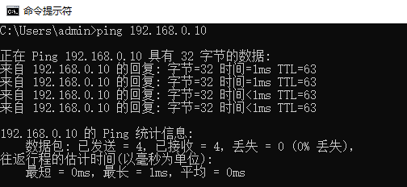

3. FortiGate查看client连接。

   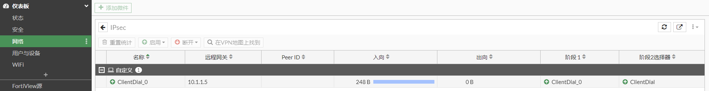

4. 点击“中断连接”，FortiClient就会显示“保存密码”选项。

   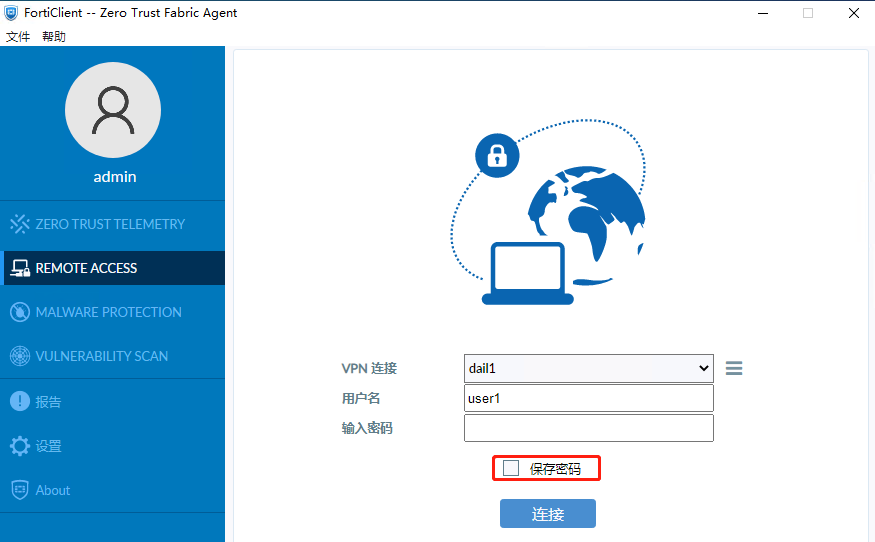

