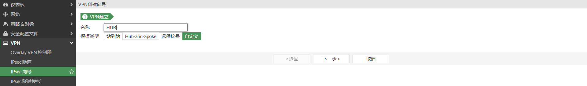
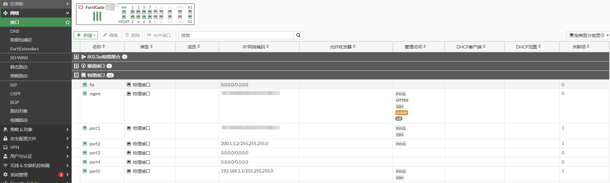
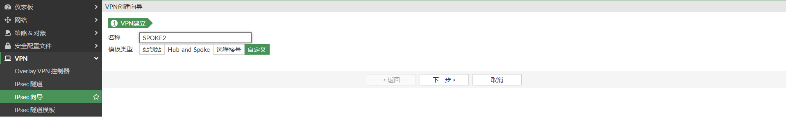

# HUB-and-SPOKE模式

## **组网需求**

某公司总部内部有一台OA服务器，其余分2个支机构都需要通过vpn拨入总部内网对OA服务器进行访问，为了方便配置，总部不想有太多的配置，总部只建立一条vpn隧道，实现所有分支机构和总部的通讯，SPOKE之间的流量通过HUB进行中转。

## 网络拓扑

```
PC1-----------(port5:192.168.0.1/24)HUB(port2:100.1.1.2)-------------Internet-------------(port2:200.1.1.2)SPOKE1(port5:192.168.1.1/24)-----------PC2
                                                                         |-----------------(port2:201.1.1.2)SPOKE2(port3:192.168.2.1/24)-----------PC3
```

## 配置步骤

### **HUB配置**

1. **基本配置**

   配置接口IP和路由

   

   

2. **配置IPSEC VPN**

   **总部（HUB）IPsec VPN配置说明：**

   - HUB使用动态拨号的VPN方式。
     因为分支可能来自任意地方的IP，另外分支可能使用PPPOE拨号，公网IP随时会变更，因此没有办法确认对方的公网IP，只能动态拨号方式的IPsec VPN。

   - HUB使用主模式。

     其实使用主模式或野蛮模式二者都是可以的，如果只有一条动态拨号的IPsec VPN，不存在多条动态IPsec VPN的情况下（因为动态VPN的目的IP为0.0.0.0，存在多条动态的IPsec VPN会导致冲突，必须使用Peer ID来区分彼此），可以简单的直接使用主模式，接收Peer ID为any即可，当然使用野蛮模式的接受任意的Peer ID 也是OK的，只要hub和spoke之间使用相同的模式即可，双方通过预共享密钥来认证对方的身份。综上，一条动态拨号VPN的场景下我们HUB选择最简单的主动模式+任意Peer ID+预共享密钥。这种选择优势是在SPOKE看来感觉就像是建立一个很普通的LAN-TO-LAN的IPsec VPN。

   - HUB第二阶段感兴趣流保持默认的0.0.0.0/0.0.0.0 <--> 0.0.0.0/0.0.0.0。

     由于HUB是被动的接受SPOKE的协商，在没有协商之前你不可能知道SPOKE的具体网段/感兴趣流，其实HUB都不知道谁要来连接自己（目的IP为0.0.0.0），同理HUB也没有办法配置明细的感兴趣流，只能被动的接收SPOKE的感兴趣流，HUB保持默认0.0.0.0/0.0.0.0 <--> 0.0.0.0/0.0.0.0的感兴趣流，会产生这样这样一个效果：自动学习分支的感兴趣流，同时自动产生反向的去往感兴趣流的回程静态路由。而SPOKE端是一定需要配置明细的感兴趣流的，SPOKE一定不能配置成0.0.0.0/0.0.0.0，否则HUB端就无法通过自动学习而得知SPOKE端的内网网段（感兴趣流），这样VPN业务就没有办法通信了。

   创建IPSEC VPN。

   

   IPSEC VPN阶段一配置。

   

   IPSEC VPN阶段二配置。

   

   VPN创建完成。

   

   对应的命令行

   ```
   config vpn ipsec phase1-interface
       edit "HUB"
           set type dynamic
           set interface "port2"
           set peertype any
           set net-device disable
           set proposal aes128-sha256 aes256-sha256 aes128-sha1 aes256-sha1
           set dpd on-idle
           set psksecret ENC o00sB0EFtnTN9mJd5/xShv4v22vbn3NpgGIepVJSXGup1iQ++HB0zjDaOuj8jIyKjxZ3yhYqjtQXL9HJ5aoTQ4rlVRiBlw7jcxbSB8lzbU0As8YhUob3Z6T2StvFeRC1VUDac8wmjsPbkUkOq0YlRZ22DoQMe2t+lG6orUAgDlY6iko6mlodLfmMiRxOFNIASP5UNg==
           set dpd-retryinterval 10
       next
   end
   config vpn ipsec phase2-interface
       edit "HUB"
           set phase1name "HUB"
           set proposal aes128-sha1 aes256-sha1 aes128-sha256 aes256-sha256 aes128gcm aes256gcm chacha20poly1305
           set keepalive enable
       next
   end
   ```

3. **配置策略**

   创建3条策略，从上到下分别是：分支到总部的放通策略；总部到分支的放通策略；分支到分支的放通策略。

   

### SPOKE1配置

1. **基本配置**

   

   

2. **配置IPSEC VPN**

   创建IPSEC VPN。

   

   IPSEC VPN阶段一配置

   

   IPSEC VPN阶段二配置。

   SPOKE1的第二阶段感兴趣流一定要填写明细感兴趣流，将自己的业务网段告知HUB，以便HUB可以动态学习到SPOKE这端的业务网段感兴趣流和路由。SPOKE1的感兴趣流可以写成 192.168.1.0/24 <---> 192.168.0.0/16 的汇总感兴趣流（HUB和其他SPOKE的业务网段汇总为192.168.0.0/16），或者简单的使用192.168.1.0/24 <---> 0.0.0.0/0都可以。实际什么样的流量走IPsec VPN隧道是通过路由决定的，因此目的网段写成192.168.0.0/16和0.0.0.0/0.0.0.0在第二阶段中并不重要，都是可以的。

   

   VPN创建完成。

   

   对应的命令行

   ```
   config vpn ipsec phase1-interface
       edit "SPOKE1"
           set interface "port2"
           set peertype any
           set net-device disable
           set proposal aes128-sha256 aes256-sha256 aes128-sha1 aes256-sha1
           set dpd on-idle
           set remote-gw 100.1.1.2
           set psksecret ENC /nQqtlGc19JE/tKd0G4lHD1r7279qcDTpVAlNPW1djHDvxMhIuZctGGr1lw1l/Odi3WkvMrhEDydpVxEtvSWPBUp2+pbhB8fXowEkkoYtaGvvmA0ohj+Bk7NOETHZKUQw9D7b8ibhF5HjbbEphvWb6QwDgI+pjwhp56AZp6sF05L3RLR2nLMEqJKCf6CBog5Se/MbA==
           set dpd-retryinterval 10
       next
   end
   config vpn ipsec phase2-interface
       edit "SPOKE1"
           set phase1name "SPOKE1"
           set proposal aes128-sha1 aes256-sha1 aes128-sha256 aes256-sha256 aes128gcm aes256gcm chacha20poly1305
           set auto-negotiate enable
           set src-subnet 192.168.1.0 255.255.255.0
       next
   end
   ```

3. **配置路由**

   这里路由的目标是192.168.0.0/16，是HUB和其他SPOKE的业务网段汇总（分支之间没有单独建立VPN，从HUB互通）。如果只需要访问总部，则写总部的明细网段即可，即192.168.0.0/24。

   管理距离为254的黑洞路由是为了VPN中断的时候防止产生错误的NAT会话。

   

4. **配置策略**

   由于SPOKE1开启了自动连接，当配置策略后，就会主动与HUB协商，策略中的接口已经是绿色的，说明VPN接口已经UP。

   

### SPOKE2配置

1. **基本配置**

   

   

2. **配置IPSEC VPN**

   创建IPSEC VPN。

   

   IPSEC VPN阶段一配置

   

   IPSEC VPN阶段二配置。

   SPOKE2的第二阶段感兴趣流一定要填写明细感兴趣流，将自己的业务网段告知HUB，以便HUB可以动态学习到SPOKE这端的业务网段感兴趣流和路由。SPOKE2的感兴趣流可以写成 192.168.2.0/24 <---> 192.168.0.0/16 的汇总感兴趣流（HUB和其他SPOKE的业务网段汇总为192.168.0.0/16），或者简单的使用192.168.2.0/24 <---> 0.0.0.0/0都可以。实际什么样的流量走IPsec VPN隧道是通过路由决定的，因此目的网段写成192.168.0.0/16和0.0.0.0/0.0.0.0在第二阶段中并不重要，都是可以的。

   

   完成VPN创建。

   

   对应的命令行

   ```
   config vpn ipsec phase1-interface
       edit "SPOKE2"
           set interface "port2"
           set peertype any
           set net-device disable
           set proposal aes128-sha256 aes256-sha256 aes128-sha1 aes256-sha1
           set dpd on-idle
           set remote-gw 100.1.1.2
           set psksecret ENC tW+gF8+AfteBwl7HXJwMXlNTH3LGBMv0D0d1krXTNETF4/AFPUWOQvD96qoK7aQNOGOben9RUCqQ7BX2GT9lisno5ilp1zp1HlFaqkTe2l6BPL3rM1BLMVYF7kCW/ozSPHSXU14OIlZ+sNQioiskUhMk7RFHbkXALqDBDVMIIfM/odiP+kpHZmya3+mQDDYCjnEA3Q==
           set dpd-retryinterval 10
       next
   end
   config vpn ipsec phase2-interface
       edit "SPOKE2"
           set phase1name "SPOKE2"
           set proposal aes128-sha1 aes256-sha1 aes128-sha256 aes256-sha256 aes128gcm aes256gcm chacha20poly1305
           set auto-negotiate enable
           set src-subnet 192.168.2.0 255.255.255.0
       next
   end
   ```

3. **配置路由**

   这里路由的目标是192.168.0.0/16，是HUB和其他SPOKE的业务网段汇总（分支之间没有单独建立VPN，从HUB互通）。如果只需要访问总部，则写总部的明细网段即可，即192.168.0.0/24。

   管理距离为254的黑洞路由是为了VPN中断的时候防止产生错误的NAT会话。

   

4. **配置策略**

   由于SPOKE2开启了自动连接，当配置策略后，就会主动与HUB协商，策略中的接口已经是绿色的，说明VPN接口已经UP。

   

## 查看VPN状态

1. **HUB端VPN状态**

   

   ```
   # diagnose vpn  ike gateway list 
   
   vd: root/0
   name: HUB_0
   version: 1
   interface: port2 10
   addr: 100.1.1.2:500 -> 200.1.1.2:500
   tun_id: 200.1.1.2/::10.0.0.38
   remote_location: 0.0.0.0
   network-id: 0
   created: 222s ago
   IKE SA: created 1/1  established 1/1  time 0/0/0 ms
   IPsec SA: created 1/1  established 1/1  time 0/0/0 ms
   
     id/spi: 5 9e99b894d5de25e7/f6f50471f8504b5c
     direction: responder
     status: established 222-222s ago = 0ms
     proposal: aes128-sha256
     key: 12b4b577207df3b1-72d0c8ab630bca42
     lifetime/rekey: 86400/85907
     DPD sent/recv: 00000017/00000000
   
   vd: root/0
   name: HUB_1
   version: 1
   interface: port2 10
   addr: 100.1.1.2:500 -> 201.1.1.2:500
   tun_id: 201.1.1.2/::10.0.0.39
   remote_location: 0.0.0.0
   network-id: 0
   created: 115s ago
   IKE SA: created 1/1  established 1/1  time 0/0/0 ms
   IPsec SA: created 1/1  established 1/1  time 0/0/0 ms
   
     id/spi: 6 61a95053c4a2a7bc/283be8ae94d730cc
     direction: responder
     status: established 115-115s ago = 0ms
     proposal: aes128-sha256
     key: 29af7f5a8312e219-5b96fb7006b7bab6
     lifetime/rekey: 86400/86014
     DPD sent/recv: 0000000a/00000005
   
   # diagnose vpn  tunnel list 
   list all ipsec tunnel in vd 0
   ------------------------------------------------------
   name=HUB_0 ver=1 serial=41 100.1.1.2:0->200.1.1.2:0 tun_id=200.1.1.2 tun_id6=::10.0.0.38 dst_mtu=1500 dpd-link=on weight=1
   bound_if=10 lgwy=static/1 tun=intf mode=dial_inst/3 encap=none/8872 options[22a8]=npu rgwy-chg frag-rfc  run_state=0 role=primary accept_traffic=1 overlay_id=0
   
   parent=HUB index=0
   proxyid_num=1 child_num=0 refcnt=5 ilast=4 olast=4 ad=/0
   stat: rxp=0 txp=0 rxb=0 txb=0
   dpd: mode=on-idle on=1 idle=10000ms retry=3 count=0 seqno=23
   natt: mode=none draft=0 interval=0 remote_port=0
   proxyid=HUB proto=0 sa=1 ref=2 serial=1 add-route
     src: 0:0.0.0.0-255.255.255.255:0
     dst: 0:192.168.1.0-192.168.1.255:0
     SA:  ref=3 options=2a6 type=00 soft=0 mtu=1438 expire=42969/0B replaywin=2048
          seqno=1 esn=0 replaywin_lastseq=00000000 qat=0 rekey=0 hash_search_len=1
     life: type=01 bytes=0/0 timeout=43191/43200
     dec: spi=14b71563 esp=aes key=16 8c3637326e7c38dbefc9bac5333125ca
          ah=sha1 key=20 a8fe40c940d8f4321d72ff9f0b0018c5b52d4f1e
     enc: spi=bcdbb5b1 esp=aes key=16 d24189aae387a6a13930e4998c7fc653
          ah=sha1 key=20 58cbd4a72ea1ad459c322ab483fe0c78f483c170
     dec:pkts/bytes=0/0, enc:pkts/bytes=0/0
     npu_flag=00 npu_rgwy=200.1.1.2 npu_lgwy=100.1.1.2 npu_selid=3e dec_npuid=0 enc_npuid=0
   ------------------------------------------------------
   name=HUB_1 ver=1 serial=42 100.1.1.2:0->201.1.1.2:0 tun_id=201.1.1.2 tun_id6=::10.0.0.39 dst_mtu=1500 dpd-link=on weight=1
   bound_if=10 lgwy=static/1 tun=intf mode=dial_inst/3 encap=none/8872 options[22a8]=npu rgwy-chg frag-rfc  run_state=0 role=primary accept_traffic=1 overlay_id=0
   
   parent=HUB index=1
   proxyid_num=1 child_num=0 refcnt=5 ilast=7 olast=7 ad=/0
   stat: rxp=0 txp=0 rxb=0 txb=0
   dpd: mode=on-idle on=1 idle=10000ms retry=3 count=0 seqno=10
   natt: mode=none draft=0 interval=0 remote_port=0
   proxyid=HUB proto=0 sa=1 ref=2 serial=1 add-route
     src: 0:0.0.0.0-255.255.255.255:0
     dst: 0:192.168.2.0-192.168.2.255:0
     SA:  ref=3 options=2a6 type=00 soft=0 mtu=1438 expire=43069/0B replaywin=2048
          seqno=1 esn=0 replaywin_lastseq=00000000 qat=0 rekey=0 hash_search_len=1
     life: type=01 bytes=0/0 timeout=43187/43200
     dec: spi=14b71564 esp=aes key=16 2a26ef846d7b8174388e862859ea7680
          ah=sha1 key=20 8915e7b5a2f18de14e3f239a7921653949a2c205
     enc: spi=1719f302 esp=aes key=16 1b704defe11ffdf2f26f4f2482f65eab
          ah=sha1 key=20 0b6a0e5d527eed61ca2b002ea8797b270a61eb87
     dec:pkts/bytes=0/0, enc:pkts/bytes=0/0
     npu_flag=00 npu_rgwy=201.1.1.2 npu_lgwy=100.1.1.2 npu_selid=3f dec_npuid=0 enc_npuid=0
   ------------------------------------------------------
   name=HUB ver=1 serial=3f 100.1.1.2:0->0.0.0.0:0 tun_id=10.0.0.15 tun_id6=::10.0.0.15 dst_mtu=0 dpd-link=on weight=1
   bound_if=10 lgwy=static/1 tun=intf mode=dialup/2 encap=none/552 options[0228]=npu frag-rfc  role=primary accept_traffic=1 overlay_id=0
   
   proxyid_num=0 child_num=2 refcnt=4 ilast=44854899 olast=44854899 ad=/0
   stat: rxp=0 txp=0 rxb=0 txb=0
   dpd: mode=on-idle on=0 idle=10000ms retry=3 count=0 seqno=0
   natt: mode=none draft=0 interval=0 remote_port=0
   run_tally=0
   ```

   查看HUB端生成的路由

   ```
   # get router info routing-table all 
   Codes: K - kernel, C - connected, S - static, R - RIP, B - BGP
          O - OSPF, IA - OSPF inter area
          N1 - OSPF NSSA external type 1, N2 - OSPF NSSA external type 2
          E1 - OSPF external type 1, E2 - OSPF external type 2
          i - IS-IS, L1 - IS-IS level-1, L2 - IS-IS level-2, ia - IS-IS inter area
          * - candidate default
   
   Routing table for VRF=0
   S*      0.0.0.0/0 [10/0] via 100.1.1.1, port2, [1/0]
   C       100.1.1.0/24 is directly connected, port2
   C       192.168.0.0/24 is directly connected, port5
   S       192.168.1.0/24 [15/0] via HUB tunnel 200.1.1.2, [1/0]
   S       192.168.2.0/24 [15/0] via HUB tunnel 201.1.1.2, [1/0]
   ```

2. **SPOKE1端VPN状态**

   

   ```
   # diagnose vpn ike gateway  list 
   
   vd: root/0
   name: SPOKE1
   version: 1
   interface: port2 10
   addr: 200.1.1.2:500 -> 100.1.1.2:500
   tun_id: 100.1.1.2/::100.1.1.2
   remote_location: 0.0.0.0
   network-id: 0
   created: 293s ago
   IKE SA: created 1/1  established 1/1  time 0/0/0 ms
   IPsec SA: created 1/1  established 1/1  time 0/0/0 ms
   
     id/spi: 0 9e99b894d5de25e7/f6f50471f8504b5c
     direction: initiator
     status: established 293-293s ago = 0ms
     proposal: aes128-sha256
     key: 12b4b577207df3b1-72d0c8ab630bca42
     lifetime/rekey: 86400/85806
     DPD sent/recv: 00000000/0000001e
   
   # diagnose vpn  tunnel list 
   list all ipsec tunnel in vd 0
   ------------------------------------------------------
   name=SPOKE1 ver=1 serial=17 200.1.1.2:0->100.1.1.2:0 tun_id=100.1.1.2 tun_id6=::100.1.1.2 dst_mtu=1500 dpd-link=on weight=1
   bound_if=10 lgwy=static/1 tun=intf mode=auto/1 encap=none/552 options[0228]=npu frag-rfc  run_state=0 role=primary accept_traffic=1 overlay_id=0
   
   proxyid_num=1 child_num=0 refcnt=4 ilast=5 olast=5 ad=/0
   stat: rxp=0 txp=0 rxb=0 txb=0
   dpd: mode=on-demand on=1 idle=10000ms retry=3 count=0 seqno=0
   natt: mode=none draft=0 interval=0 remote_port=0
   proxyid=SPOKE1 proto=0 sa=1 ref=2 serial=2 auto-negotiate
     src: 0:192.168.1.0-192.168.1.255:0
     dst: 0:0.0.0.0-255.255.255.255:0
     SA:  ref=3 options=18227 type=00 soft=0 mtu=1438 expire=42607/0B replaywin=2048
          seqno=1 esn=0 replaywin_lastseq=00000000 qat=0 rekey=0 hash_search_len=1
     life: type=01 bytes=0/0 timeout=42900/43200
     dec: spi=bcdbb5b1 esp=aes key=16 d24189aae387a6a13930e4998c7fc653
          ah=sha1 key=20 58cbd4a72ea1ad459c322ab483fe0c78f483c170
     enc: spi=14b71563 esp=aes key=16 8c3637326e7c38dbefc9bac5333125ca
          ah=sha1 key=20 a8fe40c940d8f4321d72ff9f0b0018c5b52d4f1e
     dec:pkts/bytes=0/0, enc:pkts/bytes=0/0
     npu_flag=00 npu_rgwy=100.1.1.2 npu_lgwy=200.1.1.2 npu_selid=18 dec_npuid=0 enc_npuid=0
   run_tally=0
   ```

   查看SPOKE1端的路由

   ```
   # get router info routing-table  all 
   Codes: K - kernel, C - connected, S - static, R - RIP, B - BGP
          O - OSPF, IA - OSPF inter area
          N1 - OSPF NSSA external type 1, N2 - OSPF NSSA external type 2
          E1 - OSPF external type 1, E2 - OSPF external type 2
          i - IS-IS, L1 - IS-IS level-1, L2 - IS-IS level-2, ia - IS-IS inter area
          * - candidate default
   
   Routing table for VRF=0
   S*      0.0.0.0/0 [5/0] via 200.1.1.1, port2, [1/0]
   S       192.168.0.0/16 [10/0] via SPOKE1 tunnel 100.1.1.2, [1/0]
   C       192.168.1.0/24 is directly connected, port5
   C       200.1.1.0/24 is directly connected, port2
   ```

3. **SPOKE2端VPN状态**

   

   ```
   # diagnose vpn  ike gateway list 
   
   vd: root/0
   name: SPOKE2
   version: 1
   interface: port2 6
   addr: 201.1.1.2:500 -> 100.1.1.2:500
   tun_id: 100.1.1.2/::100.1.1.2
   remote_location: 0.0.0.0
   network-id: 0
   created: 302s ago
   IKE SA: created 1/1  established 1/1  time 10/10/10 ms
   IPsec SA: created 1/1  established 1/1  time 0/0/0 ms
   
     id/spi: 0 61a95053c4a2a7bc/283be8ae94d730cc
     direction: initiator
     status: established 302-302s ago = 10ms
     proposal: aes128-sha256
     key: 29af7f5a8312e219-5b96fb7006b7bab6
     lifetime/rekey: 86400/85797
     DPD sent/recv: 00000018/0000000a
   
   # diagnose vpn  tunnel list 
   list all ipsec tunnel in vd 0
   ------------------------------------------------------
   name=SPOKE2 ver=1 serial=d 201.1.1.2:0->100.1.1.2:0 tun_id=100.1.1.2 tun_id6=::100.1.1.2 dst_mtu=1500 dpd-link=on weight=1
   bound_if=6 lgwy=static/1 tun=intf mode=auto/1 encap=none/552 options[0228]=npu frag-rfc  run_state=0 role=primary accept_traffic=1 overlay_id=0
   
   proxyid_num=1 child_num=0 refcnt=4 ilast=4 olast=4 ad=/0
   stat: rxp=0 txp=0 rxb=0 txb=0
   dpd: mode=on-idle on=1 idle=10000ms retry=3 count=0 seqno=24
   natt: mode=none draft=0 interval=0 remote_port=0
   proxyid=SPOKE2 proto=0 sa=1 ref=2 serial=1 auto-negotiate
     src: 0:192.168.2.0-192.168.2.255:0
     dst: 0:0.0.0.0-255.255.255.255:0
     SA:  ref=3 options=18203 type=00 soft=0 mtu=1438 expire=42596/0B replaywin=2048
          seqno=1 esn=0 replaywin_lastseq=00000000 qat=0 rekey=0 hash_search_len=1
     life: type=01 bytes=0/0 timeout=42902/43200
     dec: spi=1719f302 esp=aes key=16 1b704defe11ffdf2f26f4f2482f65eab
          ah=sha1 key=20 0b6a0e5d527eed61ca2b002ea8797b270a61eb87
     enc: spi=14b71564 esp=aes key=16 2a26ef846d7b8174388e862859ea7680
          ah=sha1 key=20 8915e7b5a2f18de14e3f239a7921653949a2c205
     dec:pkts/bytes=0/0, enc:pkts/bytes=0/0
     npu_flag=00 npu_rgwy=100.1.1.2 npu_lgwy=201.1.1.2 npu_selid=a dec_npuid=0 enc_npuid=0
   run_tally=0
   ```

   ```
   # get router info routing-table all 
   Codes: K - kernel, C - connected, S - static, R - RIP, B - BGP
          O - OSPF, IA - OSPF inter area
          N1 - OSPF NSSA external type 1, N2 - OSPF NSSA external type 2
          E1 - OSPF external type 1, E2 - OSPF external type 2
          i - IS-IS, L1 - IS-IS level-1, L2 - IS-IS level-2, ia - IS-IS inter area
          * - candidate default
   
   Routing table for VRF=0
   S*      0.0.0.0/0 [5/0] via 201.1.1.1, port2, [1/0]
   S       192.168.0.0/16 [10/0] via SPOKE2 tunnel 100.1.1.2, [1/0]
   C       192.168.2.0/24 is directly connected, port3
   C       201.1.1.0/24 is directly connected, port2
   ```

## 业务测试

1. HUB端业务测试

   ```
   PC1# ifconfig ens224
   ens224: flags=4163<UP,BROADCAST,RUNNING,MULTICAST>  mtu 1500
           inet 192.168.0.10  netmask 255.255.255.0  broadcast 192.168.0.255
           inet6 fe80::82c8:edfd:199d:70b0  prefixlen 64  scopeid 0x20<link>
           ether 00:0c:29:e8:ad:a9  txqueuelen 1000  (Ethernet)
           RX packets 6140132  bytes 1760274153 (1.6 GiB)
           RX errors 0  dropped 3749603  overruns 0  frame 0
           TX packets 51686  bytes 3833219 (3.6 MiB)
           TX errors 0  dropped 0 overruns 0  carrier 0  collisions 0
   
   访问SPOKE1
   PC1# ping 192.168.1.10 -c 4
   PING 192.168.1.10 (192.168.1.10) 56(84) bytes of data.
   64 bytes from 192.168.1.10: icmp_seq=1 ttl=62 time=1.42 ms
   64 bytes from 192.168.1.10: icmp_seq=2 ttl=62 time=0.788 ms
   64 bytes from 192.168.1.10: icmp_seq=3 ttl=62 time=0.751 ms
   64 bytes from 192.168.1.10: icmp_seq=4 ttl=62 time=0.688 ms
   
   --- 192.168.1.10 ping statistics ---
   4 packets transmitted, 4 received, 0% packet loss, time 3001ms
   rtt min/avg/max/mdev = 0.688/0.913/1.427/0.300 ms
   
   访问SPOKE2
   PC1# ping 192.168.2.10 -c 4
   PING 192.168.2.10 (192.168.2.10) 56(84) bytes of data.
   64 bytes from 192.168.2.10: icmp_seq=1 ttl=62 time=1.09 ms
   64 bytes from 192.168.2.10: icmp_seq=2 ttl=62 time=0.935 ms
   64 bytes from 192.168.2.10: icmp_seq=3 ttl=62 time=0.991 ms
   64 bytes from 192.168.2.10: icmp_seq=4 ttl=62 time=1.06 ms
   
   --- 192.168.2.10 ping statistics ---
   4 packets transmitted, 4 received, 0% packet loss, time 3003ms
   rtt min/avg/max/mdev = 0.935/1.021/1.098/0.070 ms
   ```

2. SPOKE1端业务测试

   ```
   PC2# ifconfig ens224
   ens224: flags=4163<UP,BROADCAST,RUNNING,MULTICAST>  mtu 1500
           inet 192.168.1.10  netmask 255.255.255.0  broadcast 192.168.1.255
           inet6 fe80::1a6c:e61:d2b9:a415  prefixlen 64  scopeid 0x20<link>
           inet6 2001::2  prefixlen 64  scopeid 0x0<global>
           ether 00:0c:29:0e:4e:c5  txqueuelen 1000  (Ethernet)
           RX packets 5904889  bytes 459674552 (438.3 MiB)
           RX errors 0  dropped 58  overruns 0  frame 0
           TX packets 3224540  bytes 205411564402 (191.3 GiB)
           TX errors 0  dropped 0 overruns 0  carrier 0  collisions 0
   
   访问HUB
   PC2# ping 192.168.0.10 -c 4
   PING 192.168.0.10 (192.168.0.10) 56(84) bytes of data.
   64 bytes from 192.168.0.10: icmp_seq=1 ttl=62 time=0.746 ms
   64 bytes from 192.168.0.10: icmp_seq=2 ttl=62 time=0.765 ms
   64 bytes from 192.168.0.10: icmp_seq=3 ttl=62 time=0.862 ms
   64 bytes from 192.168.0.10: icmp_seq=4 ttl=62 time=0.677 ms
   
   --- 192.168.0.10 ping statistics ---
   4 packets transmitted, 4 received, 0% packet loss, time 2999ms
   rtt min/avg/max/mdev = 0.677/0.762/0.862/0.071 ms
   
   访问SPOKE2
   PC2# ping 192.168.2.10 -c 4
   PING 192.168.2.10 (192.168.2.10) 56(84) bytes of data.
   64 bytes from 192.168.2.10: icmp_seq=1 ttl=61 time=1.14 ms
   64 bytes from 192.168.2.10: icmp_seq=2 ttl=61 time=0.952 ms
   64 bytes from 192.168.2.10: icmp_seq=3 ttl=61 time=1.51 ms
   64 bytes from 192.168.2.10: icmp_seq=4 ttl=61 time=0.886 ms
   
   --- 192.168.2.10 ping statistics ---
   4 packets transmitted, 4 received, 0% packet loss, time 3004ms
   rtt min/avg/max/mdev = 0.886/1.124/1.519/0.248 ms
   ```

3. SPOKE2端业务测试

   ```
   PC3# ifconfig ens224
   ens224: flags=4163<UP,BROADCAST,RUNNING,MULTICAST>  mtu 1500
           inet 192.168.2.10  netmask 255.255.255.0  broadcast 192.168.2.255
           inet6 fe80::2652:4dd7:5d0e:941d  prefixlen 64  scopeid 0x20<link>
           inet6 240e:604:109:39::216  prefixlen 64  scopeid 0x0<global>
           ether 00:0c:29:37:f0:ac  txqueuelen 1000  (Ethernet)
           RX packets 9638867  bytes 205844622412 (191.7 GiB)
           RX errors 0  dropped 118  overruns 0  frame 0
           TX packets 5737914  bytes 378901312 (361.3 MiB)
           TX errors 0  dropped 0 overruns 0  carrier 0  collisions 0
   
   访问HUB
   PC2# ping 192.168.0.10 -c 4
   PING 192.168.0.10 (192.168.0.10) 56(84) bytes of data.
   64 bytes from 192.168.0.10: icmp_seq=1 ttl=62 time=0.848 ms
   64 bytes from 192.168.0.10: icmp_seq=2 ttl=62 time=0.935 ms
   64 bytes from 192.168.0.10: icmp_seq=3 ttl=62 time=0.899 ms
   64 bytes from 192.168.0.10: icmp_seq=4 ttl=62 time=1.04 ms
   --- 192.168.0.10 ping statistics ---
   4 packets transmitted, 4 received, 0% packet loss, time 3002ms
   rtt min/avg/max/mdev = 0.848/0.931/1.045/0.081 ms
   
   访问SPOKE1
   PC3# ping 192.168.1.10 -c 4
   PING 192.168.1.10 (192.168.1.10) 56(84) bytes of data.
   64 bytes from 192.168.1.10: icmp_seq=1 ttl=61 time=1.13 ms
   64 bytes from 192.168.1.10: icmp_seq=2 ttl=61 time=1.22 ms
   64 bytes from 192.168.1.10: icmp_seq=3 ttl=61 time=1.21 ms
   64 bytes from 192.168.1.10: icmp_seq=4 ttl=61 time=1.04 ms
   --- 192.168.1.10 ping statistics ---
   4 packets transmitted, 4 received, 0% packet loss, time 3004ms
   rtt min/avg/max/mdev = 1.043/1.151/1.220/0.075 ms
   ```
   
   
