# PKI证书FortiClient客户端-VPN拨号

## 组网需求

某公司内部有一台OA服务器，在外移动办公的工作人员需要通过vpn,拨入到公司内网来对内网服OA服务器进行访问，采用证书认证的方式。

## 网络拓扑

PC---------------Internet-------------(port2:100.1.1.2)FGT-BJ(port5:192.168.0.1/24)-----------OA Server(192.168.0.10)

## 配置步骤

### 使用FortiAuthenticator为FGT-BJ和终端颁发证书

FortiAuthenticator可以做为证书服务器，RootCA是已创建好的根证书，这里使用RootCA为这两台FortiGate签发证书。（也可以使用其他证书服务器）

1. **为FGT-BJ颁发证书**

   为FGT-BJ创建证书。选择“End Entities”-->"User"，点击“Create New”，输入证书相关信息，并点击完成。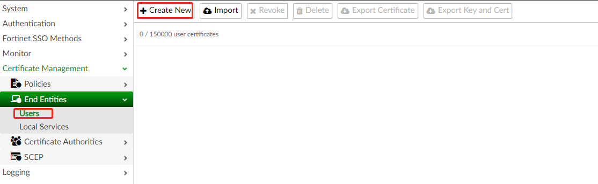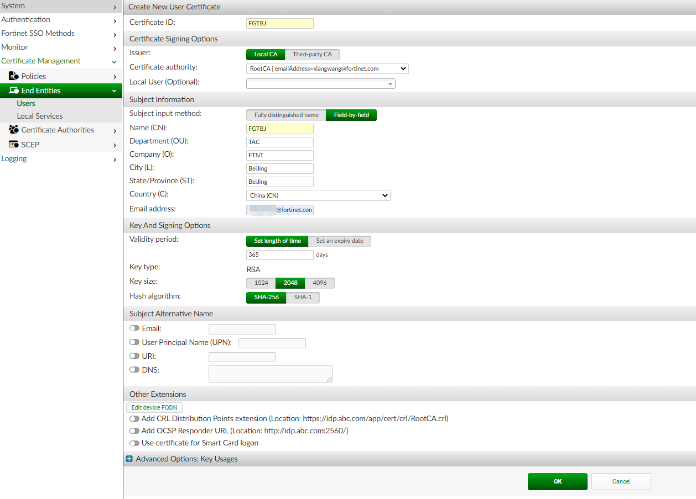点击“Export Key and Cert”导出FGTBJ证书的私钥和公钥。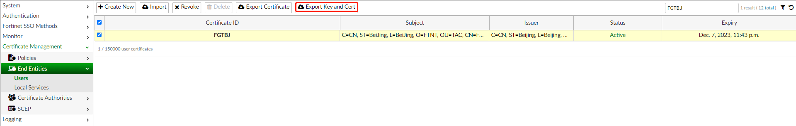输入一个密码保护私钥下载证书

2. **为终端颁发证书**

   为终端颁发证书和上述步骤是一样的。

   

   

### FortiGate导入证书

将根证书RootCA.crt和证书FGTBJ.p12导入到FGT_BJ。

在数字证书认证中，通信双方使用CA证书进行数字证书合法性验证，双方各有自己的公钥（网络上传输）和私钥（本地存储）。发送方对报文进行Hash计算，并用自己的私钥对报文计算结果进行加密，生成数字签名。接收方使用发送方的公钥对数字签名进行解密，并对报文进行Hash计算，判断计算结果与解密后的结果是否相同。如果相同，则认证通过；否则认证失败。


1. 导入CA证书

   选择“系统管理”-->“证书”，点击“Create/Import”，选择CA证书。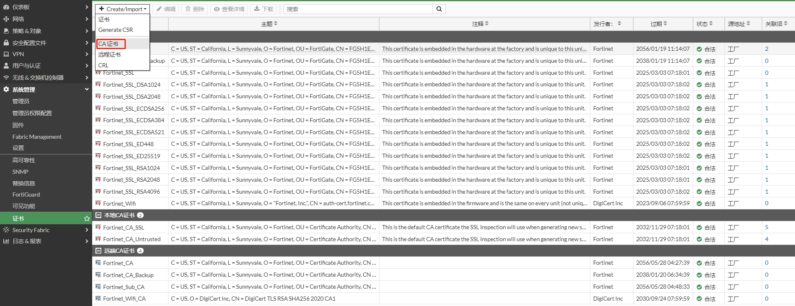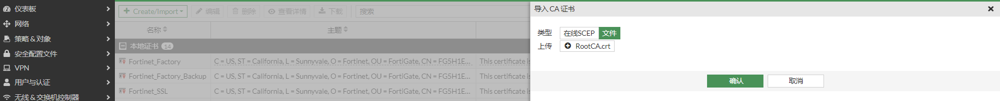查看导入的CA证书

2. 导入本地证书

   选择“系统管理”-->“证书”，点击“Create/Import”，选择“证书”。

   

   点击导入证书

   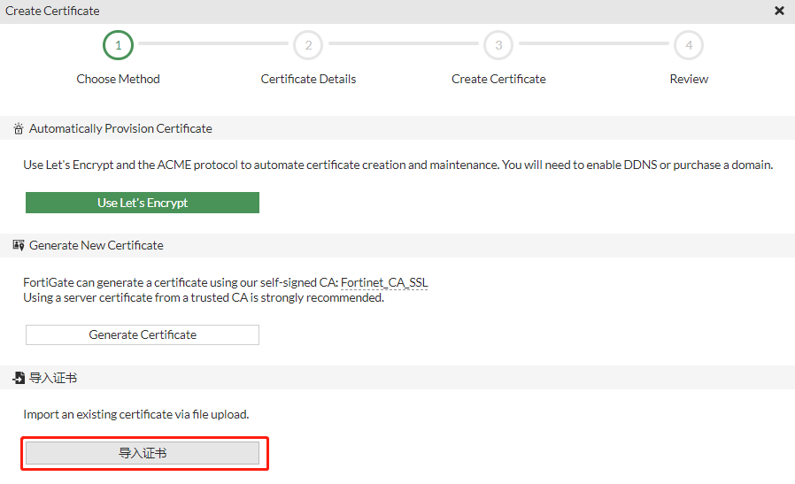

   输入证书的密码，点击“创建”

   

   提示证书已成功导入

   

   查看导入的本地证书

   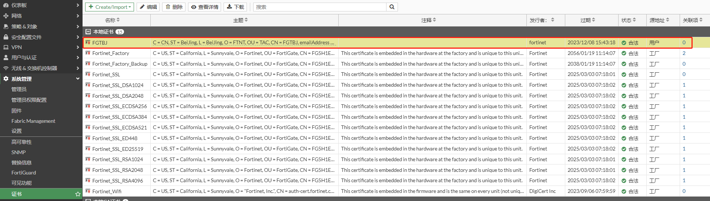

### 终端导入证书

将根证书RootCA.crt和证书user1.p12导入到终端。

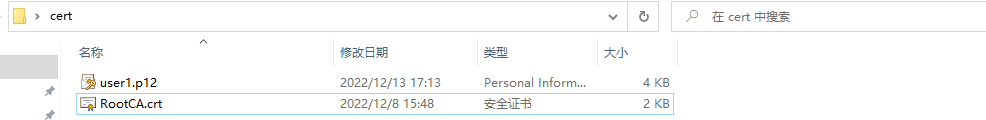

1. 导入根证书RootCA.crt

   双击RootCA.crt，点击“安装证书”。

   

   

   证书存入“受信任的根证书颁发机构”

   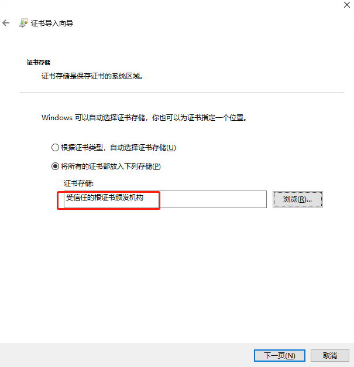

   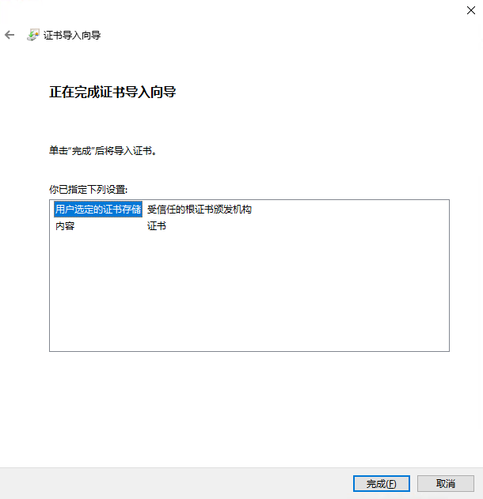

2. 导入个人证书user1.p12

   双击user1.p12，然后安装证书

   

   输入证书的密码

   

   证书存入“个人”

   

   


### IPSEC VPN配置步骤

1. **基本配置**

   配置接口IP和路由

   

   

2. **创建用户**

   选择“用户与认证”-->“设置用户”，点击“新建”。

   

   选择“本地用户”，点击“下一步”。

   

   输入用户名和密码，点击“下一步”。

   

   可根据需求选择启用。这里不启用，点击“下一步”。

   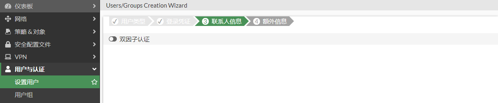

   点击“提交”。

   

   完成用户创建。

   

3. **创建用户组**

   选择“用户与认证”-->“用户组”，点击“新建”。

   

   输入名称，即组名，并将用户加入用户组，点击“确认”。

   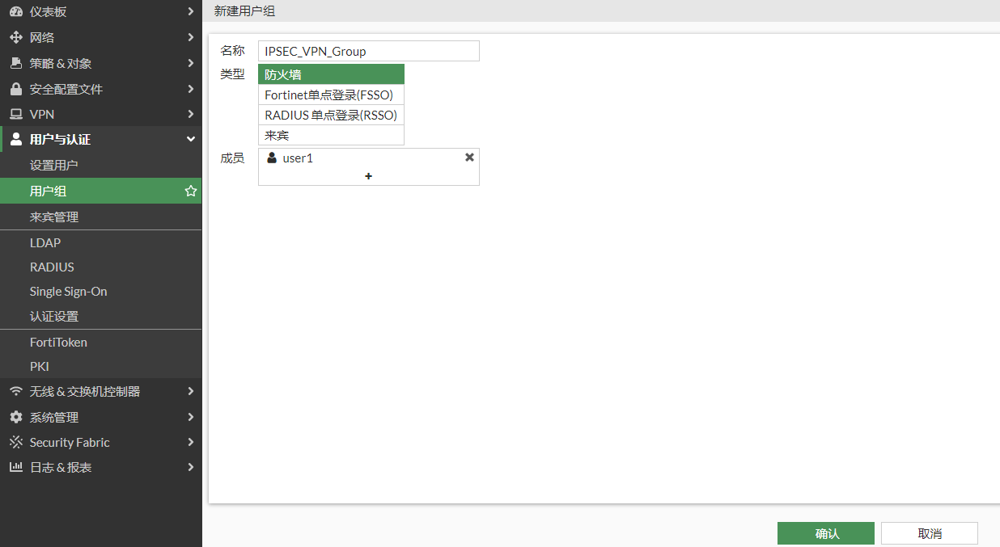

   完成用户组创建。

   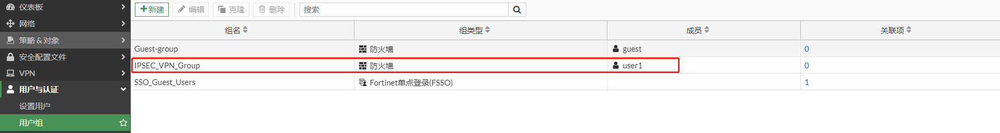

4. **创建子网**

   

5. **配置IPSEC VPN**

   选择“VPN”-->“IPsec隧道”，点击“新建”，选择“IPsec隧道”。

   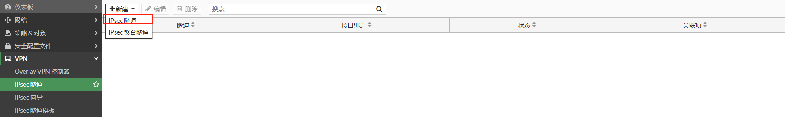

   根据“VPN创建向导”进行VPN模板配置，输入名称，选择”远程接“-->"基于客户端"-->“FortiClient”，并点击下一步。

   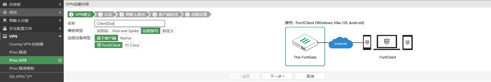

   选择对外的接口，用户组，证书名是本地的证书FGTBJ，对端证书CA是导入的RootCA，即CA_Cert_1，并点击下一步。

   

   输入内网接口，允许访问的本地地址段，客户端拨号后获取的地址范围，并点击下一步。

   

   保存密码，FortiClient第一次拨号成功后，FortiClient会显示“保存密码”的选项，默认勾选。

   自动连接，FortiClient第一次拨号成功后，FortiClient会显示“自动连接”的选项，该功能是运行FortiClient会拨入该IPSEC VPN。

   保持存活，FortiClient第一次拨号成功后，FortiClient会显示“保持连接”的选项，该功能是IPSEC VPN由于网络原因中断后，会自动重拨。

   免费的FortiClient版本不支持自动连接和保持连接，需要完整版的FortiClient，需要购买EMS license。

   

   VPN创建向导提示即将创建的内容，然后点击完成。

   

   VPN创建成功。

   

### 查看IPSEC向导创建的配置

通过“VPN创建向导”可以很方便的配置VPN，但我们需要知道向导具体做了哪些配置。

1. **创建地址对象和地址对象组。**

   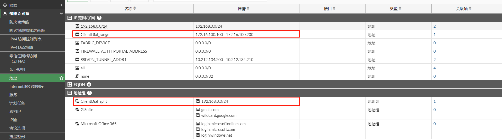

2. **创建PKI对象**

   ```
   config user peer
       edit "ClientDial_peer"
           set ca "CA_Cert_1"
       next
   end
   ```

3. **创建IPSEC VPN**

   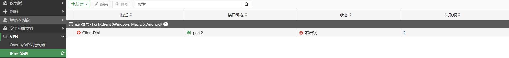

   对应的命令行

   ```
   config vpn ipsec phase1-interface
       edit "ClientDial"
           set type dynamic
           set interface "port2"
           set authmethod signature
           set mode aggressive
           set net-device disable
           set mode-cfg enable
           set proposal aes128-sha256 aes256-sha256 aes128-sha1 aes256-sha1
           set comments "VPN: ClientDial (Created by VPN wizard)"
           set wizard-type dialup-forticlient
           set xauthtype auto
           set authusrgrp "IPSEC_VPN_Group"
           set certificate "FGTBJ"
           set peer "ClientDial_peer"
           set ipv4-start-ip 172.16.100.100
           set ipv4-end-ip 172.16.100.200
           set dns-mode auto
           set ipv4-split-include "ClientDial_split"
           set save-password enable
       next
   end
   config vpn ipsec phase2-interface
       edit "ClientDial"
           set phase1name "ClientDial"
           set proposal aes128-sha1 aes256-sha1 aes128-sha256 aes256-sha256 aes128gcm aes256gcm chacha20poly1305
           set comments "VPN: ClientDial (Created by VPN wizard)"
       next
   end
   ```

4. **创建策略**

   

### 配置FortClient

1. 选择“Remote Access”，点击“配置VPN”。

   

2. 选择IPSEC VPN，输入连接名，远程网关，个人证书，以及用户名，然后点击“保存”。

   

1. 在”高级设置“有更多的选项，如ike版本，IKE阶段一和阶段二的加密集等，可以根据FortiGate的设置做对应的修改。

   

   

   3. VPN配置完成

      

## FortClient拨号测试

1. 在FortiClient中输入账号密码，点击“连接”，FortiClient拨号成功。

   

2. 查看终端路由表，192.168.0.0/24指向IPSEC VPN，并能成功访问OA Server。

   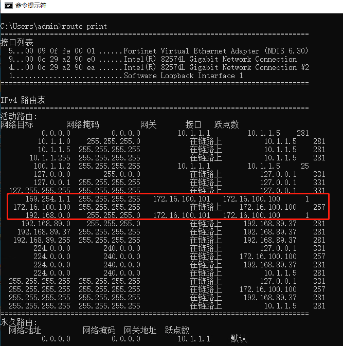

   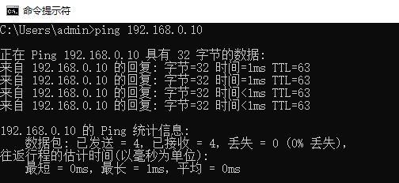

3. FortiGate查看Client的连接。

   

4. 点击“中断连接”，FortiClient就会显示“保存密码”选项。

   
