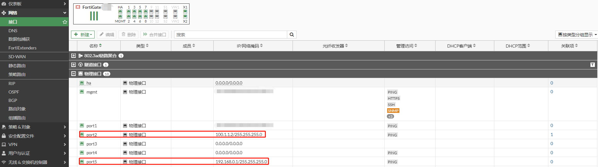
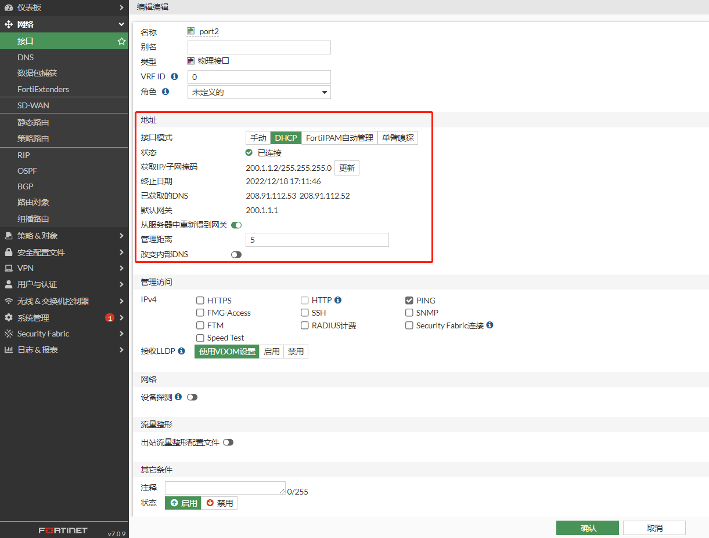
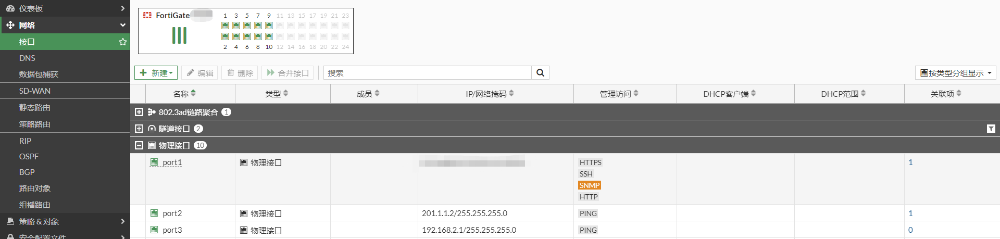
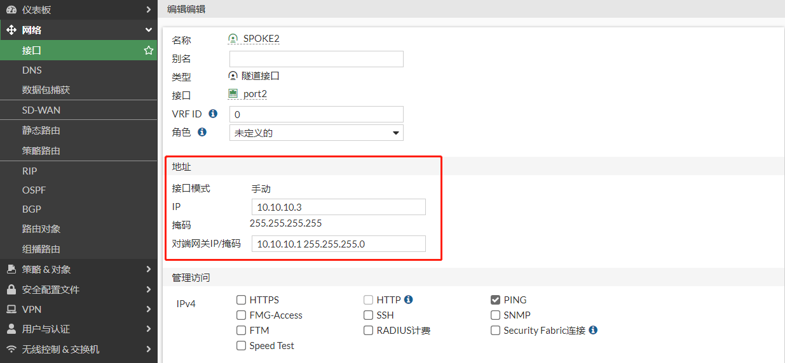

# 拨号VPN上运行动态路由协议

## **组网需求**

某公司总部内部有一台OA服务器，其余分2个支机构都需要通过vpn拨入总部内网对OA服务器进行访问，为了方便配置，总部不想有太多的配置，总部只建立一条vpn隧道，实现所有分支机构和总部的通讯。同时需要运行动态路由协议将总部和分支的路由全部打通，SPOKE之间的流量通过HUB进行中转。

## **网络拓扑**

HUB and SPOKE通过动态路由学习到整网的业务网段路由，SPOKE之间相互的流量通过HUB进行中转。

```
PC1-----------(port5:192.168.0.1/24)HUB(port2:100.1.1.2)-------------Internet-------------(port2:200.1.1.2)SPOKE1(port5:192.168.1.1/24)-----------PC2
                                                                         |-----------------(port2:201.1.1.2)SPOKE2(port3:192.168.2.1/24)-----------PC3
```

VPN Tunnel IP地址分配，以及BGP的规划：

| 角色   | 公网IP    | 私网网段       | VPN隧道IP  | BGP信息            |
| ------ | --------- | -------------- | ---------- | ------------------ |
| HUB    | 100.1.1.2 | 192.168.0.1/24 | 10.10.10.1 | AS 65001 RR反射器  |
| SPOKE1 | 200.1.1.2 | 192.168.1.1/24 | 10.10.10.2 | AS 65001 RR Client |
| SPOKE2 | 201.1.1.2 | 192.168.2.1/24 | 10.10.10.3 | AS 65001 RR Client |
| SPOKE3 |           |                |            |                    |
| SPOKEX |           |                |            |                    |

## 配置步骤

### HUB端配置

1. **基本配置**

   配置接口IP和路由

   

   

2. **配置IPSEC VPN**

   创建IPSEC VPN。

   

   IPSEC VPN阶段一配置。

   由于HUB和SPOKE之间是通过动态路由学习，因此“添加路由”选项禁用，不用HUB自动学习SPOKE的路由；Exchange接口IP打开，需要交换HUB和SPOKE之间VPN接口的IP。

   

   

   IPSEC VPN阶段二配置。

   

   创建完成。

   

   对应的命令行

   ```
   config vpn ipsec phase1-interface
       edit "HUB"
           set type dynamic
           set interface "port2"
           set peertype any
           set net-device disable
           set exchange-interface-ip enable
           set proposal aes128-sha256 aes256-sha256 aes128-sha1 aes256-sha1
           set add-route disable
           set dpd on-idle
           set psksecret ENC m9c6Qk4uhwWLRTRDI2EzYQym02Uma0709h07KB2pmS0Ek+8ZUOpRTH6OZdFEZPdlZktXajf/KRkR6SNO7UwW27pYAWoRygwcWhvJrO67tIWl5AksoOX3uy2YTjFX+kVbrw5WTVoLogqtJ4yPk7coZpMKUvqJkAv8flqIIi3EfY4TgY2avzSOkBVm8ZLgokTkmt3PMQ==
           set dpd-retryinterval 10
       next
   end
   config vpn ipsec phase2-interface
       edit "HUB"
           set phase1name "HUB"
           set proposal aes128-sha1 aes256-sha1 aes128-sha256 aes256-sha256 aes128gcm aes256gcm chacha20poly1305
           set keepalive enable
       next
   end
   ```

3. **配置VPN接口IP**

   HUB端的”对端网关IP“ 10.10.10.254是不被Spoke所使用的预留IP，IPsec Tunnel是一个点对点的隧道，但是ADVPN中这条隧道需要同时对应多个SPOKE，因此不能将Remote IP写成一个存在的SPOKE端IP。

   

4. **配置策略**

   创建3条策略，从上到下分别是：分支到总部的放通策略；总部到分支的放通策略；分支到分支的放通策略。

   

### SPOKE1配置

1. **基本配置**

   

   

2. **配置IPSEC VPN**

   创建IPSEC VPN。

   

   IPSEC VPN阶段一配置。

   由于HUB和SPOKE之间是通过动态路由学习，因此Exchange接口IP打开，需要交换HUB和SPOKE之间VPN接口的IP；SPOKE1是静态IPSEC，所以“添加路由”选项对SPOKE1没有意义，不用关注。

   

   

   IPSEC VPN阶段二配置。

   第二阶段感兴趣流配置为0.0.0.0/0.0.0.0，后续通过动态路由将流量指向VPN隧道。

   

   VPN创建完成。

   

   对应的命令行

   ```
   config vpn ipsec phase1-interface
       edit "SPOKE1"
           set interface "port2"
           set peertype any
           set net-device disable
           set exchange-interface-ip enable
           set proposal aes128-sha256 aes256-sha256 aes128-sha1 aes256-sha1
           set remote-gw 100.1.1.2
           set psksecret ENC SasMccP3qWqglxEV1I2Z8ESNcmdXyPqkxyIoMpEM3haEKdLyi6qcOoc9WtdukEH2zXuV/bcVW6HyYqi8rh+KZ533z7cH6zqNpXCrOicxBYDXrEPVU6NXtp4UgL+bqiG6Vm1FzA62V+YN4Rfchkuk49CuipVrer1xFqqIgXQVxM5GVuq+5wFvtWf5VBeuFbw+GHJlPQ==
           set dpd-retryinterval 10
       next
   end
   config vpn ipsec phase2-interface
       edit "SPOKE1"
           set phase1name "SPOKE1"
           set proposal aes128-sha1 aes256-sha1 aes128-sha256 aes256-sha256 aes128gcm aes256gcm chacha20poly1305
           set auto-negotiate enable
       next
   end
   ```

3. **配置VPN接口IP**

   SPOKE1的“对端网关IP”是指向HUB的。

   

4. **配置策略**

   由于SPOKE1开启了自动连接，当配置策略后，就会主动与HUB协商，策略中的接口已经是绿色的，说明VPN接口已经UP。

   

### SPOKE2配置

1. 基本配置

   

   

2. **配置IPSEC VPN**

   创建IPSEC VPN。

   

   IPSEC VPN阶段一配置。

   由于HUB和SPOKE之间是通过动态路由学习，因此Exchange接口IP打开，需要交换HUB和SPOKE之间VPN接口的IP；SPOKE2是静态IPSEC，所以“添加路由”选项对SPOKE2没有意义，不用关注。

   

   

   IPSEC VPN阶段二配置。

   第二阶段感兴趣流配置为0.0.0.0/0.0.0.0，后续通过动态路由将流量指向VPN隧道。

   

   VPN创建完成。

   

   对应的命令行

   ```
   config vpn ipsec phase1-interface
       edit "SPOKE2"
           set interface "port2"
           set peertype any
           set net-device disable
           set exchange-interface-ip enable
           set proposal aes128-sha256 aes256-sha256 aes128-sha1 aes256-sha1
           set remote-gw 100.1.1.2
           set psksecret ENC H3nAayIN5AWs3FomZpZri+tl6IAqg3iVu66h3qNXTjw1oSkiHauyAa/IUNw4xeJxD5dmiLfcAd/zzDb6BVai19ekg0Qvejqy39Mxr9UaRniPKE4dvoaoVLWy4OvamxRzf82+JAUYKlF0NvVlMQ/+0JUYOunFeUlLLtht4dW69X9VTXfEBdwav496AzfYgI4gRTFFSg==
           set dpd-retryinterval 10
       next
   end
   config vpn ipsec phase2-interface
       edit "SPOKE2"
           set phase1name "SPOKE2"
           set proposal aes128-sha1 aes256-sha1 aes128-sha256 aes256-sha256 aes128gcm aes256gcm chacha20poly1305
           set auto-negotiate enable
       next
   end
   ```

3. **配置VPN接口IP**

   SPOKE2的“对端网关IP”是指向HUB的。

   

4. **配置策略**

   由于SPOKE2开启了自动连接，当配置策略后，就会主动与HUB协商，策略中的接口已经是绿色的，说明VPN接口已经UP。

   

### 查看VPN状态和路由表

1. **HUB端VPN状态和路由表**

   

   ```
   # diagnose vpn ike gateway  list 
   
   vd: root/0
   name: HUB_0
   version: 1
   interface: port2 10
   addr: 100.1.1.2:500 -> 200.1.1.2:500
   tun_id: 200.1.1.2/::10.0.0.4
   remote_location: 0.0.0.0
   network-id: 0
   virtual-interface-addr: 10.10.10.1 -> 0.0.0.0
   created: 33s ago
   IKE SA: created 1/1  established 1/1  time 0/0/0 ms
   IPsec SA: created 1/1  established 1/1  time 0/0/0 ms
   
     id/spi: 2 b114b317daa486b7/29ede80ef4398500
     direction: responder
     status: established 33-33s ago = 0ms
     proposal: aes128-sha256
     key: 770b2cdeba34d096-8edcf542d0c07ef5
     lifetime/rekey: 86400/86096
     DPD sent/recv: 00000004/00000000
   
   vd: root/0
   name: HUB_1
   version: 1
   interface: port2 10
   addr: 100.1.1.2:500 -> 201.1.1.2:500
   tun_id: 201.1.1.2/::10.0.0.5
   remote_location: 0.0.0.0
   network-id: 0
   virtual-interface-addr: 10.10.10.1 -> 0.0.0.0
   created: 22s ago
   IKE SA: created 1/1  established 1/1  time 0/0/0 ms
   IPsec SA: created 1/1  established 1/1  time 0/0/0 ms
   
     id/spi: 3 a0d49273057cb2d8/146f94f98305de8d
     direction: responder
     status: established 22-22s ago = 0ms
     proposal: aes128-sha256
     key: 4dc2b68b5795fd1c-0a400a810f439a19
     lifetime/rekey: 86400/86107
     DPD sent/recv: 00000000/00000008
   
   FGT-wangxiang-used # diagnose vpn  tunnel list 
   list all ipsec tunnel in vd 0
   ------------------------------------------------------
   name=HUB_0 ver=1 serial=4 100.1.1.2:0->200.1.1.2:0 tun_id=200.1.1.2 tun_id6=::10.0.0.4 dst_mtu=1500 dpd-link=on weight=1
   bound_if=10 lgwy=static/1 tun=intf mode=dial_inst/3 encap=none/8872 options[22a8]=npu rgwy-chg frag-rfc  run_state=0 role=primary accept_traffic=1 overlay_id=0
   
   parent=HUB index=0
   proxyid_num=1 child_num=0 refcnt=5 ilast=5 olast=5 ad=/0
   stat: rxp=0 txp=0 rxb=0 txb=0
   dpd: mode=on-idle on=1 idle=10000ms retry=3 count=0 seqno=4
   natt: mode=none draft=0 interval=0 remote_port=0
   proxyid=HUB proto=0 sa=1 ref=2 serial=1
     src: 0:0.0.0.0-255.255.255.255:0
     dst: 0:0.0.0.0-255.255.255.255:0
     SA:  ref=3 options=226 type=00 soft=0 mtu=1438 expire=43155/0B replaywin=2048
          seqno=1 esn=0 replaywin_lastseq=00000000 qat=0 rekey=0 hash_search_len=1
     life: type=01 bytes=0/0 timeout=43191/43200
     dec: spi=d87e91b4 esp=aes key=16 f598636b2f6feb532e32f883300f4595
          ah=sha1 key=20 663bcb60b48c072daebdc011e27c35836e2f45eb
     enc: spi=d56f5619 esp=aes key=16 f3059875bf7c1915eb711a5355a603a8
          ah=sha1 key=20 f8d348a6abdb169781f2e1b3aae099c70d16ea92
     dec:pkts/bytes=0/0, enc:pkts/bytes=0/0
     npu_flag=00 npu_rgwy=200.1.1.2 npu_lgwy=100.1.1.2 npu_selid=2 dec_npuid=0 enc_npuid=0
   ------------------------------------------------------
   name=HUB_1 ver=1 serial=5 100.1.1.2:0->201.1.1.2:0 tun_id=201.1.1.2 tun_id6=::10.0.0.5 dst_mtu=1500 dpd-link=on weight=1
   bound_if=10 lgwy=static/1 tun=intf mode=dial_inst/3 encap=none/8872 options[22a8]=npu rgwy-chg frag-rfc  run_state=0 role=primary accept_traffic=1 overlay_id=0
   
   parent=HUB index=1
   proxyid_num=1 child_num=0 refcnt=5 ilast=4 olast=4 ad=/0
   stat: rxp=1 txp=0 rxb=60 txb=0
   dpd: mode=on-idle on=1 idle=10000ms retry=3 count=0 seqno=2
   natt: mode=none draft=0 interval=0 remote_port=0
   proxyid=HUB proto=0 sa=1 ref=2 serial=1
     src: 0:0.0.0.0-255.255.255.255:0
     dst: 0:0.0.0.0-255.255.255.255:0
     SA:  ref=4 options=226 type=00 soft=0 mtu=1438 expire=43162/0B replaywin=2048
          seqno=1 esn=0 replaywin_lastseq=00000002 qat=0 rekey=0 hash_search_len=1
     life: type=01 bytes=0/0 timeout=43187/43200
     dec: spi=d87e91b5 esp=aes key=16 f7229ae8b4fe965ea7346f41ffae201a
          ah=sha1 key=20 8ada15a3ef8a71fdb3037ee1f7014ca930009cdb
     enc: spi=c7b86106 esp=aes key=16 a6346a22cf40fba236f0cfaacc720261
          ah=sha1 key=20 e093aed38364b32892da5ae4f99413be54a7c635
     dec:pkts/bytes=2/120, enc:pkts/bytes=0/0
     npu_flag=02 npu_rgwy=201.1.1.2 npu_lgwy=100.1.1.2 npu_selid=3 dec_npuid=1 enc_npuid=0
   ------------------------------------------------------
   name=HUB ver=1 serial=1 100.1.1.2:0->0.0.0.0:0 tun_id=10.0.0.1 tun_id6=::10.0.0.1 dst_mtu=0 dpd-link=on weight=1
   bound_if=10 lgwy=static/1 tun=intf mode=dialup/2 encap=none/552 options[0228]=npu frag-rfc  role=primary accept_traffic=1 overlay_id=0
   
   proxyid_num=0 child_num=2 refcnt=4 ilast=42949600 olast=42949600 ad=/0
   stat: rxp=3 txp=0 rxb=180 txb=0
   dpd: mode=on-idle on=0 idle=10000ms retry=3 count=0 seqno=0
   natt: mode=none draft=0 interval=0 remote_port=0
   run_tally=0
   ```

   查看路由表

   ```
   # get router info routing-table  all 
   Codes: K - kernel, C - connected, S - static, R - RIP, B - BGP
          O - OSPF, IA - OSPF inter area
          N1 - OSPF NSSA external type 1, N2 - OSPF NSSA external type 2
          E1 - OSPF external type 1, E2 - OSPF external type 2
          i - IS-IS, L1 - IS-IS level-1, L2 - IS-IS level-2, ia - IS-IS inter area
          * - candidate default
   
   Routing table for VRF=0
   S*      0.0.0.0/0 [10/0] via 100.1.1.1, port2, [1/0]
   C       10.10.10.0/24 is directly connected, HUB
   C       10.10.10.1/32 is directly connected, HUB
   C       100.1.1.0/24 is directly connected, port2
   C       192.168.0.0/24 is directly connected, port5
   ```

   从HUB端分别ping SPOKE1和SPOKE2的隧道接口地址。

   ```
   # execute ping-options source 10.10.10.1
   # execute ping 10.10.10.2
   PING 10.10.10.2 (10.10.10.2): 56 data bytes
   64 bytes from 10.10.10.2: icmp_seq=0 ttl=255 time=0.7 ms
   64 bytes from 10.10.10.2: icmp_seq=1 ttl=255 time=0.4 ms
   64 bytes from 10.10.10.2: icmp_seq=2 ttl=255 time=0.3 ms
   64 bytes from 10.10.10.2: icmp_seq=3 ttl=255 time=0.3 ms
   64 bytes from 10.10.10.2: icmp_seq=4 ttl=255 time=0.4 ms
   
   --- 10.10.10.2 ping statistics ---
   5 packets transmitted, 5 packets received, 0% packet loss
   round-trip min/avg/max = 0.3/0.4/0.7 ms
   
   # execute ping 10.10.10.3
   PING 10.10.10.3 (10.10.10.3): 56 data bytes
   64 bytes from 10.10.10.3: icmp_seq=0 ttl=255 time=0.4 ms
   64 bytes from 10.10.10.3: icmp_seq=1 ttl=255 time=0.4 ms
   64 bytes from 10.10.10.3: icmp_seq=2 ttl=255 time=0.4 ms
   64 bytes from 10.10.10.3: icmp_seq=3 ttl=255 time=0.5 ms
   64 bytes from 10.10.10.3: icmp_seq=4 ttl=255 time=0.2 ms
   
   --- 10.10.10.3 ping statistics ---
   5 packets transmitted, 5 packets received, 0% packet loss
   round-trip min/avg/max = 0.2/0.3/0.5 ms
   ```

2. **SPOKE1端VPN状态**

   

   ```
   # diagnose vpn  ike gateway  list 
   
   vd: root/0
   name: SPOKE1
   version: 1
   interface: port2 10
   addr: 200.1.1.2:500 -> 100.1.1.2:500
   tun_id: 100.1.1.2/::100.1.1.2
   remote_location: 0.0.0.0
   network-id: 0
   virtual-interface-addr: 10.10.10.2 -> 10.10.10.1
   created: 139s ago
   IKE SA: created 1/1  established 1/1  time 0/0/0 ms
   IPsec SA: created 1/1  established 1/1  time 0/0/0 ms
   
     id/spi: 0 33b5335c7174437e/c89906c6196f3cd7
     direction: initiator
     status: established 139-139s ago = 0ms
     proposal: aes128-sha256
     key: ad3e41d87eb3b8b8-c97c621b25fe9a48
     lifetime/rekey: 86400/85960
     DPD sent/recv: 00000004/0000000a
   
   # diagnose vpn  tunnel list 
   list all ipsec tunnel in vd 0
   ------------------------------------------------------
   name=SPOKE1 ver=1 serial=1 200.1.1.2:0->100.1.1.2:0 tun_id=100.1.1.2 tun_id6=::100.1.1.2 dst_mtu=1500 dpd-link=on weight=1
   bound_if=10 lgwy=static/1 tun=intf mode=auto/1 encap=none/552 options[0228]=npu frag-rfc  run_state=0 role=primary accept_traffic=1 overlay_id=0
   
   proxyid_num=1 child_num=0 refcnt=4 ilast=12 olast=12 ad=/0
   stat: rxp=0 txp=6 rxb=0 txb=360
   dpd: mode=on-demand on=1 idle=10000ms retry=3 count=0 seqno=4
   natt: mode=none draft=0 interval=0 remote_port=0
   proxyid=SPOKE1 proto=0 sa=1 ref=2 serial=1 auto-negotiate
     src: 0:0.0.0.0-255.255.255.255:0
     dst: 0:0.0.0.0-255.255.255.255:0
     SA:  ref=5 options=18227 type=00 soft=0 mtu=1438 expire=42762/0B replaywin=2048
          seqno=7 esn=0 replaywin_lastseq=00000000 qat=0 rekey=0 hash_search_len=1
     life: type=01 bytes=0/0 timeout=42903/43200
     dec: spi=1a45fdb4 esp=aes key=16 373c729e4164750638f8ff0d37dbdd12
          ah=sha1 key=20 323ffd35fb089657505202639ad92371df146881
     enc: spi=a7d1cc77 esp=aes key=16 6da00eca8e15572377040c982e206526
          ah=sha1 key=20 3ea0959e65417277e75bdc5f52bdbc768f33d9b0
     dec:pkts/bytes=0/0, enc:pkts/bytes=12/1080
     npu_flag=01 npu_rgwy=100.1.1.2 npu_lgwy=200.1.1.2 npu_selid=0 dec_npuid=0 enc_npuid=1
   run_tally=0
   ```

   查看路由表

   ```
   # get router info routing-table all 
   Codes: K - kernel, C - connected, S - static, R - RIP, B - BGP
          O - OSPF, IA - OSPF inter area
          N1 - OSPF NSSA external type 1, N2 - OSPF NSSA external type 2
          E1 - OSPF external type 1, E2 - OSPF external type 2
          i - IS-IS, L1 - IS-IS level-1, L2 - IS-IS level-2, ia - IS-IS inter area
          * - candidate default
   
   Routing table for VRF=0
   S*      0.0.0.0/0 [5/0] via 200.1.1.1, port2, [1/0]
   S       10.10.10.0/24 [5/0] via SPOKE1 tunnel 100.1.1.2, [1/0]
   S       10.10.10.1/32 [15/0] via SPOKE1 tunnel 100.1.1.2, [1/0]
   C       10.10.10.2/32 is directly connected, SPOKE1
   C       192.168.1.0/24 is directly connected, port5
   C       200.1.1.0/24 is directly connected, port2
   ```

   从SPOKE1端ping HUB的隧道地址。

   ```
   # execute ping-options source 10.10.10.2
   # execute ping 10.10.10.1
   PING 10.10.10.1 (10.10.10.1): 56 data bytes
   64 bytes from 10.10.10.1: icmp_seq=0 ttl=255 time=0.7 ms
   64 bytes from 10.10.10.1: icmp_seq=1 ttl=255 time=0.4 ms
   64 bytes from 10.10.10.1: icmp_seq=2 ttl=255 time=0.6 ms
   64 bytes from 10.10.10.1: icmp_seq=3 ttl=255 time=0.4 ms
   64 bytes from 10.10.10.1: icmp_seq=4 ttl=255 time=0.6 ms
   
   --- 10.10.10.1 ping statistics ---
   5 packets transmitted, 5 packets received, 0% packet loss
   round-trip min/avg/max = 0.4/0.5/0.7 ms
   ```

3. **SPOKE2端VPN状态**

   

   ```
   # diagnose vpn ike gateway list 
   
   vd: root/0
   name: SPOKE2
   version: 1
   interface: port2 6
   addr: 201.1.1.2:500 -> 100.1.1.2:500
   tun_id: 100.1.1.2/::100.1.1.2
   remote_location: 0.0.0.0
   network-id: 0
   virtual-interface-addr: 10.10.10.3 -> 10.10.10.1
   created: 166s ago
   IKE SA: created 1/1  established 1/1  time 10/10/10 ms
   IPsec SA: created 1/1  established 1/1  time 0/0/0 ms
   
     id/spi: 0 712a042d8d25877d/437eb372be68f67e
     direction: initiator
     status: established 166-166s ago = 10ms
     proposal: aes128-sha256
     key: 48fb4b35b9a67aa3-f2f62d8949523c2d
     lifetime/rekey: 86400/85933
     DPD sent/recv: 0000000f/00000004
   
   # diagnose vpn  tunnel list 
   list all ipsec tunnel in vd 0
   ------------------------------------------------------
   name=SPOKE2 ver=1 serial=1 201.1.1.2:0->100.1.1.2:0 tun_id=100.1.1.2 tun_id6=::100.1.1.2 dst_mtu=1500 dpd-link=on weight=1
   bound_if=6 lgwy=static/1 tun=intf mode=auto/1 encap=none/552 options[0228]=npu frag-rfc  run_state=0 role=primary accept_traffic=1 overlay_id=0
   
   proxyid_num=1 child_num=0 refcnt=4 ilast=8 olast=8 ad=/0
   stat: rxp=0 txp=0 rxb=0 txb=0
   dpd: mode=on-idle on=1 idle=10000ms retry=3 count=0 seqno=15
   natt: mode=none draft=0 interval=0 remote_port=0
   proxyid=SPOKE2 proto=0 sa=1 ref=2 serial=1 auto-negotiate
     src: 0:0.0.0.0-255.255.255.255:0
     dst: 0:0.0.0.0-255.255.255.255:0
     SA:  ref=3 options=18203 type=00 soft=0 mtu=1438 expire=42730/0B replaywin=2048
          seqno=1 esn=0 replaywin_lastseq=00000000 qat=0 rekey=0 hash_search_len=1
     life: type=01 bytes=0/0 timeout=42899/43200
     dec: spi=99b97fa0 esp=aes key=16 6da0cd14244e96c9224fdfc526104c88
          ah=sha1 key=20 c15decb70b3de9678d1313b564ec2e6e912b9540
     enc: spi=a7d1cc78 esp=aes key=16 023a05cc8cd9224c781ca640b044c5b3
          ah=sha1 key=20 96da3fa1c8207a267200aac94db3718944574a1b
     dec:pkts/bytes=0/0, enc:pkts/bytes=0/0
     npu_flag=00 npu_rgwy=100.1.1.2 npu_lgwy=201.1.1.2 npu_selid=0 dec_npuid=0 enc_npuid=0
   run_tally=0
   ```

   查看路由表

   ```
   # get router info routing-table  all 
   Codes: K - kernel, C - connected, S - static, R - RIP, B - BGP
          O - OSPF, IA - OSPF inter area
          N1 - OSPF NSSA external type 1, N2 - OSPF NSSA external type 2
          E1 - OSPF external type 1, E2 - OSPF external type 2
          i - IS-IS, L1 - IS-IS level-1, L2 - IS-IS level-2, ia - IS-IS inter area
          * - candidate default
   
   Routing table for VRF=0
   S*      0.0.0.0/0 [5/0] via 201.1.1.1, port2, [1/0]
   S       10.10.10.0/24 [5/0] via SPOKE2 tunnel 100.1.1.2, [1/0]
   S       10.10.10.1/32 [15/0] via SPOKE2 tunnel 100.1.1.2, [1/0]
   C       10.10.10.3/32 is directly connected, SPOKE2
   C       192.168.2.0/24 is directly connected, port3
   C       201.1.1.0/24 is directly connected, port2
   ```

   从SPOKE2端ping HUB隧道接口地址。

   ```
   # execute ping-options source 10.10.10.3
   # execute ping 10.10.10.1
   PING 10.10.10.1 (10.10.10.1): 56 data bytes
   64 bytes from 10.10.10.1: icmp_seq=0 ttl=255 time=0.5 ms
   64 bytes from 10.10.10.1: icmp_seq=1 ttl=255 time=0.6 ms
   64 bytes from 10.10.10.1: icmp_seq=2 ttl=255 time=0.6 ms
   64 bytes from 10.10.10.1: icmp_seq=3 ttl=255 time=0.6 ms
   64 bytes from 10.10.10.1: icmp_seq=4 ttl=255 time=0.4 ms
   
   --- 10.10.10.1 ping statistics ---
   5 packets transmitted, 5 packets received, 0% packet loss
   round-trip min/avg/max = 0.4/0.5/0.6 ms
   ```

### 配置动态路由

1. **HUB端BGP配置**

   利用BGP neighbor-group特性，只要匹配前缀列表10.10.10.0/24的BGP-Peer均可以和HUB建立BGP邻居。

   将邻居设置为Route-Reflector-Client，自己即为路由反射器（Route-Reflector）,通过路由反射器原理实时同步整网路由。

   ```
   config router bgp
       set as 65001
       set router-id 100.1.1.2
       config neighbor-group
           edit "group1"
               set next-hop-self enable
               set soft-reconfiguration enable
               set interface "HUB"
               set remote-as 65001
               set route-reflector-client enable
           next
       end
       config neighbor-range
           edit 1
               set prefix 10.10.10.0 255.255.255.0
               set neighbor-group "group1"
           next
       end
       config network
           edit 1
               set prefix 192.168.0.0 255.255.255.0
           next
       end
   end
   ```

2. **SPOKE1端BGP配置**

   与HUB端建立BGP邻居

   ```
   config router bgp
       set as 65001
       set router-id 200.1.1.2
       config neighbor
           edit "10.10.10.1"
               set next-hop-self enable
               set soft-reconfiguration enable
               set interface "SPOKE1"
               set remote-as 65001
           next
       end
       config network
           edit 1
               set prefix 192.168.1.0 255.255.255.0
           next
       end
   end
   ```

3. **SPOKE2端BGP配置**

   与HUB端建立BGP邻居

   ```
   config router bgp
       set as 65001
       set router-id 201.1.1.2
       config neighbor
           edit "10.10.10.1"
               set next-hop-self enable
               set soft-reconfiguration enable
               set interface "SPOKE2"
               set remote-as 65001
           next
       end
       config network
           edit 1
               set prefix 192.168.2.0 255.255.255.0
           next
       end
       config network6
           edit 1
               set prefix6 ::/128
           next
       end
   end
   ```

## 查看路由表

1. **HUB端路由表**

   ```
   FGT-wangxiang-used # get router info routing-table  all 
   Codes: K - kernel, C - connected, S - static, R - RIP, B - BGP
          O - OSPF, IA - OSPF inter area
          N1 - OSPF NSSA external type 1, N2 - OSPF NSSA external type 2
          E1 - OSPF external type 1, E2 - OSPF external type 2
          i - IS-IS, L1 - IS-IS level-1, L2 - IS-IS level-2, ia - IS-IS inter area
          * - candidate default
   
   Routing table for VRF=0
   S*      0.0.0.0/0 [10/0] via 100.1.1.1, port2, [1/0]
   C       10.10.10.0/24 is directly connected, HUB
   C       10.10.10.1/32 is directly connected, HUB
   C       100.1.1.0/24 is directly connected, port2
   C       192.168.0.0/24 is directly connected, port5
   B       192.168.1.0/24 [200/0] via 10.10.10.2 (recursive is directly connected, HUB), 00:21:21
   B       192.168.2.0/24 [200/0] via 10.10.10.3 (recursive is directly connected, HUB), 00:21:21
   ```

2. **SPOKE1端路由表**

   ```
   FGT-wangxiang-used # get router info routing-table  all 
   Codes: K - kernel, C - connected, S - static, R - RIP, B - BGP
          O - OSPF, IA - OSPF inter area
          N1 - OSPF NSSA external type 1, N2 - OSPF NSSA external type 2
          E1 - OSPF external type 1, E2 - OSPF external type 2
          i - IS-IS, L1 - IS-IS level-1, L2 - IS-IS level-2, ia - IS-IS inter area
          * - candidate default
   
   Routing table for VRF=0
   S*      0.0.0.0/0 [5/0] via 200.1.1.1, port2, [1/0]
   S       10.10.10.0/24 [5/0] via SPOKE1 tunnel 100.1.1.2, [1/0]
   S       10.10.10.1/32 [15/0] via SPOKE1 tunnel 100.1.1.2, [1/0]
   C       10.10.10.2/32 is directly connected, SPOKE1
   C       200.1.1.0/24 is directly connected, port2
   C       192.168.1.0/24 is directly connected, port5
   B       192.168.0.0/24 [200/0] via 10.10.10.1 (recursive via SPOKE1 tunnel 100.1.1.2), 00:21:41
   B       192.168.2.0/24 [200/0] via 10.10.10.3 (recursive via SPOKE1 tunnel 100.1.1.2), 00:21:18
   ```

3. **SPOKE2端路由表**

   ```
   # get router info routing-table  all 
   Codes: K - kernel, C - connected, S - static, R - RIP, B - BGP
          O - OSPF, IA - OSPF inter area
          N1 - OSPF NSSA external type 1, N2 - OSPF NSSA external type 2
          E1 - OSPF external type 1, E2 - OSPF external type 2
          i - IS-IS, L1 - IS-IS level-1, L2 - IS-IS level-2, ia - IS-IS inter area
          * - candidate default
   
   Routing table for VRF=0
   S*      0.0.0.0/0 [5/0] via 200.1.1.1, port2, [1/0]
   S       10.10.10.0/24 [5/0] via SPOKE2 tunnel 100.1.1.2, [1/0]
   S       10.10.10.1/32 [15/0] via SPOKE2 tunnel 100.1.1.2, [1/0]
   C       10.10.10.3/32 is directly connected, SPOKE2
   C       192.168.2.0/24 is directly connected, port3
   C       201.1.1.0/24 is directly connected, port2
   B       192.168.0.0/24 [200/0] via 10.10.10.1 (recursive via SPOKE2 tunnel 100.1.1.2), 00:22:27
   B       192.168.1.0/24 [200/0] via 10.10.10.2 (recursive via SPOKE2 tunnel 100.1.1.2), 00:22:27
   ```


## 业务测试

1. **HUB端业务测试**

   ```
   PC1# ifconfig ens224
   ens224: flags=4163<UP,BROADCAST,RUNNING,MULTICAST>  mtu 1500
           inet 192.168.0.10  netmask 255.255.255.0  broadcast 192.168.0.255
           inet6 fe80::82c8:edfd:199d:70b0  prefixlen 64  scopeid 0x20<link>
           ether 00:0c:29:e8:ad:a9  txqueuelen 1000  (Ethernet)
           RX packets 6140132  bytes 1760274153 (1.6 GiB)
           RX errors 0  dropped 3749603  overruns 0  frame 0
           TX packets 51686  bytes 3833219 (3.6 MiB)
           TX errors 0  dropped 0 overruns 0  carrier 0  collisions 0
   
   访问SPOKE1
   PC1# ping 192.168.1.10 -c 4
   PING 192.168.1.10 (192.168.1.10) 56(84) bytes of data.
   64 bytes from 192.168.1.10: icmp_seq=1 ttl=62 time=1.42 ms
   64 bytes from 192.168.1.10: icmp_seq=2 ttl=62 time=0.788 ms
   64 bytes from 192.168.1.10: icmp_seq=3 ttl=62 time=0.751 ms
   64 bytes from 192.168.1.10: icmp_seq=4 ttl=62 time=0.688 ms
   
   --- 192.168.1.10 ping statistics ---
   4 packets transmitted, 4 received, 0% packet loss, time 3001ms
   rtt min/avg/max/mdev = 0.688/0.913/1.427/0.300 ms
   
   访问SPOKE2
   PC1# ping 192.168.2.10 -c 4
   PING 192.168.2.10 (192.168.2.10) 56(84) bytes of data.
   64 bytes from 192.168.2.10: icmp_seq=1 ttl=62 time=1.09 ms
   64 bytes from 192.168.2.10: icmp_seq=2 ttl=62 time=0.935 ms
   64 bytes from 192.168.2.10: icmp_seq=3 ttl=62 time=0.991 ms
   64 bytes from 192.168.2.10: icmp_seq=4 ttl=62 time=1.06 ms
   
   --- 192.168.2.10 ping statistics ---
   4 packets transmitted, 4 received, 0% packet loss, time 3003ms
   rtt min/avg/max/mdev = 0.935/1.021/1.098/0.070 ms
   ```

2. **SPOKE1端业务测试**

   ```
   PC2# ifconfig ens224
   ens224: flags=4163<UP,BROADCAST,RUNNING,MULTICAST>  mtu 1500
           inet 192.168.1.10  netmask 255.255.255.0  broadcast 192.168.1.255
           inet6 fe80::1a6c:e61:d2b9:a415  prefixlen 64  scopeid 0x20<link>
           inet6 2001::2  prefixlen 64  scopeid 0x0<global>
           ether 00:0c:29:0e:4e:c5  txqueuelen 1000  (Ethernet)
           RX packets 5904889  bytes 459674552 (438.3 MiB)
           RX errors 0  dropped 58  overruns 0  frame 0
           TX packets 3224540  bytes 205411564402 (191.3 GiB)
           TX errors 0  dropped 0 overruns 0  carrier 0  collisions 0
   
   访问HUB
   PC2# ping 192.168.0.10 -c 4
   PING 192.168.0.10 (192.168.0.10) 56(84) bytes of data.
   64 bytes from 192.168.0.10: icmp_seq=1 ttl=62 time=0.746 ms
   64 bytes from 192.168.0.10: icmp_seq=2 ttl=62 time=0.765 ms
   64 bytes from 192.168.0.10: icmp_seq=3 ttl=62 time=0.862 ms
   64 bytes from 192.168.0.10: icmp_seq=4 ttl=62 time=0.677 ms
   
   --- 192.168.0.10 ping statistics ---
   4 packets transmitted, 4 received, 0% packet loss, time 2999ms
   rtt min/avg/max/mdev = 0.677/0.762/0.862/0.071 ms
   
   访问SPOKE2
   PC2# ping 192.168.2.10 -c 4
   PING 192.168.2.10 (192.168.2.10) 56(84) bytes of data.
   64 bytes from 192.168.2.10: icmp_seq=1 ttl=61 time=1.14 ms
   64 bytes from 192.168.2.10: icmp_seq=2 ttl=61 time=0.952 ms
   64 bytes from 192.168.2.10: icmp_seq=3 ttl=61 time=1.51 ms
   64 bytes from 192.168.2.10: icmp_seq=4 ttl=61 time=0.886 ms
   
   --- 192.168.2.10 ping statistics ---
   4 packets transmitted, 4 received, 0% packet loss, time 3004ms
   rtt min/avg/max/mdev = 0.886/1.124/1.519/0.248 ms
   ```

3. **SPOKE2端业务测试**

   ```
   PC3# ifconfig ens224
   ens224: flags=4163<UP,BROADCAST,RUNNING,MULTICAST>  mtu 1500
           inet 192.168.2.10  netmask 255.255.255.0  broadcast 192.168.2.255
           inet6 fe80::2652:4dd7:5d0e:941d  prefixlen 64  scopeid 0x20<link>
           inet6 240e:604:109:39::216  prefixlen 64  scopeid 0x0<global>
           ether 00:0c:29:37:f0:ac  txqueuelen 1000  (Ethernet)
           RX packets 9638867  bytes 205844622412 (191.7 GiB)
           RX errors 0  dropped 118  overruns 0  frame 0
           TX packets 5737914  bytes 378901312 (361.3 MiB)
           TX errors 0  dropped 0 overruns 0  carrier 0  collisions 0
   
   访问HUB
   PC3# ping 192.168.0.10 -c 4
   PING 192.168.0.10 (192.168.0.10) 56(84) bytes of data.
   64 bytes from 192.168.0.10: icmp_seq=1 ttl=62 time=0.848 ms
   64 bytes from 192.168.0.10: icmp_seq=2 ttl=62 time=0.935 ms
   64 bytes from 192.168.0.10: icmp_seq=3 ttl=62 time=0.899 ms
   64 bytes from 192.168.0.10: icmp_seq=4 ttl=62 time=1.04 ms
   --- 192.168.0.10 ping statistics ---
   4 packets transmitted, 4 received, 0% packet loss, time 3002ms
   rtt min/avg/max/mdev = 0.848/0.931/1.045/0.081 ms
   
   访问SPOKE1
   PC3# ping 192.168.1.10 -c 4
   PING 192.168.1.10 (192.168.1.10) 56(84) bytes of data.
   64 bytes from 192.168.1.10: icmp_seq=1 ttl=61 time=1.13 ms
   64 bytes from 192.168.1.10: icmp_seq=2 ttl=61 time=1.22 ms
   64 bytes from 192.168.1.10: icmp_seq=3 ttl=61 time=1.21 ms
   64 bytes from 192.168.1.10: icmp_seq=4 ttl=61 time=1.04 ms
   --- 192.168.1.10 ping statistics ---
   4 packets transmitted, 4 received, 0% packet loss, time 3004ms
   rtt min/avg/max/mdev = 1.043/1.151/1.220/0.075 ms
   ```
   
   
