# FortiGuard DDNS方式建立IPSec VPN

## **组网需求**

FGT-BJ port2为静态固定IP地址，FGT-SH port2为PPPOE/DHCP动态拨号获取的IP地址，需要通过IPsec VPN将两个局域网连接起来，实现192.168.0.0/24与192.168.1.0/24两个网段的通信。

## 网络拓扑

PC1-------(port5:192.168.0.1/24)FGT-BJ(port2:100.1.1.2)-------------Internet------------(port2:FGT-SH.float-zone.com)FGT-SH(port5:192.168.1.1/24)-------PC2

## 配置步骤

### FGT-BJ配置

1. **基本配置**

   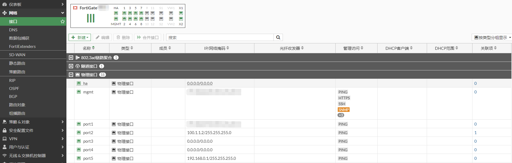

   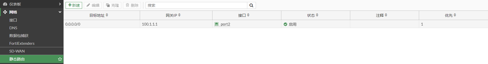

2. **配置IPSEC VPN**

   FGT-BJ使用域名FGT-SH.float-zone.com与对端发起连接，在配置IPSEC VPN前，先从FGT-BJ上测试是否能解析该域名。

   ```
   # execute ping FGT-SH.float-zone.com
   PING FGT-SH.float-zone.com (200.1.1.2): 56 data bytes
   64 bytes from 200.1.1.2: icmp_seq=0 ttl=254 time=0.4 ms
   64 bytes from 200.1.1.2: icmp_seq=1 ttl=254 time=0.3 ms
   64 bytes from 200.1.1.2: icmp_seq=2 ttl=254 time=0.6 ms
   64 bytes from 200.1.1.2: icmp_seq=3 ttl=254 time=0.4 ms
   64 bytes from 200.1.1.2: icmp_seq=4 ttl=254 time=0.5 ms
   
   --- FGT-SH.float-zone.com ping statistics ---
   5 packets transmitted, 5 packets received, 0% packet loss
   round-trip min/avg/max = 0.3/0.4/0.6 ms
   ```

   选择“VPN”-->“IPsec隧道”，点击“新建”，选择“IPsec隧道”。

   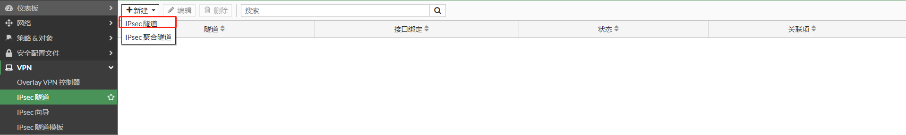

   选择“自定义”

   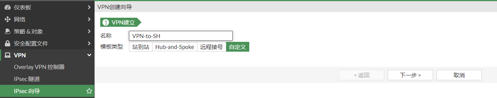

   IPSEC VPN阶段一配置

   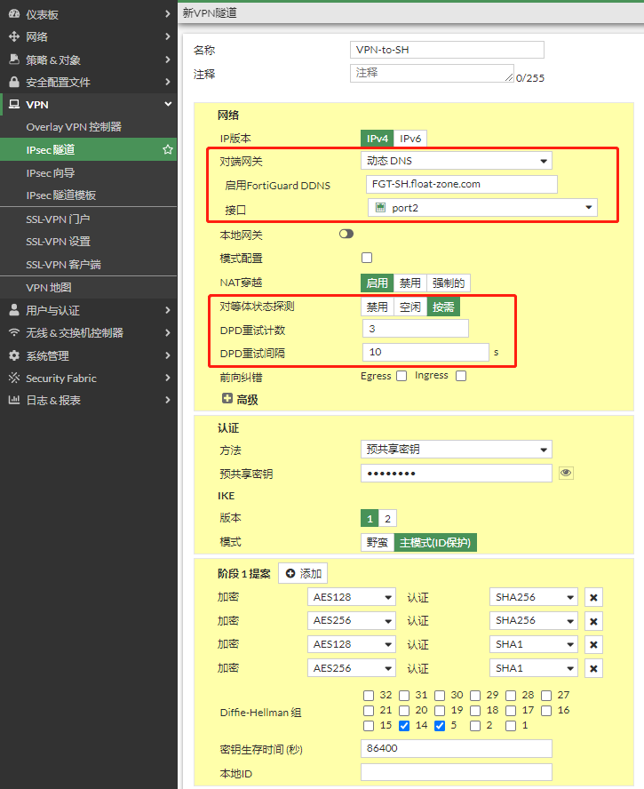

   IPSEC VPN阶段二配置

   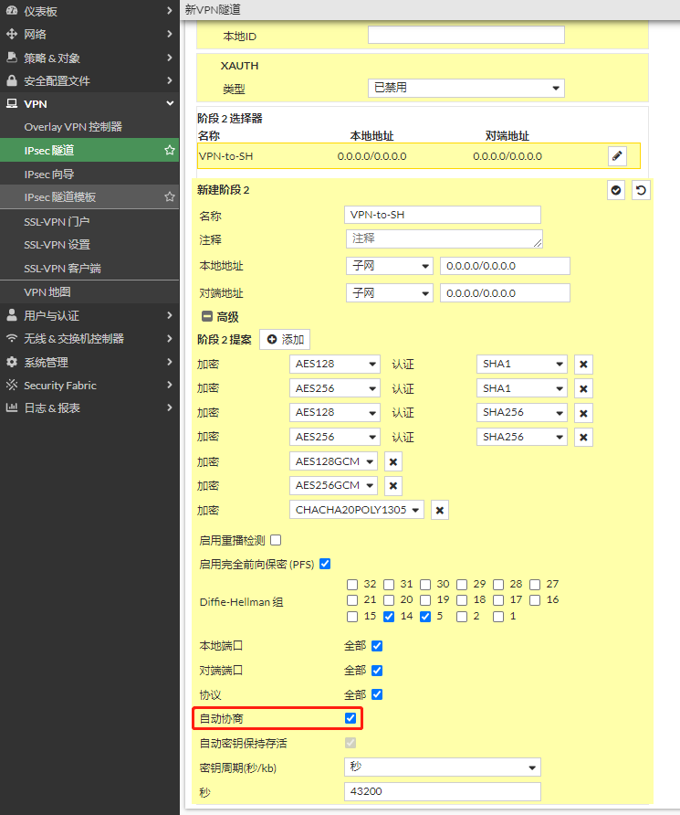

   

3. **配置IPSEC策略**

   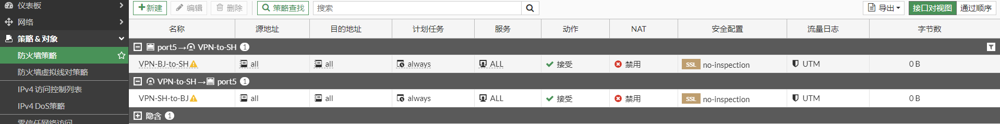

4. **配置路由**

   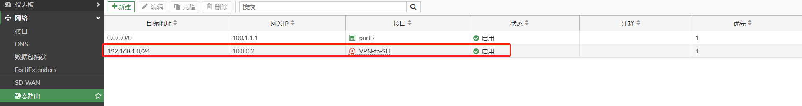

### FGT-SH配置

1. **基本配置**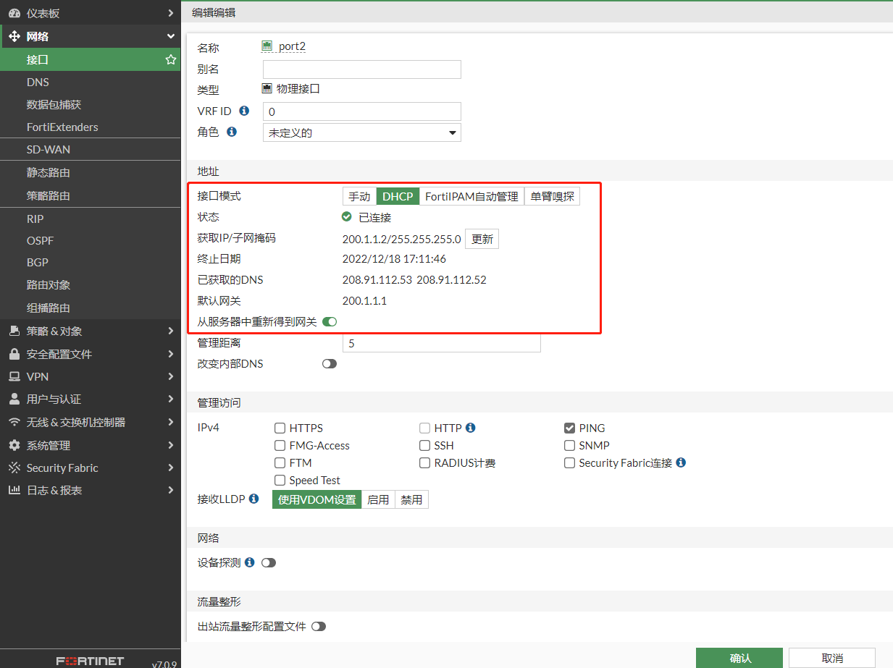

   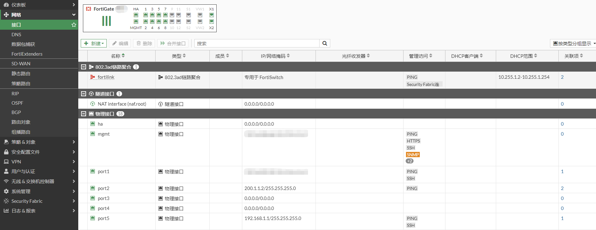

2. **配置FortiGuard DDNS**

   FGT-SH port2接口使用DHCP获取地址，地址是会变化的，但建立IPSEC VPN时，对端需要一个固定的地址，因此使用域名替代port2接口的IP。

   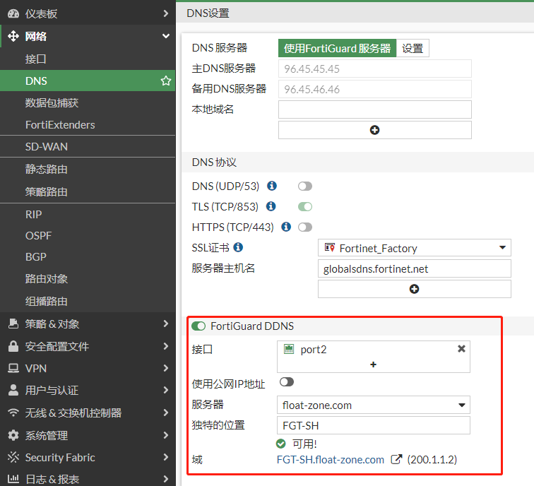

3. **配置IPSEC VPN**

   选择“VPN”-->“IPsec隧道”，点击“新建”，选择“IPsec隧道”。

   

   这里依然使用自定义

   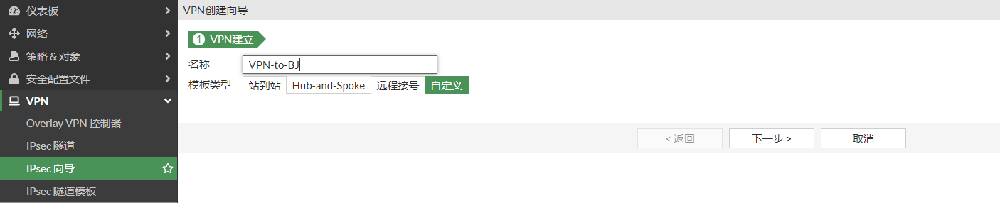

   IPSEC VPN阶段一配置

   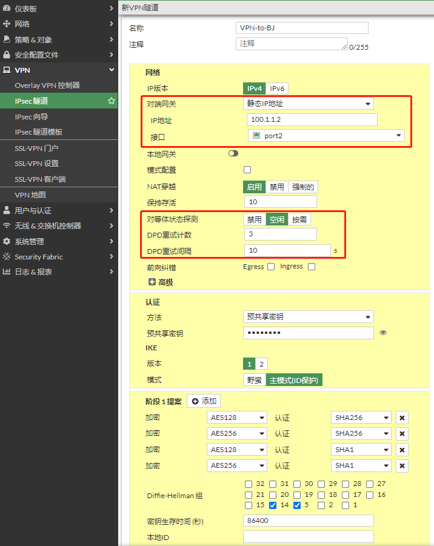

   IPSEC VPN阶段二配置

   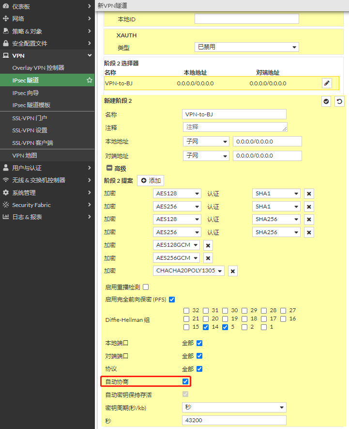

   

4. **配置防火墙策略**

   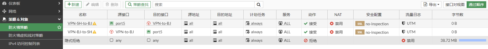

5. **配置路由**

   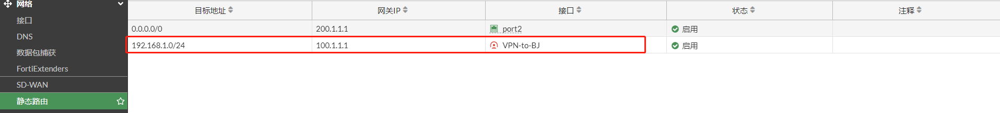

## 查看IPSEC VPN状态

1. **FGT-BJ IPSEC VPN状态**

   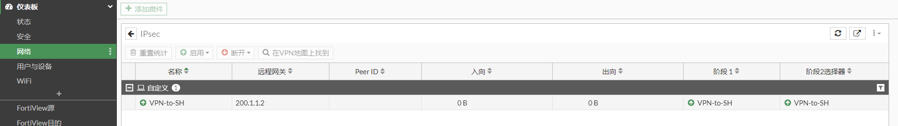

   ```
   # diagnose vpn ike gateway list 
   
   vd: root/0
   name: VPN-to-SH
   version: 1
   interface: port2 10
   addr: 100.1.1.2:500 -> 200.1.1.2:500
   tun_id: 10.0.0.2/::10.0.0.2
   remote_location: 0.0.0.0
   network-id: 0
   created: 195s ago
   IKE SA: created 2/2  established 2/2  time 0/10500/21000 ms
   IPsec SA: created 1/2  established 1/1  time 0/0/0 ms
   
     id/spi: 10 e3498ed0f017b22b/a19990e821f3733e
     direction: responder
     status: established 177-177s ago = 0ms
     proposal: aes128-sha256
     key: c9c4dd7d0bdea34b-e9425ad0fe0a17bc
     lifetime/rekey: 86400/85952
     DPD sent/recv: 00000000/00000000
   
     id/spi: 9 d46c45f0f50d9ce8/fcaf35fab405c65a
     direction: initiator
     status: established 195-174s ago = 21000ms
     proposal: aes128-sha256
     key: 27f09a3f144bf8da-85d9c19874786059
     lifetime/rekey: 86400/85925
     DPD sent/recv: 00000000/00000012
   
   # diagnose vpn  tunnel list
   list all ipsec tunnel in vd 0
   ------------------------------------------------------
   name=VPN-to-SH ver=1 serial=b 100.1.1.2:0->200.1.1.2:0 tun_id=10.0.0.2 tun_id6=::10.0.0.2 dst_mtu=1500 dpd-link=on weight=1
   bound_if=10 lgwy=static/1 tun=intf mode=auto/1 encap=none/552 options[0228]=npu frag-rfc  run_state=0 role=primary accept_traffic=1 overlay_id=0
   
   proxyid_num=1 child_num=0 refcnt=4 ilast=3 olast=3 ad=/0
   stat: rxp=0 txp=0 rxb=0 txb=0
   dpd: mode=on-demand on=1 idle=10000ms retry=3 count=0 seqno=0
   natt: mode=none draft=0 interval=0 remote_port=0
   proxyid=VPN-to-SH proto=0 sa=1 ref=2 serial=1 auto-negotiate
     src: 0:0.0.0.0-255.255.255.255:0
     dst: 0:0.0.0.0-255.255.255.255:0
     SA:  ref=3 options=18225 type=00 soft=0 mtu=1438 expire=42750/0B replaywin=0
          seqno=1 esn=0 replaywin_lastseq=00000000 qat=0 rekey=0 hash_search_len=1
     life: type=01 bytes=0/0 timeout=42933/43200
     dec: spi=03ff1e97 esp=aes key=16 e44c72247f93456bb0191fb24eee8a8f
          ah=sha1 key=20 884f93d1f1212a08eb7e99fe6153408554d1e7f2
     enc: spi=a7236c3f esp=aes key=16 712b50eed56e1d231956ed11c595220b
          ah=sha1 key=20 0bede372f1a608d05df1c793d25c8939afb995a4
     dec:pkts/bytes=0/0, enc:pkts/bytes=0/0
     npu_flag=00 npu_rgwy=200.1.1.2 npu_lgwy=100.1.1.2 npu_selid=16 dec_npuid=0 enc_npuid=0
   run_tally=0
   ```

2. **FGT-SH IPSEC VPN状态**

   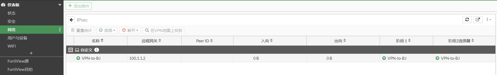

   ```
   # diagnose vpn ike gateway  list
   
   vd: root/0
   name: VPN-to-BJ
   version: 1
   interface: port2 10
   addr: 200.1.1.2:500 -> 100.1.1.2:500
   tun_id: 100.1.1.1/::100.1.1.1
   remote_location: 0.0.0.0
   network-id: 0
   created: 261s ago
   IKE SA: created 2/2  established 2/2  time 0/0/0 ms
   IPsec SA: created 1/1  established 1/1  time 0/0/0 ms
   
     id/spi: 59 d46c45f0f50d9ce8/fcaf35fab405c65a
     direction: responder
     status: established 258-258s ago = 0ms
     proposal: aes128-sha256
     key: 27f09a3f144bf8da-85d9c19874786059
     lifetime/rekey: 86400/85871
     DPD sent/recv: 0000001b/00000000
   
     id/spi: 58 e3498ed0f017b22b/a19990e821f3733e
     direction: initiator
     status: established 261-261s ago = 0ms
     proposal: aes128-sha256
     key: c9c4dd7d0bdea34b-e9425ad0fe0a17bc
     lifetime/rekey: 86400/85838
     DPD sent/recv: 00000000/00000000
   
   # diagnose vpn  tunnel list
   list all ipsec tunnel in vd 0
   ------------------------------------------------------
   name=VPN-to-BJ ver=1 serial=d 200.1.1.2:0->100.1.1.2:0 tun_id=100.1.1.1 tun_id6=::100.1.1.1 dst_mtu=1500 dpd-link=on weight=1
   bound_if=10 lgwy=static/1 tun=intf mode=auto/1 encap=none/552 options[0228]=npu frag-rfc  run_state=0 role=primary accept_traffic=1 overlay_id=0
   
   proxyid_num=1 child_num=0 refcnt=4 ilast=3 olast=3 ad=/0
   stat: rxp=0 txp=0 rxb=0 txb=0
   dpd: mode=on-idle on=1 idle=10000ms retry=3 count=0 seqno=27
   natt: mode=none draft=0 interval=0 remote_port=0
   proxyid=VPN-to-BJ proto=0 sa=1 ref=2 serial=1 auto-negotiate
     src: 0:0.0.0.0-255.255.255.255:0
     dst: 0:0.0.0.0-255.255.255.255:0
     SA:  ref=3 options=18225 type=00 soft=0 mtu=1438 expire=42637/0B replaywin=0
          seqno=1 esn=0 replaywin_lastseq=00000000 qat=0 rekey=0 hash_search_len=1
     life: type=01 bytes=0/0 timeout=42900/43200
     dec: spi=a7236c3f esp=aes key=16 712b50eed56e1d231956ed11c595220b
          ah=sha1 key=20 0bede372f1a608d05df1c793d25c8939afb995a4
     enc: spi=03ff1e97 esp=aes key=16 e44c72247f93456bb0191fb24eee8a8f
          ah=sha1 key=20 884f93d1f1212a08eb7e99fe6153408554d1e7f2
     dec:pkts/bytes=0/0, enc:pkts/bytes=0/0
     npu_flag=00 npu_rgwy=100.1.1.2 npu_lgwy=200.1.1.2 npu_selid=f dec_npuid=0 enc_npuid=0
   run_tally=0
   ```

   
