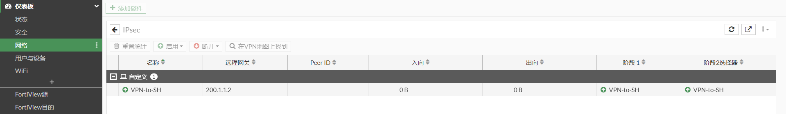
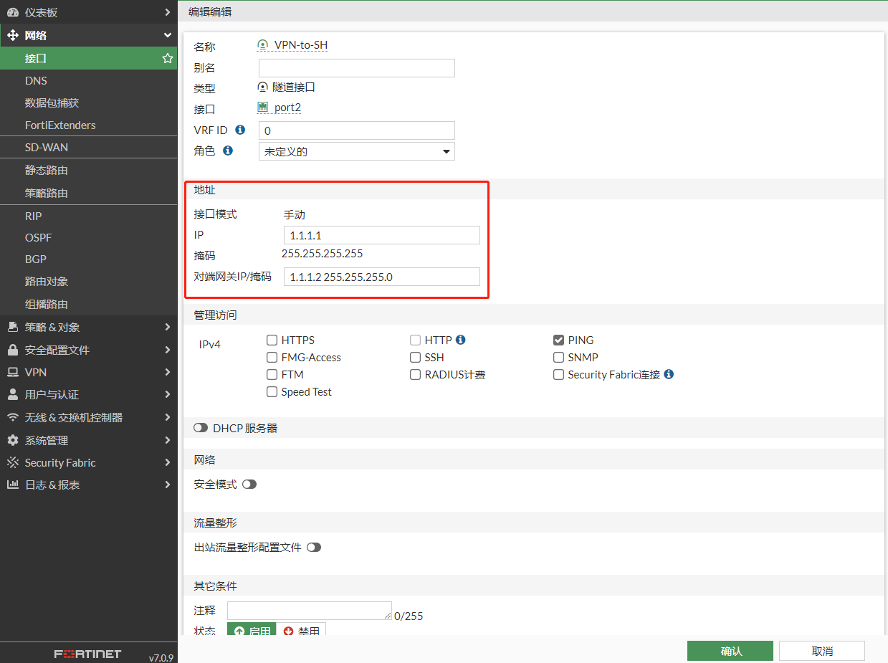
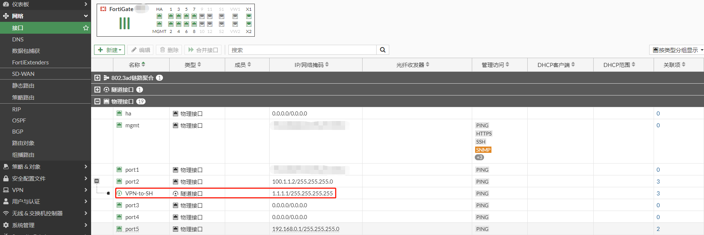
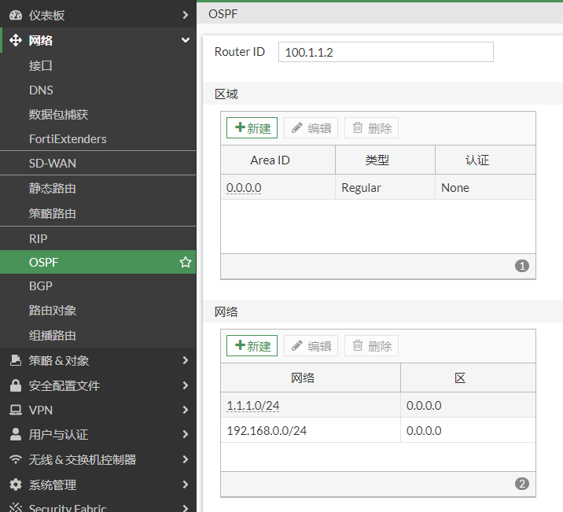

# GRE over IPSec

## 应用场景

传统的策略模式IPsec VPN无法运行组播、广播等数据，因此像OSPF/RIP等协议无法通过IPsec VPN直接运行，而需要借用GRE协议的辅助，GRE协议可封装组播、广播等数据，而IPsec又可将GRE协议封装在里面并且安全的加密，这样实现了通过互联网VPN安全的跑组播、广播等数据。

**飞塔的接口模式IPsec VPN可以直接运行OSPF/RIP协议，因此如果都是FortiGate设备则无需使用GRE Over IPsec，而直接使用接口模式的IPsec VPN即可实现GRE Over IPsec一样的功能。与友商对接的时候也应该优先选择接口模式，友商基本上都有类似FortiGate接口模式的IPsec VPN（思科叫VIT-Virtual Tunnel Interface模式的IPsec VPN），而不要再选择的GRE OVER IPsec，这个旧的技术基本上可以被接口模式完全替代。**

**那么什么时候需要用到GRE Over IPsec 呢？**

1. 替换友商运行了GRE over IPsec的设备

2. 或者对端设备为友商设备（且只能用GRE over IPsec进行对接）

如果全部都是飞塔防火墙，则推荐使用接口模式IPsec VPN直接运行路由协议即可。如果存在友商设备场景下，且必须用 GRE over IPsec，那就选择此方式进行对接和部署。

## 组网需求

通过GRE over IPsec VPN（接口模式）将2个局域网连接起来，实现192.168.0.0/24与192.168.1.0/24两个网段的通信，FGT-BJ和FGT-SH之间运行OSPF协议。

## 网络拓扑

PC1-----------(port5:192.168.0.1/24)FGT-BJ(port2:100.1.1.2)-------------Internet-------------(port2:200.1.1.2)FGT-SH(port5:192.168.1.1/24)-----------PC2

## 配置步骤

以FGT-BJ配置步骤为例，FGT-SH同理。

1. **基本配置**

   配置接口IP和路由

   

   

2. **配置GRE over IPSEC VPN**

   GRE over IPSEC VPN只能通过命令行配置

   ```
   VPN第一阶段配置：
   config vpn ipsec phase1-interface
       edit "VPN-to-SH"
           set interface "port2"
           set peertype any
           set net-device disable
           set proposal aes128-sha256 aes256-sha256 aes128-sha1 aes256-sha1
           set dpd on-idle
           set remote-gw 200.1.1.2
           set psksecret fortinet
           set dpd-retrycount 3
           set dpd-retryinterval 10
           set encapsulation gre
       next
   end
   
   VPN第二阶段的配置：
   config vpn ipsec phase2-interface
       edit "VPN-to-SH"
           set phase1name "VPN-to-SH"
           set proposal aes128-sha1 aes256-sha1 aes128-sha256 aes256-sha256 aes128gcm aes256gcm chacha20poly1305
           set auto-negotiate enable
           set encapsulation transport-mode
           set protocol 47
       next
   end
   ```

3. **配置防火墙策略**

   

4. **查看IPSEC VPN状态**

   此时VPN状态是UP的

   

   ```
   # diagnose vpn ike gateway list 
   
   vd: root/0
   name: VPN-to-SH
   version: 1
   interface: port2 10
   addr: 100.1.1.2:500 -> 200.1.1.2:500
   tun_id: 200.1.1.2/::200.1.1.2
   remote_location: 0.0.0.0
   network-id: 0
   created: 5s ago
   IKE SA: created 1/1  established 1/1  time 0/0/0 ms
   IPsec SA: created 2/2  established 2/2  time 0/0/0 ms
   
     id/spi: 35 5aefc0a3874aef73/d1fa063796f38bbb
     direction: initiator
     status: established 5-5s ago = 0ms
     proposal: aes128-sha256
     key: 35cc029e92fafcd2-1eb88678a2dd3d93
     lifetime/rekey: 86400/86094
     DPD sent/recv: 00000000/00000000
   
   # diagnose vpn  tunnel list 
   list all ipsec tunnel in vd 0
   ------------------------------------------------------
   name=VPN-to-SH ver=1 serial=9 100.1.1.2:0->200.1.1.2:0 tun_id=200.1.1.2 tun_id6=::200.1.1.2 dst_mtu=1500 dpd-link=on weight=1
   bound_if=10 lgwy=static/1 tun=intf mode=auto/1 encap=GRE/549 options[0225]=edg frag-rfc  run_state=0 role=primary accept_traffic=1 overlay_id=0
   
   encap-addr: 100.1.1.2->200.1.1.2
   proxyid_num=1 child_num=0 refcnt=4 ilast=6 olast=6 ad=/0
   stat: rxp=0 txp=0 rxb=0 txb=0
   dpd: mode=on-idle on=1 idle=10000ms retry=3 count=0 seqno=42
   natt: mode=none draft=0 interval=0 remote_port=0
   proxyid=VPN-to-SH proto=47 sa=2 ref=3 serial=1 auto-negotiate transport-mode
     src: 47:0.0.0.0-255.255.255.255:0
     dst: 47:0.0.0.0-255.255.255.255:0
     SA:  ref=3 options=8327 type=00 soft=0 mtu=1438 expire=42890/0B replaywin=2048
          seqno=1 esn=0 replaywin_lastseq=00000000 qat=0 rekey=0 hash_search_len=1
     life: type=01 bytes=0/0 timeout=42899/43200
     dec: spi=d4fb6a41 esp=aes key=16 a8da8882351e6d6f0a07ca6a8e9990fa
          ah=sha1 key=20 30e87d9cdb0ec7883005cd21c70cb75b41333a74
     enc: spi=9265e023 esp=aes key=16 8255103778ec791deb6dd576decb6859
          ah=sha1 key=20 479dd7e310e013112dcb9b4f9367c9686389efc5
     dec:pkts/bytes=0/0, enc:pkts/bytes=0/0
     npu_flag=00 npu_rgwy=200.1.1.2 npu_lgwy=100.1.1.2 npu_selid=14 dec_npuid=0 enc_npuid=0
     SA:  ref=3 options=8327 type=00 soft=0 mtu=1438 expire=42918/0B replaywin=2048
          seqno=1 esn=0 replaywin_lastseq=00000000 qat=0 rekey=0 hash_search_len=1
     life: type=01 bytes=0/0 timeout=42927/43200
     dec: spi=d4fb6a42 esp=aes key=16 3ef3be2fdb220fc740c3df3eb6955714
          ah=sha1 key=20 e1b9972a81d688cc32d160b0fc6060b57c42ccac
     enc: spi=9265e022 esp=aes key=16 a247b6207b2244b0ff7822fae3fab091
          ah=sha1 key=20 1c89fa4c89e197efa0886b23eaf722760c63b574
     dec:pkts/bytes=0/0, enc:pkts/bytes=0/0
     npu_flag=00 npu_rgwy=200.1.1.2 npu_lgwy=100.1.1.2 npu_selid=14 dec_npuid=0 enc_npuid=0
   run_tally=0
   ```

5. **配置IPSEC VPN接口地址**

   

   

   接口地址通过GRE over IPSEC能通互ping成功。

   ```
   # execute ping-options source 1.1.1.1
   # execute ping 1.1.1.2
   PING 1.1.1.2 (1.1.1.2): 56 data bytes
   64 bytes from 1.1.1.2: icmp_seq=0 ttl=255 time=0.7 ms
   64 bytes from 1.1.1.2: icmp_seq=1 ttl=255 time=0.3 ms
   64 bytes from 1.1.1.2: icmp_seq=2 ttl=255 time=0.5 ms
   64 bytes from 1.1.1.2: icmp_seq=3 ttl=255 time=0.4 ms
   64 bytes from 1.1.1.2: icmp_seq=4 ttl=255 time=0.6 ms
   
   --- 1.1.1.2 ping statistics ---
   5 packets transmitted, 5 packets received, 0% packet loss
   round-trip min/avg/max = 0.3/0.5/0.7 ms
   
   # get router info routing-table all 
   Codes: K - kernel, C - connected, S - static, R - RIP, B - BGP
          O - OSPF, IA - OSPF inter area
          N1 - OSPF NSSA external type 1, N2 - OSPF NSSA external type 2
          E1 - OSPF external type 1, E2 - OSPF external type 2
          i - IS-IS, L1 - IS-IS level-1, L2 - IS-IS level-2, ia - IS-IS inter area
          * - candidate default
   
   Routing table for VRF=0
   S*      0.0.0.0/0 [10/0] via 100.1.1.1, port2, [1/0]
   S       1.1.1.0/24 [5/0] via VPN-to-SH tunnel 200.1.1.2, [1/0]
   C       1.1.1.1/32 is directly connected, VPN-to-SH
   C       100.1.1.0/24 is directly connected, port2
   C       192.168.0.0/24 is directly connected, port5
   C       192.168.88.0/24 is directly connected, mgmt
   C       192.168.89.0/24 is directly connected, port1
   ```

6. **配置OSPF**

   

   查看OSPF邻居和路由

   ```
   # get router info ospf neighbor 
   OSPF process 0, VRF 0:
   Neighbor ID     Pri   State           Dead Time   Address         Interface
   200.1.1.2         1   Full/ -         00:00:34    1.1.1.2         VPN-to-SH(tun-id:200.1.1.2)
   
   # get router info routing-table all
   Codes: K - kernel, C - connected, S - static, R - RIP, B - BGP
          O - OSPF, IA - OSPF inter area
          N1 - OSPF NSSA external type 1, N2 - OSPF NSSA external type 2
          E1 - OSPF external type 1, E2 - OSPF external type 2
          i - IS-IS, L1 - IS-IS level-1, L2 - IS-IS level-2, ia - IS-IS inter area
          * - candidate default
   Routing table for VRF=0
   S*      0.0.0.0/0 [10/0] via 100.1.1.1, port2, [1/0]
   S       1.1.1.0/24 [5/0] via VPN-to-SH tunnel 200.1.1.2, [1/0]
   C       1.1.1.1/32 is directly connected, VPN-to-SH
   O       1.1.1.2/32 [110/100] via VPN-to-SH tunnel 200.1.1.2, 00:00:01
   C       100.1.1.0/24 is directly connected, port2
   C       192.168.0.0/24 is directly connected, port5
   O       192.168.1.0/24 [110/101] via VPN-to-SH tunnel 200.1.1.2, 00:00:01
   ```
   
   

