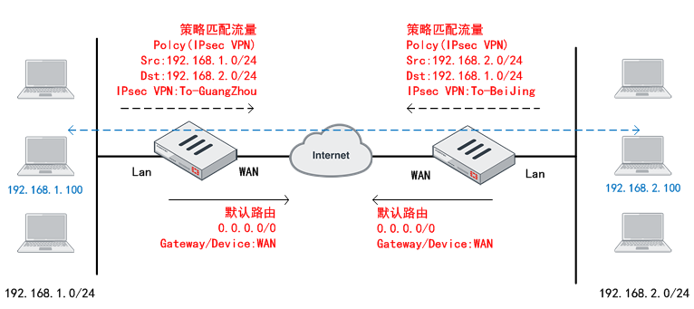

# IPSec的两种配置模式

## **FortiGate IPsec VPN的两种配置模式**

**接口模式（默认，推荐使用）：**

接口模式作为默认的IPsec VPN方式，FortiGate会自动创建一个IPsec VPN Tunnel接口，然后通过路由将感兴趣流指向IPsec VPN Tunnel，什么样的感兴趣流走IPsec VPN，由路由来决定，配置简单易懂，使用非常灵活，推荐使用。

LAN和To-GuangZhou的接口之间通信需满足：

- IPsec VPN隧道UP
- 路由正确
- 策略放通

**策略模式（默认隐藏，需要在Features中开启才能使用，不推荐使用）：**

通过策略匹配出感兴趣流，然后再策略中调用IPsec VPN，是一种较为传统的IPsec VPN连接方式，一般较少使用，通常推荐使用接口模式IPsec VPN。

IPsec VPN建立起来之后，通过策略将流量匹配，只有感兴趣流才走IPsec VPN，而其他普通数据则走普通的路由从WAN口出去，不会自动生成IPsec tunnel接口，因此不再需要也不能配置指向VPN tunnel的路由。

## **接口模式 VS 策略模式 **

**为什么FGT默认把策略模式隐藏，而推荐大家使用接口模式呢？**

- 策略模式能实现的，几乎接口模式都能实现；
- 接口模式能实现的，策略模式不一定能够实现，例如：GRE OVER IPSEC、隧道上直接跑动态路由协议（RIP/OSPF/BGP）；
- 对于安全设备来说，生成一个VPN-Tunnel接口，策略配置起来的时候，思路更加简单清晰；
- 第二阶段感兴趣流可以配置为any_to_any，感兴趣流量通过路由来引导，而不需要定义与配置复杂的第二阶段感兴趣流；
- 接口模式支持ADVPN，更加适应各种复杂的组网环境；
- 接口模式支持IPv4和IPv6，而策略模式仅支持IPv4。
