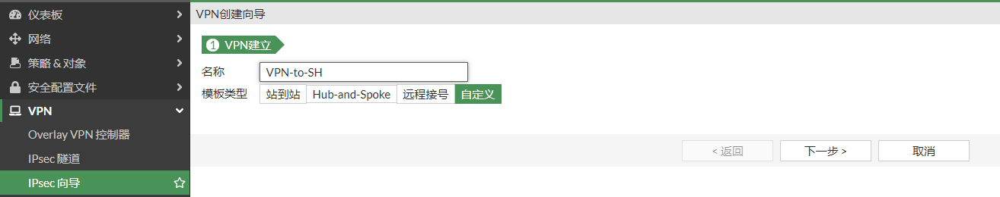
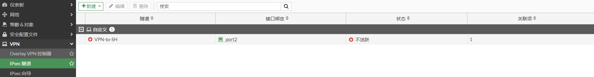

# VPN隧道上运行OSPF或BGP

## 组网需求

通过IPsec VPN（接口模式）将2个局域网连接起来，实现192.168.0.0/24与192.168.1.0/24两个网段的通信。FGT-BJ和FGT-SH通过OSP或者BGP协议动态的学习到对方的路由。

## 网络拓扑

PC1-----------(port5:192.168.0.1/24)FGT-BJ(port2:100.1.1.2)-------------Internet-------------(port2:200.1.1.2)FGT-SH(port5:192.168.1.1/24)-----------PC2

### 配置步骤

以FGT-BJ配置步骤为例，FGT-SH同理。

1. **基本配置**

   配置接口IP和路由

   

   

2. **配置IPSEC VPN**

   选择“VPN”-->“IPsec隧道”，点击“新建”，选择“IPsec隧道”。

   

   选择“自定义”

   

   IPSEC VPN阶段一配置

   

   IPSEC VPN阶段二配置

   

   

3. **配置IPSEC策略**

   

4. **查看IPSEC状态**

   如果对端配置已配置完成，此时IPSEC状态是UP的。

   

5. **配置IPSEC接口IP**

   为隧道接口分配IP用于动态路由协议

   

   

   对应的命令行

   ```
   config system interface
       edit "VPN-to-SH"
           set vdom "root"
           set ip 1.1.1.1 255.255.255.255
           set allowaccess ping
           set type tunnel
           set remote-ip 1.1.1.2 255.255.255.0
           set interface "port2"
       next
   end
   ```

   查看路由表

   ```
   # get router info routing-table  all 
   Codes: K - kernel, C - connected, S - static, R - RIP, B - BGP
          O - OSPF, IA - OSPF inter area
          N1 - OSPF NSSA external type 1, N2 - OSPF NSSA external type 2
          E1 - OSPF external type 1, E2 - OSPF external type 2
          i - IS-IS, L1 - IS-IS level-1, L2 - IS-IS level-2, ia - IS-IS inter area
          * - candidate default
   
   Routing table for VRF=0
   S*      0.0.0.0/0 [10/0] via 100.1.1.1, port2, [1/0]
   S       1.1.1.0/24 [5/0] via VPN-to-SH tunnel 200.1.1.2, [1/0]
   C       1.1.1.1/32 is directly connected, VPN-to-SH
   C       100.1.1.0/24 is directly connected, port2
   C       192.168.0.0/24 is directly connected, port5
   ```

   ping测试，能够正常ping通对端的IPSEC接口地址

   ```
   # execute ping-options source 1.1.1.1
   # execute ping 1.1.1.2
   PING 1.1.1.2 (1.1.1.2): 56 data bytes
   64 bytes from 1.1.1.2: icmp_seq=0 ttl=255 time=0.5 ms
   64 bytes from 1.1.1.2: icmp_seq=1 ttl=255 time=0.4 ms
   64 bytes from 1.1.1.2: icmp_seq=2 ttl=255 time=0.5 ms
   64 bytes from 1.1.1.2: icmp_seq=3 ttl=255 time=0.6 ms
   64 bytes from 1.1.1.2: icmp_seq=4 ttl=255 time=0.5 ms
   
   --- 1.1.1.2 ping statistics ---
   5 packets transmitted, 5 packets received, 0% packet loss
   round-trip min/avg/max = 0.4/0.5/0.6 ms
   ```

6. **使用OSPF或者BGP学习路由**

   **配置OSPF**

   

   当对端也配置完成后，则可以建立OSPF邻居，并学习到对端的路由。

   ```
   # get router info ospf neighbor 
   OSPF process 0, VRF 0:
   Neighbor ID     Pri   State           Dead Time   Address         Interface
   200.1.1.2         1   Full/ -         00:00:39    1.1.1.2         VPN-to-SH(tun-id:200.1.1.2)
   
   # get router info routing-table  all 
   Codes: K - kernel, C - connected, S - static, R - RIP, B - BGP
          O - OSPF, IA - OSPF inter area
          N1 - OSPF NSSA external type 1, N2 - OSPF NSSA external type 2
          E1 - OSPF external type 1, E2 - OSPF external type 2
          i - IS-IS, L1 - IS-IS level-1, L2 - IS-IS level-2, ia - IS-IS inter area
          * - candidate default
   
   Routing table for VRF=0
   S*      0.0.0.0/0 [10/0] via 100.1.1.1, port2, [1/0]
   S       1.1.1.0/24 [5/0] via VPN-to-SH tunnel 200.1.1.2, [1/0]
   C       1.1.1.1/32 is directly connected, VPN-to-SH
   O       1.1.1.2/32 [110/100] via VPN-to-SH tunnel 200.1.1.2, 00:01:44
   C       100.1.1.0/24 is directly connected, port2
   C       192.168.0.0/24 is directly connected, port5
   O       192.168.1.0/24 [110/101] via VPN-to-SH tunnel 200.1.1.2, 00:01:4
   ```

   **配置BGP**

   
   
   当对端也配置完成后，则可以建立BGP邻居，并学习到对端的路由。
   
   ```
   # get router info bgp neighbors 
   VRF 0 neighbor table:
   BGP neighbor is 1.1.1.2, remote AS 65001, local AS 65001, internal link
     BGP version 4, remote router ID 200.1.1.2
     BGP state = Established, up for 00:08:37
     Last read 00:00:03, hold time is 180, keepalive interval is 60 seconds
     Configured hold time is 180, keepalive interval is 60 seconds
     Neighbor capabilities:
       Route refresh: advertised and received (old and new)
       Address family IPv4 Unicast: advertised and received
       Address family IPv6 Unicast: advertised and received
     Received 12 messages, 0 notifications, 0 in queue
     Sent 12 messages, 0 notifications, 0 in queue
     Route refresh request: received 0, sent 0
     NLRI treated as withdraw: 0
     Minimum time between advertisement runs is 30 seconds
     Update source is VPN-to-SH
    For address family: IPv4 Unicast
     BGP table version 1, neighbor version 1
     Index 1, Offset 0, Mask 0x2
     Inbound soft reconfiguration allowed
     NEXT_HOP is always this router
     Community attribute sent to this neighbor (both)
     0 accepted prefixes, 0 prefixes in rib
     1 announced prefixes
    For address family: IPv6 Unicast
     BGP table version 1, neighbor version 1
     Index 1, Offset 0, Mask 0x2
     Community attribute sent to this neighbor (both)
     0 accepted prefixes, 0 prefixes in rib
     0 announced prefixes
    Connections established 1; dropped 0
   Local host: 1.1.1.1, Local port: 179
   Foreign host: 1.1.1.2, Foreign port: 15455
   Egress interface: 41
   Nexthop: 1.1.1.1
   Nexthop interface: VPN-to-SH
   Nexthop global: ::
   Nexthop local: ::
   BGP connection: non shared network
   ```
   
   ```
   # get router info routing-table all 
   Codes: K - kernel, C - connected, S - static, R - RIP, B - BGP
          O - OSPF, IA - OSPF inter area
          N1 - OSPF NSSA external type 1, N2 - OSPF NSSA external type 2
          E1 - OSPF external type 1, E2 - OSPF external type 2
          i - IS-IS, L1 - IS-IS level-1, L2 - IS-IS level-2, ia - IS-IS inter area
          * - candidate default
   
   Routing table for VRF=0
   S*      0.0.0.0/0 [10/0] via 100.1.1.1, port2, [1/0]
   S       1.1.1.0/24 [5/0] via VPN-to-SH tunnel 200.1.1.2, [1/0]
   C       1.1.1.1/32 is directly connected, VPN-to-SH
   C       100.1.1.0/24 is directly connected, port2
   C       192.168.0.0/24 is directly connected, port5
   ```
   
   
