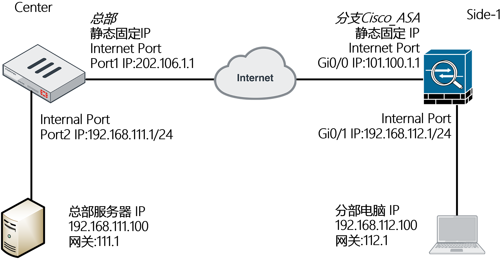
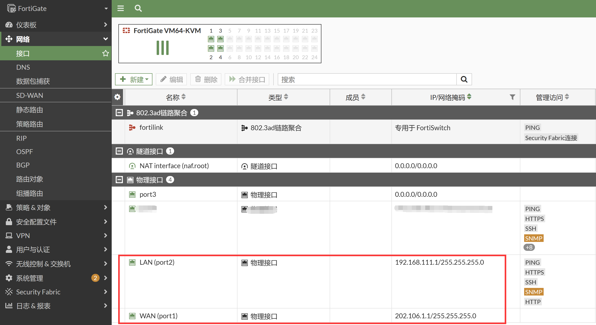
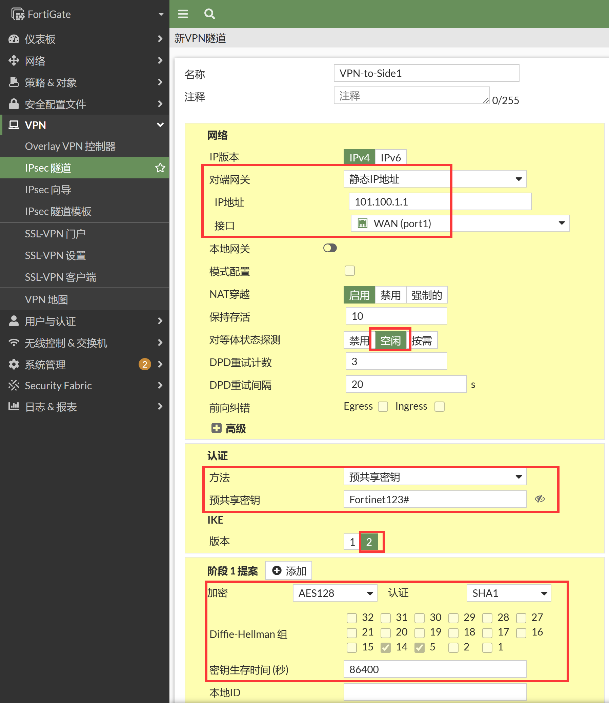
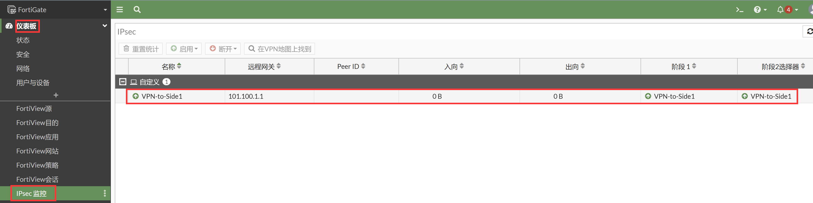

# 和思科ASA防火墙建立IPSec VPN(IKE v2)

## 组网需求

如图所示，通过IPsec VPN（接口模式）将2个局域网连接起来，实现192.168.111.0/24与192.168.112.0/24两个网段的通信。与思科ASA防火墙进行IPsec VPN（IKE v2）对接。

## 网络拓扑



## 配置要点

- 配置FortiGate
  - 基本上网配置
  - 配置IPsec VPN
- 配置Cisco_ASA防火墙
  - 基本上网配置
  - 配置IPsec VPN
- 说明：如果要删除IPSEC VPN第一阶段、第二阶段时，需要先删除被调用的路由与防火墙安全策略

## 配置步骤

### FortiGate

1. 基本上网配置。

   

   

2. 配置IPSec VPN，进入VPN→IPSec隧道，点击新建→IPSec隧道按钮。

   

3. 选择IPsec VPN自定义模板进行配置，点击下一步。

   

4. 配置网络、认证、第一阶段。

   

   ```
   config vpn ipsec phase1-interface
       edit "VPN-to-Side1"
           set interface "port1"
           set ike-version 2
           set peertype any
           set net-device disable
           set proposal aes128-sha1
           set dpd on-idle
           set remote-gw 101.100.1.1
           set psksecret ENC /HISpjoxUQ1RoRXahwT2OpZmuyYsDY818arB4Q93PztlW0oynlDWuKIk1WIAXFLNldoVFlgOOjBk9Bf9tc6LdI/BeD6CmRvgokNIKa5fVnVgxXLzHM9fPGvtRXb362jpxZkMxuKHcNGVrJCimmjVGAS+gixHgh8mRLj5kaMAbyhNX1odwNNgxYcxqap5iAwncL3ZzQ==
       next
   end
   ```

5. 配置第二阶段。

   

   ```
   config vpn ipsec phase2-interface
       edit "VPN-to-Side1"
           set phase1name "VPN-to-Side1"
           set proposal aes128-sha1
           set auto-negotiate enable
       next
   end
   ```

6. 配置VPN相关的网段地址对象和防火墙策略。

   

   

   ```
   config firewall address
       edit "Local_192.168.111.0/24"
           set subnet 192.168.111.0 255.255.255.0
       next
       edit "Remote_192.168.112.0/24"
           set subnet 192.168.112.0 255.255.255.0
       next
   end
   
   config firewall policy
       edit 1
           set name "VPN-Local-to-Side1"
           set srcintf "port2"
           set dstintf "VPN-to-Side1"
           set action accept
           set srcaddr "Local_192.168.111.0/24"
           set dstaddr "Remote_192.168.112.0/24"
           set schedule "always"
           set service "ALL"
       next
       edit 2
           set name "VPN-Side1-to-Local"
           set srcintf "VPN-to-Side1"
           set dstintf "port2"
           set action accept
           set srcaddr "Remote_192.168.112.0/24"
           set dstaddr "Local_192.168.111.0/24"
           set schedule "always"
           set service "ALL"
       next
   end
   ```

7. 配置VPN业务网段的静态路由。

   

   ```
   config router static
       edit 1
           set gateway 202.106.1.254
           set device "port1"
       next
       edit 2
           set dst 192.168.112.0 255.255.255.0
           set device "VPN-to-Side1"
       next
       edit 3
           set dst 192.168.112.0 255.255.255.0
           set distance 254
           set blackhole enable
       next
   end
   ```

### Cisco Router

1. 基本上网配置。

   ```
    interface GigabitEthernet0/0
    nameif Outside
    security-level 0
    ip address 101.100.1.1 255.255.255.0
    no shutdown
    !
    interface GigabitEthernet0/1
    nameif Inside
    security-level 100
    ip address 192.168.112.1 255.255.255.0
    no shutdown
    !
    route Outside 0.0.0.0 0.0.0.0 101.100.1.254
   
    object network Inside_Net_192.168.112.0
    subnet 192.168.112.0 255.255.255.0
   
    object network Inside_Net_192.168.112.0
    nat (Inside,Outside) dynamic interface
   
    policy-map global_policy
    class inspection_default
      inspect icmp
      inspect icmp error
   ```

2. IPsec IKEv2的配置。

   ```
    crypto ikev2 enable Outside
   
    crypto ikev2 policy 10
     encryption aes-256 aes-192 aes 3des
     integrity sha256 sha md5
     group 14 5
     prf sha256 sha md5
     lifetime seconds 86400
    !
    tunnel-group 202.106.1.1 type ipsec-l2l
    tunnel-group 202.106.1.1 ipsec-attributes
     ikev2 remote-authentication pre-shared-key Fortinet123#
     ikev2 local-authentication pre-shared-key Fortinet123#
    ! 
    crypto ipsec ikev2 ipsec-proposal MY_IPsec_Proposal
     protocol esp encryption aes-256 aes-192 aes 3des
     protocol esp integrity sha-256 sha-1 md5
   
    crypto ipsec profile MY_IPsec_Profile
     set ikev2 ipsec-proposal MY_IPsec_Proposal
     set pfs group5
   
    interface Tunnel0
    nameif VPN
    ip address 1.1.1.2 255.255.255.0
    tunnel source interface Outside
    tunnel destination 202.106.1.1
    tunnel mode ipsec ipv4
    tunnel protection ipsec profile MY_IPsec_Profile
    !
    management-access Inside     //为了可以让Inside接口可以被ping通。
    !
    route VPN 192.168.111.0 255.255.255.0 1.1.1.1
   ```

## 结果验证

1. FortiGate上查看IPSec隧道建立，在仪表盘新建IPSec监控，可以看到IPSec建立成功。

   

2. 查看FortiGate的路由表。

   ```
   FortiGate # get router info routing-table all
   Codes: K - kernel, C - connected, S - static, R - RIP, B - BGP
          O - OSPF, IA - OSPF inter area
          N1 - OSPF NSSA external type 1, N2 - OSPF NSSA external type 2
          E1 - OSPF external type 1, E2 - OSPF external type 2
          i - IS-IS, L1 - IS-IS level-1, L2 - IS-IS level-2, ia - IS-IS inter area
          * - candidate default
   
   Routing table for VRF=0
   S*      0.0.0.0/0 [10/0] via 202.106.1.254, port1, [1/0]
   C       192.168.111.0/24 is directly connected, port2
   S       192.168.112.0/24 [10/0] via VPN-to-Side1 tunnel 101.100.1.1, [1/0]
   C       202.106.1.0/24 is directly connected, port1
   ```

3. FortiGate侧业务测试。

   ```
   FortiGate # execute ping-options source 192.168.111.1
   
   FortiGate # execute ping 192.168.112.1
   PING 192.168.112.1 (192.168.112.1): 56 data bytes
   64 bytes from 192.168.112.1: icmp_seq=0 ttl=255 time=1.0 ms
   64 bytes from 192.168.112.1: icmp_seq=1 ttl=255 time=1.2 ms
   64 bytes from 192.168.112.1: icmp_seq=2 ttl=255 time=0.9 ms
   64 bytes from 192.168.112.1: icmp_seq=3 ttl=255 time=1.1 ms
   64 bytes from 192.168.112.1: icmp_seq=4 ttl=255 time=1.0 ms
   
   --- 192.168.112.1 ping statistics ---
   5 packets transmitted, 5 packets received, 0% packet loss
   round-trip min/avg/max = 0.9/1.0/1.2 ms
   ```

4. 查看FortiGate隧道状态。

   ```
   FortiGate # diagnose vpn ike gateway list
   vd: root/0
   name: VPN-to-Side1
   version: 2
   interface: port1 3
   addr: 202.106.1.1:500 -> 101.100.1.1:500
   tun_id: 101.100.1.1/::101.100.1.1
   remote_location: 0.0.0.0
   network-id: 0
   created: 36s ago
   PPK: no
   IKE SA: created 1/1  established 1/1  time 0/0/0 ms
   IPsec SA: created 1/1  established 1/1  time 0/0/0 ms
     id/spi: 134 11aa3d39fcd93c44/852e6b5523a3345d
     direction: initiator
     status: established 36-36s ago = 0ms
     proposal: aes256-sha1
     child: no
     SK_ei: 88ce24e4a2611994-bffb25c2d0ba869b-57e6a55b89508df1-b570966836823c48
     SK_er: 0dadc56cac99ad39-b507dff27d037bb1-33c8ef3555410c03-7e8383322010cb35
     SK_ai: 7481bc53c4d20b62-c9770a0695f2a2a1-0209ff70
     SK_ar: 150cadb3c206c29d-49f33c62d553fb0c-f87d3bf1
     PPK: no
     message-id sent/recv: 2/3
     lifetime/rekey: 86400/86063
     DPD sent/recv: 00000000/00000000
   
   FortiGate # diagnose vpn tunnel list
   list all ipsec tunnel in vd 0
   ------------------------------------------------------
   name=VPN-to-Side1 ver=2 serial=1 202.106.1.1:0->101.100.1.1:0 tun_id=101.100.1.1 tun_id6=::101.100.1.1 dst_mtu=1500 dpd-link=on weight=1
   bound_if=3 lgwy=static/1 tun=intf mode=auto/1 encap=none/552 options[0228]=npu frag-rfc  run_state=0 role=primary accept_traffic=1 overlay_id=0
   proxyid_num=1 child_num=0 refcnt=4 ilast=12 olast=12 ad=/0
   stat: rxp=0 txp=0 rxb=0 txb=0
   dpd: mode=on-idle on=1 idle=20000ms retry=3 count=0 seqno=37
   natt: mode=none draft=0 interval=0 remote_port=0
   proxyid=VPN-to-Side1 proto=0 sa=1 ref=2 serial=1 auto-negotiate
     src: 0:0.0.0.0-255.255.255.255:0
     dst: 0:0.0.0.0-255.255.255.255:0
     SA:  ref=3 options=38203 type=00 soft=0 mtu=1438 expire=42847/0B replaywin=2048
          seqno=1 esn=0 replaywin_lastseq=00000000 qat=0 rekey=0 hash_search_len=1
     life: type=01 bytes=0/0 timeout=42903/43200
     dec: spi=24c2ab68 esp=aes key=16 3de80d9ea806f7d02167116ef729d135
          ah=sha1 key=20 f05476e4cee8fab25811105c92ea6e5ccf8fd1e4
     enc: spi=0dd3fc4c esp=aes key=16 def29e57dd9b54801a3f31b9a6a920cb
          ah=sha1 key=20 adbfb39e5fe95fb385215da6a73113902bed6c4f
     dec:pkts/bytes=0/0, enc:pkts/bytes=0/0
     npu_flag=00 npu_rgwy=101.100.1.1 npu_lgwy=202.106.1.1 npu_selid=0 dec_npuid=0 enc_npuid=0
   run_tally=0
   ```
   
5. Cisco_Router侧业务测试。

   ```
   ciscoasa#ping 192.168.111.1 source 192.168.112.1 repeat 100   
   Type escape sequence to abort.
   Sending 100, 100-byte ICMP Echos to 192.168.111.1, timeout is 2 seconds:
   Packet sent with a source address of 192.168.112.1 
   !!!!!!!!!!!!!!!!!!!!!!!!!!!!!!!!!!!!!!!!!!!!!!!!!!!!!!!!!!!!!!!!!!!!!!
   !!!!!!!!!!!!!!!!!!!!!!!!!!!!!!
   Success rate is 100 percent (100/100), round-trip min/avg/max = 1/4/7 ms
   
   ciscoasa(config)# show crypto ikev2 sa
   IKEv2 SAs:
   Session-id:2, Status:UP-ACTIVE, IKE count:1, CHILD count:1
   Tunnel-id Local                                               Remote                                                  Status         Role
    38557965 101.100.1.1/500                                     202.106.1.1/500                                          READY    RESPONDER
         Encr: AES-CBC, keysize: 256, Hash: SHA96, DH Grp:14, Auth sign: PSK, Auth verify: PSK
         Life/Active Time: 86400/73 sec
   Child sa: local selector  0.0.0.0/0 - 255.255.255.255/65535
             remote selector 0.0.0.0/0 - 255.255.255.255/65535
             ESP spi in/out: 0xdd3fc4c/0x24c2ab68 
   ```
   
6. FortiGate侧抓包查看。

   ```
   FortiGate # dia sni pa any "host 192.168.112.1 or host 101.100.1.1" 4
   Using Original Sniffing Mode
   interfaces=[any]
   filters=[host 192.168.112.1 or host 101.100.1.1]
   9.068586 VPN-to-Side1 out 192.168.111.1 -> 192.168.112.1: icmp: echo request
   9.068748 port1 out 202.106.1.1 -> 101.100.1.1: ESP(spi=0x0dd3fc4c,seq=0x2)
   9.072619 port1 in 101.100.1.1 -> 202.106.1.1: ESP(spi=0x24c2ab68,seq=0x1)
   9.072669 VPN-to-Side1 in 192.168.112.1 -> 192.168.111.1: icmp: echo reply
   10.069075 VPN-to-Side1 out 192.168.111.1 -> 192.168.112.1: icmp: echo request
   10.069097 port1 out 202.106.1.1 -> 101.100.1.1: ESP(spi=0x0dd3fc4c,seq=0x3)
   10.071135 port1 in 101.100.1.1 -> 202.106.1.1: ESP(spi=0x24c2ab68,seq=0x2)
   10.071155 VPN-to-Side1 in 192.168.112.1 -> 192.168.111.1: icmp: echo reply
   11.069398 VPN-to-Side1 out 192.168.111.1 -> 192.168.112.1: icmp: echo request
   11.069418 port1 out 202.106.1.1 -> 101.100.1.1: ESP(spi=0x0dd3fc4c,seq=0x4)
   11.071456 port1 in 101.100.1.1 -> 202.106.1.1: ESP(spi=0x24c2ab68,seq=0x3)
   11.071483 VPN-to-Side1 in 192.168.112.1 -> 192.168.111.1: icmp: echo reply
   12.069674 VPN-to-Side1 out 192.168.111.1 -> 192.168.112.1: icmp: echo request
   12.069695 port1 out 202.106.1.1 -> 101.100.1.1: ESP(spi=0x0dd3fc4c,seq=0x5)
   12.071430 port1 in 101.100.1.1 -> 202.106.1.1: ESP(spi=0x24c2ab68,seq=0x4)
   12.071450 VPN-to-Side1 in 192.168.112.1 -> 192.168.111.1: icmp: echo reply
   13.069841 VPN-to-Side1 out 192.168.111.1 -> 192.168.112.1: icmp: echo request
   13.069861 port1 out 202.106.1.1 -> 101.100.1.1: ESP(spi=0x0dd3fc4c,seq=0x6)
   13.071790 port1 in 101.100.1.1 -> 202.106.1.1: ESP(spi=0x24c2ab68,seq=0x5)
   13.071809 VPN-to-Side1 in 192.168.112.1 -> 192.168.111.1: icmp: echo reply
   ```

### 说明

1. 关于sniffer抓VPN业务和ESP的包：

   - 抓取IPsec VPN的IKE协商包：

     ```
     diagnose sniffer packet any "host 101.1.1.1 and (port 500 or port 4500)" 4
     ```

   - 抓取IPsec VPN的ESP加密数据包：

     ```
     diagnose sniffer packet any "host 101.1.1.1 and esp" 4
     ```

   - 抓取IPsec VPN的明文业务数据包：

     ```
     diagnose sniffer packet any "host 192.168.112.100 and icmp" 4
     ```

   - 注意：由于硬件设备存在IPsec VPN芯片加速，因此可能数据包会抓不完全，主要指“ESP数据和明文业务数据”抓不全，因此有时候需要将VPN隧道的NP加速关闭：

     ```
     FortiGate # config vpn ipsec phase1-interface        
     FortiGate (phase1-interface) # edit BJ-OSPF-TO-SH        
     FortiGate (BJ-OSPF-TO-SH) # set npu-offload disable                                            FortiGate (BJ-OSPF-TO-SH) # end
     ```

2. Cisco Router IPsec VPN传统的Crypto MAP的配置方式（上述为VTI方式的IPsec VPN）。

   ```
   FortiGate 只需要修改IPsec VPN的第二阶段（添加明确的感兴趣流即可），其他的所有配置不变：
   config vpn ipsec phase2-interface
       edit "VPN-TO-Side1"
           set phase1name "VPN-TO-Side1"
           set proposal 3des-md5 aes128-sha1
           set auto-negotiate enable
           set src-subnet 192.168.111.0 255.255.255.0
           set dst-subnet 192.168.112.0 255.255.255.0
       next
   end
   
   Cisco_ASA配置：
   hostname ASA-FW
   !
   interface GigabitEthernet0/0
   nameif Outside
   security-level 0
   ip address 101.100.1.1 255.255.255.0
   !
   interface GigabitEthernet0/1
   nameif Inside
   security-level 100
   ip address 192.168.112.1 255.255.255.0
   !
   route Outside 0.0.0.0 0.0.0.0 101.100.1.254 1
   object network Inside_Net_192.168.112.0
   subnet 192.168.112.0 255.255.255.0
   object network Inside_Net_192.168.112.0
   nat (Inside,Outside) dynamic interface
   object network Remote_VPN_Net_192.168.111.0
   subnet 192.168.111.0 255.255.255.0
   policy-map global_policy
   class inspection_default
     inspect icmp
     inspect icmp error
   crypto ikev2 enable Outside
   crypto ikev2 policy 10
    encryption aes-256 aes-192 aes 3des
    integrity sha256 sha md5
    group 14 5
    prf sha256 sha md5
    lifetime seconds 86400
   tunnel-group 202.106.1.1 type ipsec-l2l
   tunnel-group 202.106.1.1 ipsec-attributes
    ikev2 remote-authentication pre-shared-key Fortinet123#
    ikev2 local-authentication pre-shared-key Fortinet123#
   crypto ipsec ikev2 ipsec-proposal MY_IPsec_Proposal
    protocol esp encryption aes-256 aes-192 aes 3des
    protocol esp integrity sha-256 sha-1 md5
   access-list VPN-Traffic extended permit ip object Inside_Net_192.168.112.0 object Remote_VPN_Net_192.168.111.0
   crypto map MY_IPsec_MAP 10 match address VPN-Traffic
   crypto map MY_IPsec_MAP 10 set pfs group5
   crypto map MY_IPsec_MAP 10 set peer 202.106.1.1
   crypto map MY_IPsec_MAP 10 set ikev2 ipsec-proposal MY_IPsec_Proposal
   crypto map MY_IPsec_MAP interface Outside
   nat (Inside,Outside) source static Inside_Net_192.168.112.0 Inside_Net_192.168.112.0 destination static Remote_VPN_Net_192.168.111.0 Remote_VPN_Net_192.168.111.0 //使用Twice NAT将VPN流量在NAT中Bypass掉
   ```
