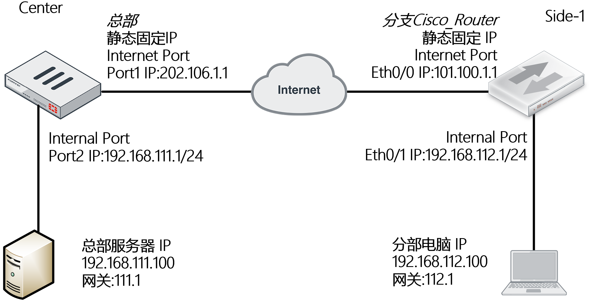
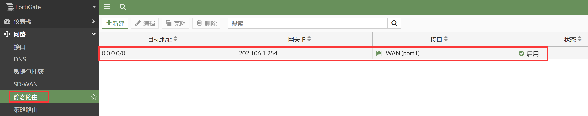
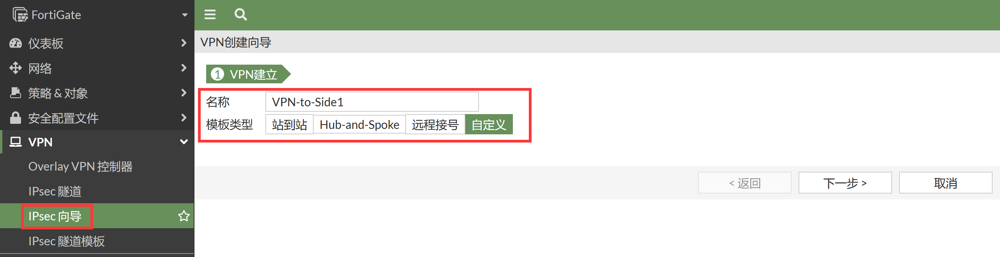
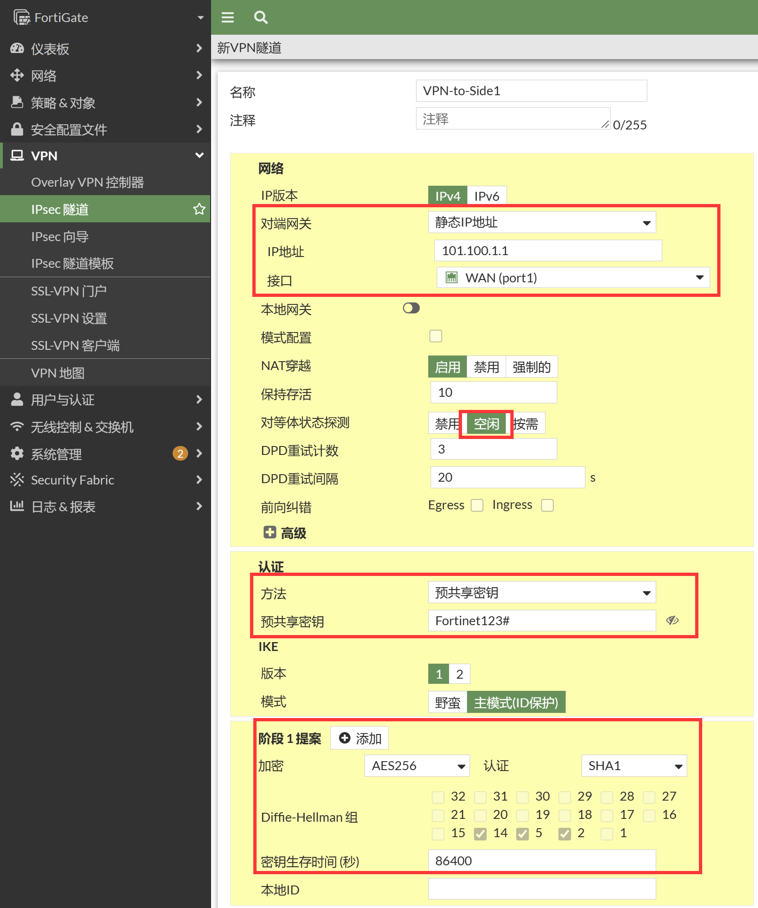
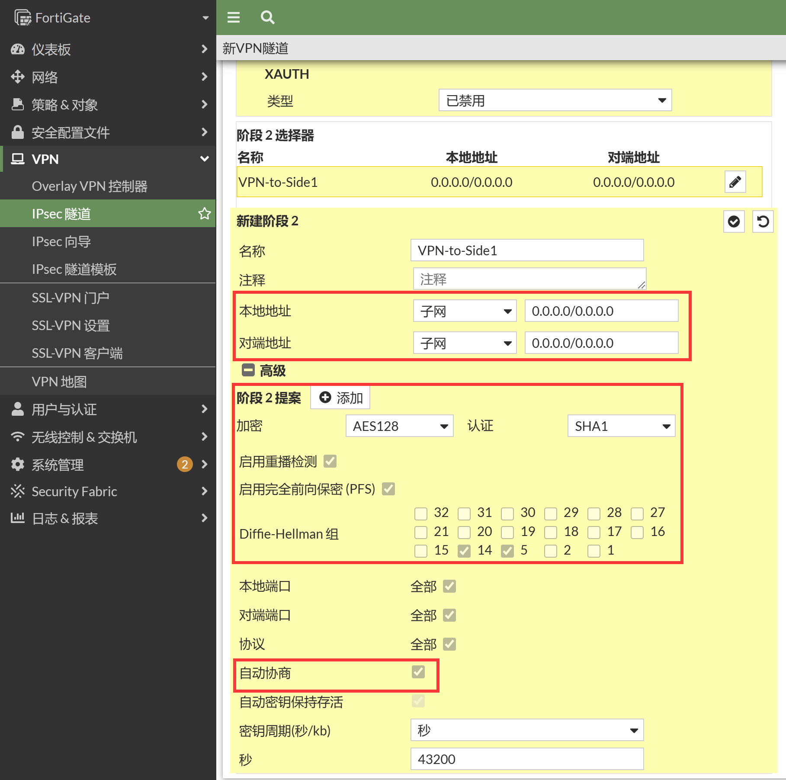
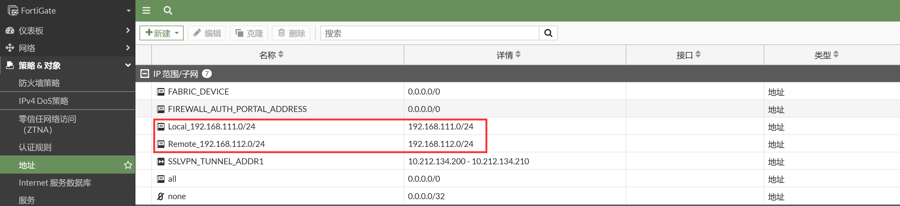
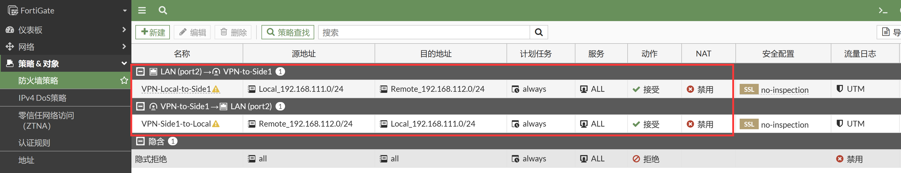

# 和思科路由器建立IPSec VPN(IKE v1)

## 组网需求

如图所示，通过IPsec VPN（接口模式）将2个局域网连接起来，实现192.168.111.0/24与192.168.112.0/24两个网段的通信。与思科路由器进行IPsec VPN（IKE v1）对接。

## 网络拓扑



## 配置要点

- 配置FortiGate
  - 基本上网配置
  - 配置IPsec VPN
- 配置Cisco_Router
  - 基本上网配置
  - 配置IPsec VPN
- 说明：如果要删除IPSEC VPN第一阶段、第二阶段时，需要先删除被调用的路由与防火墙安全策略

## 配置步骤

### FortiGate

1. 基本上网配置。

   

   

2. 配置IPSec VPN，进入VPN→IPSec隧道，点击新建→IPSec隧道按钮。

   

3. 选择IPsec VPN自定义模板进行配置，点击下一步。

   

4. 配置网络、认证、第一阶段。

   

   ```
   config vpn ipsec phase1-interface
       edit "VPN-to-Side1"
           set interface "port1"
           set peertype any
           set net-device disable
           set proposal aes256-sha1
           set dpd on-idle
           set dhgrp 14 5 2
           set remote-gw 101.100.1.1
           set psksecret ENC /HISpjoxUQ1RoRXahwT2OpZmuyYsDY818arB4Q93PztlW0oynlDWuKIk1WIAXFLNldoVFlgOOjBk9Bf9tc6LdI/BeD6CmRvgokNIKa5fVnVgxXLzHM9fPGvtRXb362jpxZkMxuKHcNGVrJCimmjVGAS+gixHgh8mRLj5kaMAbyhNX1odwNNgxYcxqap5iAwncL3ZzQ==
       next
   end
   ```

5. 配置第二阶段。

   

   ```
   config vpn ipsec phase2-interface
       edit "VPN-to-Side1"
           set phase1name "VPN-to-Side1"
           set proposal aes128-sha1
           set auto-negotiate enable
       next
   end
   ```

6. 配置VPN相关的网段地址对象和防火墙策略。

   

   

   ```
   config firewall address
       edit "Local_192.168.111.0/24"
           set uuid 3bff7c90-8e7b-51ed-5311-ca9abc900a91
           set subnet 192.168.111.0 255.255.255.0
       next
       edit "Remote_192.168.112.0/24"
           set uuid 4647b500-8e7b-51ed-ea6f-c0ec2647bb42
           set subnet 192.168.112.0 255.255.255.0
       next
   end
   
   config firewall policy
       edit 1
           set name "VPN-Local-to-Side1"
           set uuid 7d1e7ce4-8e7b-51ed-19ea-001e373a03f3
           set srcintf "port2"
           set dstintf "VPN-to-Side1"
           set action accept
           set srcaddr "Local_192.168.111.0/24"
           set dstaddr "Remote_192.168.112.0/24"
           set schedule "always"
           set service "ALL"
       next
       edit 2
           set name "VPN-Side1-to-Local"
           set uuid 96c924d2-8e7b-51ed-f2d1-a61215d677f8
           set srcintf "VPN-to-Side1"
           set dstintf "port2"
           set action accept
           set srcaddr "Remote_192.168.112.0/24"
           set dstaddr "Local_192.168.111.0/24"
           set schedule "always"
           set service "ALL"
       next
   end
   ```

7. 配置VPN业务网段的静态路由。

   

   ```
   config router static
       edit 1
           set gateway 202.106.1.254
           set device "port1"
       next
       edit 2
           set dst 192.168.112.0 255.255.255.0
           set device "VPN-to-Side1"
       next
       edit 3
           set dst 192.168.112.0 255.255.255.0
           set distance 254
           set blackhole enable
       next
   end
   ```

### Cisco Router

1. 基本上网配置。

   ```
    interface Ethernet0/0
    ip address 101.100.1.1 255.255.255.0
    ip nat outside
    no shutdown
    !       
    interface Ethernet0/1
    ip address 192.168.112.1 255.255.255.0
    ip nat inside
    no shutdown
    !
    ip nat inside source list 101 interface Ethernet0/0 overload
    ip route 0.0.0.0 0.0.0.0 101.100.1.254
    !        
    access-list 101 permit ip any any
   ```

2. IPsec IKE v1的配置。

   ```
   crypto isakmp policy 10
    encr aes 256
    hash sha
    authentication pre-share
    group 5
    !
    crypto isakmp key Fortinet123# address 202.106.1.1   
    crypto isakmp keepalive 10 periodic
    !        
    crypto ipsec transform-set MY-Trans esp-aes esp-sha-hmac
     mode tunnel
    !
    crypto ipsec profile MY-IPsec-Pro
     set transform-set MY-Trans
     set pfs group5
    !
    interface Tunnel0
     ip address 1.1.1.2 255.255.255.0
     ip mtu 1400
     tunnel source Ethernet0/0
     tunnel mode ipsec ipv4
     tunnel destination 202.106.1.1
     tunnel protection ipsec profile MY-IPsec-Pro
    !
    ip route 192.168.111.0 255.255.255.0 Tunnel0 1.1.1.1
   ```

## 结果验证

1. FortiGate上查看IPSec隧道建立，在仪表盘新建IPSec监控，可以看到IPSec建立成功。

   

2. 查看FortiGate的路由表。

   ```
   FortiGate # get router info routing-table all
   Codes: K - kernel, C - connected, S - static, R - RIP, B - BGP
          O - OSPF, IA - OSPF inter area
          N1 - OSPF NSSA external type 1, N2 - OSPF NSSA external type 2
          E1 - OSPF external type 1, E2 - OSPF external type 2
          i - IS-IS, L1 - IS-IS level-1, L2 - IS-IS level-2, ia - IS-IS inter area
          * - candidate default
   
   Routing table for VRF=0
   S*      0.0.0.0/0 [10/0] via 202.106.1.254, port1, [1/0]
   C       192.168.111.0/24 is directly connected, port2
   S       192.168.112.0/24 [10/0] via VPN-to-Side1 tunnel 101.100.1.1, [1/0]
   C       202.106.1.0/24 is directly connected, port1
   ```

3. FortiGate侧业务测试。

   ```
   FortiGate # execute ping-options source 192.168.111.1
   FortiGate # execute ping 192.168.112.1
   PING 192.168.112.1 (192.168.112.1): 56 data bytes
   64 bytes from 192.168.112.1: icmp_seq=0 ttl=255 time=1.0 ms
   64 bytes from 192.168.112.1: icmp_seq=1 ttl=255 time=1.2 ms
   64 bytes from 192.168.112.1: icmp_seq=2 ttl=255 time=0.9 ms
   64 bytes from 192.168.112.1: icmp_seq=3 ttl=255 time=1.1 ms
   64 bytes from 192.168.112.1: icmp_seq=4 ttl=255 time=1.0 ms
   --- 192.168.112.1 ping statistics ---
   5 packets transmitted, 5 packets received, 0% packet loss
   round-trip min/avg/max = 0.9/1.0/1.2 ms
   ```

4. FortiGate查看隧道建立状态。

   ```
   FortiGate # diagnose vpn ike gateway list 
   vd: root/0
   name: VPN-to-Side1
   version: 1
   interface: port1 3
   addr: 202.106.1.1:500 -> 101.100.1.1:500
   tun_id: 101.100.1.1/::101.100.1.1
   remote_location: 0.0.0.0
   network-id: 0
   created: 449s ago
   IKE SA: created 1/2  established 1/1  time 0/0/0 ms
   IPsec SA: created 2/2  established 1/1  time 0/0/0 ms
     id/spi: 58 584e6c9052795a25/a433e7123ece6706
     direction: responder
     status: established 423-423s ago = 0ms
     proposal: aes256-sha1
     key: 447062de7f9b419b-37148f8d51b0e3be-dab2d73c40ed2fcc-48619811c9f95b96
     lifetime/rekey: 86400/85706
     DPD sent/recv: 00000000/6f07eaf6
     
   FortiGate # diagnose vpn tunnel list 
   list all ipsec tunnel in vd 0
   ------------------------------------------------------
   name=VPN-to-Side1 ver=1 serial=1 202.106.1.1:0->101.100.1.1:0 tun_id=101.100.1.1 tun_id6=::101.100.1.1 dst_mtu=1500 dpd-link=on weight=1
   bound_if=3 lgwy=static/1 tun=intf mode=auto/1 encap=none/552 options[0228]=npu frag-rfc  run_state=0 role=primary accept_traffic=1 overla0
   proxyid_num=1 child_num=0 refcnt=4 ilast=5 olast=5 ad=/0
   stat: rxp=110 txp=115 rxb=10840 txb=11260
   dpd: mode=on-idle on=1 idle=20000ms retry=3 count=0 seqno=2
   natt: mode=none draft=0 interval=0 remote_port=0
   proxyid=VPN-to-Side1 proto=0 sa=1 ref=2 serial=1 auto-negotiate
     src: 0:0.0.0.0-255.255.255.255:0
     dst: 0:0.0.0.0-255.255.255.255:0
     SA:  ref=3 options=38203 type=00 soft=0 mtu=1438 expire=2905/0B replaywin=2048
          seqno=74 esn=0 replaywin_lastseq=0000006e qat=0 rekey=0 hash_search_len=1
     life: type=01 bytes=0/0 timeout=3333/3600
     dec: spi=148a81f0 esp=aes key=16 810f57e8981275c305be8c7fe3e6231d
          ah=sha1 key=20 7f9b004e1340ab3614dc359e50bf1ba5110ca6b6
     enc: spi=41a02d8a esp=aes key=16 81e238bdfb77856910326d4b40ac4bef
          ah=sha1 key=20 8785688516cc98c13b79d0008333db7b0a6f6dc7
     dec:pkts/bytes=220/21680, enc:pkts/bytes=230/30340
     npu_flag=00 npu_rgwy=101.100.1.1 npu_lgwy=202.106.1.1 npu_selid=0 dec_npuid=0 enc_npuid=0
   run_tally=0
   ```

5. Cisco_Router侧业务测试。

   ```
   Router#ping 192.168.111.1 source 192.168.112.1 repeat 100   
   Type escape sequence to abort.
   Sending 100, 100-byte ICMP Echos to 192.168.111.1, timeout is 2 seconds:
   Packet sent with a source address of 192.168.112.1 
   !!!!!!!!!!!!!!!!!!!!!!!!!!!!!!!!!!!!!!!!!!!!!!!!!!!!!!!!!!!!!!!!!!!!!!
   !!!!!!!!!!!!!!!!!!!!!!!!!!!!!!
   Success rate is 100 percent (100/100), round-trip min/avg/max = 1/4/7 ms
   
   Router#show crypto isakmp sa
   IPv4 Crypto ISAKMP SA
   dst             src             state          conn-id status
   202.106.1.1     101.100.1.1     QM_IDLE           1002 ACTIVE
   ```

6. FortiGate侧抓包查看。

   ```
   FortiGate # dia sni pa any "host 192.168.112.1 or host 101.100.1.1" 4
   Using Original Sniffing Mode
   interfaces=[any]
   filters=[host 192.168.112.1 or host 101.100.1.1]
   2.729115 VPN-to-Side1 out 192.168.111.1 -> 192.168.112.1: icmp: echo request
   2.729136 port1 out 202.106.1.1 -> 101.100.1.1: ESP(spi=0x41a02d8a,seq=0x7a)
   2.730083 port1 in 101.100.1.1 -> 202.106.1.1: ESP(spi=0x148a81f0,seq=0x74)
   2.730098 VPN-to-Side1 in 192.168.112.1 -> 192.168.111.1: icmp: echo reply
   3.729410 VPN-to-Side1 out 192.168.111.1 -> 192.168.112.1: icmp: echo request
   3.729430 port1 out 202.106.1.1 -> 101.100.1.1: ESP(spi=0x41a02d8a,seq=0x7b)
   3.730364 port1 in 101.100.1.1 -> 202.106.1.1: ESP(spi=0x148a81f0,seq=0x75)
   3.730382 VPN-to-Side1 in 192.168.112.1 -> 192.168.111.1: icmp: echo reply
   4.729580 VPN-to-Side1 out 192.168.111.1 -> 192.168.112.1: icmp: echo request
   4.729600 port1 out 202.106.1.1 -> 101.100.1.1: ESP(spi=0x41a02d8a,seq=0x7c)
   4.730377 port1 in 101.100.1.1 -> 202.106.1.1: ESP(spi=0x148a81f0,seq=0x76)
   4.730397 VPN-to-Side1 in 192.168.112.1 -> 192.168.111.1: icmp: echo reply
   5.729921 VPN-to-Side1 out 192.168.111.1 -> 192.168.112.1: icmp: echo request
   5.729941 port1 out 202.106.1.1 -> 101.100.1.1: ESP(spi=0x41a02d8a,seq=0x7d)
   5.731016 port1 in 101.100.1.1 -> 202.106.1.1: ESP(spi=0x148a81f0,seq=0x77)
   5.731031 VPN-to-Side1 in 192.168.112.1 -> 192.168.111.1: icmp: echo reply
   6.730170 VPN-to-Side1 out 192.168.111.1 -> 192.168.112.1: icmp: echo request
   6.730191 port1 out 202.106.1.1 -> 101.100.1.1: ESP(spi=0x41a02d8a,seq=0x7e)
   6.731200 port1 in 101.100.1.1 -> 202.106.1.1: ESP(spi=0x148a81f0,seq=0x78)
   6.731219 VPN-to-Side1 in 192.168.112.1 -> 192.168.111.1: icmp: echo reply
   ```

### 说明

1. 关于sniffer抓VPN业务和ESP的包：
   - 抓取IPsec VPN的IKE协商包：

     ```
     diagnose sniffer packet any "host 101.1.1.1 and (port 500 or port 4500)" 4
     ```

   - 抓取IPsec VPN的ESP加密数据包：

     ```
     diagnose sniffer packet any "host 101.1.1.1 and esp" 4
     ```

   - 抓取IPsec VPN的明文业务数据包：

     ```
     diagnose sniffer packet any "host 192.168.112.100 and icmp" 4
     ```

   - 注意：由于硬件设备存在IPsec VPN芯片加速，因此可能数据包会抓不完全，主要指“ESP数据和明文业务数据”抓不全，因此有时候需要将VPN隧道的NP加速关闭：

     ```
     FortiGate # config vpn ipsec phase1-interface        
     FortiGate (phase1-interface) # edit BJ-OSPF-TO-SH        
     FortiGate (BJ-OSPF-TO-SH) # set npu-offload disable
     FortiGate (BJ-OSPF-TO-SH) # end
     ```
   
2. 附Cisco Router IPsec VPN传统的Crypto MAP的配置方式（上述为VTI方式的IPsec VPN）。

   ```
   FortiGate二阶段配置：
   
   config vpn ipsec phase2-interface
       edit "VPN-TO-Side1"
           set phase1name "VPN-TO-Side1"
           set proposal 3des-md5 aes128-sha1
           set auto-negotiate enable
           set src-subnet 192.168.111.0 255.255.255.0
           set dst-subnet 192.168.112.0 255.255.255.0
       next
   end
   
   Cisco_Router 配置：
   
   hostname Side_Router
   !
   interface Ethernet0/0
   ip address 101.100.1.1 255.255.255.0
   ip nat outside
   crypto map MY_MAP
   !
   interface Ethernet0/1
   ip address 192.168.112.1 255.255.255.0
   ip nat inside
   !
   ip route 0.0.0.0 0.0.0.0 101.100.1.254
   
   access-list 101 deny ip 192.168.112.0 0.0.0.255 192.168.111.0 0.0.0.255  //NAT Bypass掉VPN的流量
   access-list 101 permit ip any any
   
   ip nat inside source list 101 interface Ethernet0/0 overload
   !
   !
   crypto isakmp policy 10
    encr aes 256
    hash sha
    authentication pre-share
    group 5
   
   crypto isakmp key Fortinet123# address 202.106.1.1   
   crypto isakmp keepalive 10 periodic
   !
   !
   crypto ipsec transform-set MY-Trans esp-aes esp-sha-hmac
    mode tunnel
   !
   access-list 102 permit ip 192.168.112.0 0.0.0.255 192.168.111.0 0.0.0.255
   !
   crypto map MY_MAP 10 ipsec-isakmp
    set peer 202.106.1.1
    set transform-set MY-Trans
    set pfs group5
    match address 102
   ```
