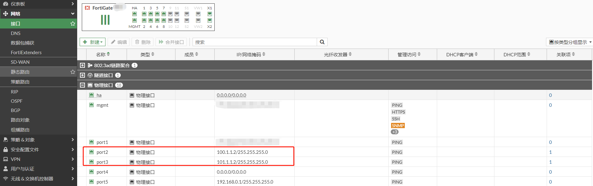

# 多路负载/主备IPSec VPN

## **组网需求**

通过IPsec VPN（接口模式）将2个局域网连接起来，实现192.168.0.0/24与192.168.1.0/24两个网段的通信，并实现多路负载或者主备切换。

## 网络拓扑

```
PC1-----------(port5:192.168.0.1/24)FGT-BJ(port2:100.1.1.2)-------------Internet-------------(port2:200.1.1.2)FGT-SH(port5:192.168.1.1/24)-----------PC2
                                       |-----(port3:101.11.2)---------------|
```

## 配置步骤

### 配置IPSec

使用FGT-BJ port2和port3接口分别与FGT-SH port2 200.1.1.2建立两条IPSEC VPN；FGT-SH配置同理，FGT-SH使用port2接口分别与FGT-BJ 100.1.1.2和101.11.2建立两条IPSEC VPN。

1. **基本配置**

   配置接口IP和路由
   
   
   
   

2. 配置IPSEC VPN

   **FGT-BJ使用port2接口与FGT-SH port2 200.1.1.2建立IPSEC VPN**

   选择“VPN”-->“IPsec隧道”，点击“新建”，选择“IPsec隧道”。

   

   根据“VPN创建向导”进行VPN模板配置，输入名称，拓扑中没有NAT，这里选择“站点之间没有NAT”，并点击下一步。

   

   输入对端设备的IP地址（流出接口会根据路由自动选择），以及预共享秘钥。

   

   选择“本地接口”，即需要被IPSEC保护的内网的接口，这里是port5接口，本地子网会自动写为该接口的IP所在的IP网段（如果被保护的是其他网段，可以根据实际组网需求修改），输入“远端子网”，即远端需要被保护的网络。然后点击“下一步”。
   
   
   
   VPN创建向导提示即将创建的内容，然后点击完成。
   
   
   
   VPN创建成功。
   
   
   
   **FGT-BJ使用port3接口与FGT-SH port2 200.1.1.2建立IPSEC VPN**
   
   选择“VPN”-->“IPsec隧道”，点击“新建”，选择“IPsec隧道”。
   
   
   
   根据“VPN创建向导”进行VPN模板配置，输入名称，拓扑中没有NAT，这里选择“站点之间没有NAT”，并点击下一步。
   
   
   
   输入对端设备的IP地址（流出接口会根据路由自动选择），以及预共享秘钥。
   
   
   
   选择“本地接口”，即需要被IPSEC保护的内网的接口，这里是port5接口，本地子网会自动写为该接口的IP所在的IP网段（如果被保护的是其他网段，可以根据实际组网需求修改），输入“远端子网”，即远端需要被保护的网络。然后点击“下一步”。
   
   
   
   VPN创建向导提示即将创建的内容，然后点击完成。
   
   
   
   VPN创建成功。
   
   
   
   注意：如果最后完成模板部署的时候报错，那么需要注意，不要有旧的配置存在，比如相关VPN的策略、VPN的路由、VPN的IP地址对象，因为会冲突，所以需要把这些内容删除干净才可以顺利的部署向导模板，一般第一次部署不会遇到报错。

### 查看IPSEC配置

已创建两条IPSEC VPN。


已创建IPSEC路由。

注意：IPsec VPN隧道的路由下一跳只是一个隧道ID标识，并不是真正的路由下一跳IP，这和我们普通的路由下一跳不同，如这里的200.1.1.2是隧道的ID；隧道ID通常是隧道的远程网关，对于具有相同远程网关的隧道，其他隧道id将随机分配（10.0.0.x），如第VPN2-to-SH隧道ID 10.0.0.1。


已创建防火墙策略。


### 针对向导配置的优化建议

1. 在第一阶段中开启DPD周期性检测（每隔10s检测一次Peer状态），实现快速的检测并切换VPN隧道的目的。

   

   对应的命令行

   ```
   config vpn ipsec phase1-interface
       edit "VPN1-to-SH"
           set dpd on-idle
           set dpd-retrycount 3
           set dpd-retryinterval 10
       next
       edit "VPN2-to-SH"
           set dpd on-idle
           set dpd-retrycount 3
           set dpd-retryinterval 10
       next    
   end
   ```

2. 开启自动协商，主动让隧道UP起来，而非使用VPN业务的时候再去触发VPN的协商，这样可以减少业务的丢包。在VPN主动发起方开启即可。

   IPSEC VPN阶段一自动协商是默认开启的。

   ```
   config vpn ipsec phase1-interface
       edit "VPN1-to-SH"
           set auto-negotiate enable 
       next
       edit "VPN2-to-SH"
           set auto-negotiate enable 
       next
   end
   ```

   IPSEC VPN阶段二自动协商默认关闭，需要开启。

   ```
   config vpn ipsec phase2-interface
       edit "VPN1-to-SH"
           set auto-negotiate enable
       next
       edit "VPN2-to-SH"
           set auto-negotiate enable
       next
   end
   ```

### 多路负载IPSEC VPN

按照上述方式配置完成后，两条IPSEC VPN隧道的会UP起来，并且已通过静态路由实现负载均衡。


### 主备IPSEC VPN

有两种方法实现主备IPSEC VPN，这里VPN1-to-SH作为主，VPN2-to-SH作为备。

1. **使用路由的方法。通过静态路由的优先级控制IPSEC VPN主备。（动态路由也可以）**

   将VPN2-to-SH路由的优先级设置为10，默认是1，值越低优先级越高。两条IPSEC VPN都能UP。从路由表可以看出，VPN1-to-SH优先。

   当VPN1-to-SH DOWN后，路由指向VPN2-to-SH。

   

   

   当dpd设置重试次数为3，重试时间间隔为10s时，主备切换丢10个包。

   ```
   config vpn ipsec phase1-interface
       edit "VPN1-to-SH"
           set dpd on-idle
           set dpd-retrycount 3
           set dpd-retryinterval 10
       next  
   end
   ```

   

   当dpd设置重试次数为3，重试时间间隔为1s时，主备切换丢2个包。

   ```
   config vpn ipsec phase1-interface
       edit "VPN1-to-SH"
           set dpd on-idle
           set dpd-retrycount 3
           set dpd-retryinterval 1
       next  
   end
   ```

   

2. **使用IPSEC monitor的方法**

   VPN1-to-SH作为主VPN UP起来，VPN2-to-SH作为备VPN则处于监听模式，一旦检测到主VPN隧道故障，则将备份的VPN协商起来，接替主VPN的工作。

   ```
   config vpn ipsec phase1-interface
       edit "VPN2-to-SH"
           set monitor "VPN1-to-SH"
       next
   end
   ```

   配置完成后，VPN1-to-SH是UP的，VPN2-to-SH是down的。

   

   

   当port2的链路故障，VPN1-to-SH DOWN后，VPN2-to-SH会协商UP起来。

   

   当dpd设置重试次数为3，重试时间间隔为10s时，主备切换丢10个包。

   ```
   config vpn ipsec phase1-interface
       edit "VPN1-to-SH"
           set dpd on-idle
           set dpd-retrycount 3
           set dpd-retryinterval 10
       next  
   end
   ```

   

   当dpd设置重试次数为3，重试时间间隔为1s时，主备切换丢2个包。

   ```
   config vpn ipsec phase1-interface
       edit "VPN1-to-SH"
           set dpd on-idle
           set dpd-retrycount 3
           set dpd-retryinterval 1
       next  
   end
   ```

   

   当port2的链路恢复后，VPN1-to-SH会抢回来，VPN1-to-SH协商UP起来，VPN2-to-SH DOWN。

   
