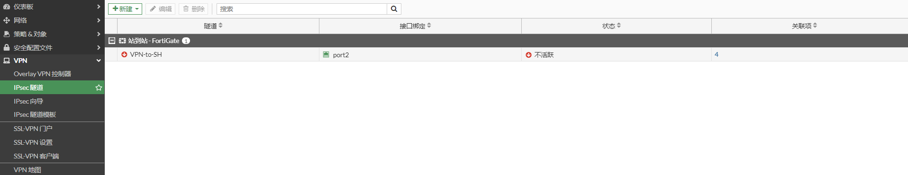

# 接口摸式

## 组网需求

通过IPsec VPN（接口模式）将2个局域网连接起来，实现192.168.0.0/24与192.168.1.0/24两个网段的通信。

## 网络拓扑

PC1-----------(port5:192.168.0.1/24)FGT-BJ(port2:100.1.1.2)-------------Internet-------------(port2:200.1.1.2)FGT-SH(port5:192.168.1.1/24)-----------PC2

## 配置步骤
### IPSec配置

以FGT-BJ配置步骤为例，FGT-SH同理。

1. **基本配置**

   配置接口IP和路由

   

   

2. **配置IPSEC VPN**

   选择“VPN”-->“IPsec隧道”，点击“新建”，选择“IPsec隧道”。

   

   根据“VPN创建向导”进行VPN模板配置，输入名称，拓扑中没有NAT，这里选择“站点之间没有NAT”，并点击下一步。

   

   输入对端设备的IP地址（流出接口会根据路由自动选择），以及预共享秘钥。

   

   选择“本地接口”，即需要被IPSEC保护的内网的接口，这里是port5接口，本地子网会自动写为该接口的IP所在的IP网段（如果被保护的是其他网段，可以根据实际组网需求修改），输入“远端子网”，即远端需要被保护的网络。然后点击“下一步”。

   

   VPN创建向导提示即将创建的内容，然后点击完成。

   

   VPN创建成功。

   

   注意：如果最后完成模板部署的时候报错，那么需要注意，不要有旧的配置存在，比如相关VPN的策略、VPN的路由、VPN的IP地址对象，因为会冲突，所以需要把这些内容删除干净才可以顺利的部署向导模板，一般第一次部署不会遇到报错。

### 查看IPSEC向导创建的配置

通过“VPN创建向导”可以很方便的配置VPN，但我们需要知道向导具体做了哪些配置。

1. 创建地址对象和地址对象组

   

2. 创建IPSEC隧道

   

   对应的命令行如下：

   ```
   config vpn ipsec phase1-interface
       edit "VPN-to-SH"
           set interface "port2"
           set peertype any
           set net-device disable
           set proposal aes128-sha256 aes256-sha256 aes128-sha1 aes256-sha1
           set comments "VPN: VPN-to-SH (Created by VPN wizard)"
           set wizard-type static-fortigate
           set remote-gw 200.1.1.2
           set psksecret ENC feA2LOY0w7mUVHbFI06AZkRjLX80Di1eIIk+FiRIezwPpWU/5oSuf/2LUOIRtrDxOIoyTN+kj5TYADnJOL/K6zQ82ektaS146SvvvZQ9umHQTJJSW7HtDfDqic1tZAImYJ+APdWC090tUIyc3z5qgcarmPUALfbDSZkmpzY6AtSLMJGHcGVkY4rVTl0GPNekUB/gUg==
       next
   end
   config vpn ipsec phase2-interface
       edit "VPN-to-SH"
           set phase1name "VPN-to-SH"
           set proposal aes128-sha1 aes256-sha1 aes128-sha256 aes256-sha256 aes128gcm aes256gcm chacha20poly1305
           set comments "VPN: VPN-to-SH (Created by VPN wizard)"
           set src-addr-type name
           set dst-addr-type name
           set src-name "VPN-to-SH_local"
           set dst-name "VPN-to-SH_remote"
       next
   end
   ```

3. 创建路由

   这里到对端的子网创建了两条路由：一条下一跳是VPN-to-SH接口的路由，一条黑洞路由。

   注意：IPsec VPN隧道的路由下一跳只是一个隧道ID标识，并不是真正的路由下一跳IP，这和我们普通的路由下一跳不同，如这里的200.1.1.2是隧道的ID；

   黑洞路由的目的：VPN有时候会因为各种原因重新连接，比如互联网不稳定，PPPOE重新连接更换公网IP地址等，VPN tunnel此时会出现短暂的DOWN，而去往对方的VPN业务网段的路由也会短暂消失，此时VPN的业务流量会因为查询到了默认路由而走向了port2（Internet），从而产生了不期望的会话，此时即便VPN tunnel再次UP，VPN业务网段的路由再次恢复，业务流量会匹配不期望的会话而走向port2，从而引起该业务异常。因此有了这条黑洞路由就不会产生这条不期望的会话。

   

4. 创建策略

   

### 修改IPSEC VPN配置

编辑VPN隧道如下图


通过点击“转换为自定义隧道”可以在GUI界面设置的更多，是否需要修改可以根据实际组网需求决定。

如IKE版本（默认使用IKEv1）


如修改阶段一加密和HASH算法


### 针对向导配置的优化建议

1. 在第一阶段中开启DPD周期性检测（每隔10s检测一次Peer状态），实现快速的检测并切换VPN隧道的目的。

   

   对应的命令行

   ```
   config vpn ipsec phase1-interface
       edit "VPN-to-SH"
           set dpd on-idle
           set dpd-retrycount 3
           set dpd-retryinterval 10
       next
   end
   ```

2. 开启自动协商，主动让隧道UP起来，而非使用VPN业务的时候再去触发VPN的协商，这样可以减少业务的丢包。在VPN主动发起方开启即可。

   IPSEC VPN阶段一自动协商是默认开启的。

   ```
   config vpn ipsec phase1-interface
       edit "VPN-to-SH"
           set auto-negotiate enable 
       next
   end
   ```

   IPSEC VPN阶段二自动协商默认关闭，需要开启。

   ```
   config vpn ipsec phase2-interface
       edit "VPN-to-SH"
           set auto-negotiate enable
       next
   end
   ```

## 查看IPSEC状态

**GUI查看IPSEC状态**


**CLI查看IPSEC状态**

```
# diagnose vpn ike gateway list 

vd: root/0
name: VPN-to-SH
version: 1
interface: port2 10
addr: 100.1.1.2:500 -> 200.1.1.2:500
tun_id: 200.1.1.2/::200.1.1.2
remote_location: 0.0.0.0
network-id: 0
created: 1547s ago
IKE SA: created 1/1  established 1/1  time 0/0/0 ms
IPsec SA: created 1/2  established 1/1  time 0/0/0 ms

  id/spi: 1428 5264c8b1b5ea006d/587ec20848be628f
  direction: initiator
  status: established 1547-1547s ago = 0ms
  proposal: aes128-sha256
  key: 7646944159f3ebe9-5eb6656064941ede
  lifetime/rekey: 86400/84552
  DPD sent/recv: 000000ec/00000000

# diagnose vpn  tunnel list 
list all ipsec tunnel in vd 0
------------------------------------------------------
name=VPN-to-SH ver=1 serial=3 100.1.1.2:0->200.1.1.2:0 tun_id=200.1.1.2 tun_id6=::200.1.1.2 dst_mtu=1500 dpd-link=on weight=1
bound_if=10 lgwy=static/1 tun=intf mode=auto/1 encap=none/552 options[0228]=npu frag-rfc  run_state=0 role=primary accept_traffic=1 overlay_id=0

proxyid_num=1 child_num=0 refcnt=4 ilast=9 olast=9 ad=/0
stat: rxp=1 txp=13 rxb=84 txb=17290
dpd: mode=on-idle on=1 idle=10000ms retry=3 count=0 seqno=236
natt: mode=none draft=0 interval=0 remote_port=0
proxyid=VPN-to-SH proto=0 sa=1 ref=2 serial=3 auto-negotiate
  src: 0:192.168.0.0-192.168.0.255:0
  dst: 0:192.168.1.0-192.168.1.255:0
  SA:  ref=6 options=18227 type=00 soft=0 mtu=1438 expire=41368/0B replaywin=2048
       seqno=e esn=0 replaywin_lastseq=00000002 qat=0 rekey=0 hash_search_len=1
  life: type=01 bytes=0/0 timeout=42903/43200
  dec: spi=0df9349a esp=aes key=16 6d4d64a051d4c6e4b1dce3c019e9c6c7
       ah=sha1 key=20 f307e4af948aed97e217c89295f50edd78166092
  enc: spi=58e500e1 esp=aes key=16 e751f770f16484e877dd63dd86576d76
       ah=sha1 key=20 3a38ffe6cacee7cae62d04c70aeeb82c9b6a91ff
  dec:pkts/bytes=2/168, enc:pkts/bytes=26/19266
  npu_flag=03 npu_rgwy=200.1.1.2 npu_lgwy=100.1.1.2 npu_selid=9 dec_npuid=1 enc_npuid=1
run_tally=0
```

**查看路由**

```
# get router info routing-table  all 
Codes: K - kernel, C - connected, S - static, R - RIP, B - BGP
       O - OSPF, IA - OSPF inter area
       N1 - OSPF NSSA external type 1, N2 - OSPF NSSA external type 2
       E1 - OSPF external type 1, E2 - OSPF external type 2
       i - IS-IS, L1 - IS-IS level-1, L2 - IS-IS level-2, ia - IS-IS inter area
       * - candidate default

Routing table for VRF=0
S*      0.0.0.0/0 [10/0] via 100.1.1.1, port2, [1/0]
C       100.1.1.0/24 is directly connected, port2
C       192.168.0.0/24 is directly connected, port5
S       192.168.1.0/24 [10/0] via VPN-to-SH tunnel 200.1.1.2, [1/0]        <----到192.168.1.0/24走IPSEC VPN
```
