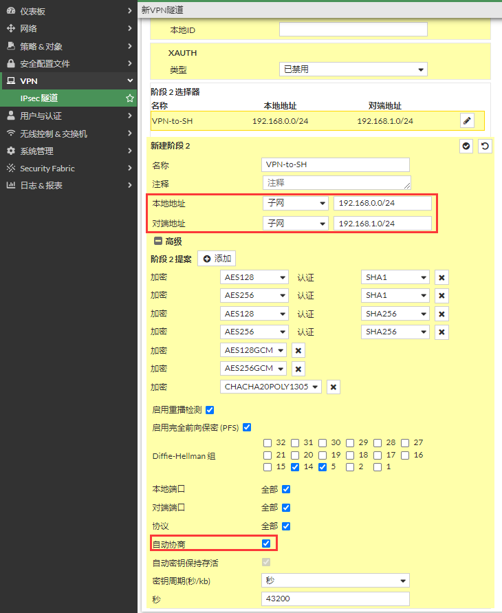
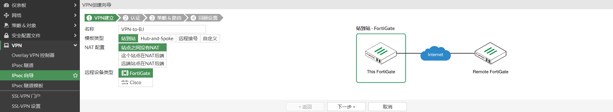

# IPSec VPN Lan-to-Lan

## 组网需求

通过IPsec VPN（接口模式）将2个局域网连接起来，实现192.168.0.0/24与192.168.1.0/24两个网段的通信。

## 网络拓扑

FGT-BJ是透明模式，PC1的网关指向Router；FGT-SH是NAT/路由模式。

PC1-----------(port3)FGT-BJ(port4)-------------Router(NAT)------------Internet-------------(port2:200.1.1.2)FGT-SH(port5:192.168.1.1/24)-----------PC2

## 配置步骤

### FGT-BJ配置

1. **基本配置**

   为了便于测试，单独建立一个透明模式的vdom，将port3和port4划入tp1 vdom。

   

   

   将设备修改为透明模式

   ```
   config system settings
       set opmode transparent
       set manageip 192.168.0.5/255.255.255.0
       set gateway 192.168.0.2
   end
   ```

2. **打开基于策略的IPSEC**

   

3. **配置IPSEC**

   “选择VPN”-->"IPSEC隧道"，点击“创建”

   

   配置IPSEC VPN阶段一

   

   配置IPSEC VPN阶段二

   

   配置完成。

   

4. **配置策略**

   新建策略时，动作要选择IPSEC，指定IPSEC 隧道，入向表示允许对端发起IPSEC流量，如果不勾选，对端发起的IPSEC流量将被拒绝。

   

   

5. IPSEC配置对应的命令行

   ```
   config vpn ipsec phase1
       edit "VPN-to-SH"
           set peertype any
           set proposal aes128-sha256 aes256-sha256 aes128-sha1 aes256-sha1
           set dpd on-idle
           set remote-gw 200.1.1.2
           set psksecret ENC 51lISs3KQ4m+sXPI9G+hwY8ysQEZUNApjT3dLeudcNwE3/ESIDyHJMeUAIBaMZ6aL6lrBiwleBYoEKnP+8gUusyE2nKqVwGYSdzsKHbycQyezu8a9zESIu3CoVZA+FUiM+iUSDN0GHwZh6nMkl4g1rXYcLle5qzF0ybsKyYOIwmwovD0v9hBsw5HWMl06WcYnA5hVA==
           set dpd-retryinterval 10
       next
   end
   
   # show vpn ipsec phase2
   config vpn ipsec phase2
       edit "VPN-to-SH"
           set phase1name "VPN-to-SH"
           set proposal aes128-sha1 aes256-sha1 aes128-sha256 aes256-sha256 aes128gcm aes256gcm chacha20poly1305
           set auto-negotiate enable
           set src-subnet 192.168.0.0 255.255.255.0
           set dst-subnet 192.168.1.0 255.255.255.0
       next
   end
   ```

### FGT-SH配置

1. **基本配置**

   配置接口ip和路由。

   

   

2. **配置IPSEC**

   选择“VPN”-->“IPSEC隧道”，点击“创建”。

   

   输入对端FortiGate的公网IP及预共享秘钥。

   

   输入需要保护的网段和接口。

   

   即将创建的内容。

   

   IPSEC模板创建IPSEC VPN隧道，策略，路由成功。

   

   

   

3. 针对向导配置的优化建议

   

4. IPSEC配置对应的命令行

   ```
   # show vpn ipsec phase1-interface 
   config vpn ipsec phase1-interface
       edit "VPN-to-BJ"
           set interface "port2"
           set peertype any
           set net-device disable
           set proposal aes128-sha256 aes256-sha256 aes128-sha1 aes256-sha1
           set dpd on-idle
           set comments "VPN: VPN-to-BJ (Created by VPN wizard)"
           set remote-gw 100.1.1.2
           set psksecret ENC y6uhBx2lgYaxVJ4mkMu+Jf1M4a0a3XnIHULRXDaRBcvy6SVVyFksSsqg6ZdfXAp7okjT3btI8WATWijaxbM1T/1YHfU9gtI0vXFuBoc6Jij41ztBkohof+OwhJnb+WILWrNIGrgThqN/Su3RtyNk/ruiiW4hs3INa5ku0ZlT7StMlJBRoZ4zQ2XjMXETmOgdZnQR9Q==
           set dpd-retryinterval 10
       next
   end
   
   wangxiang-used2 # show vpn ipsec phase2-interface
   config vpn ipsec phase2-interface
       edit "VPN-to-BJ"
           set phase1name "VPN-to-BJ"
           set proposal aes128-sha1 aes256-sha1 aes128-sha256 aes256-sha256 aes128gcm aes256gcm chacha20poly1305
           set src-addr-type name
           set dst-addr-type name
           set src-name "VPN-to-BJ_local"
           set dst-name "VPN-to-BJ_remote"
       next
   end
   ```

## 查看IPSEC状态

### FGT-BJ IPSEC状态

GUI查看IPSEC状态。


CLI查看IPSEC状态

```
# diagnose vpn ike gateway list 
vd: tp1/3
name: VPN-to-SH
version: 1
interface:  0
addr: 192.168.0.5:4500 -> 200.1.1.2:4500
tun_id: 200.1.1.2/::200.1.1.2
remote_location: 0.0.0.0
network-id: 0
created: 522s ago
nat: me
IKE SA: created 1/1  established 1/1  time 9000/9000/9000 ms
IPsec SA: created 1/1  established 1/1  time 9000/9000/9000 ms

  id/spi: 88 df473084a6cd160a/fd52b18f1451abed
  direction: initiator
  status: established 522-513s ago = 9000ms
  proposal: aes128-sha256
  key: dbd02be2254a30c4-383ba553458819b3
  lifetime/rekey: 86400/85586
  DPD sent/recv: 00000009/0000002c

# diagnose vpn tunnel list 
list all ipsec tunnel in vd 3
------------------------------------------------------
name=VPN-to-SH ver=1 serial=1 192.168.0.5:4500->200.1.1.2:4500 tun_id=200.1.1.2 tun_id6=::200.1.1.2 dst_mtu=1500 dpd-link=on weight=0
bound_if=0 lgwy=static/1 tun=tunnel mode=auto/1 encap=none/8 options[0008]=npu  run_state=0 role=primary accept_traffic=1 overlay_id=0

proxyid_num=1 child_num=0 refcnt=7 ilast=4 olast=4 ad=/0
stat: rxp=0 txp=0 rxb=0 txb=0
dpd: mode=on-idle on=1 idle=10000ms retry=3 count=0 seqno=9
natt: mode=keepalive draft=32 interval=10 remote_port=4500
proxyid=VPN-to-SH proto=0 sa=1 ref=2 serial=1 auto-negotiate
  src: 0:192.168.0.0-192.168.0.255:0
  dst: 0:192.168.1.0-192.168.1.255:0
  SA:  ref=3 options=18227 type=00 soft=0 mtu=1422 expire=42386/0B replaywin=2048
       seqno=1 esn=0 replaywin_lastseq=00000000 qat=0 rekey=0 hash_search_len=1
  life: type=01 bytes=0/0 timeout=42902/43200
  dec: spi=f77af5f3 esp=aes key=16 51994a2f09e97e1d834fba1454afce40
       ah=sha1 key=20 f75607ee1dde5d6a97d79d125fa2fbe77033e9d7
  enc: spi=e9cb7b26 esp=aes key=16 4c3df88982eb657c0ac2e851e26727b2
       ah=sha1 key=20 24392681766e619bcee614fb6e3b8318ae37d40e
  dec:pkts/bytes=0/0, enc:pkts/bytes=0/0
  npu_flag=00 npu_rgwy=200.1.1.2 npu_lgwy=192.168.0.5 npu_selid=0 dec_npuid=0 enc_npuid=0
run_tally=0
```

### FGT-SH IPSEC状态

GUI查看IPSEC状态。


CLI查看IPSEC状态。

```
# diagnose vpn ike gateway list 

vd: root/0
name: VPN-to-BJ
version: 1
interface: port2 10
addr: 200.1.1.2:4500 -> 100.1.1.2:64916
tun_id: 100.1.1.2/::100.1.1.2
remote_location: 0.0.0.0
network-id: 0
created: 563s ago
nat: peer
IKE SA: created 1/2  established 1/1  time 0/0/0 ms
IPsec SA: created 1/1  established 1/1  time 0/0/0 ms

  id/spi: 14 df473084a6cd160a/fd52b18f1451abed
  direction: responder
  status: established 544-544s ago = 0ms
  proposal: aes128-sha256
  key: dbd02be2254a30c4-383ba553458819b3
  lifetime/rekey: 86400/85585
  DPD sent/recv: 0000002f/00000009

# diagnose vpn  tunnel list 
list all ipsec tunnel in vd 0
------------------------------------------------------
name=VPN-to-BJ ver=1 serial=3 200.1.1.2:4500->100.1.1.2:64916 tun_id=100.1.1.2 tun_id6=::100.1.1.2 dst_mtu=1500 dpd-link=on weight=1
bound_if=10 lgwy=static/1 tun=intf mode=auto/1 encap=none/552 options[0228]=npu frag-rfc  run_state=0 role=primary accept_traffic=1 overlay_id=0

proxyid_num=1 child_num=0 refcnt=4 ilast=4 olast=4 ad=/0
stat: rxp=0 txp=0 rxb=0 txb=0
dpd: mode=on-idle on=1 idle=10000ms retry=3 count=0 seqno=47
natt: mode=silent draft=32 interval=10 remote_port=64916
proxyid=VPN-to-BJ proto=0 sa=1 ref=2 serial=1
  src: 0:192.168.1.0-192.168.1.255:0
  dst: 0:192.168.0.0-192.168.0.255:0
  SA:  ref=3 options=10226 type=00 soft=0 mtu=1422 expire=42386/0B replaywin=2048
       seqno=1 esn=0 replaywin_lastseq=00000000 qat=0 rekey=0 hash_search_len=1
  life: type=01 bytes=0/0 timeout=42933/43200
  dec: spi=e9cb7b26 esp=aes key=16 4c3df88982eb657c0ac2e851e26727b2
       ah=sha1 key=20 24392681766e619bcee614fb6e3b8318ae37d40e
  enc: spi=f77af5f3 esp=aes key=16 51994a2f09e97e1d834fba1454afce40
       ah=sha1 key=20 f75607ee1dde5d6a97d79d125fa2fbe77033e9d7
  dec:pkts/bytes=0/0, enc:pkts/bytes=0/0
  npu_flag=00 npu_rgwy=100.1.1.2 npu_lgwy=200.1.1.2 npu_selid=2 dec_npuid=0 enc_npuid=0
run_tally=0
```

## 业务测试

1. **从FGT-BJ端 ping FGT-SH端**

   ```
   # ifconfig ens224
   ens224: flags=4163<UP,BROADCAST,RUNNING,MULTICAST>  mtu 1500
           inet 192.168.0.10  netmask 255.255.255.0  broadcast 192.168.0.255
           inet6 fe80::82c8:edfd:199d:70b0  prefixlen 64  scopeid 0x20<link>
           ether 00:0c:29:e8:ad:a9  txqueuelen 1000  (Ethernet)
           RX packets 6352519  bytes 1854154972 (1.7 GiB)
           RX errors 0  dropped 3749690  overruns 0  frame 0
           TX packets 130448  bytes 8786148 (8.3 MiB)
           TX errors 0  dropped 0 overruns 0  carrier 0  collisions 0
   
   PC1# ping 192.168.1.10 -c 4
   PING 192.168.1.10 (192.168.1.10) 56(84) bytes of data.
   64 bytes from 192.168.1.10: icmp_seq=1 ttl=63 time=0.717 ms
   64 bytes from 192.168.1.10: icmp_seq=2 ttl=63 time=0.853 ms
   64 bytes from 192.168.1.10: icmp_seq=3 ttl=63 time=0.720 ms
   64 bytes from 192.168.1.10: icmp_seq=4 ttl=63 time=0.752 ms
   
   --- 192.168.1.10 ping statistics ---
   4 packets transmitted, 4 received, 0% packet loss, time 3002ms
   rtt min/avg/max/mdev = 0.717/0.760/0.853/0.061 ms
   ```

2. **从FGT-SH端 ping FGT-BJ端**

   ```
   # ifconfig ens224
   ens224: flags=4163<UP,BROADCAST,RUNNING,MULTICAST>  mtu 1500
           inet 192.168.1.10  netmask 255.255.255.0  broadcast 192.168.1.255
           inet6 fe80::1a6c:e61:d2b9:a415  prefixlen 64  scopeid 0x20<link>
           inet6 2001::2  prefixlen 64  scopeid 0x0<global>
           ether 00:0c:29:0e:4e:c5  txqueuelen 1000  (Ethernet)
           RX packets 6040640  bytes 490806558 (468.0 MiB)
           RX errors 0  dropped 145  overruns 0  frame 0
           TX packets 3246663  bytes 205412788614 (191.3 GiB)
           TX errors 0  dropped 0 overruns 0  carrier 0  collisions 0
   
   # ping 192.168.0.10 -c 4
   PING 192.168.0.10 (192.168.0.10) 56(84) bytes of data.
   64 bytes from 192.168.0.10: icmp_seq=1 ttl=63 time=0.790 ms
   64 bytes from 192.168.0.10: icmp_seq=2 ttl=63 time=0.879 ms
   64 bytes from 192.168.0.10: icmp_seq=3 ttl=63 time=0.686 ms
   64 bytes from 192.168.0.10: icmp_seq=4 ttl=63 time=0.855 ms
   
   --- 192.168.0.10 ping statistics ---
   4 packets transmitted, 4 received, 0% packet loss, time 3000ms
   rtt min/avg/max/mdev = 0.686/0.802/0.879/0.079 ms
   ```

   
