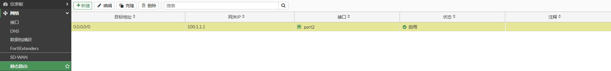
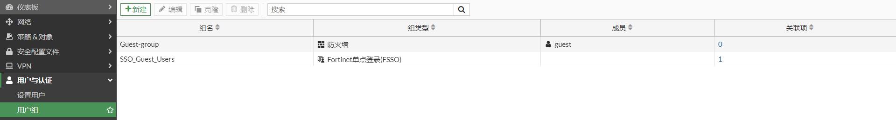
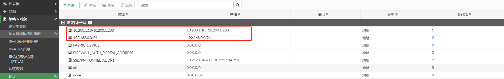
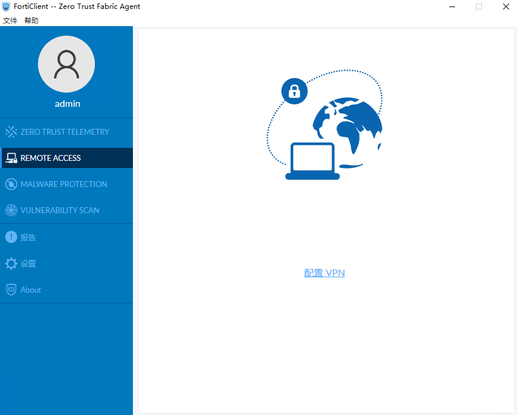
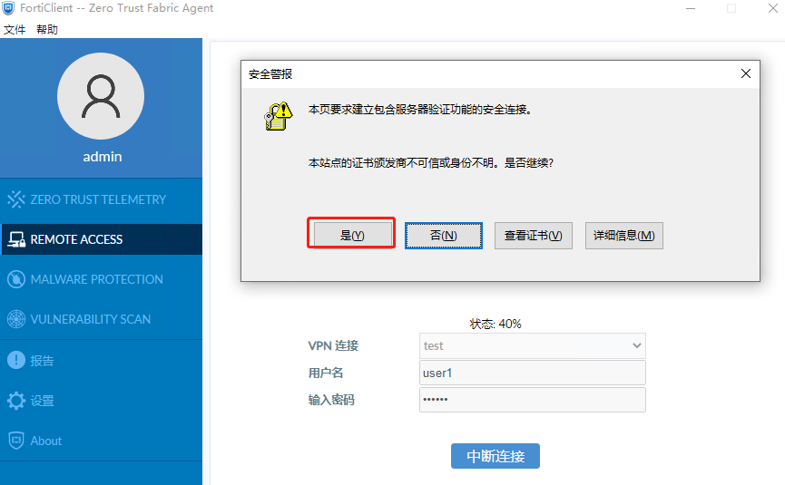
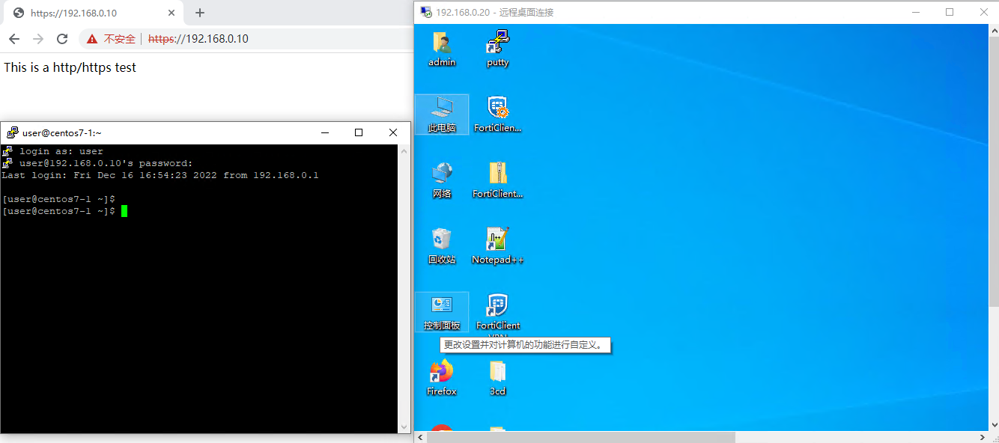

# SSL VPN FortiClient隧道模式

## **组网需求**

在外移动办公的工作人员需要通过SSL VPN 隧道模式拨入到公司内网来对内网主机进行访问。

## 网络拓扑

```
PC1---------------Internet-------------(port2:100.1.1.2)FGT-BJ(port5:192.168.0.1/24)-----------PC2(192.168.0.10  HTTPS/SSH Service)
                                                           |-----------PC3(192.168.0.20   RPD Service)
```

## 配置步骤

### 配置SSL VPN

1. **基本配置**

   配置接口IP和路由

   

   

2. **创建用户**

   选择“用户与认证”-->“设置用户”，点击“新建”。

   

   选择“本地用户”，点击“下一步”。

   

   输入用户名和密码，点击“下一步”。

   

   可根据需求选择启用。这里不启用，点击“下一步”。

   

   点击“提交”。

   

   完成用户创建。

   

3. **创建用户组**

   选择“用户与认证”-->“用户组”，点击“新建”。

   

   输入名称，即组名，并将用户加入用户组，点击“确认”。

   

   完成用户组创建。

   

4. **配置地址对象**

   10.200.1.10-10.200.1.200作为SSLVPN地址池；192.168.0.0/24作为需要访问的内网地址段。

   

5. **配置SSL-VPN门户**

   系统默认创建3个SSLVPN门户：full-access:开启了隧道模式和web代理模式；tunnel-access只开启了隧道模式；web-access：只开启web代理模式。可以根据实际需求进行修改，也可以新建新的SSL-VPN门户。这里使用tunnel-access。

   

   **隧道分割的三个选项：**

   - **禁用**：所有客户端流量都将走SSLVPN隧道；
   - **基于策略目标启用**：只有访问192.168.0.0/24的流量走SSLVPN；
   - **基于可信目标启用**：访问除192.168.0.0/24之外的流量走SSLVPN。

   **允许客户端保持密码**：FortiClient第一次拨号成功后，FortiClient会显示“保存密码”的选项。

   **允许客户端自动连接**：FortiClient第一次拨号成功后，FortiClient会显示“自动连接”的选项，该功能是运行FortiClient会拨入该SSLVPN。

   **允许客户端保持连接**：FortiClient第一次拨号成功后，FortiClient会显示“保持连接”的选项，该功能是SSLVPN由于网络原因中断后，会自动重拨。

   免费的FortiClient版本不支持自动连接和保持连接，需要完整版的FortiClient，需要购买EMS license。

   **源IP池**：客户端SSLVPN拨号成功后获取的地址。

   

6. **配置SSLVPN**

   设置提供SSLVPN服务的接口和端口，将SSLVPN-Group用户组和tunnel-access门户关联；全部其他用户/组也要关联一个门户，用于没有配置关联的用户/用户组访问。

   tunnel-access门户中的 源IP池 优先于SSL-VPN设置中的 地址范围。

   

7. **创建策略**

   当客户端SSLVPN拨号成功后，将会使用获取的地址（10.200.1.10-10.200.1.200）访问内部主机，因此内部网络需要增加到10.200.1.0/24网段的回程路由指向FortiGate 或者 可以在策略中开启NAT，那么源地址将被转换为FortiGate接口地址，则不用考虑回程路由。

   

### 配置FortiClient

1. 选择“Remote Access”，点击“配置VPN”。

   

2. 选择SSL VPN，设置连接名，远程网关，SSLVPN端口以及用户名，然后点击保存。

   

3. 配置完成。

   

## 业务测试

1. 在FortiClient中输入密码，并点击连接，在弹出的窗口中，点击“是”，信任SSLVPN证书

   

2. SSLVPN拨号成功，获取的地址是10.200.1.10

   

   查看终端获取到的地址

   ```
   C:\Users\admin>ipconfig/all
   以太网适配器 以太网 2:
   
      连接特定的 DNS 后缀 . . . . . . . :
      描述. . . . . . . . . . . . . . . : Fortinet SSL VPN Virtual Ethernet Adapter
      物理地址. . . . . . . . . . . . . : 00-09-0F-AA-00-01
      DHCP 已启用 . . . . . . . . . . . : 否
      自动配置已启用. . . . . . . . . . : 是
      本地链接 IPv6 地址. . . . . . . . : fe80::9124:e3aa:1ace:74d2%7(首选)
      IPv4 地址 . . . . . . . . . . . . : 10.200.1.10(首选)
      子网掩码  . . . . . . . . . . . . : 255.255.255.255
      默认网关. . . . . . . . . . . . . :
      DHCPv6 IAID . . . . . . . . . . . : 100665615
      DHCPv6 客户端 DUID  . . . . . . . : 00-01-00-01-29-1C-CC-4A-00-0C-29-A2-90-E0
      DNS 服务器  . . . . . . . . . . . : 114.114.114.114
      TCPIP 上的 NetBIOS  . . . . . . . : 已启用
   ```

   查看终端获取到的路由

   ```
   C:\Users\admin>route print
   ===========================================================================
   接口列表
     6...00 09 0f fe 00 01 ......Fortinet Virtual Ethernet Adapter (NDIS 6.30)
     7...00 09 0f aa 00 01 ......Fortinet SSL VPN Virtual Ethernet Adapter
    10...00 0c 29 a2 90 e0 ......Intel(R) 82574L Gigabit Network Connection
     5...00 0c 29 a2 90 ea ......Intel(R) 82574L Gigabit Network Connection #2
     1...........................Software Loopback Interface 1
   ===========================================================================
   
   IPv4 路由表
   ===========================================================================
   活动路由:
   网络目标        网络掩码          网关       接口   跃点数
             0.0.0.0          0.0.0.0         10.1.1.1         10.1.1.5    281
            10.1.1.0    255.255.255.0            在链路上          10.1.1.5    281
            10.1.1.5  255.255.255.255            在链路上          10.1.1.5    281
          10.1.1.255  255.255.255.255            在链路上          10.1.1.5    281
         10.200.1.10  255.255.255.255            在链路上       10.200.1.10    257
           100.1.1.2  255.255.255.255         10.1.1.1         10.1.1.5     25
           127.0.0.0        255.0.0.0            在链路上         127.0.0.1    331
           127.0.0.1  255.255.255.255            在链路上         127.0.0.1    331
     127.255.255.255  255.255.255.255            在链路上         127.0.0.1    331
         192.168.0.0    255.255.255.0      10.200.1.11      10.200.1.10      1
   ```

   

3. 访问内网主机HTTPS，SSH，RDP服务都正常

   

4. FortiGate查看SSLVPN连接

   

   ```
   # get vpn ssl monitor 
   SSL-VPN Login Users:
    Index   User    Group   Auth Type      Timeout         Auth-Timeout    From     HTTP in/out    HTTPS in/out  Two-factor Auth
    0       user1   SSLVPN-Group   1(1)       276             28434        10.1.1.5       0/0            0/0          0
   
   SSL-VPN sessions:
    Index   User    Group          Source IP      Duration        I/O Bytes       Tunnel/Dest IP 
    0       user1   SSLVPN-Group   10.1.1.5         366           236265/838218     10.200.1.10
   ```

   
