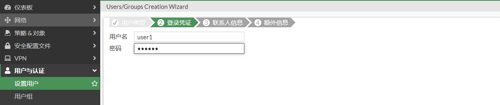
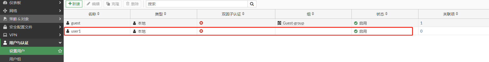
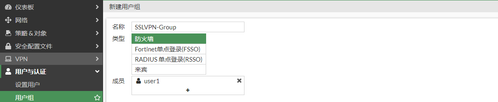
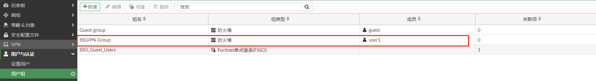
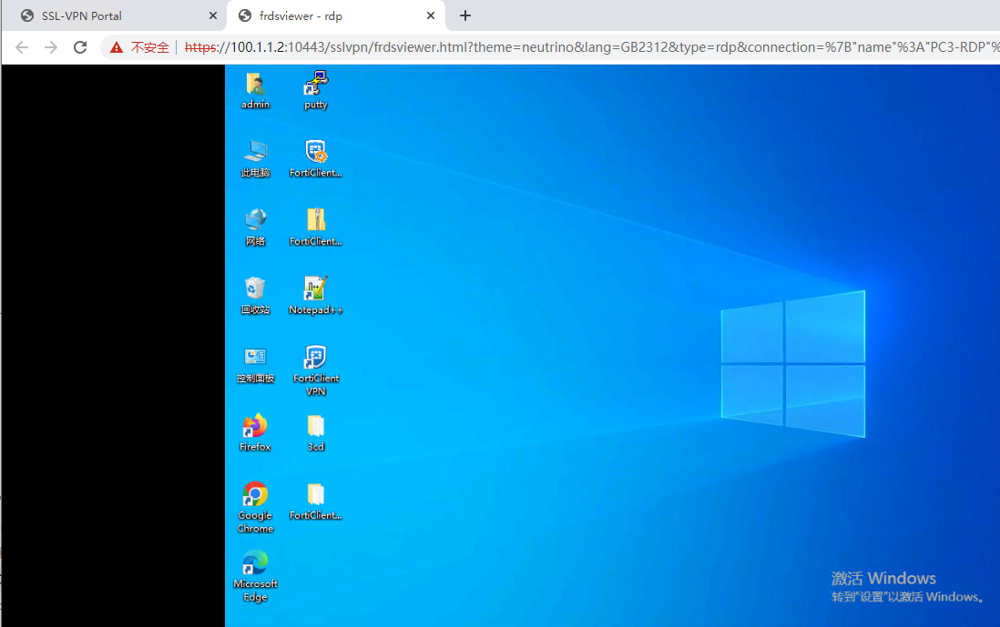

# SSL VPN WEB代理模式配置

## **组网需求**

在外移动办公的工作人员需要通过SSL VPN WEB模式拨入到公司内网来对内网主机进行访问。

## 网络拓扑

```
PC1---------------Internet-------------(port2:100.1.1.2)FGT-BJ(port5:192.168.0.1/24)-----------PC2(192.168.0.10  HTTPS/SSH Service)
                                                           |-----------PC3(192.168.0.20   RPD Service)
```

## 配置步骤

1. **基本配置**

   配置接口IP和路由

   

   

2. **创建用户**

   选择“用户与认证”-->“设置用户”，点击“新建”。

   

   选择“本地用户”，点击“下一步”。

   

   输入用户名和密码，点击“下一步”。

   

   可根据需求选择启用。这里不启用，点击“下一步”。

   

   点击“提交”。

   

   完成用户创建。

   

3. **创建用户组**

   选择“用户与认证”-->“用户组”，点击“新建”。

   

   输入名称，即组名，并将用户加入用户组，点击“确认”。

   

   完成用户组创建。

   

4. **配置SSL-VPN门户**

   系统默认创建3个SSLVPN门户：full-access:开启了隧道模式和web代理模式；tunnel-access只开启了隧道模式；web-access：只开启web代理模式。可以根据实际需求进行修改，也可以新建新的SSL-VPN门户。

   

   这里使用web-access门户，新建HTTPS，SSH，RPD 3个资源供客户端拨号后访问。

   

   PC2-HTTPS资源配置：

   

   PC2-SSH资源配置：

   

   PC3-RDP资源配置：

   

3. **配置SSLVPN**

   设置提供SSLVPN服务的接口和端口，将SSLVPN-Group用户组和web-access门户关联，全部其他用户/组也要关联一个门户，用于没有配置关联的用户/用户组访问。

   

6. **创建策略**

   

## 业务测试

1. PC1使用chrome访问SSLVPN，并输入用户名和密码。

   

2. 登录成功后，可以看到之前创建好的3个资源。

   

3. 业务访问

   点击PC2-HTTPS，访问成功。

   

   点击PC2-SSH，访问成功。

   

   输入PC2 SSH的用户的密码，登录成功。

   

   点击PC3-RDP，访问成功。

   

4. FortiGate查看SSLVPN用户状态。

   

   ```
    # get vpn ssl monitor 
   SSL-VPN Login Users:
    Index   User    Group   Auth Type      Timeout         Auth-Timeout    From     HTTP in/out    HTTPS in/out  Two-factor Auth
    0       user1   SSLVPN-Group   1(1)      289                28788    10.1.1.5       0/0               0/0          0
   
   SSL-VPN sessions:
    Index   User    Group   Source IP      Duration        I/O Bytes       Tunnel/Dest IP 
   ```

   
