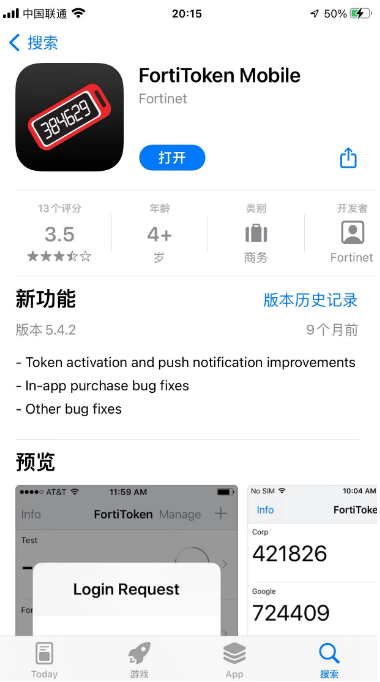
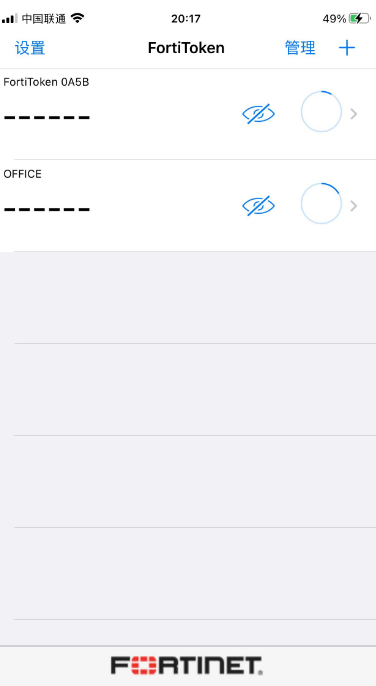
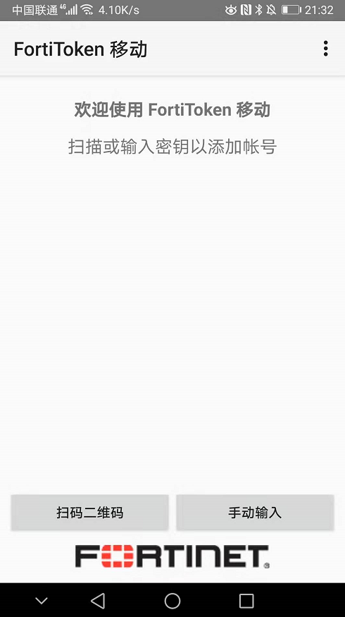

# FortiToken Mobile APP软件下载与安装

FortiToken Mobile APP 可以安装并运行在iOS系统、安卓系统手机上。

1. 苹果手机安装

   苹果手机直接在Apple App Store搜索“FortiToken Mobile”

   

   安装完后，显示如下（图中的包含了已添加过的两个token）：

   

2. Android手机下载

   安卓的用户需要在Google Play store搜索“FortiToken Mobile”即可下载安装，但由于国内的原因，我们无法登陆到Google Play store站点。可以通过发邮件给support_cn@fortinet.com来咨询Android安装包。

   
