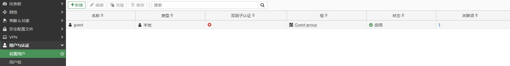

# FortiToken Mobile与用户进行绑定

FortiGate使用邮件发送FortiToken的二维码图片，这样用户直接使用手机APP扫描二维码即可绑定FortiToken Mobile。

1. 邮箱设置

   这里以QQ邮箱为例，在QQ邮箱中，点击“账户”，开启“POP3/SMTP服务”。
   
   
   
   然后点击“生成授权码”，按照提示的步骤拿到授权码。
   
   

2. FortiGate邮箱设置

   QQ的SMTP服务器是smtp.qq.com，用户名是qq的邮箱账号，密码是授权码（不是qq密码），安全模式为SMTPS，缺省回复至也是qq的邮箱账号。

   

3. 用户与FortiToken绑定

   选择“用户与认证”-->“设置用户”，点击“新建”。

   

   选择“本地用户”，点击“下一步”。

   

   输入用户名和密码，点击“下一步”。

   

   启用双因子认证，选择一个token并填写用户邮箱，点击“下一步”。

   

   点击提交。

   

   完成用户创建。

   

4. 发送token二维码到用户邮箱

   用户创建完成后会自动发送一封带有二维码的邮件给用户邮箱。如果没有收到，也可以右击该用户，选择“发送激活码”。

   

   邮件中的二维码如下：

   

5. FortiToken APP扫描二维码

   使用FortiToken扫描二维码即可拿到该Token。

   

6. 注意事项

   每个令牌只能在一台 FortiGate 设备上使用； 

   每个令牌只能绑定一个用户； 

   可以将令牌从用户上解除绑定，每次绑定用户均需要再次激活。
