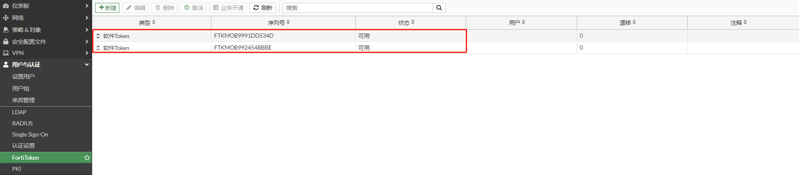

# FortiToken Mobile在FortiGate上的激活

FortiToken Mobile 是FortiToken的手机软件安装版，是一种非常环保且方便的FortiToken实现方式，只需要在手机上安装一个APP即可实现FortiToken双因子的功能。默认每一台防火墙都有2个免费提供的FortiToken Mobile许可，自带且完全免费。

## 免费token激活

关于免费token文档请参考：https://fortinet-public.s3.cn-north-1.amazonaws.com.cn/Fortinet_TAC_Doc/%E5%85%8D%E8%B4%B9FortiToken+Mobile%E5%9C%A8FortiGate%E7%BB%91%E5%AE%9A%E6%97%B6%E9%81%87%E5%88%B0%E7%9A%84%E9%97%AE%E9%A2%98%E5%8F%8A%E5%A4%84%E7%90%86%E6%96%B9%E6%B3%95.pdf

1. 保证FortiGate能够上网

2. 选择“用户与认证”-->”FortiToken“，点击“导入免费试用令牌”

   

   即可生成两个免费的token。

   

## FortiToken许可激活

1. 购买FortiToken后会收到一个PDF激活文件

   

2. 保证FortiGate能够上网

3. 激活FortiToken

   选择“用户与认证”-->”FortiToken“，点击“新建”

   

   点击“软件Token”，输入PDF文件的中的Activation Code，点击确认。

   

   FortiToken导入成功。

   
