# FortiToken Moblie与SSL VPN结合成双因子认证

## **组网需求**

在外移动办公的工作人员需要通过SSL VPN 隧道模式拨入到公司内网来对内网主机进行访问。

## 网络拓扑

PC1---------------Internet-------------(port2:100.1.1.2)FGT-BJ(port5:192.168.0.1/24)-----------PC2(192.168.0.10  HTTPS/SSH Service)

## 配置步骤

### 配置SSL VPN

1. **基本配置**

   配置接口IP和路由

   

   

2. **创建用户，开启双因子认证，并将用户加入到用户组**

   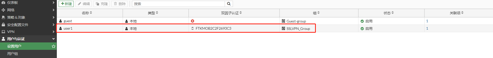

   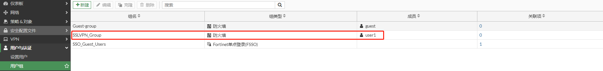

3. **配置地址对象**

   10.200.1.10-10.200.1.200作为SSLVPN地址池；192.168.0.0/24作为需要访问的内网地址段。

   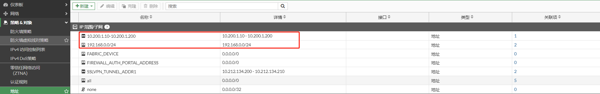

4. **配置SSL-VPN门户**

   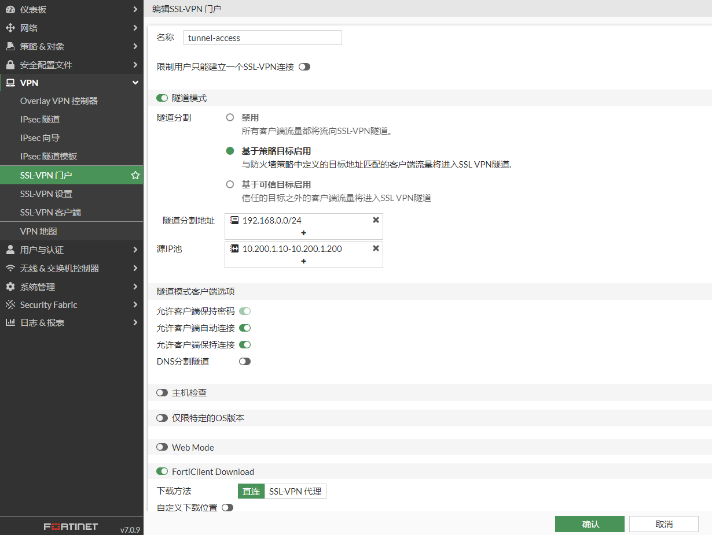

5. **配置SSLVPN**

   设置提供SSLVPN服务的接口和端口，将SSLVPN-Group用户组和tunnel-access门户关联；全部其他用户/组也要关联一个门户，用于没有配置关联的用户/用户组访问。

   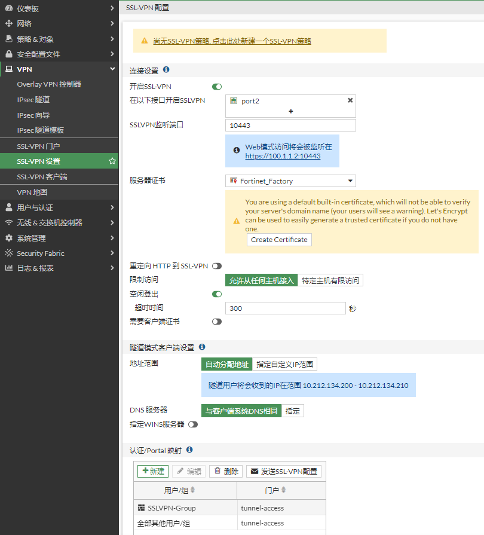

6. 创建策略

   当客户端SSLVPN拨号成功后，将会使用获取的地址（10.200.1.10-10.200.1.200）访问内部主机，因此内部网络需要增加到10.200.1.0/24网段的回程路由指向FortiGate 或者 可以在策略中开启NAT，那么源地址将被转换为FortiGate接口地址，则不用考虑回程路由。

   

### 配置FortiClient

1. 选择“Remote Access”，点击“配置VPN”。

   

2. 选择SSL VPN，设置连接名，远程网关，SSLVPN端口以及用户名，然后点击保存。

   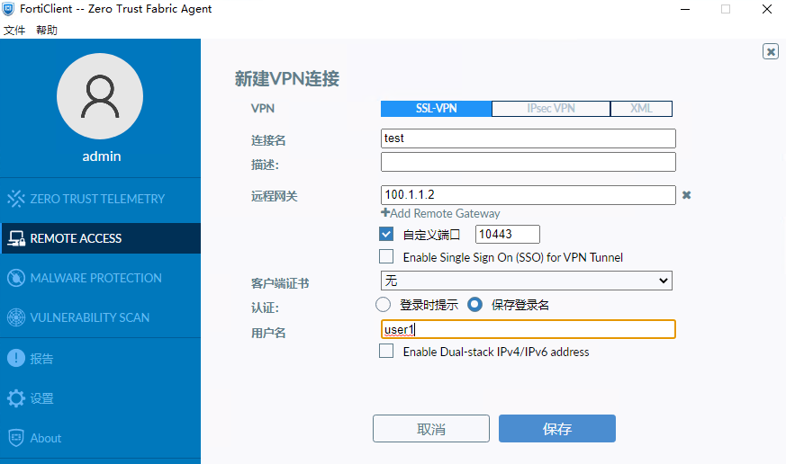

3. 配置完成。

   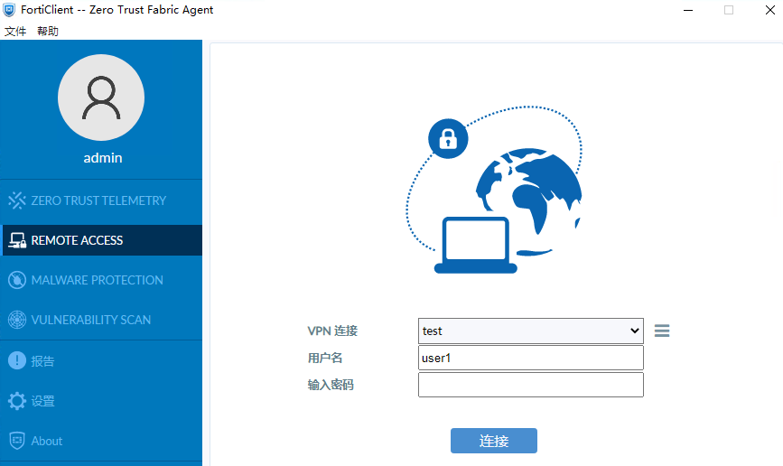

## 业务测试

1. 在FortiClient中输入密码，并点击连接，在弹出的窗口中，点击“是”，信任SSLVPN证书

   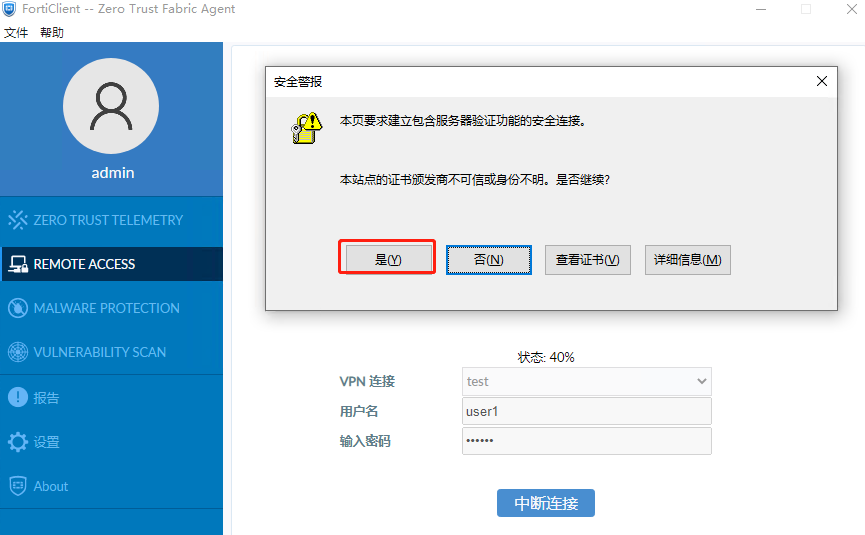

2. 输入token码

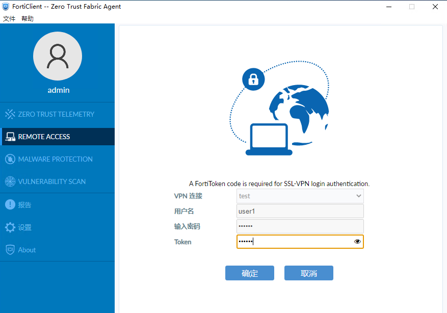

3. 连接成功

   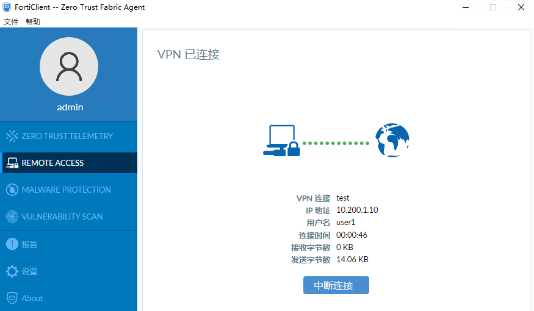

   查看终端获取到的地址

   ```
   C:\Users\admin>ipconfig/all
   以太网适配器 以太网 2:
   
      连接特定的 DNS 后缀 . . . . . . . :
      描述. . . . . . . . . . . . . . . : Fortinet SSL VPN Virtual Ethernet Adapter
      物理地址. . . . . . . . . . . . . : 00-09-0F-AA-00-01
      DHCP 已启用 . . . . . . . . . . . : 否
      自动配置已启用. . . . . . . . . . : 是
      本地链接 IPv6 地址. . . . . . . . : fe80::9124:e3aa:1ace:74d2%7(首选)
      IPv4 地址 . . . . . . . . . . . . : 10.200.1.10(首选)
      子网掩码  . . . . . . . . . . . . : 255.255.255.255
      默认网关. . . . . . . . . . . . . :
      DHCPv6 IAID . . . . . . . . . . . : 100665615
      DHCPv6 客户端 DUID  . . . . . . . : 00-01-00-01-29-1C-CC-4A-00-0C-29-A2-90-E0
      DNS 服务器  . . . . . . . . . . . : 114.114.114.114
      TCPIP 上的 NetBIOS  . . . . . . . : 已启用
   ```

   查看终端获取到的路由

   ```
   C:\Users\admin>route print
   ===========================================================================
   接口列表
     6...00 09 0f fe 00 01 ......Fortinet Virtual Ethernet Adapter (NDIS 6.30)
     7...00 09 0f aa 00 01 ......Fortinet SSL VPN Virtual Ethernet Adapter
    10...00 0c 29 a2 90 e0 ......Intel(R) 82574L Gigabit Network Connection
     5...00 0c 29 a2 90 ea ......Intel(R) 82574L Gigabit Network Connection #2
     1...........................Software Loopback Interface 1
   ===========================================================================
   
   IPv4 路由表
   ===========================================================================
   活动路由:
   网络目标        网络掩码          网关       接口   跃点数
             0.0.0.0          0.0.0.0         10.1.1.1         10.1.1.5    281
            10.1.1.0    255.255.255.0            在链路上          10.1.1.5    281
            10.1.1.5  255.255.255.255            在链路上          10.1.1.5    281
          10.1.1.255  255.255.255.255            在链路上          10.1.1.5    281
         10.200.1.10  255.255.255.255            在链路上       10.200.1.10    257
           100.1.1.2  255.255.255.255         10.1.1.1         10.1.1.5     25
           127.0.0.0        255.0.0.0            在链路上         127.0.0.1    331
           127.0.0.1  255.255.255.255            在链路上         127.0.0.1    331
     127.255.255.255  255.255.255.255            在链路上         127.0.0.1    331
         192.168.0.0    255.255.255.0      10.200.1.11      10.200.1.10      1
   ```

4. 访问内网主机PING，HTTPS，SSH服务都正常

   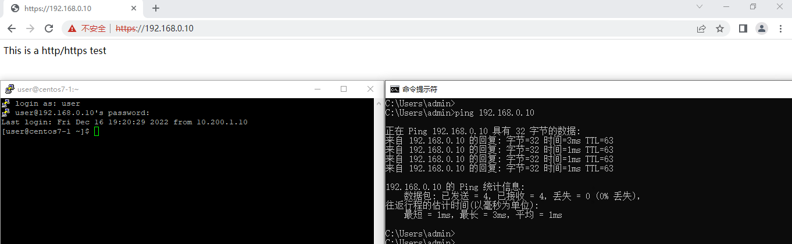
