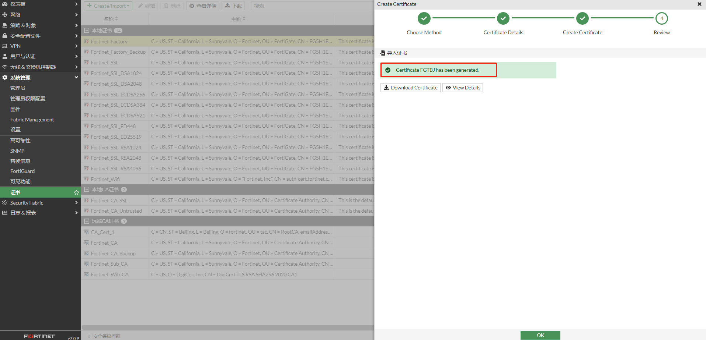
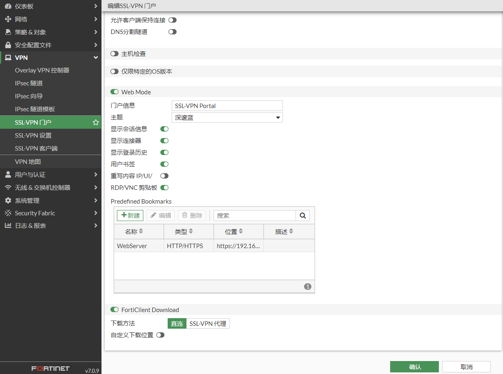
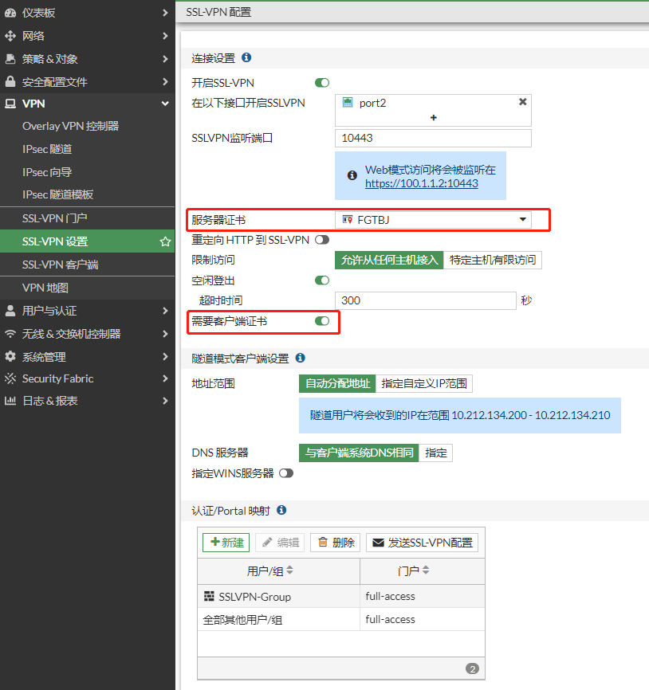

## **组网需求**

在外移动办公的工作人员需要通过SSL VPN 并且使用数字证书认证的方式，拨入到公司内网来对内网主机进行访问。

## **网络拓扑**

```
PC1---------------Internet-------------(port2:100.1.1.2)FGT-BJ(port5:192.168.0.1/24)-----------PC2(192.168.0.10  HTTPS/SSH Service)
                                                           |-----------PC3(192.168.0.20   RPD Service)
```

## 配置步骤

### 使用FortiAuthenticator为FGT-BJ和终端颁发证书

FortiAuthenticator可以做为证书服务器，RootCA是已创建好的根证书，这里使用RootCA为这两台FortiGate签发证书。（也可以使用其他证书服务器）

1. **为FGT-BJ颁发证书**

   为FGT-BJ创建证书。选择“End Entities”-->"User"，点击“Create New”，输入证书相关信息，并点击完成。点击“Export Key and Cert”导出FGTBJ证书的私钥和公钥。输入一个密码保护私钥下载证书

2. **为终端颁发证书**

   为终端颁发证书和上述步骤是一样的。

   

   

### FortiGate导入证书

将根证书RootCA.crt和证书FGTBJ.p12导入到FGT_BJ。

在数字证书认证中，通信双方使用CA证书进行数字证书合法性验证，双方各有自己的公钥（网络上传输）和私钥（本地存储）。发送方对报文进行Hash计算，并用自己的私钥对报文计算结果进行加密，生成数字签名。接收方使用发送方的公钥对数字签名进行解密，并对报文进行Hash计算，判断计算结果与解密后的结果是否相同。如果相同，则认证通过；否则认证失败。


1. 导入CA证书

   选择“系统管理”-->“证书”，点击“Create/Import”，选择CA证书。查看导入的CA证书

2. 导入本地证书

   选择“系统管理”-->“证书”，点击“Create/Import”，选择“证书”。

   

   点击导入证书

   

   输入证书的密码，点击“创建”

   

   提示证书已成功导入

   

   查看导入的本地证书

   

### 终端导入证书

将根证书RootCA.crt和证书user1.p12导入到终端。


1. 导入根证书RootCA.crt

   双击RootCA.crt，点击“安装证书”。

   

   

   证书存入“受信任的根证书颁发机构”

   

   

2. 导入个人证书user1.p12

   双击user1.p12，然后安装证书

   

   输入证书的密码

   

   证书存入“个人”

   

   

### 配置SSL VPN

1. **基本配置**

   配置接口IP和路由

   

   

2. **创建用户，并将用户加入到用户组。**

   

   

3. **配置SSL-VPN门户**

   

   

4. **配置SSLVPN**

   服务器证书选择“FGTBJ”，FortiGate会使用FGTBJ证书与终端交互；勾选“需要客户端证书”，那么认证过程中FortiGate会要求客户端提供证书。

   

5. **创建策略**

   当客户端SSLVPN拨号成功后，将会使用获取的地址（10.200.1.10-10.200.1.200）访问内部主机，因此内部网络需要增加到10.200.1.0/24网段的回程路由指向FortiGate 或者 可以在策略中开启NAT，那么源地址将被转换为FortiGate接口地址，则不用考虑回程路由。

### 配置FortiClient

1. 选择“Remote Access”，点击“配置VPN”。

   

2. 选择SSL VPN，设置连接名，远程网关，SSLVPN端口，用户名以及选择终端证书，然后点击保存。

   

3. 配置完成。

   

## FortiClient拨号测试

1. 输入密码，点击连接。

   

   查看终端获取到的路由

   

2. 访问内网主机HTTPS，SSH，RDP服务都正常

   

3. FortiGate查看SSLVPN连接

   

   ```
   # get vpn ssl monitor 
   SSL-VPN Login Users:
    Index   User    Group   Auth Type      Timeout         Auth-Timeout    From     HTTP in/out    HTTPS in/out    Two-factor Auth
    0       user1   SSLVPN-Group   1(1)             189    28625    10.1.1.5       0/0     0/0     0
   
   SSL-VPN sessions:
    Index   User    Group   Source IP      Duration        I/O Bytes       Tunnel/Dest IP 
    0       user1   SSLVPN-Group   10.1.1.5         175     27388/14075    10.200.1.10
   ```

## 浏览器拨号测试

1. PC1使用chrome访问SSLVPN，在弹出的证书选择框中，使用user1证书。

   

2. 跳转到输入账号密码界面。

   

3. 登录成功。

   

4. 访问webserver成功。

   

5. FortiGate查看SSLVPN用户状态。

   

   ```
    # get vpn ssl monitor 
   SSL-VPN Login Users:
    Index   User    Group   Auth Type      Timeout         Auth-Timeout    From     HTTP in/out    HTTPS in/out  Two-factor Auth
    0       user1   SSLVPN-Group   1(1)      289                28788    10.1.1.5       0/0               0/0          0
   
   SSL-VPN sessions:
    Index   User    Group   Source IP      Duration        I/O Bytes       Tunnel/Dest IP 
   ```

   