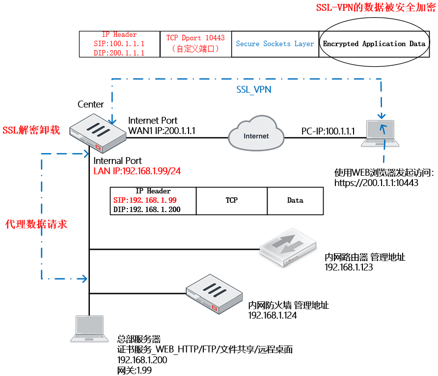

# SSL VPN的两种模式

## **SSL VPN 隧道模式**

Tunnel模式，需要下载运行的客户端支持。客户端和FortiGate设备建立SSL隧道后，FortiGate为客户端分配IP，客户端通过建立的虚接口直接通过SSL隧道连接到内部网络。推荐使用。

## **WEB代理模式**

Web代理模式，FortiGate将来自远端浏览器的页面请求转发给Web服务器，然后将服务器的响应回传给终端用户。由于有时用户Web服务器的网页代码不够规范，可能与SSLVPN代理模式不兼容，会导致访问异常。

