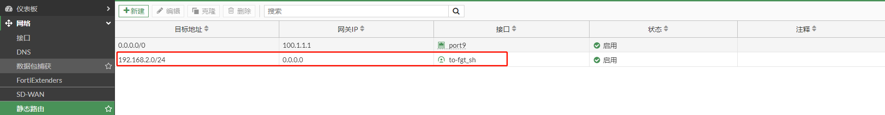
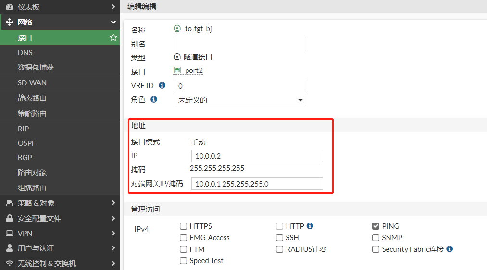

# GRE

## GRE简介

GRE（Generic Routing Encapsulation，通用路由封装）协议是对某些网络层协议（如IPv4，IPv6，IPX）的数据报文进行封装，使这些被封装的数据报文能够在另一个网络层协议中传输。

## 组网需求

通过GRE将2个局域网连接起来，实现192.168.0.0/24与192.168.2.0/24两个网段的通信。

## 网络拓扑

PC1-----------(port10:192.168.0.1/24)FGT-BJ(port9:100.1.1.3)-------------Internet-------------(port2:201.1.1.3)FGT-SH(port3:192.168.2.1/24)-----------PC2

## 配置步骤

### FGT-BJ GRE配置

1. **基础配置**

   

   

2. **配置GRE**

   ```
   config system gre-tunnel
       edit "to-fgt_sh"
           set interface "port9"
           set remote-gw 201.1.1.3
           set local-gw 100.1.1.3
       next
   end
   ```

3. **配置策略**

   

### FGT-SH GRE配置

1. **基础配置**

   

   

2. **配置GRE**

   ```
   config system gre-tunnel
       edit "to-fgt_bj"
           set interface "port2"
           set remote-gw 100.1.1.3
           set local-gw 201.1.1.3
       next
   end
   ```

3. **配置策略**

   

## 路由及业务测试

### 静态路由互通

1. **FGT-BJ 配置静态路由**

   

2. **FGT-SH配置静态路由**

   

3. **业务测试**

   从FGT-BJ内网能ping通FGT-SH的内网

   ```
   PC1# ifconfig ens224
   ens224: flags=4163<UP,BROADCAST,RUNNING,MULTICAST>  mtu 1500
           inet 192.168.0.10  netmask 255.255.255.0  broadcast 192.168.0.255
           inet6 fe80::82c8:edfd:199d:70b0  prefixlen 64  scopeid 0x20<link>
           ether 00:0c:29:e8:ad:a9  txqueuelen 1000  (Ethernet)
           RX packets 6225014  bytes 1799326210 (1.6 GiB)
           RX errors 0  dropped 3749612  overruns 0  frame 0
           TX packets 75758  bytes 5398290 (5.1 MiB)
           TX errors 0  dropped 0 overruns 0  carrier 0  collisions 0
   
   PC1# ping 192.168.2.10 -c 4
   PING 192.168.2.10 (192.168.2.10) 56(84) bytes of data.
   64 bytes from 192.168.2.10: icmp_seq=1 ttl=62 time=1.15 ms
   64 bytes from 192.168.2.10: icmp_seq=2 ttl=62 time=0.931 ms
   64 bytes from 192.168.2.10: icmp_seq=3 ttl=62 time=0.994 ms
   64 bytes from 192.168.2.10: icmp_seq=4 ttl=62 time=0.673 ms
   
   --- 192.168.2.10 ping statistics ---
   4 packets transmitted, 4 received, 0% packet loss, time 3003ms
   rtt min/avg/max/mdev = 0.673/0.938/1.155/0.174 ms
   ```

### 动态路由互通

1. **FGT-BJ 配置GRE隧道接口IP**

   

   查看路由表

   ```
   # get router info routing-table  all 
   Codes: K - kernel, C - connected, S - static, R - RIP, B - BGP
          O - OSPF, IA - OSPF inter area
          N1 - OSPF NSSA external type 1, N2 - OSPF NSSA external type 2
          E1 - OSPF external type 1, E2 - OSPF external type 2
          i - IS-IS, L1 - IS-IS level-1, L2 - IS-IS level-2, ia - IS-IS inter area
          * - candidate default
   
   Routing table for VRF=0
   S*      0.0.0.0/0 [10/0] via 100.1.1.1, port9, [1/0]
   C       10.0.0.0/24 is directly connected, to-fgt_sh
   C       10.0.0.1/32 is directly connected, to-fgt_sh
   C       100.1.1.0/24 is directly connected, port9
   C       192.168.0.0/24 is directly connected, port10
   ```

2. **FGT-SH配置GRE隧道接口IP**

   

   查看路由表

   ```
   # get router info routing-table all 
   Codes: K - kernel, C - connected, S - static, R - RIP, B - BGP
          O - OSPF, IA - OSPF inter area
          N1 - OSPF NSSA external type 1, N2 - OSPF NSSA external type 2
          E1 - OSPF external type 1, E2 - OSPF external type 2
          i - IS-IS, L1 - IS-IS level-1, L2 - IS-IS level-2, ia - IS-IS inter area
          * - candidate default
   
   Routing table for VRF=0
   S*      0.0.0.0/0 [10/0] via 201.1.1.1, port2, [1/0]
   C       10.0.0.0/24 is directly connected, to-fgt_bj
   C       10.0.0.2/32 is directly connected, to-fgt_bj
   C       192.168.2.0/24 is directly connected, port3
   C       201.1.1.0/24 is directly connected
   ```

3. **GRE接口连通性测试**

   ```
   从FGT-BJ的GRE接口地址 ping FGT-SH的GRE接口地址
   # execute ping-options source 10.0.0.1
   # execute ping 10.0.0.2
   PING 10.0.0.2 (10.0.0.2): 56 data bytes
   64 bytes from 10.0.0.2: icmp_seq=0 ttl=255 time=0.5 ms
   64 bytes from 10.0.0.2: icmp_seq=1 ttl=255 time=0.5 ms
   64 bytes from 10.0.0.2: icmp_seq=2 ttl=255 time=0.5 ms
   64 bytes from 10.0.0.2: icmp_seq=3 ttl=255 time=0.4 ms
   64 bytes from 10.0.0.2: icmp_seq=4 ttl=255 time=0.1 ms
   
   --- 10.0.0.2 ping statistics ---
   5 packets transmitted, 5 packets received, 0% packet loss
   round-trip min/avg/max = 0.1/0.4/0.5 ms
   ```

4. **配置动态路由**

#### BGP互通

1. **配置BGP**

   FGT-BJ配置BGP

   ```
   config router bgp
       set as 65001
       set router-id 100.1.1.3
       config neighbor
           edit "10.0.0.2"
               set next-hop-self enable
               set soft-reconfiguration enable
               set interface "to-fgt_sh"
               set remote-as 65001
           next
       end
       config network
           edit 1
               set prefix 192.168.0.0 255.255.255.0
           next
       end
   end
   ```

   FGT-SH配置BGP

   ```
   config router bgp
       set as 65001
       set router-id 201.1.1.3
       config neighbor
           edit "10.0.0.1"
               set next-hop-self enable
               set soft-reconfiguration enable
               set remote-as 65001
           next
       end
       config network
           edit 1
               set prefix 192.168.2.0 255.255.255.0
           next
       end
   end
   ```

2. **查看BGP邻居和路由**

   FGT-BJ查看BGP邻居和路由

   ```
   # get router info bgp neighbors 
   VRF 0 neighbor table:
   BGP neighbor is 10.0.0.2, remote AS 65001, local AS 65001, internal link
     BGP version 4, remote router ID 201.1.1.3
     BGP state = Established, up for 04:22:48
     Last read 00:00:13, hold time is 180, keepalive interval is 60 seconds
     Configured hold time is 180, keepalive interval is 60 seconds
     Neighbor capabilities:
       Route refresh: advertised and received (old and new)
       Address family IPv4 Unicast: advertised and received
       Address family IPv6 Unicast: advertised and received
     Received 302 messages, 0 notifications, 0 in queue
     Sent 302 messages, 0 notifications, 0 in queue
     Route refresh request: received 0, sent 0
     NLRI treated as withdraw: 0
     Minimum time between advertisement runs is 30 seconds
    For address family: IPv4 Unicast
     BGP table version 2, neighbor version 1
     Index 1, Offset 0, Mask 0x2
     Inbound soft reconfiguration allowed
     NEXT_HOP is always this router
     Community attribute sent to this neighbor (both)
     1 accepted prefixes, 1 prefixes in rib
     1 announced prefixes
    For address family: IPv6 Unicast
     BGP table version 1, neighbor version 1
     Index 1, Offset 0, Mask 0x2
     Community attribute sent to this neighbor (both)
     0 accepted prefixes, 0 prefixes in rib
     0 announced prefixes
    Connections established 1; dropped 0
   Local host: 10.0.0.1, Local port: 179
   Foreign host: 10.0.0.2, Foreign port: 14233
   Egress interface: 55
   Nexthop: 10.0.0.1
   Nexthop interface: to-fgt_sh
   Nexthop global: ::
   Nexthop local: ::
   BGP connection: non shared network
   
   # get router info routing-table all 
   Routing table for VRF=0
   S*      0.0.0.0/0 [10/0] via 100.1.1.1, port9, [1/0]
   C       10.0.0.0/24 is directly connected, to-fgt_sh
   C       10.0.0.1/32 is directly connected, to-fgt_sh
   C       100.1.1.0/24 is directly connected, port9
   C       192.168.0.0/24 is directly connected, port10
   B       192.168.2.0/24 [200/0] via 10.0.0.2 (recursive is directly connected, to-fgt_sh), 04:22:34
   ```
   
   FGT-SH查看BGP邻居和路由
   
   ```
   # get router info bgp neighbors 
   VRF 0 neighbor table:
   BGP neighbor is 10.0.0.1, remote AS 65001, local AS 65001, internal link
     BGP version 4, remote router ID 100.1.1.3
     BGP state = Established, up for 04:24:18
     Last read 00:00:30, hold time is 180, keepalive interval is 60 seconds
     Configured hold time is 180, keepalive interval is 60 seconds
     Neighbor capabilities:
       Route refresh: advertised and received (old and new)
       Address family IPv4 Unicast: advertised and received
       Address family IPv6 Unicast: advertised and received
     Received 303 messages, 0 notifications, 0 in queue
     Sent 304 messages, 0 notifications, 0 in queue
     Route refresh request: received 0, sent 0
     NLRI treated as withdraw: 0
     Minimum time between advertisement runs is 30 seconds
    For address family: IPv4 Unicast
     BGP table version 8, neighbor version 7
     Index 1, Offset 0, Mask 0x2
     Inbound soft reconfiguration allowed
     NEXT_HOP is always this router
     Community attribute sent to this neighbor (both)
     1 accepted prefixes, 1 prefixes in rib
     1 announced prefixes
    For address family: IPv6 Unicast
     BGP table version 1, neighbor version 1
     Index 1, Offset 0, Mask 0x2
     Community attribute sent to this neighbor (both)
     0 accepted prefixes, 0 prefixes in rib
     0 announced prefixes
    Connections established 1; dropped 0
   Local host: 10.0.0.2, Local port: 14233
   Foreign host: 10.0.0.1, Foreign port: 179
   Egress interface: 34
   Nexthop: 10.0.0.2
   Nexthop interface: to-fgt_bj
   Nexthop global: ::
   Nexthop local: ::
   BGP connection: non shared network
   
   FGVM08TM22000410 # get router info routing-table  all 
   Routing table for VRF=0
   S*      0.0.0.0/0 [10/0] via 201.1.1.1, port2, [1/0]
   C       10.0.0.0/24 is directly connected, to-fgt_bj
   C       10.0.0.2/32 is directly connected, to-fgt_bj
   B       192.168.0.0/24 [200/0] via 10.0.0.1 (recursive is directly connected, to-fgt_bj), 04:23:24
   C       192.168.2.0/24 is directly connected, port3
   C       201.1.1.0/24 is directly connected, port2
   ```
   
3. **业务测试**

   从FGT-BJ内网能ping通FGT-SH的内网

   ```
   PC1# ifconfig ens224
   ens224: flags=4163<UP,BROADCAST,RUNNING,MULTICAST>  mtu 1500
           inet 192.168.0.10  netmask 255.255.255.0  broadcast 192.168.0.255
           inet6 fe80::82c8:edfd:199d:70b0  prefixlen 64  scopeid 0x20<link>
           ether 00:0c:29:e8:ad:a9  txqueuelen 1000  (Ethernet)
           RX packets 6225014  bytes 1799326210 (1.6 GiB)
           RX errors 0  dropped 3749612  overruns 0  frame 0
           TX packets 75758  bytes 5398290 (5.1 MiB)
           TX errors 0  dropped 0 overruns 0  carrier 0  collisions 0
   
   PC1# ping 192.168.2.10 -c 4
   PING 192.168.2.10 (192.168.2.10) 56(84) bytes of data.
   64 bytes from 192.168.2.10: icmp_seq=1 ttl=62 time=1.15 ms
   64 bytes from 192.168.2.10: icmp_seq=2 ttl=62 time=0.931 ms
   64 bytes from 192.168.2.10: icmp_seq=3 ttl=62 time=0.994 ms
   64 bytes from 192.168.2.10: icmp_seq=4 ttl=62 time=0.673 ms
   
   --- 192.168.2.10 ping statistics ---
   4 packets transmitted, 4 received, 0% packet loss, time 3003ms
   rtt min/avg/max/mdev = 0.673/0.938/1.155/0.174 ms
   ```

#### OSPF互通

1. **配置OSPF**

   FGT-BJ配置OSPF

   ```
   config router ospf
       set router-id 100.1.1.3
       config area
           edit 0.0.0.0
           next
       end
       config network
           edit 1
               set prefix 10.0.0.0 255.255.255.0
           next
           edit 2
               set prefix 192.168.0.0 255.255.255.0
           next
       end
   end
   ```

   FGT-SH配置OSPF

   ```
   config router ospf
       set router-id 201.1.1.3
       config area
           edit 0.0.0.0
           next
       end
       config network
           edit 1
               set prefix 10.0.0.0 255.255.255.0
           next
           edit 2
               set prefix 192.168.2.0 255.255.255.0
           next
       end
   en
   ```

2. **查看OSPF邻居和路由**

   FGT-BJ查看OSPF邻居和路由

   ```
   # get router info ospf neighbor 
   OSPF process 0, VRF 0:
   Neighbor ID     Pri   State           Dead Time   Address         Interface
   201.1.1.3         1   Full/ -         00:00:33    10.0.0.2        to-fgt_sh
   
   # get router info routing-table  all 
   Routing table for VRF=0
   S*      0.0.0.0/0 [10/0] via 100.1.1.1, port9, [1/0]
   C       10.0.0.0/24 is directly connected, to-fgt_sh
   C       10.0.0.1/32 is directly connected, to-fgt_sh
   C       100.1.1.0/24 is directly connected, port9
   C       192.168.0.0/24 is directly connected, port10
   O       192.168.2.0/24 [110/101] via 10.0.0.2, to-fgt_sh, 00:01:12
   ```
   
   FGT-SH查看OSPF邻居和路由
   
   ```
   # get router info ospf neighbor 
   OSPF process 0, VRF 0:
   Neighbor ID     Pri   State           Dead Time   Address         Interface
   100.1.1.3         1   Full/ -         00:00:34    10.0.0.1        to-fgt_bj
   
   # get router info routing-table all 
   Routing table for VRF=0
   S*      0.0.0.0/0 [10/0] via 201.1.1.1, port2, [1/0]
   C       10.0.0.0/24 is directly connected, to-fgt_bj
   C       10.0.0.2/32 is directly connected, to-fgt_bj
   O       192.168.0.0/24 [110/101] via 10.0.0.1, to-fgt_bj, 00:01:43
   C       192.168.2.0/24 is directly connected, port3
   C       201.1.1.0/24 is directly connected, port2
   ```
   
3. **业务测试**

   从FGT-BJ内网能ping通FGT-SH的内网

   ```
   PC1# ifconfig ens224
   ens224: flags=4163<UP,BROADCAST,RUNNING,MULTICAST>  mtu 1500
           inet 192.168.0.10  netmask 255.255.255.0  broadcast 192.168.0.255
           inet6 fe80::82c8:edfd:199d:70b0  prefixlen 64  scopeid 0x20<link>
           ether 00:0c:29:e8:ad:a9  txqueuelen 1000  (Ethernet)
           RX packets 6225014  bytes 1799326210 (1.6 GiB)
           RX errors 0  dropped 3749612  overruns 0  frame 0
           TX packets 75758  bytes 5398290 (5.1 MiB)
           TX errors 0  dropped 0 overruns 0  carrier 0  collisions 0
   
   PC1# ping 192.168.2.10 -c 4
   PING 192.168.2.10 (192.168.2.10) 56(84) bytes of data.
   64 bytes from 192.168.2.10: icmp_seq=1 ttl=62 time=1.15 ms
   64 bytes from 192.168.2.10: icmp_seq=2 ttl=62 time=0.931 ms
   64 bytes from 192.168.2.10: icmp_seq=3 ttl=62 time=0.994 ms
   64 bytes from 192.168.2.10: icmp_seq=4 ttl=62 time=0.673 ms
   --- 192.168.2.10 ping statistics ---
   4 packets transmitted, 4 received, 0% packet loss, time 3003ms
   rtt min/avg/max/mdev = 0.673/0.938/1.155/0.174 ms
   ```
   
