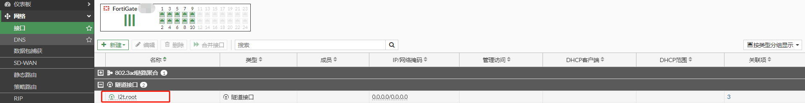

# L2TP VPN

## L2TP VPN简介

L2TP（Layer 2 Tunneling Protocol） VPN是一种用于承载PPP报文的隧道技术，基于UDP，端口1701。该技术主要应用在远程办公场景中为出差员工远程访问企业内网资源提供接入服务。

## L2TP数据报文

L2TP数据报文分为两种：控制报文和数据报文；

**控制报文：**控制消息用于隧道和会话连接的建立、维护以及传输控制；位于隧道和会话建立过程中。控制消息的传输是可靠传输，并且支持对控制消息的流量控制和拥塞控制；主要的控制消息包括控制报文、会话报文等。


**数据报文**：用于承载用户的PPP连接数据报文，并在隧道上进行传输。数据消息的传输是不可靠传输，若数据报文丢失，不予重传。不支持对数据消息的流量控制和拥塞控制。


## L2TP协议交互过程

1. 建立L2TP隧道

   **SCCRQ（Start-Control-Connection-Request**）：终端向FortiGate发起控制连接请求；

   **SCCRP（Start-Control-Connection-Reply）**：FortiGate接受了终端的连接请求，隧道的建立过程可以继续；

   **SCCCN（Start-Control-Connection-Connected）**：对SCCRP的回应，完成隧道的建立。

2. 建立L2TP会话

   **ICRQ（Incoming-Call-Request）**：终端请求在已经建立的隧道中建立会话；

   **ICRP（Incoming-Call-Reply）**：FortiGate回应ICRQ，表示ICRQ成功，也会在ICRP中标识L2TP会话必要的参数；

   **ICCN（Incoming-Call-Connected）**：回应ICRP，L2TP会话建立完成。

3. 对用户认证，认证通过，建立PPP连接

   

## **组网需求**

在外移动办公的工作人员需要通过L2TP VPN 隧道模式拨入到公司内网来对内网主机进行访问。

## 网络拓扑

PC1---------------Internet-------------(port2:201.1.1.3)FGT-BJ(port3:192.168.2.1/24)-----------PC2(192.168.2.10)

## 配置步骤

### 配置FortiGate L2TP VPN

1. **基础配置**

   

   

   

   

2. **创建用户并将用户加入到用户组**

   

   

3. **配置L2TP VPN**

   ```
   config vpn l2tp
       set status enable
       set eip 172.31.1.200
       set sip 172.31.1.10
       set usrgrp "L2TP_Group"
   end
   ```


3. **配置地址对象**

   

4. **配置防火墙策略**

   FortiGate会自动创建L2TP的接口l2t.root。

   

   第1条策略用于客户端L2TP VPN拨号后访问内网；第2条策略用于客户端L2TP VPN拨号后上网。

   当客户端L2TP VPN拨号成功后，将会使用获取的地址（172.31.1.10-172.31.1.200）访问内部主机，因此内部网络需要增加到172.31.1.0/24网段的回程路由指向FortiGate 或者 可以在策略中开启NAT，那么源地址将被转换为FortiGate接口地址，则不用考虑回程路由。

   

5. **配置路由**

   将L2TP地址池的地址段指向l2t.root接口。

   ```
   config router static
       edit 0
           set dst 172.31.1.0 255.255.255.0
           set device "l2t.root"
       next
   end
   ```

### 配置终端L2TP VPN

1. 右击本地连接图标，选择“打开网络和Internet设置”，选择VPN。

   

2. 点击“添加VPN连接”，设置L2TP，然后点击保存。

   

3. L2TP VPN创建完整。

   

4. 修改注册表

   WINDOWS电脑默认都是使用L2TP OVER IPSEC的拨号方式，因此会发起IKE的协商，并不是L2TP的协商，需要修改电脑的注册表，让电脑发起L2TP的协商，而非IKE的协商。

   ```
   修改注册表:将prohibiteIPsec的dword值修改为“1”。
   [HKEY_LOCAL_MACHINE\SYSTEM\CurrentControlSet\Services\RasMan\Parameters]
   "ProhibitIpSec"=dword:00000001
   ```

## L2TP VPN拨号测试

1. 点击创建的“L2TP_VPN”，点击“连接”。

   

2. 连接成功。

   

   查看L2TP_VPN获取的地址

   ```
   C:\Users\admin>ipconfig/all
   以太网适配器 Ethernet1:
   
      连接特定的 DNS 后缀 . . . . . . . :
      描述. . . . . . . . . . . . . . . : Intel(R) 82574L Gigabit Network Connection #2
      物理地址. . . . . . . . . . . . . : 00-0C-29-A2-90-EA
      DHCP 已启用 . . . . . . . . . . . : 否
      自动配置已启用. . . . . . . . . . : 是
      本地链接 IPv6 地址. . . . . . . . : fe80::65c4:a7eb:1876:83ac%5(首选)
      IPv4 地址 . . . . . . . . . . . . : 10.1.1.5(首选)
      子网掩码  . . . . . . . . . . . . : 255.255.255.0
      默认网关. . . . . . . . . . . . . : 10.1.1.1
      DHCPv6 IAID . . . . . . . . . . . : 402656297
      DHCPv6 客户端 DUID  . . . . . . . : 00-01-00-01-29-1C-CC-4A-00-0C-29-A2-90-E0
      DNS 服务器  . . . . . . . . . . . : 114.114.114.114
      TCPIP 上的 NetBIOS  . . . . . . . : 已启用
   
   PPP 适配器 L2TP_VPN:
   
      连接特定的 DNS 后缀 . . . . . . . :
      描述. . . . . . . . . . . . . . . : L2TP_VPN
      物理地址. . . . . . . . . . . . . :
      DHCP 已启用 . . . . . . . . . . . : 否
      自动配置已启用. . . . . . . . . . : 是
      IPv4 地址 . . . . . . . . . . . . : 172.31.1.12(首选)
      子网掩码  . . . . . . . . . . . . : 255.255.255.255
      默认网关. . . . . . . . . . . . . : 0.0.0.0
      DNS 服务器  . . . . . . . . . . . : 114.114.114.114
      TCPIP 上的 NetBIOS  . . . . . . . : 已启用
   ```

   查看终端路由表。

   ```
   C:\Users\admin>route print
   ===========================================================================
   接口列表
     6...00 09 0f fe 00 01 ......Fortinet Virtual Ethernet Adapter (NDIS 6.30)
    10...00 0c 29 a2 90 e0 ......Intel(R) 82574L Gigabit Network Connection
     5...00 0c 29 a2 90 ea ......Intel(R) 82574L Gigabit Network Connection #2
    46...........................L2TP_VPN
     1...........................Software Loopback Interface 1
   ===========================================================================
   
   IPv4 路由表
   ===========================================================================
   活动路由:
   网络目标        网络掩码          网关       接口   跃点数
             0.0.0.0          0.0.0.0         10.1.1.1         10.1.1.5   4506
             0.0.0.0          0.0.0.0            在链路上       172.31.1.12     26
            10.1.1.0    255.255.255.0            在链路上          10.1.1.5   4506
            10.1.1.5  255.255.255.255            在链路上          10.1.1.5   4506
          10.1.1.255  255.255.255.255            在链路上          10.1.1.5   4506
           127.0.0.0        255.0.0.0            在链路上         127.0.0.1   4556
           127.0.0.1  255.255.255.255            在链路上         127.0.0.1   4556
     127.255.255.255  255.255.255.255            在链路上         127.0.0.1   4556
         172.31.1.12  255.255.255.255            在链路上       172.31.1.12    281
   ```

3. 访问内部主机。

   ```
   C:\Users\admin>ping 192.168.2.10
   
   正在 Ping 192.168.2.10 具有 32 字节的数据:
   来自 192.168.2.10 的回复: 字节=32 时间<1ms TTL=63
   来自 192.168.2.10 的回复: 字节=32 时间<1ms TTL=63
   来自 192.168.2.10 的回复: 字节=32 时间<1ms TTL=63
   来自 192.168.2.10 的回复: 字节=32 时间<1ms TTL=63
   
   192.168.2.10 的 Ping 统计信息:
       数据包: 已发送 = 4，已接收 = 4，丢失 = 0 (0% 丢失)，
   往返行程的估计时间(以毫秒为单位):
       最短 = 0ms，最长 = 0ms，平均 = 0ms
   ```

   访问Internet

   

   